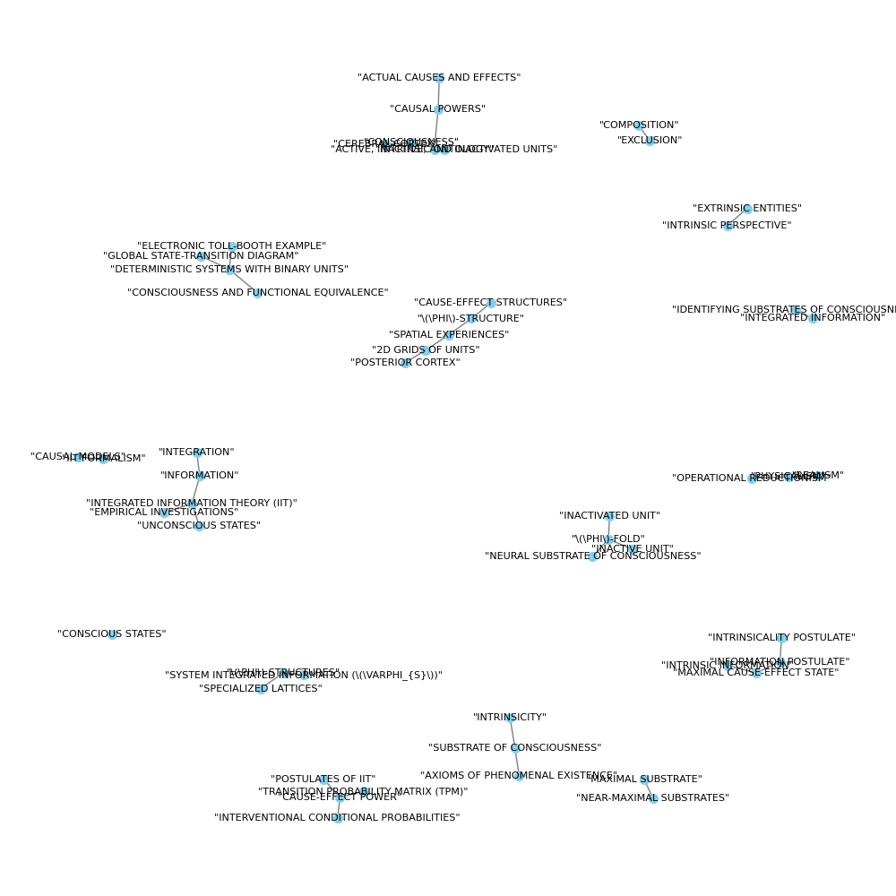

## Graph Visualization

Here is the visualization of the merged graph:

## create_base_extracted_entities.

parquet                                                                                                                                                                                                                                                                                                                                                                                                                                                                                              entity_graph
0  <graphml xmlns="http://graphml.graphdrawing.org/xmlns" xmlns:xsi="http://www.w3.org/2001/XMLSchema-instance" xsi:schemaLocation="http://graphml.graphdrawing.org/xmlns http://graphml.graphdrawing.org/xmlns/1.0/graphml.xsd">\n  <key id="d5" for="edge" attr.name="source_id" attr.type="string" />\n  <key id="d4" for="edge" attr.name="description" attr.type="string" />\n  <key id="d3" for="edge" attr.name="weight" attr.type="double" />\n  <key id="d2" for="node" attr.name="source_id" attr.type="string" />\n  <key id="d1" for="node" attr.name="description" attr.type="string" />\n  <key id="d0" for="node" attr.name="type" attr.type="string" />\n  <graph edgedefault="undirected">\n    <node id="&quot;AXIOMS OF PHENOMENAL EXISTENCE&quot;">\n      <data key="d0">"THEORY"</data>\n      <data key="d1">"The axioms of phenomenal existence outline essential properties of experience, such as unity, definiteness, and intrinsicity, which are crucial for understanding the nature of consciousness."</data>\n      <data key="d2">14270b835c0661067dae1c7b7e52ea13</data>\n    </node>\n    <node id="&quot;REALISM&quot;">\n      <data key="d0">"THEORY"</data>\n      <data key="d1">"Realism is the assumption that a world exists independently of one's experience, a foundational concept for explaining the regularities of experience through the existence of a physical world."</data>\n      <data key="d2">14270b835c0661067dae1c7b7e52ea13</data>\n    </node>\n    <node id="&quot;PHYSICALISM&quot;">\n      <data key="d0">"THEORY"</data>\n      <data key="d1">"Physicalism posits that for something to have physical existence, it must have the power to affect and be affected in a reliable way, emphasizing the operational and causal aspects of physical entities."</data>\n      <data key="d2">14270b835c0661067dae1c7b7e52ea13</data>\n    </node>\n    <node id="&quot;OPERATIONAL REDUCTIONISM&quot;">\n      <data key="d0">"METHODOLOGY"</data>\n      <data key="d1">"Operational reductionism is the approach of establishing what exists in physical terms by starting from the smallest units that can take and make a difference, ensuring nothing is left out."</data>\n      <data key="d2">14270b835c0661067dae1c7b7e52ea13</data>\n    </node>\n    <node id="&quot;SUBSTRATE OF CONSCIOUSNESS&quot;">\n      <data key="d0">"THEORY"</data>\n      <data key="d1">"The substrate of consciousness is defined by its cause-effect power, characterized operationally as a set of units that can be observed and manipulated to take and make a difference."</data>\n      <data key="d2">14270b835c0661067dae1c7b7e52ea13</data>\n    </node>\n    <node id="&quot;INTRINSICITY&quot;">\n      <data key="d0">"POSTULATE"</data>\n      <data key="d1">"Intrinsicity requires that the cause-effect power of the substrate of consciousness must be intrinsic, making a difference within itself."</data>\n      <data key="d2">14270b835c0661067dae1c7b7e52ea13</data>\n    </node>\n    <node id="&quot;INFORMATION&quot;">\n      <data key="d0">"POSTULATE"</data>\n      <data key="d1">"The postulate of Information states that the cause-effect power of the substrate must be specific, selecting this cause-effect state with maximal intrinsic information."\n"Information, in the context of intrinsic ontology and IIT, is considered as causal, intrinsic, specific, maximally irreducible, and structured, differing from classical accounts of information as merely communication and storage."</data>\n      <data key="d2">14270b835c0661067dae1c7b7e52ea13,a3cfbedc24d5316550172975e83f59cb</data>\n    </node>\n    <node id="&quot;INTEGRATION&quot;">\n      <data key="d0">"POSTULATE"</data>\n      <data key="d1">"Integration demands that the cause-effect power of the substrate must be unitary, specifying its cause-effect state as a whole set of units, irreducible to subsets."</data>\n      <data key="d2">14270b835c0661067dae1c7b7e52ea13</data>\n    </node>\n    <node id="&quot;EXCLUSION&quot;">\n      <data key="d0">"POSTULATE"</data>\n      <data key="d1">"Exclusion specifies that the cause-effect power of the substrate must be definite, specifying its cause-effect state as this whole set of units, known as a maximal substrate or complex."</data>\n      <data key="d2">14270b835c0661067dae1c7b7e52ea13</data>\n    </node>\n    <node id="&quot;COMPOSITION&quot;">\n      <data key="d0">"POSTULATE"</data>\n      <data key="d1">"Composition involves the structured cause-effect power of the substrate, where subsets of units specify cause-effect states over subsets of units, forming a cause-effect structure or Phi-structure."</data>\n      <data key="d2">14270b835c0661067dae1c7b7e52ea13</data>\n    </node>\n    <node id="&quot;IIT FORMALISM&quot;">\n      <data key="d0">"METHODOLOGY"</data>\n      <data key="d1">"IIT formalism refers to the methodology applied to analyze simple, simulated networks to illustrate how a hypothetical substrate's cause-effect power can be unfolded."</data>\n      <data key="d2">b620b3c7b3684d091b3cfaf9118d85af</data>\n    </node>\n    <node id="&quot;CAUSAL MODELS&quot;">\n      <data key="d0">"MODEL"</data>\n      <data key="d1">"Causal models are representations used to understand and predict the effects of various factors on a given system or phenomenon."</data>\n      <data key="d2">b620b3c7b3684d091b3cfaf9118d85af</data>\n    </node>\n    <node id="&quot;POSTULATES OF IIT&quot;">\n      <data key="d0">"THEORY"</data>\n      <data key="d1">"The postulates of IIT (Integrated Information Theory) include requirements for a system to have cause-effect power that is intrinsic, specific, integrated, definite, and structured."</data>\n      <data key="d2">b620b3c7b3684d091b3cfaf9118d85af</data>\n    </node>\n    <node id="&quot;CAUSE-EFFECT POWER&quot;">\n      <data key="d0">"KNOWLEDGE"</data>\n      <data key="d1">"Cause-effect power is the capacity of a system to both influence and be influenced by internal and external factors, quantified as causal informativeness in IIT."</data>\n      <data key="d2">b620b3c7b3684d091b3cfaf9118d85af</data>\n    </node>\n    <node id="&quot;INTERVENTIONAL CONDITIONAL PROBABILITIES&quot;">\n      <data key="d0">"METHODOLOGY"</data>\n      <data key="d1">"Interventional conditional probabilities are statistical measures used to quantify the effect of potential causes on the current state of a system."</data>\n      <data key="d2">b620b3c7b3684d091b3cfaf9118d85af</data>\n    </node>\n    <node id="&quot;INTRINSICALITY POSTULATE&quot;">\n      <data key="d0">"THEORY"</data>\n      <data key="d1">"The intrinsicality postulate of IIT requires that a system exerts cause-effect power within itself, independent of external conditions."</data>\n      <data key="d2">b620b3c7b3684d091b3cfaf9118d85af</data>\n    </node>\n    <node id="&quot;INFORMATION POSTULATE&quot;">\n      <data key="d0">"THEORY"</data>\n      <data key="d1">"The information postulate of IIT demands that a system's cause-effect power be specific, selecting a specific cause-effect state for its units."</data>\n      <data key="d2">b620b3c7b3684d091b3cfaf9118d85af</data>\n    </node>\n    <node id="&quot;MAXIMAL CAUSE-EFFECT STATE&quot;">\n      <data key="d0">"KNOWLEDGE"</data>\n      <data key="d1">"The maximal cause-effect state is the state for which intrinsic information is maximal, representing the specific cause-effect power of a system."</data>\n      <data key="d2">b620b3c7b3684d091b3cfaf9118d85af</data>\n    </node>\n    <node id="&quot;INTRINSIC INFORMATION&quot;">\n      <data key="d0">"KNOWLEDGE"</data>\n      <data key="d1">"Intrinsic information measures the difference a system makes over itself for a given cause and effect state, crucial for evaluating a system's cause-effect power."</data>\n      <data key="d2">b620b3c7b3684d091b3cfaf9118d85af</data>\n    </node>\n    <node id="&quot;IDENTIFYING SUBSTRATES OF CONSCIOUSNESS&quot;">\n      <data key="d0">"EXPERIMENT"</data>\n      <data key="d1">"This process involves applying the postulates of IIT to determine whether a system, such as a network of units, has the cause-effect power indicative of consciousness."</data>\n      <data key="d2">b620b3c7b3684d091b3cfaf9118d85af</data>\n    </node>\n    <node id="&quot;TRANSITION PROBABILITY MATRIX (TPM)&quot;">\n      <data key="d0">"TOOL"</data>\n      <data key="d1">"The Transition Probability Matrix (TPM) is a tool used to represent the probabilities of a system transitioning from one state to another, essential for analyzing cause-effect power."</data>\n      <data key="d2">b620b3c7b3684d091b3cfaf9118d85af</data>\n    </node>\n    <node id="&quot;INTEGRATED INFORMATION&quot;">\n      <data key="d0">"KNOWLEDGE"</data>\n      <data key="d1">"Integrated information quantifies the irreducibility of a system's cause-effect state, indicating how much the system operates 'as one'."</data>\n      <data key="d2">b620b3c7b3684d091b3cfaf9118d85af</data>\n    </node>\n    <node id="&quot;SPECIALIZED LATTICES&quot;">\n      <data key="d0">"KNOWLEDGE"</data>\n      <data key="d1">"Specialized lattices refer to networks consisting of heterogeneously connected units that exhibit high structure integrated information, capable of forming complex \(\Phi\)-structures."</data>\n      <data key="d2">35b9ad87f251bfdef5d7939e51d664fb</data>\n    </node>\n    <node id="&quot;\(\PHI\)-STRUCTURES&quot;">\n      <data key="d0">"KNOWLEDGE"</data>\n      <data key="d1">"\(\Phi\)-structures are configurations within a network that comprise distinctions with causes and effects congruent with the system's maximal cause-effect state, indicating a high level of system integrated information."</data>\n      <data key="d2">35b9ad87f251bfdef5d7939e51d664fb</data>\n    </node>\n    <node id="&quot;SYSTEM INTEGRATED INFORMATION (\(\VARPHI_{S}\))&quot;">\n      <data key="d0">"KNOWLEDGE"</data>\n      <data key="d1">"System integrated information, denoted as \(\varphi_{s}\), measures the amount of information generated by a system as a whole that is greater than the sum of its parts, reflecting the system's integration and irreducibility."</data>\n      <data key="d2">35b9ad87f251bfdef5d7939e51d664fb</data>\n    </node>\n    <node id="&quot;CEREBRAL CORTEX&quot;">\n      <data key="d0">"KNOWLEDGE"</data>\n      <data key="d1">"The cerebral cortex, especially its posterior regions, is organized as a dense, divergent-convergent hierarchical 3D lattice of specialized units, making it a plausible substrate for human consciousness."</data>\n      <data key="d2">35b9ad87f251bfdef5d7939e51d664fb</data>\n    </node>\n    <node id="&quot;CONSCIOUSNESS&quot;">\n      <data key="d0">"RESEARCH FIELD"</data>\n      <data key="d1">"Consciousness studies explore the substrates and mechanisms that constitute conscious experience, focusing on how integrated information and neural structures contribute to it."</data>\n      <data key="d2">35b9ad87f251bfdef5d7939e51d664fb</data>\n    </node>\n    <node id="&quot;MAXIMAL SUBSTRATE&quot;">\n      <data key="d0">"KNOWLEDGE"</data>\n      <data key="d1">"A maximal substrate is a system configuration that, excluding all its subsets, achieves the highest value of system integrated information (\(\varphi_{s}\)), indicating a significant level of integration and irreducibility."</data>\n      <data key="d2">35b9ad87f251bfdef5d7939e51d664fb</data>\n    </node>\n    <node id="&quot;NEAR-MAXIMAL SUBSTRATES&quot;">\n      <data key="d0">"KNOWLEDGE"</data>\n      <data key="d1">"Near-maximal substrates are system configurations that, while highly integrated, are slightly less irreducible than a subset of their units, indicating a complex but not fully maximized level of integration."</data>\n      <data key="d2">35b9ad87f251bfdef5d7939e51d664fb</data>\n    </node>\n    <node id="&quot;EXTRINSIC ENTITIES&quot;">\n      <data key="d0">"KNOWLEDGE"</data>\n      <data key="d1">"Extrinsic entities in the context of integrated information theory refer to units or systems that, from an external perspective, behave as integrated wholes but may not satisfy all intrinsic postulates of existence."</data>\n      <data key="d2">35b9ad87f251bfdef5d7939e51d664fb</data>\n    </node>\n    <node id="&quot;INTRINSIC PERSPECTIVE&quot;">\n      <data key="d0">"KNOWLEDGE"</data>\n      <data key="d1">"The intrinsic perspective of a system or substrate focuses on its internal properties and functionalities, such as maximal irreducibility and the definite nature of experience, as per integrated information theory."</data>\n      <data key="d2">35b9ad87f251bfdef5d7939e51d664fb</data>\n    </node>\n    <node id="&quot;ACTIVE, INACTIVE, AND INACTIVATED UNITS&quot;">\n      <data key="d0">"KNOWLEDGE"</data>\n      <data key="d1">"In the context of neural substrates of consciousness, units (neurons or neural assemblies) can be active, inactive, or inactivated, with each state contributing differently to the system's \(\Phi\)-structure and integrated information."</data>\n      <data key="d2">35b9ad87f251bfdef5d7939e51d664fb</data>\n    </node>\n    <node id="&quot;\(\PHI\)-FOLD&quot;">\n      <data key="d0">"KNOWLEDGE"</data>\n      <data key="d1">"A \(\Phi\)-fold represents a complex structure within the neural substrate of consciousness, comprising a large number of distinctions and relations contributed by a subset of units. It signifies the intricate connectivity and functional interplay that underpins conscious experience."</data>\n      <data key="d2">9ac96ca7b115a80886c5646b5b705bb0</data>\n    </node>\n    <node id="&quot;NEURAL SUBSTRATE OF CONSCIOUSNESS&quot;">\n      <data key="d0">"RESEARCH FIELD"</data>\n      <data key="d1">"The neural substrate of consciousness refers to the specific neural structures and mechanisms within the brain that give rise to consciousness. It encompasses the study of how various neural processes correlate with conscious experience."</data>\n      <data key="d2">9ac96ca7b115a80886c5646b5b705bb0</data>\n    </node>\n    <node id="&quot;INACTIVE UNIT&quot;">\n      <data key="d0">"KNOWLEDGE"</data>\n      <data key="d1">"An inactive unit within a neural or computational system refers to a unit that is not currently active or contributing to the system's output but can still influence the system's state or function."</data>\n      <data key="d2">9ac96ca7b115a80886c5646b5b705bb0</data>\n    </node>\n    <node id="&quot;INACTIVATED UNIT&quot;">\n      <data key="d0">"KNOWLEDGE"</data>\n      <data key="d1">"An inactivated unit is one that has lost its cause-effect power, meaning it no longer has any counterfactual states and cannot contribute to or be intervened upon within the system."</data>\n      <data key="d2">9ac96ca7b115a80886c5646b5b705bb0</data>\n    </node>\n    <node id="&quot;CONSCIOUSNESS AND FUNCTIONAL EQUIVALENCE&quot;">\n      <data key="d0">"THEORY"</data>\n      <data key="d1">"This theory posits that the \(\Phi\)-structure of a complex depends on the causal interactions between system subsets rather than the system's interaction with its environment, suggesting that different physical systems with different internal causal structures may perform the same input-output functions."</data>\n      <data key="d2">9ac96ca7b115a80886c5646b5b705bb0</data>\n    </node>\n    <node id="&quot;DETERMINISTIC SYSTEMS WITH BINARY UNITS&quot;">\n      <data key="d0">"MODEL"</data>\n      <data key="d1">"These systems are simple computational models that receive binary inputs and produce outputs based on internal state transitions. They are used to illustrate the concept of functional equivalence in systems with identical input-output functions but different internal dynamics."</data>\n      <data key="d2">9ac96ca7b115a80886c5646b5b705bb0</data>\n    </node>\n    <node id="&quot;ELECTRONIC TOLL-BOOTH EXAMPLE&quot;">\n      <data key="d0">"EXPERIMENT"</data>\n      <data key="d1">"An illustrative example used to explain the functional equivalence of different systems. It describes systems that count binary inputs (representing valid coins) and produce an output (opening the gate) after a specific count, despite having different internal dynamics."</data>\n      <data key="d2">9ac96ca7b115a80886c5646b5b705bb0</data>\n    </node>\n    <node id="&quot;GLOBAL STATE-TRANSITION DIAGRAM&quot;">\n      <data key="d0">"TOOL"</data>\n      <data key="d1">"A diagram that represents the internal dynamics of a system, showing how global states update in response to inputs. It is used to compare the internal mechanisms of systems that are functionally equivalent but have different internal structures."</data>\n      <data key="d2">9ac96ca7b115a80886c5646b5b705bb0</data>\n    </node>\n    <node id="&quot;CAUSE-EFFECT STRUCTURES&quot;">\n      <data key="d0">"KNOWLEDGE"</data>\n      <data key="d1">"Cause-effect structures refer to the specific ways in which units within a system interact to produce outcomes. These structures underlie the system's ability to generate integrated information and contribute to its \(\Phi\)-structure."</data>\n      <data key="d2">9ac96ca7b115a80886c5646b5b705bb0</data>\n    </node>\n    <node id="&quot;\(\PHI\)-STRUCTURE&quot;">\n      <data key="d0" />\n      <data key="d1">\n"A conceptual model within IIT that represents the structure of integrated information, which is proposed to account for the quality of conscious experiences."</data>\n      <data key="d2">4b031fd746dcfaa41991dd6b26a55fad,9ac96ca7b115a80886c5646b5b705bb0</data>\n    </node>\n    <node id="&quot;CONSCIOUS STATES&quot;">\n      <data key="d0">"KNOWLEDGE"</data>\n      <data key="d1">"States such as wakefulness and dreaming, characterized by high levels of integrated information (\(\Phi\)), according to IIT."</data>\n      <data key="d2">4b031fd746dcfaa41991dd6b26a55fad</data>\n    </node>\n    <node id="&quot;UNCONSCIOUS STATES&quot;">\n      <data key="d0">"KNOWLEDGE"</data>\n      <data key="d1">"States such as dreamless sleep and anesthesia, characterized by low levels of integrated information (\(\Phi\)), as per IIT."</data>\n      <data key="d2">4b031fd746dcfaa41991dd6b26a55fad</data>\n    </node>\n    <node id="&quot;SPATIAL EXPERIENCES&quot;">\n      <data key="d0">"KNOWLEDGE"</data>\n      <data key="d1">"Aspects of consciousness related to the perception of space, which IIT attempts to explain through the properties of \(\Phi\)-structures."</data>\n      <data key="d2">4b031fd746dcfaa41991dd6b26a55fad</data>\n    </node>\n    <node id="&quot;2D GRIDS OF UNITS&quot;">\n      <data key="d0">"MODEL"</data>\n      <data key="d1">"A model used in IIT to explain the fundamental properties of spatial experiences, based on the organization of units in two-dimensional grids."</data>\n      <data key="d2">4b031fd746dcfaa41991dd6b26a55fad</data>\n    </node>\n    <node id="&quot;POSTERIOR CORTEX&quot;">\n      <data key="d0">"RESEARCH FIELD"</data>\n      <data key="d1">"A region of the brain implicated by IIT in supporting the experience of space, based on the arrangement of 2D grids of units."</data>\n      <data key="d2">4b031fd746dcfaa41991dd6b26a55fad</data>\n    </node>\n    <node id="&quot;INTEGRATED INFORMATION THEORY (IIT)&quot;">\n      <data key="d0" />\n      <data key="d1">\n"IIT proposes that consciousness arises from the integration of information within a system, characterized by causal powers that are intrinsic, specific, and structured."</data>\n      <data key="d2">4b031fd746dcfaa41991dd6b26a55fad,a3cfbedc24d5316550172975e83f59cb</data>\n    </node>\n    <node id="&quot;INTRINSIC ONTOLOGY&quot;">\n      <data key="d0">"THEORY"</data>\n      <data key="d1">"An intrinsic ontology is grounded in experience as intrinsic existence, aiming to provide an account of subjective existence in objective, operational terms and seeks a unified view of nature."</data>\n      <data key="d2">a3cfbedc24d5316550172975e83f59cb</data>\n    </node>\n    <node id="&quot;CAUSAL POWERS&quot;">\n      <data key="d0">"KNOWLEDGE"</data>\n      <data key="d1">"Causal powers refer to the capabilities or properties that enable entities to cause effects or bring about changes, as defined by certain postulates in the context of intrinsic ontology."</data>\n      <data key="d2">a3cfbedc24d5316550172975e83f59cb</data>\n    </node>\n    <node id="&quot;ACTUAL CAUSES AND EFFECTS&quot;">\n      <data key="d0">"KNOWLEDGE"</data>\n      <data key="d1">"Actual causes and effects involve the evaluation of what entities or events cause others, based on the application of postulates defining causal powers."</data>\n      <data key="d2">a3cfbedc24d5316550172975e83f59cb</data>\n    </node>\n    <node id="&quot;EMPIRICAL INVESTIGATIONS&quot;">\n      <data key="d0">"METHODOLOGY"</data>\n      <data key="d1">"Empirical investigations refer to the research methods and studies assessing the relationship between the quantity and quality of consciousness and its substrate in the brain."</data>\n      <data key="d2">a3cfbedc24d5316550172975e83f59cb</data>\n    </node>\n    <edge source="&quot;AXIOMS OF PHENOMENAL EXISTENCE&quot;" target="&quot;SUBSTRATE OF CONSCIOUSNESS&quot;">\n      <data key="d3">1.0</data>\n      <data key="d4">"The axioms of phenomenal existence are conceptually related to the substrate of consciousness as they define the essential properties that the substrate must exhibit."</data>\n      <data key="d5">14270b835c0661067dae1c7b7e52ea13</data>\n    </edge>\n    <edge source="&quot;REALISM&quot;" target="&quot;PHYSICALISM&quot;">\n      <data key="d3">1.0</data>\n      <data key="d4">"Realism and physicalism are related as realism's assumption of an independent world is operationalized through physicalism's criteria for physical existence."</data>\n      <data key="d5">14270b835c0661067dae1c7b7e52ea13</data>\n    </edge>\n    <edge source="&quot;PHYSICALISM&quot;" target="&quot;OPERATIONAL REDUCTIONISM&quot;">\n      <data key="d3">1.0</data>\n      <data key="d4">"Physicalism's emphasis on causal power leads naturally to the methodology of operational reductionism, focusing on the smallest units of difference-making."</data>\n      <data key="d5">14270b835c0661067dae1c7b7e52ea13</data>\n    </edge>\n    <edge source="&quot;SUBSTRATE OF CONSCIOUSNESS&quot;" target="&quot;INTRINSICITY&quot;">\n      <data key="d3">1.0</data>\n      <data key="d4">"The substrate of consciousness's definition as having cause-effect power is directly related to the intrinsicity postulate, which emphasizes internal difference-making."</data>\n      <data key="d5">14270b835c0661067dae1c7b7e52ea13</data>\n    </edge>\n    <edge source="&quot;INFORMATION&quot;" target="&quot;INTEGRATION&quot;">\n      <data key="d3">1.0</data>\n      <data key="d4">"The postulates of Information and Integration are related through their shared focus on the specificity and unity of the cause-effect power within the substrate of consciousness."</data>\n      <data key="d5">14270b835c0661067dae1c7b7e52ea13</data>\n    </edge>\n    <edge source="&quot;INFORMATION&quot;" target="&quot;INTEGRATED INFORMATION THEORY (IIT)&quot;">\n      <data key="d3">1.0</data>\n      <data key="d4">"IIT's notion of information as causal, intrinsic, specific, and structured is a key component of its theoretical framework, distinguishing it from classical information theories."</data>\n      <data key="d5">a3cfbedc24d5316550172975e83f59cb</data>\n    </edge>\n    <edge source="&quot;EXCLUSION&quot;" target="&quot;COMPOSITION&quot;">\n      <data key="d3">1.0</data>\n      <data key="d4">"Exclusion and Composition are related as both deal with the definiteness and structured nature of the cause-effect power, leading to the formation of a Phi-structure."</data>\n      <data key="d5">14270b835c0661067dae1c7b7e52ea13</data>\n    </edge>\n    <edge source="&quot;IIT FORMALISM&quot;" target="&quot;CAUSAL MODELS&quot;">\n      <data key="d3">1.0</data>\n      <data key="d4">"IIT formalism uses causal models to illustrate hypothetical substrates' cause-effect power."</data>\n      <data key="d5">b620b3c7b3684d091b3cfaf9118d85af</data>\n    </edge>\n    <edge source="&quot;POSTULATES OF IIT&quot;" target="&quot;CAUSE-EFFECT POWER&quot;">\n      <data key="d3">1.0</data>\n      <data key="d4">"The postulates of IIT define the requirements for a system to have cause-effect power."</data>\n      <data key="d5">b620b3c7b3684d091b3cfaf9118d85af</data>\n    </edge>\n    <edge source="&quot;CAUSE-EFFECT POWER&quot;" target="&quot;INTERVENTIONAL CONDITIONAL PROBABILITIES&quot;">\n      <data key="d3">1.0</data>\n      <data key="d4">"Cause-effect power is quantified using interventional conditional probabilities according to IIT."</data>\n      <data key="d5">b620b3c7b3684d091b3cfaf9118d85af</data>\n    </edge>\n    <edge source="&quot;CAUSE-EFFECT POWER&quot;" target="&quot;TRANSITION PROBABILITY MATRIX (TPM)&quot;">\n      <data key="d3">1.0</data>\n      <data key="d4">"The TPM is used to analyze the cause-effect power of a system by representing state transition probabilities."</data>\n      <data key="d5">b620b3c7b3684d091b3cfaf9118d85af</data>\n    </edge>\n    <edge source="&quot;INTRINSICALITY POSTULATE&quot;" target="&quot;INFORMATION POSTULATE&quot;">\n      <data key="d3">1.0</data>\n      <data key="d4">"The intrinsicality postulate lays the foundation for the information postulate by ensuring cause-effect power is exerted within the system itself."</data>\n      <data key="d5">b620b3c7b3684d091b3cfaf9118d85af</data>\n    </edge>\n    <edge source="&quot;INFORMATION POSTULATE&quot;" target="&quot;MAXIMAL CAUSE-EFFECT STATE&quot;">\n      <data key="d3">1.0</data>\n      <data key="d4">"The information postulate requires a system to select a maximal cause-effect state, where intrinsic information is maximal."</data>\n      <data key="d5">b620b3c7b3684d091b3cfaf9118d85af</data>\n    </edge>\n    <edge source="&quot;MAXIMAL CAUSE-EFFECT STATE&quot;" target="&quot;INTRINSIC INFORMATION&quot;">\n      <data key="d3">1.0</data>\n      <data key="d4">"The maximal cause-effect state is determined by the level of intrinsic information, which measures the system's specific cause-effect power."</data>\n      <data key="d5">b620b3c7b3684d091b3cfaf9118d85af</data>\n    </edge>\n    <edge source="&quot;IDENTIFYING SUBSTRATES OF CONSCIOUSNESS&quot;" target="&quot;INTEGRATED INFORMATION&quot;">\n      <data key="d3">1.0</data>\n      <data key="d4">"The process of identifying substrates of consciousness involves evaluating the integrated information of a system, as per the postulates of IIT."</data>\n      <data key="d5">b620b3c7b3684d091b3cfaf9118d85af</data>\n    </edge>\n    <edge source="&quot;SPECIALIZED LATTICES&quot;" target="&quot;\(\PHI\)-STRUCTURES&quot;">\n      <data key="d3">1.0</data>\n      <data key="d4">"Specialized lattices are capable of forming complex \(\Phi\)-structures, indicating a direct relationship between the network configuration and its integrated information capabilities."</data>\n      <data key="d5">35b9ad87f251bfdef5d7939e51d664fb</data>\n    </edge>\n    <edge source="&quot;\(\PHI\)-STRUCTURES&quot;" target="&quot;SYSTEM INTEGRATED INFORMATION (\(\VARPHI_{S}\))&quot;">\n      <data key="d3">1.0</data>\n      <data key="d4">"\(\Phi\)-structures comprise distinctions that contribute to the system's overall integrated information, as measured by \(\varphi_{s}\)."</data>\n      <data key="d5">35b9ad87f251bfdef5d7939e51d664fb</data>\n    </edge>\n    <edge source="&quot;CEREBRAL CORTEX&quot;" target="&quot;CONSCIOUSNESS&quot;">\n      <data key="d3">1.0</data>\n      <data key="d4">"The cerebral cortex's organization as a dense 3D lattice of specialized units is studied for its role as a substrate of human consciousness."</data>\n      <data key="d5">35b9ad87f251bfdef5d7939e51d664fb</data>\n    </edge>\n    <edge source="&quot;CONSCIOUSNESS&quot;" target="&quot;ACTIVE, INACTIVE, AND INACTIVATED UNITS&quot;">\n      <data key="d3">1.0</data>\n      <data key="d4">"The states of active, inactive, and inactivated units within neural substrates are crucial for understanding their contribution to consciousness and integrated information."</data>\n      <data key="d5">35b9ad87f251bfdef5d7939e51d664fb</data>\n    </edge>\n    <edge source="&quot;MAXIMAL SUBSTRATE&quot;" target="&quot;NEAR-MAXIMAL SUBSTRATES&quot;">\n      <data key="d3">1.0</data>\n      <data key="d4">"Maximal substrates and near-maximal substrates are related concepts in integrated information theory, with the latter being slightly less irreducible versions of the former."</data>\n      <data key="d5">35b9ad87f251bfdef5d7939e51d664fb</data>\n    </edge>\n    <edge source="&quot;EXTRINSIC ENTITIES&quot;" target="&quot;INTRINSIC PERSPECTIVE&quot;">\n      <data key="d3">1.0</data>\n      <data key="d4">"Extrinsic entities and the intrinsic perspective are related through the examination of how external behaviors and internal functionalities of systems align with the postulates of integrated information theory."</data>\n      <data key="d5">35b9ad87f251bfdef5d7939e51d664fb</data>\n    </edge>\n    <edge source="&quot;\(\PHI\)-FOLD&quot;" target="&quot;NEURAL SUBSTRATE OF CONSCIOUSNESS&quot;">\n      <data key="d3">1.0</data>\n      <data key="d4">"A \(\Phi\)-fold within the neural substrate of consciousness indicates a change in the overall \(\Phi\)-structure, correlating with a change in the structure of experience."</data>\n      <data key="d5">9ac96ca7b115a80886c5646b5b705bb0</data>\n    </edge>\n    <edge source="&quot;\(\PHI\)-FOLD&quot;" target="&quot;INACTIVE UNIT&quot;">\n      <data key="d3">1.0</data>\n      <data key="d4">"An inactive unit contributes differently to a \(\Phi\)-fold compared to an inactivated unit, affecting the \(\Phi\)-structure and thus the conscious experience."</data>\n      <data key="d5">9ac96ca7b115a80886c5646b5b705bb0</data>\n    </edge>\n    <edge source="&quot;\(\PHI\)-FOLD&quot;" target="&quot;INACTIVATED UNIT&quot;">\n      <data key="d3">1.0</data>\n      <data key="d4">"The inactivation of a unit leads to the collapse of its compound \(\Phi\)-fold, significantly impacting the \(\Phi\)-structure and the conscious experience."</data>\n      <data key="d5">9ac96ca7b115a80886c5646b5b705bb0</data>\n    </edge>\n    <edge source="&quot;CONSCIOUSNESS AND FUNCTIONAL EQUIVALENCE&quot;" target="&quot;DETERMINISTIC SYSTEMS WITH BINARY UNITS&quot;">\n      <data key="d3">1.0</data>\n      <data key="d4">"This theory is illustrated through the example of deterministic systems with binary units that, despite functional equivalence, have different internal causal structures affecting their \(\Phi\)-structures."</data>\n      <data key="d5">9ac96ca7b115a80886c5646b5b705bb0</data>\n    </edge>\n    <edge source="&quot;DETERMINISTIC SYSTEMS WITH BINARY UNITS&quot;" target="&quot;ELECTRONIC TOLL-BOOTH EXAMPLE&quot;">\n      <data key="d3">1.0</data>\n      <data key="d4">"The electronic toll-booth example demonstrates the concept of functional equivalence among different deterministic systems with binary units."</data>\n      <data key="d5">9ac96ca7b115a80886c5646b5b705bb0</data>\n    </edge>\n    <edge source="&quot;DETERMINISTIC SYSTEMS WITH BINARY UNITS&quot;" target="&quot;GLOBAL STATE-TRANSITION DIAGRAM&quot;">\n      <data key="d3">1.0</data>\n      <data key="d4">"The global state-transition diagram is a tool used to understand and compare the internal dynamics of functionally equivalent deterministic systems with binary units."</data>\n      <data key="d5">9ac96ca7b115a80886c5646b5b705bb0</data>\n    </edge>\n    <edge source="&quot;CAUSE-EFFECT STRUCTURES&quot;" target="&quot;\(\PHI\)-STRUCTURE&quot;">\n      <data key="d3">1.0</data>\n      <data key="d4">"Cause-effect structures specified by a system contribute to its \(\Phi\)-structure, determining the complexity and richness of the conscious experience it can support."</data>\n      <data key="d5">9ac96ca7b115a80886c5646b5b705bb0</data>\n    </edge>\n    <edge source="&quot;\(\PHI\)-STRUCTURE&quot;" target="&quot;SPATIAL EXPERIENCES&quot;">\n      <data key="d3">1.0</data>\n      <data key="d4">"The structure of \(\Phi\) within IIT is used to explain the quality of spatial experiences in conscious states."</data>\n      <data key="d5">4b031fd746dcfaa41991dd6b26a55fad</data>\n    </edge>\n    <edge source="&quot;UNCONSCIOUS STATES&quot;" target="&quot;INTEGRATED INFORMATION THEORY (IIT)&quot;">\n      <data key="d3">1.0</data>\n      <data key="d4">"IIT suggests that unconscious states are characterized by low \(\Phi\), reflecting minimal integrated information."</data>\n      <data key="d5">4b031fd746dcfaa41991dd6b26a55fad</data>\n    </edge>\n    <edge source="&quot;SPATIAL EXPERIENCES&quot;" target="&quot;2D GRIDS OF UNITS&quot;">\n      <data key="d3">1.0</data>\n      <data key="d4">"The organization of units in 2D grids is proposed by IIT to account for the fundamental properties of spatial experiences."</data>\n      <data key="d5">4b031fd746dcfaa41991dd6b26a55fad</data>\n    </edge>\n    <edge source="&quot;2D GRIDS OF UNITS&quot;" target="&quot;POSTERIOR CORTEX&quot;">\n      <data key="d3">1.0</data>\n      <data key="d4">"IIT implicates the posterior cortex in the experience of space, based on its similarity to 2D grids of units."</data>\n      <data key="d5">4b031fd746dcfaa41991dd6b26a55fad</data>\n    </edge>\n    <edge source="&quot;INTEGRATED INFORMATION THEORY (IIT)&quot;" target="&quot;EMPIRICAL INVESTIGATIONS&quot;">\n      <data key="d3">1.0</data>\n      <data key="d4">"The validity and accuracy of IIT are subject to the outcomes of empirical investigations that assess its predictions about consciousness."</data>\n      <data key="d5">a3cfbedc24d5316550172975e83f59cb</data>\n    </edge>\n    <edge source="&quot;INTRINSIC ONTOLOGY&quot;" target="&quot;CAUSAL POWERS&quot;">\n      <data key="d3">1.0</data>\n      <data key="d4">"Intrinsic ontology uses the concept of causal powers to explain subjective existence and aims for a unified view of nature."</data>\n      <data key="d5">a3cfbedc24d5316550172975e83f59cb</data>\n    </edge>\n    <edge source="&quot;CAUSAL POWERS&quot;" target="&quot;ACTUAL CAUSES AND EFFECTS&quot;">\n      <data key="d3">1.0</data>\n      <data key="d4">"The evaluation of actual causes and effects is based on the application of postulates that define causal powers within the framework of intrinsic ontology."</data>\n      <data key="d5">a3cfbedc24d5316550172975e83f59cb</data>\n    </edge>\n  </graph>\n</graphml>

## create_base_entity_graph.parquet
0      0  <graphml xmlns="http://graphml.graphdrawing.org/xmlns" xmlns:xsi="http://www.w3.org/2001/XMLSchema-instance" xsi:schemaLocation="http://graphml.graphdrawing.org/xmlns http://graphml.graphdrawing.org/xmlns/1.0/graphml.xsd">\n  <key id="d13" for="edge" attr.name="level" attr.type="long" />\n  <key id="d12" for="edge" attr.name="human_readable_id" attr.type="long" />\n  <key id="d11" for="edge" attr.name="id" attr.type="string" />\n  <key id="d10" for="edge" attr.name="source_id" attr.type="string" />\n  <key id="d9" for="edge" attr.name="description" attr.type="string" />\n  <key id="d8" for="edge" attr.name="weight" attr.type="double" />\n  <key id="d7" for="node" attr.name="level" attr.type="long" />\n  <key id="d6" for="node" attr.name="cluster" attr.type="string" />\n  <key id="d5" for="node" attr.name="id" attr.type="string" />\n  <key id="d4" for="node" attr.name="human_readable_id" attr.type="long" />\n  <key id="d3" for="node" attr.name="degree" attr.type="long" />\n  <key id="d2" for="node" attr.name="source_id" attr.type="string" />\n  <key id="d1" for="node" attr.name="description" attr.type="string" />\n  <key id="d0" for="node" attr.name="type" attr.type="string" />\n  <graph edgedefault="undirected">\n    <node id="&quot;AXIOMS OF PHENOMENAL EXISTENCE&quot;">\n      <data key="d0">"THEORY"</data>\n      <data key="d1">"The axioms of phenomenal existence outline essential properties of experience, such as unity, definiteness, and intrinsicity, which are crucial for understanding the nature of consciousness."</data>\n      <data key="d2">14270b835c0661067dae1c7b7e52ea13</data>\n      <data key="d3">1</data>\n      <data key="d4">0</data>\n      <data key="d5">b45241d70f0e43fca764df95b2b81f77</data>\n    </node>\n    <node id="&quot;REALISM&quot;">\n      <data key="d0">"THEORY"</data>\n      <data key="d1">"Realism is the assumption that a world exists independently of one's experience, a foundational concept for explaining the regularities of experience through the existence of a physical world."</data>\n      <data key="d2">14270b835c0661067dae1c7b7e52ea13</data>\n      <data key="d3">1</data>\n      <data key="d4">1</data>\n      <data key="d5">4119fd06010c494caa07f439b333f4c5</data>\n    </node>\n    <node id="&quot;PHYSICALISM&quot;">\n      <data key="d0">"THEORY"</data>\n      <data key="d1">"Physicalism posits that for something to have physical existence, it must have the power to affect and be affected in a reliable way, emphasizing the operational and causal aspects of physical entities."</data>\n      <data key="d2">14270b835c0661067dae1c7b7e52ea13</data>\n      <data key="d3">2</data>\n      <data key="d4">2</data>\n      <data key="d5">d3835bf3dda84ead99deadbeac5d0d7d</data>\n    </node>\n    <node id="&quot;OPERATIONAL REDUCTIONISM&quot;">\n      <data key="d0">"METHODOLOGY"</data>\n      <data key="d1">"Operational reductionism is the approach of establishing what exists in physical terms by starting from the smallest units that can take and make a difference, ensuring nothing is left out."</data>\n      <data key="d2">14270b835c0661067dae1c7b7e52ea13</data>\n      <data key="d3">1</data>\n      <data key="d4">3</data>\n      <data key="d5">077d2820ae1845bcbb1803379a3d1eae</data>\n    </node>\n    <node id="&quot;SUBSTRATE OF CONSCIOUSNESS&quot;">\n      <data key="d0">"THEORY"</data>\n      <data key="d1">"The substrate of consciousness is defined by its cause-effect power, characterized operationally as a set of units that can be observed and manipulated to take and make a difference."</data>\n      <data key="d2">14270b835c0661067dae1c7b7e52ea13</data>\n      <data key="d3">2</data>\n      <data key="d4">4</data>\n      <data key="d5">3671ea0dd4e84c1a9b02c5ab2c8f4bac</data>\n    </node>\n    <node id="&quot;INTRINSICITY&quot;">\n      <data key="d0">"POSTULATE"</data>\n      <data key="d1">"Intrinsicity requires that the cause-effect power of the substrate of consciousness must be intrinsic, making a difference within itself."</data>\n      <data key="d2">14270b835c0661067dae1c7b7e52ea13</data>\n      <data key="d3">1</data>\n      <data key="d4">5</data>\n      <data key="d5">19a7f254a5d64566ab5cc15472df02de</data>\n    </node>\n    <node id="&quot;INFORMATION&quot;">\n      <data key="d0">"POSTULATE"</data>\n      <data key="d1">In the realm of intrinsic ontology and Integrated Information Theory (IIT), the concept of "INFORMATION" is perceived through a unique lens that diverges significantly from classical interpretations, which primarily view information as a means for communication and storage. Within this context, "INFORMATION" is characterized by its causal nature, intrinsic value, specificity, maximal irreducibility, and structured form. This perspective is further elaborated by the postulate of Information, which asserts that the cause-effect power inherent in the substrate is distinguished by its specificity. This means that the substrate selects this cause-effect state because it embodies the maximal intrinsic information. This approach to understanding "INFORMATION" underscores the complexity and depth of information beyond its conventional roles, highlighting its fundamental importance in the structure and function of systems as per the principles of intrinsic ontology and IIT.</data>\n      <data key="d2">14270b835c0661067dae1c7b7e52ea13,a3cfbedc24d5316550172975e83f59cb</data>\n      <data key="d6">1</data>\n      <data key="d7">0</data>\n      <data key="d3">2</data>\n      <data key="d4">6</data>\n      <data key="d5">e7ffaee9d31d4d3c96e04f911d0a8f9e</data>\n    </node>\n    <node id="&quot;INTEGRATION&quot;">\n      <data key="d0">"POSTULATE"</data>\n      <data key="d1">"Integration demands that the cause-effect power of the substrate must be unitary, specifying its cause-effect state as a whole set of units, irreducible to subsets."</data>\n      <data key="d2">14270b835c0661067dae1c7b7e52ea13</data>\n      <data key="d6">1</data>\n      <data key="d7">0</data>\n      <data key="d3">1</data>\n      <data key="d4">7</data>\n      <data key="d5">f7e11b0e297a44a896dc67928368f600</data>\n    </node>\n    <node id="&quot;EXCLUSION&quot;">\n      <data key="d0">"POSTULATE"</data>\n      <data key="d1">"Exclusion specifies that the cause-effect power of the substrate must be definite, specifying its cause-effect state as this whole set of units, known as a maximal substrate or complex."</data>\n      <data key="d2">14270b835c0661067dae1c7b7e52ea13</data>\n      <data key="d3">1</data>\n      <data key="d4">8</data>\n      <data key="d5">1fd3fa8bb5a2408790042ab9573779ee</data>\n    </node>\n    <node id="&quot;COMPOSITION&quot;">\n      <data key="d0">"POSTULATE"</data>\n      <data key="d1">"Composition involves the structured cause-effect power of the substrate, where subsets of units specify cause-effect states over subsets of units, forming a cause-effect structure or Phi-structure."</data>\n      <data key="d2">14270b835c0661067dae1c7b7e52ea13</data>\n      <data key="d3">1</data>\n      <data key="d4">9</data>\n      <data key="d5">27f9fbe6ad8c4a8b9acee0d3596ed57c</data>\n    </node>\n    <node id="&quot;IIT FORMALISM&quot;">\n      <data key="d0">"METHODOLOGY"</data>\n      <data key="d1">"IIT formalism refers to the methodology applied to analyze simple, simulated networks to illustrate how a hypothetical substrate's cause-effect power can be unfolded."</data>\n      <data key="d2">b620b3c7b3684d091b3cfaf9118d85af</data>\n      <data key="d3">1</data>\n      <data key="d4">10</data>\n      <data key="d5">e1fd0e904a53409aada44442f23a51cb</data>\n    </node>\n    <node id="&quot;CAUSAL MODELS&quot;">\n      <data key="d0">"MODEL"</data>\n      <data key="d1">"Causal models are representations used to understand and predict the effects of various factors on a given system or phenomenon."</data>\n      <data key="d2">b620b3c7b3684d091b3cfaf9118d85af</data>\n      <data key="d3">1</data>\n      <data key="d4">11</data>\n      <data key="d5">de988724cfdf45cebfba3b13c43ceede</data>\n    </node>\n    <node id="&quot;POSTULATES OF IIT&quot;">\n      <data key="d0">"THEORY"</data>\n      <data key="d1">"The postulates of IIT (Integrated Information Theory) include requirements for a system to have cause-effect power that is intrinsic, specific, integrated, definite, and structured."</data>\n      <data key="d2">b620b3c7b3684d091b3cfaf9118d85af</data>\n      <data key="d3">1</data>\n      <data key="d4">12</data>\n      <data key="d5">96aad7cb4b7d40e9b7e13b94a67af206</data>\n    </node>\n    <node id="&quot;CAUSE-EFFECT POWER&quot;">\n      <data key="d0">"KNOWLEDGE"</data>\n      <data key="d1">"Cause-effect power is the capacity of a system to both influence and be influenced by internal and external factors, quantified as causal informativeness in IIT."</data>\n      <data key="d2">b620b3c7b3684d091b3cfaf9118d85af</data>\n      <data key="d3">3</data>\n      <data key="d4">13</data>\n      <data key="d5">c9632a35146940c2a86167c7726d35e9</data>\n    </node>\n    <node id="&quot;INTERVENTIONAL CONDITIONAL PROBABILITIES&quot;">\n      <data key="d0">"METHODOLOGY"</data>\n      <data key="d1">"Interventional conditional probabilities are statistical measures used to quantify the effect of potential causes on the current state of a system."</data>\n      <data key="d2">b620b3c7b3684d091b3cfaf9118d85af</data>\n      <data key="d3">1</data>\n      <data key="d4">14</data>\n      <data key="d5">9646481f66ce4fd2b08c2eddda42fc82</data>\n    </node>\n    <node id="&quot;INTRINSICALITY POSTULATE&quot;">\n      <data key="d0">"THEORY"</data>\n      <data key="d1">"The intrinsicality postulate of IIT requires that a system exerts cause-effect power within itself, independent of external conditions."</data>\n      <data key="d2">b620b3c7b3684d091b3cfaf9118d85af</data>\n      <data key="d3">1</data>\n      <data key="d4">15</data>\n      <data key="d5">d91a266f766b4737a06b0fda588ba40b</data>\n    </node>\n    <node id="&quot;INFORMATION POSTULATE&quot;">\n      <data key="d0">"THEORY"</data>\n      <data key="d1">"The information postulate of IIT demands that a system's cause-effect power be specific, selecting a specific cause-effect state for its units."</data>\n      <data key="d2">b620b3c7b3684d091b3cfaf9118d85af</data>\n      <data key="d3">2</data>\n      <data key="d4">16</data>\n      <data key="d5">bc0e3f075a4c4ebbb7c7b152b65a5625</data>\n    </node>\n    <node id="&quot;MAXIMAL CAUSE-EFFECT STATE&quot;">\n      <data key="d0">"KNOWLEDGE"</data>\n      <data key="d1">"The maximal cause-effect state is the state for which intrinsic information is maximal, representing the specific cause-effect power of a system."</data>\n      <data key="d2">b620b3c7b3684d091b3cfaf9118d85af</data>\n      <data key="d3">2</data>\n      <data key="d4">17</data>\n      <data key="d5">254770028d7a4fa9877da4ba0ad5ad21</data>\n    </node>\n    <node id="&quot;INTRINSIC INFORMATION&quot;">\n      <data key="d0">"KNOWLEDGE"</data>\n      <data key="d1">"Intrinsic information measures the difference a system makes over itself for a given cause and effect state, crucial for evaluating a system's cause-effect power."</data>\n      <data key="d2">b620b3c7b3684d091b3cfaf9118d85af</data>\n      <data key="d3">1</data>\n      <data key="d4">18</data>\n      <data key="d5">4a67211867e5464ba45126315a122a8a</data>\n    </node>\n    <node id="&quot;IDENTIFYING SUBSTRATES OF CONSCIOUSNESS&quot;">\n      <data key="d0">"EXPERIMENT"</data>\n      <data key="d1">"This process involves applying the postulates of IIT to determine whether a system, such as a network of units, has the cause-effect power indicative of consciousness."</data>\n      <data key="d2">b620b3c7b3684d091b3cfaf9118d85af</data>\n      <data key="d3">1</data>\n      <data key="d4">19</data>\n      <data key="d5">04dbbb2283b845baaeac0eaf0c34c9da</data>\n    </node>\n    <node id="&quot;TRANSITION PROBABILITY MATRIX (TPM)&quot;">\n      <data key="d0">"TOOL"</data>\n      <data key="d1">"The Transition Probability Matrix (TPM) is a tool used to represent the probabilities of a system transitioning from one state to another, essential for analyzing cause-effect power."</data>\n      <data key="d2">b620b3c7b3684d091b3cfaf9118d85af</data>\n      <data key="d3">1</data>\n      <data key="d4">20</data>\n      <data key="d5">1943f245ee4243bdbfbd2fd619ae824a</data>\n    </node>\n    <node id="&quot;INTEGRATED INFORMATION&quot;">\n      <data key="d0">"KNOWLEDGE"</data>\n      <data key="d1">"Integrated information quantifies the irreducibility of a system's cause-effect state, indicating how much the system operates 'as one'."</data>\n      <data key="d2">b620b3c7b3684d091b3cfaf9118d85af</data>\n      <data key="d3">1</data>\n      <data key="d4">21</data>\n      <data key="d5">273daeec8cad41e6b3e450447db58ee7</data>\n    </node>\n    <node id="&quot;SPECIALIZED LATTICES&quot;">\n      <data key="d0">"KNOWLEDGE"</data>\n      <data key="d1">"Specialized lattices refer to networks consisting of heterogeneously connected units that exhibit high structure integrated information, capable of forming complex \(\Phi\)-structures."</data>\n      <data key="d2">35b9ad87f251bfdef5d7939e51d664fb</data>\n      <data key="d3">1</data>\n      <data key="d4">22</data>\n      <data key="d5">e69dc259edb944ea9ea41264b9fcfe59</data>\n    </node>\n    <node id="&quot;\(\PHI\)-STRUCTURES&quot;">\n      <data key="d0">"KNOWLEDGE"</data>\n      <data key="d1">"\(\Phi\)-structures are configurations within a network that comprise distinctions with causes and effects congruent with the system's maximal cause-effect state, indicating a high level of system integrated information."</data>\n      <data key="d2">35b9ad87f251bfdef5d7939e51d664fb</data>\n      <data key="d3">2</data>\n      <data key="d4">23</data>\n      <data key="d5">e2f5735c7d714423a2c4f61ca2644626</data>\n    </node>\n    <node id="&quot;SYSTEM INTEGRATED INFORMATION (\(\VARPHI_{S}\))&quot;">\n      <data key="d0">"KNOWLEDGE"</data>\n      <data key="d1">"System integrated information, denoted as \(\varphi_{s}\), measures the amount of information generated by a system as a whole that is greater than the sum of its parts, reflecting the system's integration and irreducibility."</data>\n      <data key="d2">35b9ad87f251bfdef5d7939e51d664fb</data>\n      <data key="d3">1</data>\n      <data key="d4">24</data>\n      <data key="d5">deece7e64b2a4628850d4bb6e394a9c3</data>\n    </node>\n    <node id="&quot;CEREBRAL CORTEX&quot;">\n      <data key="d0">"KNOWLEDGE"</data>\n      <data key="d1">"The cerebral cortex, especially its posterior regions, is organized as a dense, divergent-convergent hierarchical 3D lattice of specialized units, making it a plausible substrate for human consciousness."</data>\n      <data key="d2">35b9ad87f251bfdef5d7939e51d664fb</data>\n      <data key="d3">1</data>\n      <data key="d4">25</data>\n      <data key="d5">e657b5121ff8456b9a610cfaead8e0cb</data>\n    </node>\n    <node id="&quot;CONSCIOUSNESS&quot;">\n      <data key="d0">"RESEARCH FIELD"</data>\n      <data key="d1">"Consciousness studies explore the substrates and mechanisms that constitute conscious experience, focusing on how integrated information and neural structures contribute to it."</data>\n      <data key="d2">35b9ad87f251bfdef5d7939e51d664fb</data>\n      <data key="d3">2</data>\n      <data key="d4">26</data>\n      <data key="d5">bf4e255cdac94ccc83a56435a5e4b075</data>\n    </node>\n    <node id="&quot;MAXIMAL SUBSTRATE&quot;">\n      <data key="d0">"KNOWLEDGE"</data>\n      <data key="d1">"A maximal substrate is a system configuration that, excluding all its subsets, achieves the highest value of system integrated information (\(\varphi_{s}\)), indicating a significant level of integration and irreducibility."</data>\n      <data key="d2">35b9ad87f251bfdef5d7939e51d664fb</data>\n      <data key="d3">1</data>\n      <data key="d4">27</data>\n      <data key="d5">3b040bcc19f14e04880ae52881a89c1c</data>\n    </node>\n    <node id="&quot;NEAR-MAXIMAL SUBSTRATES&quot;">\n      <data key="d0">"KNOWLEDGE"</data>\n      <data key="d1">"Near-maximal substrates are system configurations that, while highly integrated, are slightly less irreducible than a subset of their units, indicating a complex but not fully maximized level of integration."</data>\n      <data key="d2">35b9ad87f251bfdef5d7939e51d664fb</data>\n      <data key="d3">1</data>\n      <data key="d4">28</data>\n      <data key="d5">3d6b216c14354332b1bf1927ba168986</data>\n    </node>\n    <node id="&quot;EXTRINSIC ENTITIES&quot;">\n      <data key="d0">"KNOWLEDGE"</data>\n      <data key="d1">"Extrinsic entities in the context of integrated information theory refer to units or systems that, from an external perspective, behave as integrated wholes but may not satisfy all intrinsic postulates of existence."</data>\n      <data key="d2">35b9ad87f251bfdef5d7939e51d664fb</data>\n      <data key="d3">1</data>\n      <data key="d4">29</data>\n      <data key="d5">1c109cfdc370463eb6d537e5b7b382fb</data>\n    </node>\n    <node id="&quot;INTRINSIC PERSPECTIVE&quot;">\n      <data key="d0">"KNOWLEDGE"</data>\n      <data key="d1">"The intrinsic perspective of a system or substrate focuses on its internal properties and functionalities, such as maximal irreducibility and the definite nature of experience, as per integrated information theory."</data>\n      <data key="d2">35b9ad87f251bfdef5d7939e51d664fb</data>\n      <data key="d3">1</data>\n      <data key="d4">30</data>\n      <data key="d5">3d0dcbc8971b415ea18065edc4d8c8ef</data>\n    </node>\n    <node id="&quot;ACTIVE, INACTIVE, AND INACTIVATED UNITS&quot;">\n      <data key="d0">"KNOWLEDGE"</data>\n      <data key="d1">"In the context of neural substrates of consciousness, units (neurons or neural assemblies) can be active, inactive, or inactivated, with each state contributing differently to the system's \(\Phi\)-structure and integrated information."</data>\n      <data key="d2">35b9ad87f251bfdef5d7939e51d664fb</data>\n      <data key="d3">1</data>\n      <data key="d4">31</data>\n      <data key="d5">68105770b523412388424d984e711917</data>\n    </node>\n    <node id="&quot;\(\PHI\)-FOLD&quot;">\n      <data key="d0">"KNOWLEDGE"</data>\n      <data key="d1">"A \(\Phi\)-fold represents a complex structure within the neural substrate of consciousness, comprising a large number of distinctions and relations contributed by a subset of units. It signifies the intricate connectivity and functional interplay that underpins conscious experience."</data>\n      <data key="d2">9ac96ca7b115a80886c5646b5b705bb0</data>\n      <data key="d3">3</data>\n      <data key="d4">32</data>\n      <data key="d5">85c79fd84f5e4f918471c386852204c5</data>\n    </node>\n    <node id="&quot;NEURAL SUBSTRATE OF CONSCIOUSNESS&quot;">\n      <data key="d0">"RESEARCH FIELD"</data>\n      <data key="d1">"The neural substrate of consciousness refers to the specific neural structures and mechanisms within the brain that give rise to consciousness. It encompasses the study of how various neural processes correlate with conscious experience."</data>\n      <data key="d2">9ac96ca7b115a80886c5646b5b705bb0</data>\n      <data key="d3">1</data>\n      <data key="d4">33</data>\n      <data key="d5">eae4259b19a741ab9f9f6af18c4a0470</data>\n    </node>\n    <node id="&quot;INACTIVE UNIT&quot;">\n      <data key="d0">"KNOWLEDGE"</data>\n      <data key="d1">"An inactive unit within a neural or computational system refers to a unit that is not currently active or contributing to the system's output but can still influence the system's state or function."</data>\n      <data key="d2">9ac96ca7b115a80886c5646b5b705bb0</data>\n      <data key="d3">1</data>\n      <data key="d4">34</data>\n      <data key="d5">3138f39f2bcd43a69e0697cd3b05bc4d</data>\n    </node>\n    <node id="&quot;INACTIVATED UNIT&quot;">\n      <data key="d0">"KNOWLEDGE"</data>\n      <data key="d1">"An inactivated unit is one that has lost its cause-effect power, meaning it no longer has any counterfactual states and cannot contribute to or be intervened upon within the system."</data>\n      <data key="d2">9ac96ca7b115a80886c5646b5b705bb0</data>\n      <data key="d3">1</data>\n      <data key="d4">35</data>\n      <data key="d5">dde131ab575d44dbb55289a6972be18f</data>\n    </node>\n    <node id="&quot;CONSCIOUSNESS AND FUNCTIONAL EQUIVALENCE&quot;">\n      <data key="d0">"THEORY"</data>\n      <data key="d1">"This theory posits that the \(\Phi\)-structure of a complex depends on the causal interactions between system subsets rather than the system's interaction with its environment, suggesting that different physical systems with different internal causal structures may perform the same input-output functions."</data>\n      <data key="d2">9ac96ca7b115a80886c5646b5b705bb0</data>\n      <data key="d3">1</data>\n      <data key="d4">36</data>\n      <data key="d5">de9e343f2e334d88a8ac7f8813a915e5</data>\n    </node>\n    <node id="&quot;DETERMINISTIC SYSTEMS WITH BINARY UNITS&quot;">\n      <data key="d0">"MODEL"</data>\n      <data key="d1">"These systems are simple computational models that receive binary inputs and produce outputs based on internal state transitions. They are used to illustrate the concept of functional equivalence in systems with identical input-output functions but different internal dynamics."</data>\n      <data key="d2">9ac96ca7b115a80886c5646b5b705bb0</data>\n      <data key="d3">3</data>\n      <data key="d4">37</data>\n      <data key="d5">e2bf260115514fb3b252fd879fb3e7be</data>\n    </node>\n    <node id="&quot;ELECTRONIC TOLL-BOOTH EXAMPLE&quot;">\n      <data key="d0">"EXPERIMENT"</data>\n      <data key="d1">"An illustrative example used to explain the functional equivalence of different systems. It describes systems that count binary inputs (representing valid coins) and produce an output (opening the gate) after a specific count, despite having different internal dynamics."</data>\n      <data key="d2">9ac96ca7b115a80886c5646b5b705bb0</data>\n      <data key="d3">1</data>\n      <data key="d4">38</data>\n      <data key="d5">b462b94ce47a4b8c8fffa33f7242acec</data>\n    </node>\n    <node id="&quot;GLOBAL STATE-TRANSITION DIAGRAM&quot;">\n      <data key="d0">"TOOL"</data>\n      <data key="d1">"A diagram that represents the internal dynamics of a system, showing how global states update in response to inputs. It is used to compare the internal mechanisms of systems that are functionally equivalent but have different internal structures."</data>\n      <data key="d2">9ac96ca7b115a80886c5646b5b705bb0</data>\n      <data key="d3">1</data>\n      <data key="d4">39</data>\n      <data key="d5">17ed1d92075643579a712cc6c29e8ddb</data>\n    </node>\n    <node id="&quot;CAUSE-EFFECT STRUCTURES&quot;">\n      <data key="d0">"KNOWLEDGE"</data>\n      <data key="d1">"Cause-effect structures refer to the specific ways in which units within a system interact to produce outcomes. These structures underlie the system's ability to generate integrated information and contribute to its \(\Phi\)-structure."</data>\n      <data key="d2">9ac96ca7b115a80886c5646b5b705bb0</data>\n      <data key="d3">1</data>\n      <data key="d4">40</data>\n      <data key="d5">3ce7c210a21b4deebad7cc9308148d86</data>\n    </node>\n    <node id="&quot;\(\PHI\)-STRUCTURE&quot;">\n      <data key="d0" />\n      <data key="d1">The "\(\PHI\)-STRUCTURE" is a conceptual model within Integrated Information Theory (IIT) that represents the structure of integrated information. This model is proposed to account for the quality of conscious experiences, suggesting that the way information is integrated within a system contributes to the nature and quality of its conscious experiences. The \(\PHI\)-STRUCTURE is central to understanding how consciousness arises from the physical properties of information systems, according to IIT.</data>\n      <data key="d2">4b031fd746dcfaa41991dd6b26a55fad,9ac96ca7b115a80886c5646b5b705bb0</data>\n      <data key="d3">2</data>\n      <data key="d4">41</data>\n      <data key="d5">d64ed762ea924caa95c8d06f072a9a96</data>\n    </node>\n    <node id="&quot;CONSCIOUS STATES&quot;">\n      <data key="d0">"KNOWLEDGE"</data>\n      <data key="d1">"States such as wakefulness and dreaming, characterized by high levels of integrated information (\(\Phi\)), according to IIT."</data>\n      <data key="d2">4b031fd746dcfaa41991dd6b26a55fad</data>\n      <data key="d3">0</data>\n      <data key="d4">42</data>\n      <data key="d5">adf4ee3fbe9b4d0381044838c4f889c8</data>\n    </node>\n    <node id="&quot;UNCONSCIOUS STATES&quot;">\n      <data key="d0">"KNOWLEDGE"</data>\n      <data key="d1">"States such as dreamless sleep and anesthesia, characterized by low levels of integrated information (\(\Phi\)), as per IIT."</data>\n      <data key="d2">4b031fd746dcfaa41991dd6b26a55fad</data>\n      <data key="d6">0</data>\n      <data key="d7">0</data>\n      <data key="d3">1</data>\n      <data key="d4">43</data>\n      <data key="d5">32ee140946e5461f9275db664dc541a5</data>\n    </node>\n    <node id="&quot;SPATIAL EXPERIENCES&quot;">\n      <data key="d0">"KNOWLEDGE"</data>\n      <data key="d1">"Aspects of consciousness related to the perception of space, which IIT attempts to explain through the properties of \(\Phi\)-structures."</data>\n      <data key="d2">4b031fd746dcfaa41991dd6b26a55fad</data>\n      <data key="d3">2</data>\n      <data key="d4">44</data>\n      <data key="d5">c160b9cb27d6408ba6ab20214a2f3f81</data>\n    </node>\n    <node id="&quot;2D GRIDS OF UNITS&quot;">\n      <data key="d0">"MODEL"</data>\n      <data key="d1">"A model used in IIT to explain the fundamental properties of spatial experiences, based on the organization of units in two-dimensional grids."</data>\n      <data key="d2">4b031fd746dcfaa41991dd6b26a55fad</data>\n      <data key="d3">2</data>\n      <data key="d4">45</data>\n      <data key="d5">23527cd679ff4d5a988d52e7cd056078</data>\n    </node>\n    <node id="&quot;POSTERIOR CORTEX&quot;">\n      <data key="d0">"RESEARCH FIELD"</data>\n      <data key="d1">"A region of the brain implicated by IIT in supporting the experience of space, based on the arrangement of 2D grids of units."</data>\n      <data key="d2">4b031fd746dcfaa41991dd6b26a55fad</data>\n      <data key="d3">1</data>\n      <data key="d4">46</data>\n      <data key="d5">f1c6eed066f24cbdb376b910fce29ed4</data>\n    </node>\n    <node id="&quot;INTEGRATED INFORMATION THEORY (IIT)&quot;">\n      <data key="d0" />\n      <data key="d1">Integrated Information Theory (IIT) is a theoretical framework that suggests consciousness emerges from the integration of information within a system. This theory posits that for consciousness to arise, the system must possess causal powers that are intrinsic, meaning they originate from within the system itself, specific, indicating that they are unique to the system, and structured, implying that the information is organized in a particular way. IIT emphasizes the importance of these characteristics in understanding how consciousness comes into being, highlighting the complex interplay of information integration within a system.</data>\n      <data key="d2">4b031fd746dcfaa41991dd6b26a55fad,a3cfbedc24d5316550172975e83f59cb</data>\n      <data key="d6">0</data>\n      <data key="d7">0</data>\n      <data key="d3">3</data>\n      <data key="d4">47</data>\n      <data key="d5">83a6cb03df6b41d8ad6ee5f6fef5f024</data>\n    </node>\n    <node id="&quot;INTRINSIC ONTOLOGY&quot;">\n      <data key="d0">"THEORY"</data>\n      <data key="d1">"An intrinsic ontology is grounded in experience as intrinsic existence, aiming to provide an account of subjective existence in objective, operational terms and seeks a unified view of nature."</data>\n      <data key="d2">a3cfbedc24d5316550172975e83f59cb</data>\n      <data key="d3">1</data>\n      <data key="d4">48</data>\n      <data key="d5">147c038aef3e4422acbbc5f7938c4ab8</data>\n    </node>\n    <node id="&quot;CAUSAL POWERS&quot;">\n      <data key="d0">"KNOWLEDGE"</data>\n      <data key="d1">"Causal powers refer to the capabilities or properties that enable entities to cause effects or bring about changes, as defined by certain postulates in the context of intrinsic ontology."</data>\n      <data key="d2">a3cfbedc24d5316550172975e83f59cb</data>\n      <data key="d3">2</data>\n      <data key="d4">49</data>\n      <data key="d5">b7702b90c7f24190b864e8c6e64612a5</data>\n    </node>\n    <node id="&quot;ACTUAL CAUSES AND EFFECTS&quot;">\n      <data key="d0">"KNOWLEDGE"</data>\n      <data key="d1">"Actual causes and effects involve the evaluation of what entities or events cause others, based on the application of postulates defining causal powers."</data>\n      <data key="d2">a3cfbedc24d5316550172975e83f59cb</data>\n      <data key="d3">1</data>\n      <data key="d4">50</data>\n      <data key="d5">de6fa24480894518ab3cbcb66f739266</data>\n    </node>\n    <node id="&quot;EMPIRICAL INVESTIGATIONS&quot;">\n      <data key="d0">"METHODOLOGY"</data>\n      <data key="d1">"Empirical investigations refer to the research methods and studies assessing the relationship between the quantity and quality of consciousness and its substrate in the brain."</data>\n      <data key="d2">a3cfbedc24d5316550172975e83f59cb</data>\n      <data key="d6">0</data>\n      <data key="d7">0</data>\n      <data key="d3">1</data>\n      <data key="d4">51</data>\n      <data key="d5">6fae5ee1a831468aa585a1ea09095998</data>\n    </node>\n    <edge source="&quot;AXIOMS OF PHENOMENAL EXISTENCE&quot;" target="&quot;SUBSTRATE OF CONSCIOUSNESS&quot;">\n      <data key="d8">1.0</data>\n      <data key="d9">"The axioms of phenomenal existence are conceptually related to the substrate of consciousness as they define the essential properties that the substrate must exhibit."</data>\n      <data key="d10">14270b835c0661067dae1c7b7e52ea13</data>\n      <data key="d11">ef32c4b208d041cc856f6837915dc1b0</data>\n      <data key="d12">0</data>\n      <data key="d13">0</data>\n    </edge>\n    <edge source="&quot;REALISM&quot;" target="&quot;PHYSICALISM&quot;">\n      <data key="d8">1.0</data>\n      <data key="d9">"Realism and physicalism are related as realism's assumption of an independent world is operationalized through physicalism's criteria for physical existence."</data>\n      <data key="d10">14270b835c0661067dae1c7b7e52ea13</data>\n      <data key="d11">07b2425216bd4f0aa4e079827cb48ef5</data>\n      <data key="d12">1</data>\n      <data key="d13">0</data>\n    </edge>\n    <edge source="&quot;PHYSICALISM&quot;" target="&quot;OPERATIONAL REDUCTIONISM&quot;">\n      <data key="d8">1.0</data>\n      <data key="d9">"Physicalism's emphasis on causal power leads naturally to the methodology of operational reductionism, focusing on the smallest units of difference-making."</data>\n      <data key="d10">14270b835c0661067dae1c7b7e52ea13</data>\n      <data key="d11">2670deebfa3f4d69bb82c28ab250a209</data>\n      <data key="d12">2</data>\n      <data key="d13">0</data>\n    </edge>\n    <edge source="&quot;SUBSTRATE OF CONSCIOUSNESS&quot;" target="&quot;INTRINSICITY&quot;">\n      <data key="d8">1.0</data>\n      <data key="d9">"The substrate of consciousness's definition as having cause-effect power is directly related to the intrinsicity postulate, which emphasizes internal difference-making."</data>\n      <data key="d10">14270b835c0661067dae1c7b7e52ea13</data>\n      <data key="d11">404309e89a5241d6bff42c05a45df206</data>\n      <data key="d12">3</data>\n      <data key="d13">0</data>\n    </edge>\n    <edge source="&quot;INFORMATION&quot;" target="&quot;INTEGRATION&quot;">\n      <data key="d8">1.0</data>\n      <data key="d9">"The postulates of Information and Integration are related through their shared focus on the specificity and unity of the cause-effect power within the substrate of consciousness."</data>\n      <data key="d10">14270b835c0661067dae1c7b7e52ea13</data>\n      <data key="d11">b785a9025069417f94950ad231bb1441</data>\n      <data key="d12">4</data>\n      <data key="d13">0</data>\n    </edge>\n    <edge source="&quot;INFORMATION&quot;" target="&quot;INTEGRATED INFORMATION THEORY (IIT)&quot;">\n      <data key="d8">1.0</data>\n      <data key="d9">"IIT's notion of information as causal, intrinsic, specific, and structured is a key component of its theoretical framework, distinguishing it from classical information theories."</data>\n      <data key="d10">a3cfbedc24d5316550172975e83f59cb</data>\n      <data key="d11">3b6cd96a27304614850709aba1c9598b</data>\n      <data key="d12">5</data>\n      <data key="d13">0</data>\n    </edge>\n    <edge source="&quot;EXCLUSION&quot;" target="&quot;COMPOSITION&quot;">\n      <data key="d8">1.0</data>\n      <data key="d9">"Exclusion and Composition are related as both deal with the definiteness and structured nature of the cause-effect power, leading to the formation of a Phi-structure."</data>\n      <data key="d10">14270b835c0661067dae1c7b7e52ea13</data>\n      <data key="d11">d54956b79dd147f894b67a8b97dcbef0</data>\n      <data key="d12">6</data>\n      <data key="d13">0</data>\n    </edge>\n    <edge source="&quot;IIT FORMALISM&quot;" target="&quot;CAUSAL MODELS&quot;">\n      <data key="d8">1.0</data>\n      <data key="d9">"IIT formalism uses causal models to illustrate hypothetical substrates' cause-effect power."</data>\n      <data key="d10">b620b3c7b3684d091b3cfaf9118d85af</data>\n      <data key="d11">958beecdb5bb4060948415ffd75d2b03</data>\n      <data key="d12">7</data>\n      <data key="d13">0</data>\n    </edge>\n    <edge source="&quot;POSTULATES OF IIT&quot;" target="&quot;CAUSE-EFFECT POWER&quot;">\n      <data key="d8">1.0</data>\n      <data key="d9">"The postulates of IIT define the requirements for a system to have cause-effect power."</data>\n      <data key="d10">b620b3c7b3684d091b3cfaf9118d85af</data>\n      <data key="d11">b999ed77e19e4f85b7f1ae79af5c002a</data>\n      <data key="d12">8</data>\n      <data key="d13">0</data>\n    </edge>\n    <edge source="&quot;CAUSE-EFFECT POWER&quot;" target="&quot;INTERVENTIONAL CONDITIONAL PROBABILITIES&quot;">\n      <data key="d8">1.0</data>\n      <data key="d9">"Cause-effect power is quantified using interventional conditional probabilities according to IIT."</data>\n      <data key="d10">b620b3c7b3684d091b3cfaf9118d85af</data>\n      <data key="d11">48c0c4d72da74ff5bb926fa0c856d1a7</data>\n      <data key="d12">9</data>\n      <data key="d13">0</data>\n    </edge>\n    <edge source="&quot;CAUSE-EFFECT POWER&quot;" target="&quot;TRANSITION PROBABILITY MATRIX (TPM)&quot;">\n      <data key="d8">1.0</data>\n      <data key="d9">"The TPM is used to analyze the cause-effect power of a system by representing state transition probabilities."</data>\n      <data key="d10">b620b3c7b3684d091b3cfaf9118d85af</data>\n      <data key="d11">4f3c97517f794ebfb49c4c6315f9cf23</data>\n      <data key="d12">10</data>\n      <data key="d13">0</data>\n    </edge>\n    <edge source="&quot;INTRINSICALITY POSTULATE&quot;" target="&quot;INFORMATION POSTULATE&quot;">\n      <data key="d8">1.0</data>\n      <data key="d9">"The intrinsicality postulate lays the foundation for the information postulate by ensuring cause-effect power is exerted within the system itself."</data>\n      <data key="d10">b620b3c7b3684d091b3cfaf9118d85af</data>\n      <data key="d11">1745a2485a9443bab76587ad650e9be0</data>\n      <data key="d12">11</data>\n      <data key="d13">0</data>\n    </edge>\n    <edge source="&quot;INFORMATION POSTULATE&quot;" target="&quot;MAXIMAL CAUSE-EFFECT STATE&quot;">\n      <data key="d8">1.0</data>\n      <data key="d9">"The information postulate requires a system to select a maximal cause-effect state, where intrinsic information is maximal."</data>\n      <data key="d10">b620b3c7b3684d091b3cfaf9118d85af</data>\n      <data key="d11">32e6ccab20d94029811127dbbe424c64</data>\n      <data key="d12">12</data>\n      <data key="d13">0</data>\n    </edge>\n    <edge source="&quot;MAXIMAL CAUSE-EFFECT STATE&quot;" target="&quot;INTRINSIC INFORMATION&quot;">\n      <data key="d8">1.0</data>\n      <data key="d9">"The maximal cause-effect state is determined by the level of intrinsic information, which measures the system's specific cause-effect power."</data>\n      <data key="d10">b620b3c7b3684d091b3cfaf9118d85af</data>\n      <data key="d11">94a964c6992945ebb3833dfdfdc8d655</data>\n      <data key="d12">13</data>\n      <data key="d13">0</data>\n    </edge>\n    <edge source="&quot;IDENTIFYING SUBSTRATES OF CONSCIOUSNESS&quot;" target="&quot;INTEGRATED INFORMATION&quot;">\n      <data key="d8">1.0</data>\n      <data key="d9">"The process of identifying substrates of consciousness involves evaluating the integrated information of a system, as per the postulates of IIT."</data>\n      <data key="d10">b620b3c7b3684d091b3cfaf9118d85af</data>\n      <data key="d11">1eb829d0ace042089f0746f78729696c</data>\n      <data key="d12">14</data>\n      <data key="d13">0</data>\n    </edge>\n    <edge source="&quot;SPECIALIZED LATTICES&quot;" target="&quot;\(\PHI\)-STRUCTURES&quot;">\n      <data key="d8">1.0</data>\n      <data key="d9">"Specialized lattices are capable of forming complex \(\Phi\)-structures, indicating a direct relationship between the network configuration and its integrated information capabilities."</data>\n      <data key="d10">35b9ad87f251bfdef5d7939e51d664fb</data>\n      <data key="d11">015e7b58d1a14b44beab3bbc9f912c18</data>\n      <data key="d12">15</data>\n      <data key="d13">0</data>\n    </edge>\n    <edge source="&quot;\(\PHI\)-STRUCTURES&quot;" target="&quot;SYSTEM INTEGRATED INFORMATION (\(\VARPHI_{S}\))&quot;">\n      <data key="d8">1.0</data>\n      <data key="d9">"\(\Phi\)-structures comprise distinctions that contribute to the system's overall integrated information, as measured by \(\varphi_{s}\)."</data>\n      <data key="d10">35b9ad87f251bfdef5d7939e51d664fb</data>\n      <data key="d11">26f88ab3e2e04c33a459ad6270ade565</data>\n      <data key="d12">16</data>\n      <data key="d13">0</data>\n    </edge>\n    <edge source="&quot;CEREBRAL CORTEX&quot;" target="&quot;CONSCIOUSNESS&quot;">\n      <data key="d8">1.0</data>\n      <data key="d9">"The cerebral cortex's organization as a dense 3D lattice of specialized units is studied for its role as a substrate of human consciousness."</data>\n      <data key="d10">35b9ad87f251bfdef5d7939e51d664fb</data>\n      <data key="d11">babe97e1d9784cffa1c85abc1e588126</data>\n      <data key="d12">17</data>\n      <data key="d13">0</data>\n    </edge>\n    <edge source="&quot;CONSCIOUSNESS&quot;" target="&quot;ACTIVE, INACTIVE, AND INACTIVATED UNITS&quot;">\n      <data key="d8">1.0</data>\n      <data key="d9">"The states of active, inactive, and inactivated units within neural substrates are crucial for understanding their contribution to consciousness and integrated information."</data>\n      <data key="d10">35b9ad87f251bfdef5d7939e51d664fb</data>\n      <data key="d11">1033a18c45aa4584b2aef6ab96890351</data>\n      <data key="d12">18</data>\n      <data key="d13">0</data>\n    </edge>\n    <edge source="&quot;MAXIMAL SUBSTRATE&quot;" target="&quot;NEAR-MAXIMAL SUBSTRATES&quot;">\n      <data key="d8">1.0</data>\n      <data key="d9">"Maximal substrates and near-maximal substrates are related concepts in integrated information theory, with the latter being slightly less irreducible versions of the former."</data>\n      <data key="d10">35b9ad87f251bfdef5d7939e51d664fb</data>\n      <data key="d11">c9b8ce91fc2945b4907fe35519339cac</data>\n      <data key="d12">19</data>\n      <data key="d13">0</data>\n    </edge>\n    <edge source="&quot;EXTRINSIC ENTITIES&quot;" target="&quot;INTRINSIC PERSPECTIVE&quot;">\n      <data key="d8">1.0</data>\n      <data key="d9">"Extrinsic entities and the intrinsic perspective are related through the examination of how external behaviors and internal functionalities of systems align with the postulates of integrated information theory."</data>\n      <data key="d10">35b9ad87f251bfdef5d7939e51d664fb</data>\n      <data key="d11">fa3c4204421c48609e52c8de2da4c654</data>\n      <data key="d12">20</data>\n      <data key="d13">0</data>\n    </edge>\n    <edge source="&quot;\(\PHI\)-FOLD&quot;" target="&quot;NEURAL SUBSTRATE OF CONSCIOUSNESS&quot;">\n      <data key="d8">1.0</data>\n      <data key="d9">"A \(\Phi\)-fold within the neural substrate of consciousness indicates a change in the overall \(\Phi\)-structure, correlating with a change in the structure of experience."</data>\n      <data key="d10">9ac96ca7b115a80886c5646b5b705bb0</data>\n      <data key="d11">53af055f068244d0ac861b2e89376495</data>\n      <data key="d12">21</data>\n      <data key="d13">0</data>\n    </edge>\n    <edge source="&quot;\(\PHI\)-FOLD&quot;" target="&quot;INACTIVE UNIT&quot;">\n      <data key="d8">1.0</data>\n      <data key="d9">"An inactive unit contributes differently to a \(\Phi\)-fold compared to an inactivated unit, affecting the \(\Phi\)-structure and thus the conscious experience."</data>\n      <data key="d10">9ac96ca7b115a80886c5646b5b705bb0</data>\n      <data key="d11">c03ab3ce8cb74ad2a03b94723bfab3c7</data>\n      <data key="d12">22</data>\n      <data key="d13">0</data>\n    </edge>\n    <edge source="&quot;\(\PHI\)-FOLD&quot;" target="&quot;INACTIVATED UNIT&quot;">\n      <data key="d8">1.0</data>\n      <data key="d9">"The inactivation of a unit leads to the collapse of its compound \(\Phi\)-fold, significantly impacting the \(\Phi\)-structure and the conscious experience."</data>\n      <data key="d10">9ac96ca7b115a80886c5646b5b705bb0</data>\n      <data key="d11">ed6d2eee9d7b4f5db466b1f6404d31cc</data>\n      <data key="d12">23</data>\n      <data key="d13">0</data>\n    </edge>\n    <edge source="&quot;CONSCIOUSNESS AND FUNCTIONAL EQUIVALENCE&quot;" target="&quot;DETERMINISTIC SYSTEMS WITH BINARY UNITS&quot;">\n      <data key="d8">1.0</data>\n      <data key="d9">"This theory is illustrated through the example of deterministic systems with binary units that, despite functional equivalence, have different internal causal structures affecting their \(\Phi\)-structures."</data>\n      <data key="d10">9ac96ca7b115a80886c5646b5b705bb0</data>\n      <data key="d11">fc01e9baa80e417c9206f941bb279407</data>\n      <data key="d12">24</data>\n      <data key="d13">0</data>\n    </edge>\n    <edge source="&quot;DETERMINISTIC SYSTEMS WITH BINARY UNITS&quot;" target="&quot;ELECTRONIC TOLL-BOOTH EXAMPLE&quot;">\n      <data key="d8">1.0</data>\n      <data key="d9">"The electronic toll-booth example demonstrates the concept of functional equivalence among different deterministic systems with binary units."</data>\n      <data key="d10">9ac96ca7b115a80886c5646b5b705bb0</data>\n      <data key="d11">56d0e5ebe79e4814bd1463cf6ca21394</data>\n      <data key="d12">25</data>\n      <data key="d13">0</data>\n    </edge>\n    <edge source="&quot;DETERMINISTIC SYSTEMS WITH BINARY UNITS&quot;" target="&quot;GLOBAL STATE-TRANSITION DIAGRAM&quot;">\n      <data key="d8">1.0</data>\n      <data key="d9">"The global state-transition diagram is a tool used to understand and compare the internal dynamics of functionally equivalent deterministic systems with binary units."</data>\n      <data key="d10">9ac96ca7b115a80886c5646b5b705bb0</data>\n      <data key="d11">7c49f2710e8b4d3b8dc9310834406ea5</data>\n      <data key="d12">26</data>\n      <data key="d13">0</data>\n    </edge>\n    <edge source="&quot;CAUSE-EFFECT STRUCTURES&quot;" target="&quot;\(\PHI\)-STRUCTURE&quot;">\n      <data key="d8">1.0</data>\n      <data key="d9">"Cause-effect structures specified by a system contribute to its \(\Phi\)-structure, determining the complexity and richness of the conscious experience it can support."</data>\n      <data key="d10">9ac96ca7b115a80886c5646b5b705bb0</data>\n      <data key="d11">c6d1e4f56c2843e89cf0b91c10bb6de2</data>\n      <data key="d12">27</data>\n      <data key="d13">0</data>\n    </edge>\n    <edge source="&quot;\(\PHI\)-STRUCTURE&quot;" target="&quot;SPATIAL EXPERIENCES&quot;">\n      <data key="d8">1.0</data>\n      <data key="d9">"The structure of \(\Phi\) within IIT is used to explain the quality of spatial experiences in conscious states."</data>\n      <data key="d10">4b031fd746dcfaa41991dd6b26a55fad</data>\n      <data key="d11">0adb2d9941f34ef7b2f7743cc6225844</data>\n      <data key="d12">28</data>\n      <data key="d13">0</data>\n    </edge>\n    <edge source="&quot;UNCONSCIOUS STATES&quot;" target="&quot;INTEGRATED INFORMATION THEORY (IIT)&quot;">\n      <data key="d8">1.0</data>\n      <data key="d9">"IIT suggests that unconscious states are characterized by low \(\Phi\), reflecting minimal integrated information."</data>\n      <data key="d10">4b031fd746dcfaa41991dd6b26a55fad</data>\n      <data key="d11">6b02373137fd438ba96af28f735cdbdb</data>\n      <data key="d12">29</data>\n      <data key="d13">0</data>\n    </edge>\n    <edge source="&quot;SPATIAL EXPERIENCES&quot;" target="&quot;2D GRIDS OF UNITS&quot;">\n      <data key="d8">1.0</data>\n      <data key="d9">"The organization of units in 2D grids is proposed by IIT to account for the fundamental properties of spatial experiences."</data>\n      <data key="d10">4b031fd746dcfaa41991dd6b26a55fad</data>\n      <data key="d11">36a4fcd8efc144e6b8af9a1c7ab8b2ce</data>\n      <data key="d12">30</data>\n      <data key="d13">0</data>\n    </edge>\n    <edge source="&quot;2D GRIDS OF UNITS&quot;" target="&quot;POSTERIOR CORTEX&quot;">\n      <data key="d8">1.0</data>\n      <data key="d9">"IIT implicates the posterior cortex in the experience of space, based on its similarity to 2D grids of units."</data>\n      <data key="d10">4b031fd746dcfaa41991dd6b26a55fad</data>\n      <data key="d11">fbeef791d19b413a9c93c6608286ab63</data>\n      <data key="d12">31</data>\n      <data key="d13">0</data>\n    </edge>\n    <edge source="&quot;INTEGRATED INFORMATION THEORY (IIT)&quot;" target="&quot;EMPIRICAL INVESTIGATIONS&quot;">\n      <data key="d8">1.0</data>\n      <data key="d9">"The validity and accuracy of IIT are subject to the outcomes of empirical investigations that assess its predictions about consciousness."</data>\n      <data key="d10">a3cfbedc24d5316550172975e83f59cb</data>\n      <data key="d11">d2b629c0396f4180a03e16ddf3818589</data>\n      <data key="d12">32</data>\n      <data key="d13">0</data>\n    </edge>\n    <edge source="&quot;INTRINSIC ONTOLOGY&quot;" target="&quot;CAUSAL POWERS&quot;">\n      <data key="d8">1.0</data>\n      <data key="d9">"Intrinsic ontology uses the concept of causal powers to explain subjective existence and aims for a unified view of nature."</data>\n      <data key="d10">a3cfbedc24d5316550172975e83f59cb</data>\n      <data key="d11">6102fc6619ed422ebc42588bfa97355d</data>\n      <data key="d12">33</data>\n      <data key="d13">0</data>\n    </edge>\n    <edge source="&quot;CAUSAL POWERS&quot;" target="&quot;ACTUAL CAUSES AND EFFECTS&quot;">\n      <data key="d8">1.0</data>\n      <data key="d9">"The evaluation of actual causes and effects is based on the application of postulates that define causal powers within the framework of intrinsic ontology."</data>\n      <data key="d10">a3cfbedc24d5316550172975e83f59cb</data>\n      <data key="d11">8d141c0b80f74b79a05eed7fe161fe49</data>\n      <data key="d12">34</data>\n      <data key="d13">0</data>\n    </edge>\n  </graph>\n</graphml>  {'"EMPIRICAL INVESTIGATIONS"': [0.0006832735962234437, -0.0006668847054243088, -5.6523000239394605e-05, -0.0007802433101460338, -3.868229396175593e-05, 0.00032688735518604517, 0.0011349818669259548, -0.000539153057616204, 2.603738357720431e-05, 0.00043039937736466527, 0.00022728760086465627, 0.000661927682813257, 0.0007453059661202133, -0.0010222995188087225, 0.000802436494268477, -0.0005709196557290852, -0.00013064856466371566, -0.0006158086471259594, -0.0007456834428012371, -0.0007390424143522978, -0.0003663941170088947, -0.000495446496643126, 0.00018281597294844687, -0.00015800971596036106, -2.125047330991947e-06, 7.9272876973846e-06, 0.0008343993686139584, 0.0006324932328425348, -0.0007437648600898683, 0.0003884826728608459, 0.00034178642090409994, -0.00027811460313387215, 0.0007039745687507093, -0.0005042916163802147, 0.00046740120160393417, 0.0004390866670291871, 0.0006521106115542352, 0.0006171054556034505, -0.0006998684257268906, 0.0006854761741124094, 0.0003240712685510516, 2.6011755835497752e-05, -0.00033909399644471705, 6.721639510942623e-05, 0.0009124985663220286, -0.000538614287506789, -0.0009926409693434834, -0.00018841592827811837, 0.00043979694601148367, -0.00019793333194684237, -0.0002571476507000625, 0.0002764730015769601, -0.0009695979533717036, -0.00039062646101228893, -0.000548051146324724, 0.0004177041701041162, -0.00014796243340242654, -0.0011154543608427048, -0.0010346048511564732, 2.1824034774908796e-06, 0.00022692694619763643, -0.0005786105757579207, -0.0003715080092661083, -0.00012171962589491159, -0.00047394027933478355, 0.0005983594455756247, -0.0007560750818811357, 0.00020203241729177535, 0.0005640337476506829, -0.0010391072137281299, 0.0004065268731210381, -0.001021687057800591, -0.000403351936256513, 0.00021989733795635402, -0.0011605089530348778, -0.0005082626012153924, 0.0008085370645858347, -9.982616029446945e-05, -0.0005992320366203785, 0.0005749191041104496, -0.0011002646060660481, 0.0007115377811715007, -0.0002972264774143696, 0.0010288446210324764, -0.000636266777291894, 0.00041279103606939316, 6.107454828452319e-05, 4.288014315534383e-05, -0.0003559451433829963, 0.00012226264516357332, -0.00028870353708043694, 0.00013526536349672824, -0.00019511321443133056, -6.299501819739817e-06, 8.234802407969255e-06, 0.000496908905915916, -0.0002255333965877071, 0.0011909216409549117, 0.0005098183173686266, -0.0004924548557028174, ...], '"INFORMATION"': [5.136508116265759e-05, -0.0001375345600536093, -9.717497596284375e-05, -0.0012106152717024088, 0.00024972777464427054, 0.0008036108338274062, 0.0011859756195917726, -8.978427649708465e-05, -0.0004218748363200575, 0.0003071898245252669, 0.00031288829632103443, 0.0007942938827909529, 0.0005837719072587788, -0.001164451939985156, 0.0009277007193304598, 0.0004507515986915678, -0.0005774465389549732, -0.0005465236608870327, -0.0001118421132559888, -0.0013066136743873358, 0.0006103839841671288, -0.0002546287141740322, -0.0004978845245204866, -0.00045906208106316626, 0.0007960685179568827, 0.0001817311131162569, 0.000769062724430114, -0.00016173483163584024, -0.0005314450827427208, 0.0005810114671476185, 0.0001659714471315965, 0.0007310700020752847, -0.0002450807951390743, 0.0003153457655571401, -0.00016188861627597362, -8.506041922373697e-05, 0.0007717225234955549, 3.0431130653596483e-05, -0.0008561240392737091, 0.0004390209505800158, -3.6511399230221286e-05, -0.00012208979751449078, 0.00035836998722516, 0.001088477554731071, 0.0009046894265338778, -0.00015762419207021594, -0.0002550244389567524, -6.325203139567748e-05, -0.00032634829403832555, -7.716134859947488e-05, 4.5923305151518434e-05, 0.0005025072605349123, -0.0010976429330185056, 5.5976717703742906e-05, -0.0006049054209142923, -0.000420397671405226, 0.0002702132042031735, -0.000881700892932713, -0.001321251504123211, -0.0006903756293468177, 0.00030650669941678643, -0.00029668895876966417, -0.0005694997380487621, -0.0008178840507753193, -0.0003746198199223727, -0.00032918754732236266, -0.00015084502229001373, 0.00019950256682932377, 0.00036458950489759445, -0.00031236736685968935, -0.00018013072258327156, -0.0007375391433015466, -0.00028137845220044255, 0.0003023634199053049, -0.0010257684625685215, -0.0007186888251453638, 0.0010834390996024013, -0.0007202984415926039, -0.00037699606036767364, 0.0004496040637604892, -0.0009087020880542696, 0.00044526305282488465, 0.0005205799243412912, 0.0007840512553229928, -0.0006684360560029745, 0.0008493781206198037, -0.00038389384280890226, 0.00029194378294050694, 0.0009465324110351503, 0.0005045885918661952, 0.00028252816991880536, 0.00040336718666367233, -0.0010183012345805764, 0.0002059379476122558, -0.0005471671465784311, -0.00019154683104716241, 0.0006370171904563904, 0.0014584885211661458, 0.0001889322738861665, -0.0006065522320568562, ...], '"INTEGRATED INFORMATION THEORY (IIT)"': [0.0007169082527980208, -0.0010117725469172, -0.0005742439534515142, -0.0010245657758787274, -0.0005682014161720872, 0.0007895809831097722, 0.0013064492959529161, 0.00012540107127279043, -0.0009155048173852265, -0.0005298844771459699, -0.00011927611194550991, 0.00039284848025999963, 0.00045727251563221216, -0.0006842841394245625, 0.00021364775602705777, -0.0004966224660165608, -3.7247304135235026e-05, 0.0002641575993038714, -0.001156334881670773, -0.0015172591665759683, 6.355857476592064e-05, -0.00038655713433399796, 0.0005408414290286601, -0.00013903321814723313, 8.842723036650568e-05, -9.598213364370167e-05, 0.0005289270775392652, 0.00038126332219690084, -0.0007206991431303322, 0.0007984479889273643, 0.0007259754347614944, 0.0010678168619051576, 0.0006699658697471023, -0.0006014688406139612, -0.00018393581558484584, 0.00024224752269219607, 0.0007809132221154869, 0.0006059678853489459, 0.0002034847711911425, 0.00011469722085166723, 0.0007096275803633034, -0.001022571581415832, -0.0007066536345519125, 0.001254900824278593, 0.001350669888779521, -0.0005853368202224374, -0.0010090458672493696, -0.00023242564930114895, -0.0007571003516204655, 0.0007230810006149113, 0.00028848304646089673, 0.00035697795101441443, -0.001143726403824985, -0.0001778741425368935, -0.0008935407968237996, 0.000513640115968883, 0.00014120488776825368, -0.0013507097028195858, -0.0011608174536377192, -3.293753252364695e-05, 0.00013754997053183615, -0.0005078256945125759, -0.0006636301404796541, -0.0013126501580700278, -0.00017035362543538213, 0.00034284163848496974, -0.000252536847256124, 0.0007666398887522519, 0.00099657301325351, -0.0009788566967472434, 0.0003251848975196481, -0.0004440252378117293, -0.0006400441052392125, -0.0004071537696290761, -0.0007910968852229416, 8.538465772289783e-05, 0.00031424019834958017, 0.00012301182141527534, 2.2627204089076258e-05, -0.00016549127758480608, -0.0008575200336053967, 0.0008572359220124781, 0.000761835603043437, 0.00075656792614609, -0.0013246634043753147, 0.0005876472569070756, -0.0005722210626117885, 0.0007397065637633204, 0.0009338616509921849, 1.5970186723279767e-05, 0.0008214143454097211, 0.000595209829043597, -0.0008105684537440538, 0.0007309299544431269, -0.0003550220571924001, -0.0007527111447416246, 0.00024019432021304965, 0.0014324118383228779, 0.0003312797052785754, -0.0006136242882348597, ...], '"INTEGRATION"': [3.449710857239552e-05, -0.0001279304997297004, -0.00028224452398717403, -0.0005339991766959429, -0.0005624735495075583, -0.00015053575043566525, 0.0009441375732421875, -1.3635063623951282e-05, -8.491152402712032e-05, 0.000566593196708709, 0.0004037033941131085, 0.0005831953603774309, 0.0003250709269195795, -0.0010169255547225475, 0.0009048878564499319, 6.8070526140218135e-06, -0.0007116541382856667, 0.0004917003097943962, -0.000980444485321641, -0.0014081880217418075, 0.0005804551765322685, -0.0008366958936676383, -0.0004772505781147629, 0.000290092546492815, 0.0003435485705267638, 0.00011184950562892482, -0.00022621566313318908, 0.0005545577150769532, 0.0004012651043012738, 0.00015574244025629014, 0.0003834027156699449, 0.00043426937190815806, 0.0005814051837660372, -0.0007264759042300284, 0.00016789253277238458, -0.0004561766982078552, 0.0008395854383707047, 0.0003564835642464459, -0.0002650880778674036, 0.0007759933359920979, -0.00035867534461431205, -0.00023272089310921729, 0.0003576928284019232, -0.0001432055578334257, 0.00037313211942091584, -0.0008993430528789759, -0.0004022855719085783, 0.0003567565872799605, 0.00045187477371655405, -1.0796300557558425e-05, 0.0003424153837841004, -0.00020255803246982396, -0.0012078150175511837, -0.0004320592270232737, -0.000876764883287251, 0.0006801449926570058, 8.021015673875809e-05, -0.000600534665863961, -0.00014341931091621518, -0.000709963554982096, 3.122714042547159e-05, -0.0006881454610265791, -0.0005335547612048686, -0.0011781572829931974, -0.0008475889335386455, 0.0006941744359210134, -0.0006389864138327539, 8.839351357892156e-05, -0.00020572076027747244, -0.000548376003280282, 0.00025225101853720844, -0.0010728437919169664, -0.00044204501318745315, -0.0004122319514863193, -0.001002900185994804, 0.0002180524606956169, 0.0006330086616799235, 0.0003155948652420193, -0.00024034128000494093, 0.00010409364040242508, -0.0009547750814817846, 4.844497379963286e-05, 0.0005280902259983122, 0.001024256576783955, -0.00042125192703679204, 2.9322800401132554e-05, 9.705271804705262e-05, -4.4236690882826224e-05, -0.00018297380302101374, -0.00038174347719177604, -0.00036565703339874744, 0.00018069050565827638, -0.0003266200073994696, 0.0006142435013316572, 0.00036816811189055443, -0.00014635328261647373, -0.00036911535426042974, 0.0011776662431657314, -0.0001596522197360173, -0.0006051882519386709, ...], '"UNCONSCIOUS STATES"': [0.0004222115967422724, -0.0009313726332038641, 0.0003897859714925289, -0.000236405452596955, 2.6716217689681798e-05, 9.964194759959355e-05, 0.0002106662286678329, 0.000520626490470022, 9.788072929950431e-05, -0.0003519234014675021, -5.333966691978276e-05, 0.0006804040749557316, -0.0004346522327978164, -0.0001660073467064649, 0.0007313333335332572, 0.00025281310081481934, -0.0005094463704153895, 0.00012569944374263287, -0.00042183775804005563, -0.0010328030912205577, -0.0004353544791229069, 0.0004305369220674038, 0.0003705148701556027, -0.0003826268657576293, -0.00033735507167875767, -0.00029151327908039093, -0.0003583317738957703, 0.0007033639121800661, 0.0002379353391006589, 0.0009228456183336675, 0.0008286834927275777, 0.00023183571465779096, 0.00039972015656530857, -0.0009012187947519124, 0.0005670037935487926, 0.0001272790541406721, 0.0005490460316650569, 0.0007769747753627598, -0.00038941900129429996, 0.0009072354296222329, -0.00019645494467113167, -0.0005733162979595363, -0.0005366727709770203, 0.0008523169090040028, 0.0009205691749230027, 0.00010936849139397964, -0.0007548445137217641, 0.0005107781616970897, 2.7282752853352576e-05, 0.0005903498386032879, -0.00016284576850011945, 0.0003800312406383455, -0.00048209086526185274, -0.00017525008297525346, 0.00014525174628943205, 9.042535566550214e-06, 0.0007395480643026531, -0.0002846035349648446, -0.0012671969598159194, -0.0005610107909888029, -0.00012223883823025972, -0.00015431331121362746, 0.0003670765436254442, -0.0011079409159719944, -0.000391894398489967, -0.00016278601833619177, -0.00031008178484626114, -0.000514312123414129, 0.000675830349791795, -0.0010316666448488832, 0.0006234227912500501, -0.0010388015070930123, -9.23166317079449e-06, -0.0007020525517873466, -0.0010944833047688007, -0.0006087670335546136, 0.0010398136219009757, -0.0005849305889569223, -0.0001374382700305432, 0.0006612449651584029, -0.0007247755420394242, 0.0003559492761269212, -0.00015231675934046507, -0.0002070844784611836, -0.0008013431215658784, -0.00020589026098605245, -4.620887557393871e-05, 0.0006464276229962707, 0.0001167321897810325, 0.00023838301422074437, 0.0002536663960199803, -9.675803448772058e-05, -0.0009008200140669942, -0.0004996675415895879, -0.0003488614165689796, -0.0003194220771547407, -0.00012326905562076718, 0.0004604800196830183, -0.00024000584380701184, -0.0006353813223540783, ...]}

## create_final_community_reports.parquet
  community                                                                                                                                                                                                                                                                                                                                                                                                                                                                                                                                                                                                                                                                                                                                                                                                                                                                                                                                                                                                                                                                                                                                                                                                                                                                                                                                                                                                                                                                                                                                                                                                                                                                                                                                                                                                                                                                                                                                                                                                                                                                                                                                                                                                                                                                                                                                                                                                                                                                                                                                                                                                                    full_content  level  rank                                                                           title                                                                                                                                                                                rank_explanation                                                                                                                                                                                                                                                                                                                                                                                                                                                          summary                                                                                                                                                                                                                                                                                                                                                                                                                                                                                                                                                                                                                                                                                                                                                                                                                                                                                                                                                                                                                                                                                                                                                                                                                                                                                                                                                                                                                                                                                                                                                                                                                                                                                                                                                                                                                                                                                                                                                                                                                                                                                                                                                                                                                                   findings                                                                                                                                                                                                                                                                                                                                                                                                                                                                                                                                                                                                                                                                                                                                                                                                                                                                                                                                                                                                                                                                                                                                                                                                                                                                                                                                                                                                                                                                                                                                                                                                                                                                                                                                                                                                                                                                                                                                                                                                                                                                                                                                                                                                                                                                                                                                                                                                                                                                                                                                                                                                                                                                                                                                                                                                                                                                                                                                                                                                                                                                                                                                                  full_content_json                                    id
0         0                                                                                                                                                                                                                                                                                                                                                                                                                                # Exploring Integrated Information Theory (IIT) and Its Empirical Investigations\n\nThis report delves into the community centered around Integrated Information Theory (IIT), a theoretical framework positing that consciousness arises from the integration of information within a system. It explores the relationships between IIT, empirical investigations assessing its validity, and the concept of unconscious states as characterized by IIT.\n\n## The foundational principles of Integrated Information Theory (IIT)\n\nIntegrated Information Theory (IIT) serves as a cornerstone in the study of consciousness, proposing that consciousness emerges from the integration of information within a system. IIT is distinguished by its emphasis on information being causal, intrinsic, specific, and structured. This theoretical framework suggests that for consciousness to arise, the system must possess causal powers that originate from within itself, are unique to the system, and are organized in a particular way. The theory's focus on the complex interplay of information integration within a system highlights its innovative approach to understanding consciousness. [Data: Entities (47), Relationships (5)]\n\n## Empirical investigations into IIT\n\nThe validity and accuracy of Integrated Information Theory are subject to empirical investigations that assess its predictions about consciousness. These investigations aim to explore the relationship between the quantity and quality of consciousness and its substrate in the brain. By assessing IIT's theoretical predictions through empirical research, scientists can better understand the applicability and accuracy of the theory in explaining consciousness. This relationship between IIT and empirical investigations underscores the importance of scientific research in validating theoretical frameworks. [Data: Entities (51), Relationships (32)]\n\n## Unconscious states as characterized by IIT\n\nAccording to Integrated Information Theory, unconscious states, such as dreamless sleep and anesthesia, are characterized by low levels of integrated information (      0   7.5  Exploring Integrated Information Theory (IIT) and Its Empirical Investigations                                       The impact severity rating is relatively high due to the significant implications of IIT on understanding consciousness and its empirical investigations.                                                                                            This report delves into the community centered around Integrated Information Theory (IIT), a theoretical framework positing that consciousness arises from the integration of information within a system. It explores the relationships between IIT, empirical investigations assessing its validity, and the concept of unconscious states as characterized by IIT.                                                                                                                                                                                                                                                                                                                                                                                 [{'Phi': None, 'explanation': 'Integrated Information Theory (IIT) serves as a cornerstone in the study of consciousness, proposing that consciousness emerges from the integration of information within a system. IIT is distinguished by its emphasis on information being causal, intrinsic, specific, and structured. This theoretical framework suggests that for consciousness to arise, the system must possess causal powers that originate from within itself, are unique to the system, and are organized in a particular way. The theory's focus on the complex interplay of information integration within a system highlights its innovative approach to understanding consciousness. [Data: Entities (47), Relationships (5)]', 'summary': 'The foundational principles of Integrated Information Theory (IIT)'}, {'Phi': None, 'explanation': 'The validity and accuracy of Integrated Information Theory are subject to empirical investigations that assess its predictions about consciousness. These investigations aim to explore the relationship between the quantity and quality of consciousness and its substrate in the brain. By assessing IIT's theoretical predictions through empirical research, scientists can better understand the applicability and accuracy of the theory in explaining consciousness. This relationship between IIT and empirical investigations underscores the importance of scientific research in validating theoretical frameworks. [Data: Entities (51), Relationships (32)]', 'summary': 'Empirical investigations into IIT'}, {'Phi': 'Phi', 'explanation': 'According to Integrated Information Theory, unconscious states, such as dreamless sleep and anesthesia, are characterized by low levels of integrated information (', 'summary': 'Unconscious states as characterized by IIT'}]                                                                                                                                                                                                                                                                                                                                                                                                                                          {\n    "title": "Exploring Integrated Information Theory (IIT) and Its Empirical Investigations",\n    "summary": "This report delves into the community centered around Integrated Information Theory (IIT), a theoretical framework positing that consciousness arises from the integration of information within a system. It explores the relationships between IIT, empirical investigations assessing its validity, and the concept of unconscious states as characterized by IIT.",\n    "rating": 7.5,\n    "rating_explanation": "The impact severity rating is relatively high due to the significant implications of IIT on understanding consciousness and its empirical investigations.",\n    "findings": [\n        {\n            "summary": "The foundational principles of Integrated Information Theory (IIT)",\n            "explanation": "Integrated Information Theory (IIT) serves as a cornerstone in the study of consciousness, proposing that consciousness emerges from the integration of information within a system. IIT is distinguished by its emphasis on information being causal, intrinsic, specific, and structured. This theoretical framework suggests that for consciousness to arise, the system must possess causal powers that originate from within itself, are unique to the system, and are organized in a particular way. The theory's focus on the complex interplay of information integration within a system highlights its innovative approach to understanding consciousness. [Data: Entities (47), Relationships (5)]"\n        },\n        {\n            "summary": "Empirical investigations into IIT",\n            "explanation": "The validity and accuracy of Integrated Information Theory are subject to empirical investigations that assess its predictions about consciousness. These investigations aim to explore the relationship between the quantity and quality of consciousness and its substrate in the brain. By assessing IIT's theoretical predictions through empirical research, scientists can better understand the applicability and accuracy of the theory in explaining consciousness. This relationship between IIT and empirical investigations underscores the importance of scientific research in validating theoretical frameworks. [Data: Entities (51), Relationships (32)]"\n        },\n        {\n            "summary": "Unconscious states as characterized by IIT",\n            "explanation": "According to Integrated Information Theory, unconscious states, such as dreamless sleep and anesthesia, are characterized by low levels of integrated information (",\n            "Phi": "Phi"\n        }\n    ]\n}  d09c3def-19e9-4020-8033-7d0a792c40d1
1         1  # Information and Integration in IIT\n\nThis report delves into the intricate relationship between the concepts of 'INFORMATION' and 'INTEGRATION' within the framework of Integrated Information Theory (IIT). It highlights how these concepts are foundational to understanding consciousness and its emergence from a substrate according to IIT. The causal, intrinsic, specific, and structured nature of 'INFORMATION' and its unitary integration are explored as central tenets of the theory.\n\n## 'INFORMATION' as a foundational concept in IIT\n\n'INFORMATION' in the context of Integrated Information Theory diverges significantly from its classical interpretations. Unlike the traditional view of information as a means for communication and storage, IIT posits information as having a causal nature, intrinsic value, and being maximally irreducible. This perspective emphasizes the complexity and depth of information, highlighting its fundamental importance in the structure and function of systems. The concept is characterized by its specificity and structured form, which are essential for understanding the emergence of consciousness from a physical substrate. [Data: Entities (6)]\n\n## The critical role of 'INTEGRATION' in consciousness\n\n'INTEGRATION' demands that the cause-effect power of the substrate must be unitary, specifying its cause-effect state as a whole set of units, irreducible to subsets. This principle is crucial for the emergence of consciousness, as it ensures that the system is more than the sum of its parts. The integration of information within a system allows for the emergence of a unified conscious experience, distinguishing conscious entities from those that are not. This concept underscores the importance of unity and irreducibility in the mechanisms that give rise to consciousness. [Data: Entities (7)]\n\n## Interrelation of 'INFORMATION' and 'INTEGRATION'\n\nThe concepts of 'INFORMATION' and 'INTEGRATION' are deeply intertwined within the framework of IIT. The theory's notion of information as causal, intrinsic, specific, and structured is complemented by the demand for integration, which specifies that the cause-effect power must be unitary. This relationship is key to understanding how consciousness can emerge from a substrate, as it requires both the complexity of information and its unified integration. The interplay between these concepts forms the backbone of IIT, offering insights into the nature of consciousness and its emergence. [Data: Relationships (4, 5)]      0   8.5                                              Information and Integration in IIT  The impact severity rating is high due to the profound implications these concepts have on the scientific understanding of consciousness and potentially on developing conscious technologies.  This report delves into the intricate relationship between the concepts of 'INFORMATION' and 'INTEGRATION' within the framework of Integrated Information Theory (IIT). It highlights how these concepts are foundational to understanding consciousness and its emergence from a substrate according to IIT. The causal, intrinsic, specific, and structured nature of 'INFORMATION' and its unitary integration are explored as central tenets of the theory.  [{'Phi': None, 'explanation': ''INFORMATION' in the context of Integrated Information Theory diverges significantly from its classical interpretations. Unlike the traditional view of information as a means for communication and storage, IIT posits information as having a causal nature, intrinsic value, and being maximally irreducible. This perspective emphasizes the complexity and depth of information, highlighting its fundamental importance in the structure and function of systems. The concept is characterized by its specificity and structured form, which are essential for understanding the emergence of consciousness from a physical substrate. [Data: Entities (6)]', 'summary': ''INFORMATION' as a foundational concept in IIT'}, {'Phi': None, 'explanation': ''INTEGRATION' demands that the cause-effect power of the substrate must be unitary, specifying its cause-effect state as a whole set of units, irreducible to subsets. This principle is crucial for the emergence of consciousness, as it ensures that the system is more than the sum of its parts. The integration of information within a system allows for the emergence of a unified conscious experience, distinguishing conscious entities from those that are not. This concept underscores the importance of unity and irreducibility in the mechanisms that give rise to consciousness. [Data: Entities (7)]', 'summary': 'The critical role of 'INTEGRATION' in consciousness'}, {'Phi': None, 'explanation': 'The concepts of 'INFORMATION' and 'INTEGRATION' are deeply intertwined within the framework of IIT. The theory's notion of information as causal, intrinsic, specific, and structured is complemented by the demand for integration, which specifies that the cause-effect power must be unitary. This relationship is key to understanding how consciousness can emerge from a substrate, as it requires both the complexity of information and its unified integration. The interplay between these concepts forms the backbone of IIT, offering insights into the nature of consciousness and its emergence. [Data: Relationships (4, 5)]', 'summary': 'Interrelation of 'INFORMATION' and 'INTEGRATION''}]  {\n    "title": "Information and Integration in IIT",\n    "summary": "This report delves into the intricate relationship between the concepts of 'INFORMATION' and 'INTEGRATION' within the framework of Integrated Information Theory (IIT). It highlights how these concepts are foundational to understanding consciousness and its emergence from a substrate according to IIT. The causal, intrinsic, specific, and structured nature of 'INFORMATION' and its unitary integration are explored as central tenets of the theory.",\n    "rating": 8.5,\n    "rating_explanation": "The impact severity rating is high due to the profound implications these concepts have on the scientific understanding of consciousness and potentially on developing conscious technologies.",\n    "findings": [\n        {\n            "summary": "'INFORMATION' as a foundational concept in IIT",\n            "explanation": "'INFORMATION' in the context of Integrated Information Theory diverges significantly from its classical interpretations. Unlike the traditional view of information as a means for communication and storage, IIT posits information as having a causal nature, intrinsic value, and being maximally irreducible. This perspective emphasizes the complexity and depth of information, highlighting its fundamental importance in the structure and function of systems. The concept is characterized by its specificity and structured form, which are essential for understanding the emergence of consciousness from a physical substrate. [Data: Entities (6)]"\n        },\n        {\n            "summary": "The critical role of 'INTEGRATION' in consciousness",\n            "explanation": "'INTEGRATION' demands that the cause-effect power of the substrate must be unitary, specifying its cause-effect state as a whole set of units, irreducible to subsets. This principle is crucial for the emergence of consciousness, as it ensures that the system is more than the sum of its parts. The integration of information within a system allows for the emergence of a unified conscious experience, distinguishing conscious entities from those that are not. This concept underscores the importance of unity and irreducibility in the mechanisms that give rise to consciousness. [Data: Entities (7)]"\n        },\n        {\n            "summary": "Interrelation of 'INFORMATION' and 'INTEGRATION'",\n            "explanation": "The concepts of 'INFORMATION' and 'INTEGRATION' are deeply intertwined within the framework of IIT. The theory's notion of information as causal, intrinsic, specific, and structured is complemented by the demand for integration, which specifies that the cause-effect power must be unitary. This relationship is key to understanding how consciousness can emerge from a substrate, as it requires both the complexity of information and its unified integration. The interplay between these concepts forms the backbone of IIT, offering insights into the nature of consciousness and its emergence. [Data: Relationships (4, 5)]"\n        }\n    ]\n}  2369fbba-acac-4dc7-8b9d-8c6ae5489bb4

## create_final_entities.parquet
                                  id                                               name              type                                                                                                                                                                                                                                                                                                                                                                                                                                                                                                                                                                                                                                                                                                                                                                                                                                                                                                                                                                                                          description  human_readable_id                                                                                                                                                                                                                                                                                                                                                                                                                                                                                                                                                                                                                                                                                                                                                                                                                                                                                                                                                                                                                                                                                                                                                                                                                                                                                                                                                                                                                                                                                                                                                                                                                                                                                                                                                                                                                                                                                                                                                                                                                                                                                                                                                                                                                                                                                                                                                                                                                                                               graph_embedding                                                         text_unit_ids                                                                                                                                                                                                                                                                                                                                                                                                                                                                                                                                                                                                                                                                                                                                                                                                                                                                                                                                                                                                                                                                                                                                                                                                                                                                                                                                                                                                                                                                                                                                                                                                                                                                                                                                                                                                                                                                                                                                                                                                                                                                                                                                                                                                                                                                                                           description_embedding
0   b45241d70f0e43fca764df95b2b81f77                   "AXIOMS OF PHENOMENAL EXISTENCE"          "THEORY"                                                                                                                                                                                                                                                                                                                                                                                                                                                                                                                                                                                                                                                                                                                                                                                                                     "The axioms of phenomenal existence outline essential properties of experience, such as unity, definiteness, and intrinsicity, which are crucial for understanding the nature of consciousness."                  0                                                                                                                                                                                                                                                                                                                                                                                                                                                                                                                                                                                                                                                                                                                                                                                                                                                                                                                                                                                                                                                                                                                                                                                                                                                                                                                                                                                                                                                                                                                                                                                                                                                                                                                                                                                                                                                                                                                                                                                                                                                                                                                                                                                                                                                                                                                                                                                                                                                                          None                                    [14270b835c0661067dae1c7b7e52ea13]                               [0.014898658730089664, 0.04682127386331558, -0.005124448332935572, 0.05510669946670532, 0.05402786657214165, -0.03478151932358742, 0.018167518079280853, 0.028934253379702568, 0.042700137943029404, 0.02147953025996685, 0.005288970191031694, -0.02882636897265911, 0.013604061678051949, -0.02382059395313263, -0.0016735369572415948, 0.024057935923337936, -0.015146790072321892, 0.026560824364423752, 0.03570931404829025, 0.04708019271492958, 0.0232596006244421, 0.02811434119939804, -0.029732588678598404, 0.0343284085392952, 0.002233180683106184, -0.05752328038215637, -0.031329259276390076, 0.07284267991781235, -0.015891183167696, -0.02839483693242073, 0.032882776111364365, -0.012611537240445614, 0.03598980978131294, 0.016657153144478798, -0.01850195601582527, 0.044749919325113297, -0.019257137551903725, -0.02738073654472828, 0.016355080530047417, -0.02023887261748314, 0.0010383750777691603, -0.016365868970751762, -0.018793240189552307, 0.03810431808233261, 0.0035817197058349848, -0.006268009543418884, -0.04578559473156929, 0.03696075826883316, -0.038147471845149994, 0.05148182436823845, -0.03963625803589821, -0.007778373081237078, 0.05445940047502518, 0.04595820978283882, -0.04319640249013901, -0.02117745578289032, -0.014510279521346092, 0.05117975175380707, -0.03775909170508385, 0.017833080142736435, 0.006116972770541906, -0.034608904272317886, -0.01906294748187065, 0.05225858464837074, -0.02166293002665043, -0.007071738597005606, 0.004460967145860195, -0.032904352992773056, -0.001030283747240901, -0.021371645852923393, 0.03952837362885475, 0.07115970551967621, -0.015880394726991653, 0.06063031405210495, 0.002467826474457979, 0.004040223080664873, 0.026927627623081207, 0.03881634771823883, -0.021975791081786156, -0.02224550023674965, -0.015804877504706383, 0.026172444224357605, 0.006365104112774134, -0.016236409544944763, -0.009472138248383999, 0.05225858464837074, -0.032170746475458145, -0.0001741300948197022, -0.040154095739126205, 0.0029937566723674536, 0.03547196835279465, 0.007605759892612696, -0.0021320402156561613, -0.018976641818881035, 0.02423054911196232, 0.031307682394981384, 0.030293580144643784, 0.01617167890071869, -0.02074592374265194, 0.031868673861026764, ...]
1   4119fd06010c494caa07f439b333f4c5                                          "REALISM"          "THEORY"                                                                                                                                                                                                                                                                                                                                                                                                                                                                                                                                                                                                                                                                                                                                                                                                                   "Realism is the assumption that a world exists independently of one's experience, a foundational concept for explaining the regularities of experience through the existence of a physical world."                  1                                                                                                                                                                                                                                                                                                                                                                                                                                                                                                                                                                                                                                                                                                                                                                                                                                                                                                                                                                                                                                                                                                                                                                                                                                                                                                                                                                                                                                                                                                                                                                                                                                                                                                                                                                                                                                                                                                                                                                                                                                                                                                                                                                                                                                                                                                                                                                                                                                                                          None                                    [14270b835c0661067dae1c7b7e52ea13]                     [0.0011347023537382483, 0.05403072014451027, -0.023409496992826462, 0.05535859242081642, 0.04523928090929985, 0.004913704935461283, 0.003328269347548485, 0.012752166017889977, -0.01045700442045927, 0.04146170988678932, -0.03827939182519913, 0.024130668491125107, -0.016312239691615105, -0.03727203980088234, -0.0010860518086701632, 0.022528063505887985, -0.025115126743912697, 0.03647073730826378, 0.01706775464117527, 0.017537089064717293, 0.0555417500436306, -0.009575571864843369, -0.049955520778894424, -0.03198343887925148, 0.03065556474030018, -0.029350586235523224, 0.030976086854934692, 0.03626468777656555, -0.04452955350279808, 0.03958437219262123, 0.021600840613245964, -0.021486368030309677, 0.012168359011411667, 0.012557563371956348, -0.004767753183841705, 0.020284414291381836, -0.010474175214767456, 0.0014065729919821024, 0.012477433308959007, -0.026053795590996742, -0.02838902175426483, -0.006502002011984587, -0.034730762243270874, 0.05302336812019348, -0.0004535947518888861, 0.035074178129434586, 0.008722756057977676, 0.008654072880744934, 0.020868221297860146, -0.0023996164090931416, -0.059433791786432266, -0.05883853882551193, 0.0421256460249424, 0.01715933158993721, -0.021486368030309677, -0.023787252604961395, 0.03491391986608505, 0.022802796214818954, -0.0425606407225132, 0.017720244824886322, -0.0005627007340081036, -0.00847091805189848, -0.004601769149303436, 0.044392187148332596, -0.037592560052871704, -0.050413407385349274, -0.01571698673069477, 0.006942718755453825, -0.0006739530945196748, 0.03468497470021248, 0.004226873628795147, 0.009008935652673244, -0.014526479877531528, 0.06295952200889587, -0.03294500336050987, 0.0018415660597383976, 0.010313915088772774, -0.004415752366185188, -0.0483987033367157, -0.042423274368047714, -0.050184465944767, -0.00216494919732213, -0.01505304966121912, -0.03679125756025314, 0.011658959090709686, 0.023901725187897682, -0.01362215168774128, -0.032303959131240845, 0.006152862682938576, 0.016747234389185905, 0.023718569427728653, -0.009237878955900669, 0.02500065416097641, 0.053160734474658966, 0.015797117725014687, -0.03917227312922478, -0.007051466964185238, 0.0044071669690310955, 0.009787344373762608, 0.02525249309837818, ...]
2   d3835bf3dda84ead99deadbeac5d0d7d                                      "PHYSICALISM"          "THEORY"                                                                                                                                                                                                                                                                                                                                                                                                                                                                                                                                                                                                                                                                                                                                                                                                         "Physicalism posits that for something to have physical existence, it must have the power to affect and be affected in a reliable way, emphasizing the operational and causal aspects of physical entities."                  2                                                                                                                                                                                                                                                                                                                                                                                                                                                                                                                                                                                                                                                                                                                                                                                                                                                                                                                                                                                                                                                                                                                                                                                                                                                                                                                                                                                                                                                                                                                                                                                                                                                                                                                                                                                                                                                                                                                                                                                                                                                                                                                                                                                                                                                                                                                                                                                                                                                                          None                                    [14270b835c0661067dae1c7b7e52ea13]                     [0.014409470371901989, 0.07557755708694458, -0.05106591805815697, 0.0742454081773758, 0.07251360267400742, 0.006605265662074089, -0.0077431476674973965, -0.0018455889075994492, 0.011556439101696014, -0.003599592251703143, -0.0029945720452815294, 0.02192504145205021, -0.02781982347369194, -0.03317064419388771, 0.00045480584958568215, 0.011944984085857868, 0.004826284479349852, 0.008570193313062191, 0.027642203494906425, -0.002420080592855811, 0.050177816301584244, -0.040497492998838425, -0.04764672368764877, -0.025399744510650635, 0.015042243525385857, -0.02551075629889965, 0.03246016055345535, 0.015397484414279461, -0.0284636989235878, 0.012400137260556221, 0.06736260652542114, -0.01749562844634056, 0.024800274521112442, -0.030040081590414047, 0.007493368349969387, 0.02342371456325054, -0.03465821593999863, 0.014387267641723156, 0.03823282942175865, -0.011178995482623577, -0.05217604711651802, -0.04928971454501152, -0.05324177071452141, 0.027642203494906425, 0.0010879260953515768, 0.011389920487999916, 0.021014735102653503, 0.0013717027613893151, 0.016740741208195686, 0.027731014415621758, -0.026465468108654022, -0.03612358495593071, 0.06771785020828247, 0.04928971454501152, 0.02060398831963539, 0.007909666746854782, 0.031128007918596268, -0.017639944329857826, -0.040564101189374924, 0.007687640842050314, 0.00747671676799655, 0.0015527924988418818, -0.02586599811911583, 0.05852598324418068, -0.0510215125977993, -0.012533352710306644, -0.01785086840391159, -0.005225930828601122, -0.012655466794967651, 0.019926808774471283, 0.021525394171476364, 0.04535985738039017, -0.026199037209153175, 0.06643009930849075, -0.01579713076353073, -0.02006002515554428, -0.0031166861299425364, -0.0026892866007983685, -0.0036245700903236866, 0.004956724587827921, -0.03619019314646721, 0.05333058163523674, 0.009191865101456642, -0.004634787328541279, -0.01593034714460373, 0.06274447590112686, -0.01405422855168581, -0.01499783806502819, -0.04609254375100136, 0.030839374288916588, 0.05288653075695038, -0.0061279102228581905, 0.012333529070019722, 0.012699872255325317, 0.026043618097901344, -0.018228312954306602, 0.0009977280860766768, -0.04220709204673767, -0.036301206797361374, 0.02964043617248535, ...]
3   077d2820ae1845bcbb1803379a3d1eae                         "OPERATIONAL REDUCTIONISM"     "METHODOLOGY"                                                                                                                                                                                                                                                                                                                                                                                                                                                                                                                                                                                                                                                                                                                                                                                                                      "Operational reductionism is the approach of establishing what exists in physical terms by starting from the smallest units that can take and make a difference, ensuring nothing is left out."                  3                                                                                                                                                                                                                                                                                                                                                                                                                                                                                                                                                                                                                                                                                                                                                                                                                                                                                                                                                                                                                                                                                                                                                                                                                                                                                                                                                                                                                                                                                                                                                                                                                                                                                                                                                                                                                                                                                                                                                                                                                                                                                                                                                                                                                                                                                                                                                                                                                                                                          None                                    [14270b835c0661067dae1c7b7e52ea13]                   [-0.012175220996141434, 0.051487311720848083, 0.019998185336589813, 0.027420446276664734, 0.05434771999716759, 0.03427555784583092, 0.014215726405382156, 0.03923195227980614, -0.010393631644546986, 0.010233350098133087, -0.00465740729123354, -0.019689951092004776, -0.025176506489515305, -0.003933058585971594, 0.048207707703113556, -0.004444726277142763, 0.02973836101591587, -0.03888672962784767, 0.001242180704139173, 0.06884702295064926, 0.044508907943964005, -0.06361938267946243, 0.0002932070638053119, 0.021206460893154144, 0.02825884148478508, -0.014634923078119755, 0.007582542486488819, -0.007841458544135094, 0.01882689818739891, -0.01929541304707527, 0.03417692333459854, -0.020984532311558723, -0.028579404577612877, 0.021157143637537956, 0.02353670448064804, 0.033116601407527924, -0.0064729019068181515, -0.017285730689764023, 0.040292274206876755, 0.0486515648663044, -0.009863469749689102, -0.03543451428413391, -0.02452305145561695, 0.016447335481643677, 0.02358602173626423, 6.453637615777552e-05, 0.010954616591334343, -0.0215393528342247, -0.02279694564640522, 0.023635338991880417, -0.03368375077843666, -0.05429840087890625, 0.01813645474612713, -0.01078200526535511, -0.0035292727407068014, 0.001143546076491475, 0.006694830022752285, 0.009370296262204647, -0.006361938081681728, 0.004081010818481445, 0.015387012623250484, -0.013291025534272194, 0.010011421516537666, 0.07022790610790253, -0.03368375077843666, 0.005135169252753258, -0.024720322340726852, 0.02056533470749855, -0.007471578661352396, 0.031587760895490646, -0.018420029431581497, -0.032154910266399384, -0.035804394632577896, 0.004968722816556692, 0.030921978875994682, -0.029319165274500847, -0.0015581200132146478, 0.03718528151512146, -0.034867364913225174, 0.029171211645007133, 0.0024781967513263226, 0.004537196364253759, 0.07851321995258331, -0.04083476588129997, -0.0019603646360337734, -0.02401755005121231, -0.011688211932778358, 0.0018386124866083264, -0.025090200826525688, -0.033807042986154556, 0.012649900279939175, 0.002735571702942252, 0.010140880011022091, 0.031267199665308, 0.009684694930911064, 0.005992058198899031, -0.007724329829216003, -0.00022520305356010795, 0.007675012573599815, 0.062534399330616, ...]
4   3671ea0dd4e84c1a9b02c5ab2c8f4bac                       "SUBSTRATE OF CONSCIOUSNESS"          "THEORY"                                                                                                                                                                                                                                                                                                                                                                                                                                                                                                                                                                                                                                                                                                                                                                                                                             "The substrate of consciousness is defined by its cause-effect power, characterized operationally as a set of units that can be observed and manipulated to take and make a difference."                  4                                                                                                                                                                                                                                                                                                                                                                                                                                                                                                                                                                                                                                                                                                                                                                                                                                                                                                                                                                                                                                                                                                                                                                                                                                                                                                                                                                                                                                                                                                                                                                                                                                                                                                                                                                                                                                                                                                                                                                                                                                                                                                                                                                                                                                                                                                                                                                                                                                                                          None                                    [14270b835c0661067dae1c7b7e52ea13]     [0.015137293376028538, 0.024283213540911674, -0.03719643875956535, 0.02895830012857914, 0.03258943557739258, 0.00813601166009903, 0.020856330171227455, 0.07312197983264923, 0.004002758767455816, -0.014717443846166134, 0.023920100182294846, -0.015523101203143597, 0.010751563124358654, -0.029775306582450867, 0.0031573851592838764, -0.020096061751246452, -0.0035176619421690702, -0.006626821123063564, 0.004641044419258833, 0.03240787982940674, 0.03833116590976715, -0.043800562620162964, -0.006655189208686352, 0.05859743803739548, 0.030751172453165054, -0.014467802830040455, -0.03519931435585022, -0.016952861100435257, -0.0704440176486969, -0.0006230375147424638, 0.024964051321148872, -0.016816692426800728, -0.027505846694111824, -0.03283907473087311, 0.026371117681264877, 0.013412504456937313, -0.0009857963304966688, -0.006019740831106901, -0.002370166592299938, 0.030615005642175674, -0.007114754989743233, -0.05737192928791046, -0.016737261787056923, 0.011914661154150963, -8.541499846614897e-05, -0.01870034448802471, -0.07058018445968628, -0.009270741604268551, 0.013855049386620522, 0.04892954230308533, -0.05532941594719887, 0.009395561181008816, 0.01590890996158123, -0.011534526944160461, 0.0054750703275203705, -0.02873135544359684, 0.009758674539625645, 0.03896661475300789, -0.03492697700858116, 0.02598530799150467, -0.003841059748083353, 0.00013306477922014892, -0.02575836330652237, 0.01276570837944746, -0.07398436963558197, -0.0260080024600029, -0.014070647768676281, -0.003293552901595831, -0.0511082224547863, 0.024510160088539124, 0.033202189952135086, 0.04237080365419388, -0.010280650109052658, 0.036924101412296295, -0.02118540182709694, -0.0041871522553265095, 0.029707221314311028, 0.01773582398891449, 0.0042353784665465355, 0.008953017182648182, -0.013140168972313404, -0.0034751095809042454, 0.05514786019921303, 0.021661989390850067, -0.037037573754787445, 0.021242137998342514, -0.03921625763177872, -0.0034722727723419666, -0.03803613781929016, -0.012493372894823551, 0.008493451401591301, -0.0013219600077718496, -0.030070334672927856, 0.052833013236522675, -0.003137527499347925, -0.004652391653507948, -0.008567208424210548, 0.0227853711694479, -0.029979556798934937, 0.017111722379922867, ...]
5   19a7f254a5d64566ab5cc15472df02de                                     "INTRINSICITY"       "POSTULATE"                                                                                                                                                                                                                                                                                                                                                                                                                                                                                                                                                                                                                                                                                                                                                                                                                                                                          "Intrinsicity requires that the cause-effect power of the substrate of consciousness must be intrinsic, making a difference within itself."                  5                                                                                                                                                                                                                                                                                                                                                                                                                                                                                                                                                                                                                                                                                                                                                                                                                                                                                                                                                                                                                                                                                                                                                                                                                                                                                                                                                                                                                                                                                                                                                                                                                                                                                                                                                                                                                                                                                                                                                                                                                                                                                                                                                                                                                                                                                                                                                                                                                                                                          None                                    [14270b835c0661067dae1c7b7e52ea13]                [-0.0015623330837115645, 0.033608973026275635, -0.015037660486996174, 0.034786857664585114, 0.11464743316173553, -0.006589610129594803, 0.052559830248355865, 0.03237874060869217, -0.0034714876674115658, -0.017223291099071503, 0.04127831012010574, 0.0021758147049695253, 0.02654166705906391, -0.025586271658539772, 0.020063301548361778, -0.021764690056443214, 0.013375533744692802, -0.006602697540074587, 0.004888221155852079, 0.016804486513137817, 0.031227029860019684, -0.03161965683102608, 0.01486752089112997, 0.061511751264333725, 0.036357372999191284, -0.03934134542942047, 0.027693375945091248, 0.013074519112706184, 0.0007549913134425879, 0.007787126116454601, 0.03753525763750076, -0.019016291946172714, -0.0069887819699943066, -0.04104273393750191, -0.03889636695384979, 0.05810897424817085, 0.017066238448023796, 0.00047401676420122385, -0.0004772886459250003, -0.0047998796217143536, -0.011948985047638416, -0.04017895087599754, -0.008035790175199509, 0.034158654510974884, 0.012184562161564827, -0.015665864571928978, -0.02063915506005287, 0.011916265822947025, 0.010574785992503166, 0.03431570529937744, -0.06172115355730057, -0.030520299449563026, 0.025586271658539772, -0.01785149611532688, -0.03934134542942047, -0.03284989297389984, 0.0011819744249805808, 0.00923985056579113, -0.07088247686624527, 0.02963034249842167, 0.013768162578344345, -0.019160255789756775, -0.01679139956831932, 0.011026308871805668, -0.030677350237965584, -0.036278847604990005, -0.0032964409328997135, -0.009357638657093048, -0.010005475021898746, 0.06130234897136688, 0.013297008350491524, 0.0645480751991272, -0.02944711595773697, 0.06988781690597534, 0.002898904960602522, -0.0093510951846838, 0.012380875647068024, 0.03054647333920002, -0.012040598317980766, 0.018466612324118614, 0.003779046470299363, 0.04653953015804291, 0.0370379276573658, 0.0061969817616045475, -0.042299143970012665, 0.018270298838615417, -0.04564957320690155, -0.004672275390475988, -0.05119871720671654, 0.005630942992866039, 0.02181703969836235, 0.0002860868989955634, -0.03722115233540535, 0.025403045117855072, 0.014448718167841434, 0.0029807023238390684, 0.036723826080560684, 0.016922274604439735, -0.02552083320915699, 0.049994658678770065, ...]
6   e7ffaee9d31d4d3c96e04f911d0a8f9e                                      "INFORMATION"       "POSTULATE"  In the realm of intrinsic ontology and Integrated Information Theory (IIT), the concept of "INFORMATION" is perceived through a unique lens that diverges significantly from classical interpretations, which primarily view information as a means for communication and storage. Within this context, "INFORMATION" is characterized by its causal nature, intrinsic value, specificity, maximal irreducibility, and structured form. This perspective is further elaborated by the postulate of Information, which asserts that the cause-effect power inherent in the substrate is distinguished by its specificity. This means that the substrate selects this cause-effect state because it embodies the maximal intrinsic information. This approach to understanding "INFORMATION" underscores the complexity and depth of information beyond its conventional roles, highlighting its fundamental importance in the structure and function of systems as per the principles of intrinsic ontology and IIT.                  6    [5.136508116265759e-05, -0.0001375345600536093, -9.717497596284375e-05, -0.0012106152717024088, 0.00024972777464427054, 0.0008036108338274062, 0.0011859756195917726, -8.978427649708465e-05, -0.0004218748363200575, 0.0003071898245252669, 0.00031288829632103443, 0.0007942938827909529, 0.0005837719072587788, -0.001164451939985156, 0.0009277007193304598, 0.0004507515986915678, -0.0005774465389549732, -0.0005465236608870327, -0.0001118421132559888, -0.0013066136743873358, 0.0006103839841671288, -0.0002546287141740322, -0.0004978845245204866, -0.00045906208106316626, 0.0007960685179568827, 0.0001817311131162569, 0.000769062724430114, -0.00016173483163584024, -0.0005314450827427208, 0.0005810114671476185, 0.0001659714471315965, 0.0007310700020752847, -0.0002450807951390743, 0.0003153457655571401, -0.00016188861627597362, -8.506041922373697e-05, 0.0007717225234955549, 3.0431130653596483e-05, -0.0008561240392737091, 0.0004390209505800158, -3.6511399230221286e-05, -0.00012208979751449078, 0.00035836998722516, 0.001088477554731071, 0.0009046894265338778, -0.00015762419207021594, -0.0002550244389567524, -6.325203139567748e-05, -0.00032634829403832555, -7.716134859947488e-05, 4.5923305151518434e-05, 0.0005025072605349123, -0.0010976429330185056, 5.5976717703742906e-05, -0.0006049054209142923, -0.000420397671405226, 0.0002702132042031735, -0.000881700892932713, -0.001321251504123211, -0.0006903756293468177, 0.00030650669941678643, -0.00029668895876966417, -0.0005694997380487621, -0.0008178840507753193, -0.0003746198199223727, -0.00032918754732236266, -0.00015084502229001373, 0.00019950256682932377, 0.00036458950489759445, -0.00031236736685968935, -0.00018013072258327156, -0.0007375391433015466, -0.00028137845220044255, 0.0003023634199053049, -0.0010257684625685215, -0.0007186888251453638, 0.0010834390996024013, -0.0007202984415926039, -0.00037699606036767364, 0.0004496040637604892, -0.0009087020880542696, 0.00044526305282488465, 0.0005205799243412912, 0.0007840512553229928, -0.0006684360560029745, 0.0008493781206198037, -0.00038389384280890226, 0.00029194378294050694, 0.0009465324110351503, 0.0005045885918661952, 0.00028252816991880536, 0.00040336718666367233, -0.0010183012345805764, 0.0002059379476122558, -0.0005471671465784311, -0.00019154683104716241, 0.0006370171904563904, 0.0014584885211661458, 0.0001889322738861665, -0.0006065522320568562, ...]  [14270b835c0661067dae1c7b7e52ea13, a3cfbedc24d5316550172975e83f59cb]                           [-0.007185416296124458, 0.013752862811088562, -0.0471353605389595, 0.02743302285671234, 0.06441428512334824, -0.022028815001249313, 0.057240989059209824, 0.00826383475214243, -0.03729631006717682, 0.012904668226838112, 0.05530225858092308, 0.013534755446016788, -0.013619574718177319, -0.017194107174873352, 0.029807966202497482, -0.005104311276227236, 0.00019387295469641685, -0.002936872188001871, -0.0031019672751426697, 0.06562599539756775, 0.009899637661874294, -0.0356726236641407, -0.03802333399653435, 0.03303110599517822, -0.0032716060522943735, -0.04858940839767456, -0.011323392391204834, 0.07662828266620636, 0.0505523718893528, 0.025421591475605965, 0.01800595037639141, -0.009996574372053146, 0.0029732235707342625, -0.022319624200463295, 0.015352314338088036, 0.0278207678347826, -0.013062190264463425, 0.01063877809792757, 0.037950631231069565, 0.005325447767972946, -0.03261912241578102, 0.02811157889664173, 0.015158441849052906, 0.011456679552793503, -0.005649579223245382, -0.028862835839390755, 0.00834865402430296, 0.026027442887425423, -0.012335166335105896, 0.038289908319711685, -0.05297578498721123, -0.02068382129073143, 0.033830828964710236, 0.0066704414784908295, -0.02917787991464138, 0.018926847726106644, 0.002140175551176071, -0.002320416970178485, -0.01165661122649908, 0.013425702229142189, 0.01501303631812334, -0.010929587297141552, 0.0012753205373883247, -0.001376043539494276, -0.04352447763085365, -0.010305559262633324, -0.027966173365712166, 0.043815288692712784, -0.019944680854678154, 0.04425150156021118, 0.014370832592248917, 0.03053499013185501, -0.060682233422994614, 0.028475088998675346, 0.007470167241990566, -0.006603797432035208, -0.030147243291139603, 0.03988936170935631, 0.0063735730946063995, -0.03904116526246071, 0.014140608720481396, 0.035963431000709534, 0.024658216163516045, -0.03218290954828262, -0.02917787991464138, 0.05985827371478081, -0.0269725751131773, 0.003123172093182802, -0.063735730946064, -0.024052362889051437, -0.054090552031993866, 0.037562884390354156, -0.023543447256088257, 0.03453361988067627, -0.020077968016266823, -0.04165844991803169, 0.003183757420629263, 0.012419985607266426, -0.058937378227710724, 0.059034314006567, ...]
7   f7e11b0e297a44a896dc67928368f600                                      "INTEGRATION"       "POSTULATE"                                                                                                                                                                                                                                                                                                                                                                                                                                                                                                                                                                                                                                                                                                                                                                                                                                               "Integration demands that the cause-effect power of the substrate must be unitary, specifying its cause-effect state as a whole set of units, irreducible to subsets."                  7  [3.449710857239552e-05, -0.0001279304997297004, -0.00028224452398717403, -0.0005339991766959429, -0.0005624735495075583, -0.00015053575043566525, 0.0009441375732421875, -1.3635063623951282e-05, -8.491152402712032e-05, 0.000566593196708709, 0.0004037033941131085, 0.0005831953603774309, 0.0003250709269195795, -0.0010169255547225475, 0.0009048878564499319, 6.8070526140218135e-06, -0.0007116541382856667, 0.0004917003097943962, -0.000980444485321641, -0.0014081880217418075, 0.0005804551765322685, -0.0008366958936676383, -0.0004772505781147629, 0.000290092546492815, 0.0003435485705267638, 0.00011184950562892482, -0.00022621566313318908, 0.0005545577150769532, 0.0004012651043012738, 0.00015574244025629014, 0.0003834027156699449, 0.00043426937190815806, 0.0005814051837660372, -0.0007264759042300284, 0.00016789253277238458, -0.0004561766982078552, 0.0008395854383707047, 0.0003564835642464459, -0.0002650880778674036, 0.0007759933359920979, -0.00035867534461431205, -0.00023272089310921729, 0.0003576928284019232, -0.0001432055578334257, 0.00037313211942091584, -0.0008993430528789759, -0.0004022855719085783, 0.0003567565872799605, 0.00045187477371655405, -1.0796300557558425e-05, 0.0003424153837841004, -0.00020255803246982396, -0.0012078150175511837, -0.0004320592270232737, -0.000876764883287251, 0.0006801449926570058, 8.021015673875809e-05, -0.000600534665863961, -0.00014341931091621518, -0.000709963554982096, 3.122714042547159e-05, -0.0006881454610265791, -0.0005335547612048686, -0.0011781572829931974, -0.0008475889335386455, 0.0006941744359210134, -0.0006389864138327539, 8.839351357892156e-05, -0.00020572076027747244, -0.000548376003280282, 0.00025225101853720844, -0.0010728437919169664, -0.00044204501318745315, -0.0004122319514863193, -0.001002900185994804, 0.0002180524606956169, 0.0006330086616799235, 0.0003155948652420193, -0.00024034128000494093, 0.00010409364040242508, -0.0009547750814817846, 4.844497379963286e-05, 0.0005280902259983122, 0.001024256576783955, -0.00042125192703679204, 2.9322800401132554e-05, 9.705271804705262e-05, -4.4236690882826224e-05, -0.00018297380302101374, -0.00038174347719177604, -0.00036565703339874744, 0.00018069050565827638, -0.0003266200073994696, 0.0006142435013316572, 0.00036816811189055443, -0.00014635328261647373, -0.00036911535426042974, 0.0011776662431657314, -0.0001596522197360173, -0.0006051882519386709, ...]                                    [14270b835c0661067dae1c7b7e52ea13]                    [0.0005426020943559706, 0.012366925366222858, 0.02911706455051899, 0.03175221011042595, 0.06752236932516098, -0.0004977589705958962, 0.0466238297522068, 0.030812950804829597, -0.019307013601064682, 0.0024394674692302942, 0.049937330186367035, -0.010331861674785614, 0.0009743193513713777, -0.013514909893274307, 0.0008781104115769267, -0.018106848001480103, 0.02023322880268097, 0.009581757709383965, 0.012719147838652134, 0.0491546131670475, 0.05210284888744354, -0.07028796523809433, -0.010318816639482975, 0.06016483157873154, 0.0005442327819764614, -0.04377995803952217, 0.033082831650972366, 0.04260588437318802, -0.01749372109770775, -0.01120589580386877, 0.044562675058841705, -0.01491075474768877, -0.014702030457556248, -0.02721245400607586, -0.021746480837464333, 0.03266537934541702, 0.0046571651473641396, 0.03042159229516983, -0.001019977848045528, 0.03605715557932854, 0.0019649453461170197, -0.027734264731407166, -0.045058395713567734, 0.06146935746073723, -0.0005515707307495177, -0.03864011913537979, -0.03279583528637886, -0.019006973132491112, 0.010266635566949844, 0.0248121228069067, -0.011166759766638279, -0.03329155594110489, 0.04260588437318802, -0.04187534749507904, -0.016789276152849197, -0.015132525004446507, -0.01101673860102892, 0.041223086416721344, -0.01575869880616665, 0.016984954476356506, -0.010410133749246597, -0.01926787942647934, -0.010971080511808395, 0.021055081859230995, -0.05651215463876724, -0.05158103629946709, 0.01706322655081749, 0.0035613614600151777, -0.03185657411813736, 0.01432371698319912, -0.006542207673192024, 0.03102167509496212, -0.02507302723824978, 0.048032719641923904, 0.005345303565263748, 0.005671435501426458, -0.024720804765820503, 0.06673964858055115, 0.0018198165344074368, 0.026573235169053078, -0.028490891680121422, 0.01187120471149683, 0.046467285603284836, -0.036187607795000076, -0.0022861852776259184, -0.005456188227981329, -0.014662894420325756, -0.01802857778966427, -0.01766330935060978, 0.0021948684006929398, -0.017389358952641487, 0.014036721549928188, -0.06272170692682266, 0.021224670112133026, 0.00796414352953434, -0.02303796447813511, 0.017806807532906532, 0.004141876474022865, -0.029064884409308434, 0.04093609005212784, ...]
8   1fd3fa8bb5a2408790042ab9573779ee                                        "EXCLUSION"       "POSTULATE"                                                                                                                                                                                                                                                                                                                                                                                                                                                                                                                                                                                                                                                                                                                                                                                                                          "Exclusion specifies that the cause-effect power of the substrate must be definite, specifying its cause-effect state as this whole set of units, known as a maximal substrate or complex."                  8                                                                                                                                                                                                                                                                                                                                                                                                                                                                                                                                                                                                                                                                                                                                                                                                                                                                                                                                                                                                                                                                                                                                                                                                                                                                                                                                                                                                                                                                                                                                                                                                                                                                                                                                                                                                                                                                                                                                                                                                                                                                                                                                                                                                                                                                                                                                                                                                                                                                          None                                    [14270b835c0661067dae1c7b7e52ea13]                            [-0.004694678355008364, -0.023996440693736076, -0.030591953545808792, 0.026994401589035988, 0.03977719321846962, 0.037531912326812744, -0.01114348229020834, 0.011181754991412163, -0.01743919961154461, 0.004107843618839979, 0.0525599867105484, -0.030694011598825455, 0.02478739246726036, -0.008349638432264328, -0.010358910076320171, -0.011405006982386112, -0.0024589654058218002, 0.024481216445565224, -0.005492008291184902, 0.04870728775858879, 0.0402364544570446, -0.0427623987197876, -0.005329353269189596, 0.04046608880162239, 0.010728871449828148, -0.024723606184124947, 0.03230142965912819, 0.028933508321642876, 0.04059366136789322, 0.008955609053373337, 0.03406193479895592, -0.012546783313155174, -0.005756721831858158, -0.037812571972608566, -0.03505700081586838, -0.01057578343898058, 0.03602655604481697, 0.041435640305280685, -0.015015317127108574, 0.023868868127465248, 0.025259410962462425, -0.03365369886159897, -0.045109737664461136, 0.022440053522586823, 0.020730577409267426, 0.00960623100399971, -0.02414952777326107, -0.012208715081214905, 0.009944298304617405, 0.025769703090190887, -0.031969740986824036, -0.02111329510807991, 0.03883315622806549, 0.012106657028198242, -0.0259100329130888, -0.0226058978587389, 0.009249026887118816, 0.025489041581749916, -0.007890376262366772, 0.008866308256983757, -0.00614900840446353, 0.002887928858399391, -0.006531726568937302, 0.025208381935954094, -0.027759836986660957, -0.01853632554411888, 0.0038048583082854748, 0.014581569470465183, -0.026382051408290863, 0.05822421982884407, -0.005067829042673111, -0.01144327875226736, -0.036766476929187775, 0.05577482283115387, 0.004771222360432148, -0.00229312083683908, 0.015015317127108574, 0.050263676792383194, 0.05490732565522194, -0.008930094540119171, -0.010550268925726414, 0.004605377558618784, 0.03837389498949051, 0.015002559870481491, 0.014938772656023502, 0.019008344039320946, -0.022414539009332657, 0.005986352916806936, -0.03357715532183647, -0.018765956163406372, -0.04988095909357071, -0.0123043954372406, -0.0360775850713253, 0.05197315290570259, 0.008024328388273716, 0.02148325741291046, 0.0016807714710012078, -0.013765103183686733, -0.05965303257107735, 0.062408607453107834, ...]
9   27f9fbe6ad8c4a8b9acee0d3596ed57c                                      "COMPOSITION"       "POSTULATE"                                                                                                                                                                                                                                                                                                                                                                                                                                                                                                                                                                                                                                                                                                                                                                                                              "Composition involves the structured cause-effect power of the substrate, where subsets of units specify cause-effect states over subsets of units, forming a cause-effect structure or Phi-structure."                  9                                                                                                                                                                                                                                                                                                                                                                                                                                                                                                                                                                                                                                                                                                                                                                                                                                                                                                                                                                                                                                                                                                                                                                                                                                                                                                                                                                                                                                                                                                                                                                                                                                                                                                                                                                                                                                                                                                                                                                                                                                                                                                                                                                                                                                                                                                                                                                                                                                                                          None                                    [14270b835c0661067dae1c7b7e52ea13]                [0.01105578150600195, -0.016209272667765617, -0.02026159130036831, 0.031386591494083405, 0.059903837740421295, -0.002903951797634363, 0.040699370205402374, 0.025333281606435776, -0.04180683568120003, -0.0016486139502376318, 0.03601780906319618, 0.000582835404202342, 0.014359301887452602, 0.009633694775402546, -0.017417417839169502, -0.016385460272431374, -0.0007043577497825027, 0.010804085060954094, 0.03604298084974289, 0.01841161958873272, 0.026302315294742584, -0.07133086770772934, 0.015894651412963867, 0.05919908359646797, 0.014699092134833336, -0.026126127690076828, -0.00833116378635168, -0.008350040763616562, -0.04024631530046463, -0.010867008939385414, 0.05351073667407036, -0.011785701848566532, 0.012289095669984818, -0.030505651608109474, -0.012912045232951641, -0.007733383681625128, -0.0003608309489209205, 0.022665295749902725, -0.0058267805725336075, 0.014699092134833336, 0.021620754152536392, -0.0064811925403773785, -0.03382804989814758, 0.0006001395522616804, -0.015013713389635086, -0.01775720901787281, -0.04429863393306732, 0.044374145567417145, 0.03372737020254135, 0.0668003261089325, -0.03642052412033081, 0.002546856878325343, 0.03820757195353508, 0.01362938154488802, -0.028617925941944122, -0.01615893468260765, -0.002987326355651021, 0.029775729402899742, -0.04928223043680191, 0.022476524114608765, 0.013730060309171677, -0.061162319034338, -0.007494271732866764, 0.06423301994800568, -0.05527261644601822, -0.03740214183926582, -0.023785347118973732, -0.023395216092467308, -0.034306272864341736, 0.027082575485110283, 0.025232603773474693, 0.04238573834300041, -0.016448386013507843, 0.027283931151032448, -0.017706869170069695, -0.015429013408720493, -0.020538458600640297, 0.05295700579881668, 0.04112725704908371, 0.01624702848494053, -0.01439705677330494, 0.010174842551350594, 0.04618636146187782, -0.011515128426253796, -0.012421236373484135, -0.0047979699447751045, -0.029750561341643333, 0.05335972085595131, -0.04326668009161949, -0.06216910853981972, -0.0483006127178669, 0.0018594100838527083, -0.04439931362867355, 0.03793070465326309, 0.01254708506166935, -0.037527989596128464, -0.010659359395503998, 0.0018625562079250813, -0.010804085060954094, 0.01853746920824051, ...]
10  e1fd0e904a53409aada44442f23a51cb                                    "IIT FORMALISM"     "METHODOLOGY"                                                                                                                                                                                                                                                                                                                                                                                                                                                                                                                                                                                                                                                                                                                                                                                                                                             "IIT formalism refers to the methodology applied to analyze simple, simulated networks to illustrate how a hypothetical substrate's cause-effect power can be unfolded."                 10                                                                                                                                                                                                                                                                                                                                                                                                                                                                                                                                                                                                                                                                                                                                                                                                                                                                                                                                                                                                                                                                                                                                                                                                                                                                                                                                                                                                                                                                                                                                                                                                                                                                                                                                                                                                                                                                                                                                                                                                                                                                                                                                                                                                                                                                                                                                                                                                                                                                          None                                    [b620b3c7b3684d091b3cfaf9118d85af]                      [-0.01225615106523037, 0.0004727982741314918, -0.087653748691082, -0.023121360689401627, 0.026379093527793884, -0.016984134912490845, -0.016203254461288452, 0.014421872794628143, -0.0012834185035899282, 0.03194286301732063, 0.04653555154800415, -0.0016166650457307696, -0.025769030675292015, -0.024902742356061935, 0.008004017174243927, -0.043802473694086075, 0.018375076353549957, -0.004172826185822487, -0.01167049165815115, 0.015153947286307812, 0.04316800832748413, -0.02667192369699478, -0.013445773161947727, 0.029893051832914352, 0.028014060109853745, -0.0437292642891407, 0.004599869716912508, 0.003361443290486932, 0.009718292392790318, 0.027355192229151726, 0.04241153225302696, -0.005636975634843111, -0.035066381096839905, -0.053099822252988815, 0.0022602807730436325, 0.03194286301732063, -0.007705086842179298, 0.03189405798912048, -0.0030304845422506332, 0.014592690393328667, 0.006036566570401192, -0.020510293543338776, -0.03853153437376022, 0.005417353007942438, 0.01282350905239582, -0.009486468508839607, -0.0069974143989384174, 0.00707672256976366, 0.04673077166080475, 0.0014374592574313283, -0.030429907143115997, 0.01488551963120699, 0.04970787465572357, 0.00975489616394043, -0.03704298287630081, 0.006079270504415035, 0.026501106098294258, 0.028990160673856735, -0.0011034501949325204, 0.002022356493398547, 0.02053469605743885, -0.02072991617023945, 0.03377304971218109, 0.029819844290614128, -0.06105503439903259, 0.0008540871785953641, -0.04897579923272133, -0.01705734245479107, -0.003346191719174385, 0.05627214536070824, 0.0102917505428195, 0.01628866232931614, -0.018253063783049583, 0.018045643344521523, -0.055296044796705246, -0.007540369872003794, -0.010401561856269836, 0.019851427525281906, 0.05993251875042915, -0.004380247090011835, 0.02013205550611019, 0.03135720267891884, 0.019851427525281906, -0.06237277016043663, -0.02967342920601368, 0.022047651931643486, -0.052026111632585526, -0.034041475504636765, -0.07657501846551895, -0.05163567140698433, -0.012957722879946232, 0.010993322357535362, -0.012762502767145634, 0.06452018767595291, 0.014397470280528069, 0.01986362785100937, 0.00536244735121727, -0.010663888417184353, -0.036140091717243195, 0.06373930722475052, ...]
11  de988724cfdf45cebfba3b13c43ceede                                    "CAUSAL MODELS"           "MODEL"                                                                                                                                                                                                                                                                                                                                                                                                                                                                                                                                                                                                                                                                                                                                                                                                                                                                                   "Causal models are representations used to understand and predict the effects of various factors on a given system or phenomenon."                 11                                                                                                                                                                                                                                                                                                                                                                                                                                                                                                                                                                                                                                                                                                                                                                                                                                                                                                                                                                                                                                                                                                                                                                                                                                                                                                                                                                                                                                                                                                                                                                                                                                                                                                                                                                                                                                                                                                                                                                                                                                                                                                                                                                                                                                                                                                                                                                                                                                                                          None                                    [b620b3c7b3684d091b3cfaf9118d85af]                          [-0.01044275239109993, 0.03494848683476448, -0.03835975006222725, -0.00470742816105485, -0.0007222103886306286, 0.022749274969100952, -0.002172984881326556, -0.025482801720499992, -0.027922645211219788, 0.03201163932681084, -0.0005139483255334198, -0.019145987927913666, 0.015361973084509373, -0.037207599729299545, 0.00022167552378959954, 0.0002746235113590956, 0.00640458706766367, 0.023607738316059113, -0.01974465325474739, 0.06280335783958435, -0.005873695481568575, 0.016468938440084457, -0.009347083047032356, 0.036620233207941055, 0.04726065695285797, 0.020874209702014923, -0.0010603714035823941, 0.0426972471177578, -0.0105500603094697, 0.012583263218402863, 0.02760636806488037, -0.015429746359586716, -0.05801403895020485, -0.025143934413790703, -0.012007188983261585, -0.0004497047921177, -0.0066304984502494335, 0.012504193931818008, 0.01707889884710312, 0.045340411365032196, 0.006568372715264559, -0.016717441380023956, -0.00779959000647068, 0.03838234022259712, -0.00357787124812603, -0.001094964100047946, -0.022240974009037018, -0.014300188980996609, -0.015678249299526215, 0.07089098542928696, -0.05638747662305832, -0.03682355210185051, 0.04726065695285797, 0.010086942464113235, -0.00290578487329185, -0.03058839775621891, 0.030610989779233932, 0.01734999194741249, -0.009674654342234135, -0.030543215572834015, -0.00864675734192133, -0.024646930396556854, -0.0493842251598835, 0.056523021310567856, -0.004441982135176659, -0.053450629115104675, 0.015418450348079205, -0.02091939188539982, -0.08738251775503159, 0.04956495389342308, 0.01962040178477764, 0.015441041439771652, 0.014785898849368095, 0.09113264083862305, 0.004134178161621094, -0.04488858953118324, 0.003795310854911804, 0.053269900381565094, 0.029278112575411797, 0.021145302802324295, 0.001461364096030593, 0.059414688497781754, 0.01906691864132881, 0.028351876884698868, 0.006060072220861912, 0.009047750383615494, -0.03185350075364113, 0.05290844291448593, -0.018807120621204376, -0.027719324454665184, -0.004586000461131334, 0.027877463027834892, -0.00661920290440321, 0.01443573646247387, 0.02776450663805008, 0.019055623561143875, -0.04183878377079964, -0.03101762942969799, 0.03860825300216675, 0.03160499781370163, ...]
12  96aad7cb4b7d40e9b7e13b94a67af206                                "POSTULATES OF IIT"          "THEORY"                                                                                                                                                                                                                                                                                                                                                                                                                                                                                                                                                                                                                                                                                                                                                                                                                              "The postulates of IIT (Integrated Information Theory) include requirements for a system to have cause-effect power that is intrinsic, specific, integrated, definite, and structured."                 12                                                                                                                                                                                                                                                                                                                                                                                                                                                                                                                                                                                                                                                                                                                                                                                                                                                                                                                                                                                                                                                                                                                                                                                                                                                                                                                                                                                                                                                                                                                                                                                                                                                                                                                                                                                                                                                                                                                                                                                                                                                                                                                                                                                                                                                                                                                                                                                                                                                                          None                                    [b620b3c7b3684d091b3cfaf9118d85af]           [-0.054390162229537964, -0.003120106877759099, -0.04891270771622658, -0.007093063089996576, 0.019519437104463577, -0.03269656002521515, -0.010840795002877712, -0.010840795002877712, -0.007735703140497208, 0.014174113981425762, 0.05208386480808258, 0.013525468297302723, -0.04920099303126335, -0.028972851112484932, -0.009177138097584248, -0.062221959233284, 0.006774746347218752, -0.012504451908171177, -0.02180171012878418, 0.05165143311023712, 0.059531278908252716, -0.03668452799320221, -0.02959747239947319, 0.025008903816342354, 0.022522427141666412, -0.021837744861841202, -0.004354335833340883, 0.04230612888932228, 0.02738727256655693, 0.03248034417629242, 0.02536926232278347, -0.005870846100151539, -0.03608393296599388, -0.05203581601381302, -0.01778971403837204, 0.04667847976088524, -0.02938125655055046, 0.03810194134712219, 0.02421611361205578, 0.006462435238063335, 0.007729697041213512, 0.010522478260099888, -0.011645596474409103, -0.00015014951350167394, -0.027098985388875008, -0.022174080833792686, -0.0055855619721114635, -0.02359149232506752, -0.008888850919902325, 0.016132064163684845, -0.014138078317046165, -0.0012282230891287327, 0.05318896472454071, 0.011411363258957863, -0.0033243102952837944, -0.03776560723781586, 0.014150090515613556, 0.037909749895334244, 0.031279146671295166, 5.9074449382023886e-05, 0.03029416687786579, -0.027963845059275627, 0.01913505420088768, -0.009705664590001106, -0.023459360003471375, -0.019723640754818916, -0.017933858558535576, -0.006258232053369284, -0.026882769539952278, 0.0264743622392416, 0.01851043291389942, 0.024564459919929504, -0.03404189646244049, 0.013273216784000397, -0.0378376767039299, -0.01983174867928028, -0.01469062827527523, 0.010990944691002369, 0.007723690941929817, -0.010630586184561253, -6.742651748936623e-05, 0.023987887427210808, 0.05544721335172653, -0.08028794825077057, -0.009039000608026981, 0.02781970240175724, -0.03730915114283562, -0.010948902927339077, -0.10224581509828568, -0.01756148785352707, -0.03471456840634346, 0.028324205428361893, -0.0067987702786922455, 0.057705461978912354, 0.006462435238063335, -0.021489398553967476, 0.061549291014671326, 0.014846784062683582, -0.024420317262411118, 0.037501342594623566, ...]
13  c9632a35146940c2a86167c7726d35e9                               "CAUSE-EFFECT POWER"       "KNOWLEDGE"                                                                                                                                                                                                                                                                                                                                                                                                                                                                                                                                                                                                                                                                                                                                                                                                                                                  "Cause-effect power is the capacity of a system to both influence and be influenced by internal and external factors, quantified as causal informativeness in IIT."                 13                                                                                                                                                                                                                                                                                                                                                                                                                                                                                                                                                                                                                                                                                                                                                                                                                                                                                                                                                                                                                                                                                                                                                                                                                                                                                                                                                                                                                                                                                                                                                                                                                                                                                                                                                                                                                                                                                                                                                                                                                                                                                                                                                                                                                                                                                                                                                                                                                                                                          None                                    [b620b3c7b3684d091b3cfaf9118d85af]                       [0.0059425062499940395, 0.003072987776249647, -0.032291803508996964, 0.047540049999952316, 0.06271647661924362, 0.02762397564947605, -0.012154310010373592, 0.034781314432621, -0.03078373707830906, -0.02120870165526867, 0.07147763669490814, 0.0006003098096698523, -0.036672383546829224, -0.02245345711708069, 0.042872220277786255, -0.0275521632283926, -0.003898834576830268, -0.010939477011561394, -0.014721616171300411, 0.015260212123394012, 0.004829408135265112, -0.026929786428809166, 0.03676813468337059, 0.056396953761577606, 0.0266185961663723, -0.011986746452748775, 0.013213547877967358, 0.033368997275829315, -0.005511629395186901, 0.015834713354706764, 0.06534961611032486, -0.022261956706643105, -0.040095459669828415, -0.06314735859632492, -0.011172869242727757, 0.01436255220323801, -0.01297417189925909, 0.03214817866683006, 0.021184764802455902, 0.0021513905376195908, 0.024224838241934776, -0.031047049909830093, 0.015272180549800396, 0.019712602719664574, -0.011567839421331882, -0.05960459262132645, -0.013919707387685776, -0.040454521775245667, 0.04900024086236954, 0.0535244457423687, -0.03815651312470436, -0.026259534060955048, 0.03875495493412018, -0.028772979974746704, 0.005496668629348278, -0.006840165704488754, 0.00859359372407198, 0.020789794623851776, -0.0014751538401469588, -0.01658874750137329, 0.01952110230922699, -0.03188486769795418, -0.004500266630202532, 0.0463671050965786, -0.01272282749414444, -0.01512855477631092, 0.014266801998019218, -0.019987884908914566, -0.002318953862413764, 0.025110529735684395, 0.02654678374528885, 0.08373367786407471, -0.04617560654878616, 0.0552479512989521, -0.01469767838716507, -0.03664844483137131, -0.00043312073103152215, 0.00024124600167851895, 0.04263284429907799, 0.013919707387685776, 0.004329711198806763, 0.07075950503349304, 0.029203856363892555, -0.017522314563393593, -0.021017201244831085, 0.010526553727686405, -0.034541938453912735, -0.011136962100863457, -0.05108281224966049, 0.0024969896767288446, -0.04596016928553581, 0.00789940357208252, -0.018036972731351852, 0.014925085939466953, 0.026570722460746765, 0.03566700592637062, -0.008150748908519745, -0.020131511613726616, 0.0006979302852414548, 0.057785335928201675, ...]
14  9646481f66ce4fd2b08c2eddda42fc82         "INTERVENTIONAL CONDITIONAL PROBABILITIES"     "METHODOLOGY"                                                                                                                                                                                                                                                                                                                                                                                                                                                                                                                                                                                                                                                                                                                                                                                                                                                                "Interventional conditional probabilities are statistical measures used to quantify the effect of potential causes on the current state of a system."                 14                                                                                                                                                                                                                                                                                                                                                                                                                                                                                                                                                                                                                                                                                                                                                                                                                                                                                                                                                                                                                                                                                                                                                                                                                                                                                                                                                                                                                                                                                                                                                                                                                                                                                                                                                                                                                                                                                                                                                                                                                                                                                                                                                                                                                                                                                                                                                                                                                                                                          None                                    [b620b3c7b3684d091b3cfaf9118d85af]                  [-0.04225420951843262, -0.010774204507470131, 0.007725953124463558, 0.04579811170697212, -0.012713436968624592, 0.00794899556785822, 0.03873509168624878, 0.04453420266509056, 0.026096003130078316, 0.03360510990023613, 0.011548657901585102, 0.0032620003912597895, 0.007230302784591913, 3.1316983950091526e-05, 0.01037768367677927, 0.0019129014108330011, 0.007973778992891312, 0.04780549928545952, -0.022886665537953377, 0.04708680510520935, -0.019330373033881187, -0.029045123606920242, -0.016083860769867897, 0.019094938412308693, 0.01069366093724966, -0.042402904480695724, 0.014522561803460121, -0.013952563516795635, 0.0149438651278615, 0.02859903872013092, 0.05476938933134079, -0.022824708372354507, -0.04862331971526146, -0.03722335770726204, 0.013766694813966751, 0.025749046355485916, -0.03127555176615715, 0.0398750901222229, 0.011616810224950314, 0.017434509471058846, -0.012601915746927261, -0.014733212999999523, -0.022750360891222954, 0.07092759758234024, 0.02919381856918335, 0.016455598175525665, -0.00856855884194374, -0.07058063894510269, -0.006554978899657726, -0.0004433749127201736, -0.06071719527244568, -0.0033301522489637136, -0.008376494981348515, 0.03130033239722252, 0.0025897743180394173, -0.02626948058605194, -0.008271168917417526, 0.010259966365993023, -0.03080468252301216, -0.053084176033735275, -0.01842580921947956, -0.051349397748708725, 0.04232855886220932, 0.03898291662335396, -0.05268765613436699, -0.03618249297142029, 0.018277114257216454, 0.025550786405801773, -0.009665186516940594, -0.012019526213407516, 0.012608110904693604, 0.046244196593761444, -0.00886594969779253, 0.026319045573472977, -0.03794205188751221, 0.020396020263433456, -0.0015101853059604764, 0.0018943145405501127, 0.013456912711262703, 0.014696039259433746, -0.0037111835554242134, 0.04512898251414299, 0.022688405588269234, -0.007459540851414204, -0.029218601062893867, -0.011114964261651039, -0.03454684466123581, -0.013320608995854855, -0.017459291964769363, -0.0254516564309597, -0.01785581186413765, 0.03697553277015686, -0.003438575891777873, 0.027706867083907127, 0.005151668097823858, -0.03011077269911766, 0.04364203289151192, -0.012285938486456871, 0.004742756485939026, -0.028574256226420403, ...]
15  d91a266f766b4737a06b0fda588ba40b                         "INTRINSICALITY POSTULATE"          "THEORY"                                                                                                                                                                                                                                                                                                                                                                                                                                                                                                                                                                                                                                                                                                                                                                                                                                                                            "The intrinsicality postulate of IIT requires that a system exerts cause-effect power within itself, independent of external conditions."                 15                                                                                                                                                                                                                                                                                                                                                                                                                                                                                                                                                                                                                                                                                                                                                                                                                                                                                                                                                                                                                                                                                                                                                                                                                                                                                                                                                                                                                                                                                                                                                                                                                                                                                                                                                                                                                                                                                                                                                                                                                                                                                                                                                                                                                                                                                                                                                                                                                                                                          None                                    [b620b3c7b3684d091b3cfaf9118d85af]                           [-0.056914810091257095, 0.008255856111645699, -0.039810750633478165, 0.0462525375187397, 0.0513368621468544, -0.0024943421594798565, 0.018695997074246407, 0.007614145055413246, -0.02485395222902298, -0.0023493401240557432, 0.04109416902065277, 0.005395923741161823, -0.05410115420818329, -0.026803765445947647, 0.000457373185781762, -0.05651991069316864, -0.006330723408609629, -0.02569311298429966, -0.025039060041308403, 0.07088436186313629, 0.03800902143120766, -0.03262852504849434, 0.016659798100590706, 0.0128342155367136, 0.0510900504887104, -0.033788539469242096, 0.004819001071155071, 0.018103647977113724, 0.01967090368270874, 0.02154667302966118, 0.035516224801540375, -0.004689424764364958, -0.016499372199177742, -0.058691855520009995, -0.005395923741161823, 0.05207729712128639, -0.009730556979775429, 0.02266966737806797, 0.0002672509290277958, -0.011365684680640697, 0.008329899050295353, -0.037194542586803436, -0.031962133944034576, 0.005864866077899933, -0.01768406853079796, 0.005466882139444351, -0.02000409923493862, -0.018264075741171837, 0.03319619223475456, 0.017449596896767616, -0.04541337862610817, -0.028037825599312782, 0.04561082646250725, 0.01500615943223238, -0.03828051686286926, -0.036380063742399216, 0.019707925617694855, 0.025026720017194748, 0.006509662140160799, -0.014389130286872387, 0.009280124679207802, -0.03267788887023926, 0.021250499412417412, 0.04010692238807678, -0.034553658217191696, -0.006231999024748802, 0.006441788747906685, -0.017671726644039154, 0.00774372136220336, 0.04114353284239769, -0.028087187558412552, 0.049313005059957504, -0.03867541626095772, 0.048350438475608826, -0.019954737275838852, -0.023595212027430534, 0.015968725085258484, -0.0019127917475998402, 0.02048538252711296, -0.0033227044623345137, -0.006225828547030687, 0.0255450252443552, 0.07206905633211136, -0.02231178991496563, -0.03159191459417343, 0.026729721575975418, -0.06170295923948288, 0.020115165039896965, -0.0825832411646843, -0.004319207277148962, 0.011822286993265152, 0.03776220977306366, -0.01624021865427494, 0.03480046987533569, 0.029345927760004997, -0.0006879880093038082, 0.02154667302966118, -0.016758523881435394, -0.01722746714949608, 0.07058818638324738, ...]
16  bc0e3f075a4c4ebbb7c7b152b65a5625                            "INFORMATION POSTULATE"          "THEORY"                                                                                                                                                                                                                                                                                                                                                                                                                                                                                                                                                                                                                                                                                                                                                                                                                                                                    "The information postulate of IIT demands that a system's cause-effect power be specific, selecting a specific cause-effect state for its units."                 16                                                                                                                                                                                                                                                                                                                                                                                                                                                                                                                                                                                                                                                                                                                                                                                                                                                                                                                                                                                                                                                                                                                                                                                                                                                                                                                                                                                                                                                                                                                                                                                                                                                                                                                                                                                                                                                                                                                                                                                                                                                                                                                                                                                                                                                                                                                                                                                                                                                                          None                                    [b620b3c7b3684d091b3cfaf9118d85af]                       [-0.0554254874587059, -0.01933126710355282, -0.056828662753105164, 0.017101218923926353, 0.04104292392730713, -0.025858545675873756, -0.003561187768355012, -0.012008437886834145, -0.030869891867041588, 0.018554508686065674, 0.05068976432085037, 0.0006557815941050649, -0.0532706081867218, -0.03137102723121643, -0.02035859227180481, -0.04888568073511124, -0.0020922368858009577, -0.02701115421950817, -0.029491771012544632, 0.03878781944513321, 0.0505644828081131, -0.026384737342596054, -0.012503308244049549, 0.011062546633183956, 0.024004347622394562, -0.023891592398285866, 0.006809166166931391, 0.0010054012527689338, 0.023415513336658478, 0.02359091117978096, 0.047206878662109375, -0.011212886311113834, -0.026986097916960716, -0.048760395497083664, -0.012302854098379612, 0.03189721703529358, -0.029942791908979416, 0.0554254874587059, 0.011331906542181969, 0.014169581234455109, 0.01716385968029499, -0.02603394165635109, -0.04450075328350067, -0.005869538988918066, -0.027086324989795685, -0.02176176942884922, -0.016048835590481758, -0.029942791908979416, 0.006373805925250053, 0.03605663403868675, -0.03001796267926693, -0.006317427847534418, 0.0440998449921608, -0.008550609461963177, 0.013818786479532719, -0.024217329919338226, 0.02813870832324028, 0.026209339499473572, 0.04156911373138428, -0.004807760007679462, 0.029942791908979416, -0.044525809586048126, 0.014219693839550018, 0.05036402866244316, 0.0078114354982972145, -0.006715203635394573, -0.001320959534496069, 0.0028000895399600267, -0.02808859385550022, 0.042220588773489, 0.0018980472814291716, 0.037685323506593704, -0.013305123895406723, 0.029291316866874695, -0.02856467291712761, -0.02203739434480667, -0.01632446050643921, 0.05332072079181671, 0.02630956657230854, 0.008287513628602028, -0.0033983190078288317, 0.014006712473928928, 0.05843229591846466, -0.05657809600234032, -0.035154592245817184, 0.04643012210726738, -0.03828668221831322, -0.005449838936328888, -0.08434095233678818, -0.04783329740166664, -0.06790373474359512, 0.061689671128988266, -0.01933126710355282, 0.05437310412526131, 0.010248202830553055, -0.012321647256612778, 0.03267397731542587, -0.006073124706745148, -0.028815239667892456, 0.05099044740200043, ...]
17  254770028d7a4fa9877da4ba0ad5ad21                       "MAXIMAL CAUSE-EFFECT STATE"       "KNOWLEDGE"                                                                                                                                                                                                                                                                                                                                                                                                                                                                                                                                                                                                                                                                                                                                                                                                                                                                  "The maximal cause-effect state is the state for which intrinsic information is maximal, representing the specific cause-effect power of a system."                 17                                                                                                                                                                                                                                                                                                                                                                                                                                                                                                                                                                                                                                                                                                                                                                                                                                                                                                                                                                                                                                                                                                                                                                                                                                                                                                                                                                                                                                                                                                                                                                                                                                                                                                                                                                                                                                                                                                                                                                                                                                                                                                                                                                                                                                                                                                                                                                                                                                                                          None                                    [b620b3c7b3684d091b3cfaf9118d85af]                    [0.013777336105704308, 0.025951769202947617, -0.018089909106492996, 0.05256505310535431, 0.03065870702266693, 0.004293491132557392, 0.002647652756422758, -0.002386863110587001, -0.035162102431058884, 0.017670100554823875, 0.07083306461572647, 0.010991337709128857, -0.04378724843263626, -0.021168502047657967, 0.030811363831162453, 0.011442949064075947, 0.02146109566092491, -0.00543206138536334, 0.005133107304573059, 0.007340279873460531, -0.019476547837257385, -0.04643331095576286, -0.002941836602985859, 0.044728636741638184, 0.007995435036718845, 6.181831849971786e-05, 0.009280301630496979, 0.025277530774474144, 0.010647857561707497, 0.026015376672148705, 0.030277064070105553, -0.01604175567626953, 0.008803246542811394, -0.014540622942149639, -0.025010380893945694, -0.030862249433994293, -0.015418403781950474, 0.007836416363716125, 0.007556544151157141, 0.026867713779211044, 0.005864590872079134, -0.028826817870140076, -0.011156716383993626, 0.05409162864089012, 0.008625146932899952, -0.053277455270290375, 0.00751837994903326, 0.0032694139517843723, 0.0414464995265007, 0.06737282872200012, -0.05836603790521622, -0.04332927614450455, 0.033660970628261566, 0.027274800464510918, -0.005842328071594238, -0.006446597632020712, 0.03544197231531143, 0.014616952277719975, 0.003226479049772024, 0.013446577824652195, 0.002444109646603465, -0.011322095058858395, -0.03757917881011963, 0.04813798516988754, 0.019858190789818764, -0.03205806761980057, 0.012059939093887806, -0.008523374795913696, 0.006818700116127729, 0.035212986171245575, -0.01559650432318449, -0.0020926792640239, -0.02773277275264263, 0.029640991240739822, -0.008027237839996815, -0.015316631644964218, 0.012683290988206863, 0.008497931994497776, 0.03617981821298599, 0.009509287774562836, -0.023102162405848503, 0.028496060520410538, 0.03732474893331528, 0.005034516099840403, -0.021054008975625038, -0.0036160736344754696, -0.0065102046355605125, 0.01041887141764164, -0.03388995677232742, -0.028292516246438026, -0.028241630643606186, -0.010266214609146118, 0.030098963528871536, 0.012034496292471886, 0.030964022502303123, 0.016868649050593376, 0.011379341594874859, 0.006074494682252407, -0.023929057642817497, 0.04874861612915993, ...]
18  4a67211867e5464ba45126315a122a8a                            "INTRINSIC INFORMATION"       "KNOWLEDGE"                                                                                                                                                                                                                                                                                                                                                                                                                                                                                                                                                                                                                                                                                                                                                                                                                                                 "Intrinsic information measures the difference a system makes over itself for a given cause and effect state, crucial for evaluating a system's cause-effect power."                 18                                                                                                                                                                                                                                                                                                                                                                                                                                                                                                                                                                                                                                                                                                                                                                                                                                                                                                                                                                                                                                                                                                                                                                                                                                                                                                                                                                                                                                                                                                                                                                                                                                                                                                                                                                                                                                                                                                                                                                                                                                                                                                                                                                                                                                                                                                                                                                                                                                                                          None                                    [b620b3c7b3684d091b3cfaf9118d85af]                     [-0.015408942475914955, 0.014300854876637459, -0.03699710592627525, 0.011719660833477974, 0.07503711432218552, 0.002814217936247587, 0.04474068433046341, -0.007169981952756643, -0.024364901706576347, 0.02461259253323078, 0.040516916662454605, -0.005638212896883488, -0.011693588458001614, -0.04205520078539848, 0.045679301023483276, 0.004846255760639906, -0.0007357379072345793, -0.01513517927378416, -0.0009296532953158021, 0.06320013105869293, 0.017859771847724915, -0.025134045630693436, 0.023491468280553818, 0.026176951825618744, 0.034050896763801575, -0.033946603536605835, -0.009816356934607029, 0.02098849229514599, 0.03944793716073036, 0.0024622369091957808, 0.031156830489635468, -0.017794590443372726, -0.01033129170536995, -0.061114318668842316, 0.0052373455837368965, 0.025029754266142845, -0.009855465963482857, 0.011810915544629097, 0.006844073534011841, -0.003291673492640257, -0.008603977970778942, -0.01315365731716156, -0.03697103261947632, 0.0357716903090477, -0.000955725961830467, -0.051493506878614426, 0.006857109721750021, 0.008630050346255302, 0.0006811482599005103, 0.060749299824237823, -0.06935327500104904, -0.039317574352025986, -0.00815422460436821, 0.013987982645630836, -0.006557274144142866, 0.005902198608964682, 0.014027091674506664, -0.012684349901974201, -0.04385421425104141, 0.00937963929027319, 0.013362239114940166, -0.036658160388469696, -0.007241681683808565, 0.008115115575492382, -0.04059513285756111, -0.04447995871305466, -0.002252025995403528, 0.04614860936999321, 0.010044492781162262, 0.04109051451086998, 0.010585499927401543, 0.05337073653936386, -0.02630731463432312, 0.005331858992576599, 0.03545881807804108, -0.01084622647613287, -0.00426613911986351, 0.04114265739917755, -0.006661565043032169, 0.0034839592408388853, 0.03175650164484978, 0.03407696634531021, 0.058298468589782715, 0.004640933591872454, -0.0357716903090477, 0.02169245295226574, -0.049277327954769135, -0.007202572654932737, -0.02685484103858471, -0.03186079114675522, -0.03598027303814888, 0.015252506360411644, 0.0160346869379282, 0.047739043831825256, -0.0028484382200986147, -0.03365980461239815, 0.0013688147300854325, -0.01879838854074478, -0.05316215381026268, 0.06685030460357666, ...]
19  04dbbb2283b845baaeac0eaf0c34c9da          "IDENTIFYING SUBSTRATES OF CONSCIOUSNESS"      "EXPERIMENT"                                                                                                                                                                                                                                                                                                                                                                                                                                                                                                                                                                                                                                                                                                                                                                                                                                            "This process involves applying the postulates of IIT to determine whether a system, such as a network of units, has the cause-effect power indicative of consciousness."                 19                                                                                                                                                                                                                                                                                                                                                                                                                                                                                                                                                                                                                                                                                                                                                                                                                                                                                                                                                                                                                                                                                                                                                                                                                                                                                                                                                                                                                                                                                                                                                                                                                                                                                                                                                                                                                                                                                                                                                                                                                                                                                                                                                                                                                                                                                                                                                                                                                                                                          None                                    [b620b3c7b3684d091b3cfaf9118d85af]                    [-0.009649684652686119, 0.001532623777166009, -0.021558452397584915, 0.01615365780889988, 0.02109691873192787, -0.018947146832942963, 0.014926950447261333, 0.05314917489886284, -0.014003884978592396, 0.022457227110862732, 0.04204808920621872, -0.0296595711261034, -0.01104642916470766, -0.02220216952264309, 0.015412774868309498, -0.02968386374413967, -0.01864350587129593, -0.0001442290813429281, -0.013177983462810516, 0.032768845558166504, 0.05164312198758125, -0.006546481978148222, 0.011568690650165081, 0.05562688037753105, 0.05518963932991028, -0.02154630608856678, -0.012127388268709183, 0.019675882533192635, -0.01396744791418314, -0.006173004861921072, 0.0337647870182991, -0.01550993975251913, -0.034469231963157654, -0.023137381300330162, 0.0003178733168169856, 0.05091438442468643, -0.04250962287187576, 0.0046851676888763905, -0.02788631245493889, 0.015898600220680237, -0.00034387249615974724, -0.0061669317074120045, -0.010481658391654491, -0.003215549513697624, -0.017368217930197716, -0.03160287067294121, -0.050379976630210876, -0.01550993975251913, -0.0029954102355986834, 0.0299510657787323, -0.04940832778811455, 0.012509974651038647, 0.02492278441786766, -0.007348092272877693, -0.018570633605122566, -0.018181974068284035, 0.01764756627380848, 0.04858242720365524, -0.004584966693073511, 0.02730332501232624, 0.004900752566754818, -0.02261511981487274, 0.011088939383625984, 0.01244924683123827, -0.05421799048781395, 0.000355828320607543, -0.027351906523108482, -0.03541658818721771, -0.029902484267950058, 0.008301522582769394, 0.024157611653208733, 0.04080924019217491, -0.004709458909928799, 0.030728384852409363, -0.022335771471261978, 0.010032271035015583, -0.015570667572319508, 0.03403199091553688, 0.030072523280978203, -0.005489814095199108, 0.005580906290560961, -0.017368217930197716, 0.037189848721027374, -0.027060411870479584, -0.030898423865437508, 0.03366762399673462, -0.0593191422522068, -0.03323037922382355, -0.09298676252365112, -0.01801193505525589, 0.005656816530972719, 0.03961896896362305, -0.0425582081079483, 0.05324634164571762, -0.0023213292006403208, -0.008441196754574776, 0.03838011622428894, 0.017210325226187706, -0.01751396432518959, 0.041975218802690506, ...]
20  1943f245ee4243bdbfbd2fd619ae824a              "TRANSITION PROBABILITY MATRIX (TPM)"            "TOOL"                                                                                                                                                                                                                                                                                                                                                                                                                                                                                                                                                                                                                                                                                                                                                                                                                             "The Transition Probability Matrix (TPM) is a tool used to represent the probabilities of a system transitioning from one state to another, essential for analyzing cause-effect power."                 20                                                                                                                                                                                                                                                                                                                                                                                                                                                                                                                                                                                                                                                                                                                                                                                                                                                                                                                                                                                                                                                                                                                                                                                                                                                                                                                                                                                                                                                                                                                                                                                                                                                                                                                                                                                                                                                                                                                                                                                                                                                                                                                                                                                                                                                                                                                                                                                                                                                                          None                                    [b620b3c7b3684d091b3cfaf9118d85af]                         [-0.03403009474277496, 0.02045697532594204, 0.009620373137295246, 0.027340833097696304, -0.0022697877138853073, -0.01575016789138317, 0.02617325261235237, 0.04059772938489914, 0.006543313153088093, 0.03437063843011856, 0.00377031066454947, 0.052005961537361145, -0.003226048080250621, -0.011073767207562923, 0.01647990569472313, 0.015531247481703758, 0.01972723752260208, -0.015105566941201687, -0.0056098573841154575, 0.03748418390750885, -0.058135755360126495, -0.0193502064794302, -0.03230304643511772, 0.027827324345707893, -0.005287556443363428, -0.014765022322535515, 0.02139347232878208, 0.02498134784400463, -0.022025911137461662, 0.03814094886183739, 0.0396004244685173, -0.030016537755727768, -0.01341500785201788, 0.005150730721652508, 0.036973368376493454, -0.011858235113322735, -0.04855186864733696, 0.05784386023879051, 0.017294779419898987, -0.004497007466852665, -0.04035448655486107, 0.025735409930348396, -0.01590827852487564, 0.05380598083138466, 0.011791341938078403, -0.03205980360507965, -0.03510037437081337, -0.03638957813382149, 0.013670416548848152, 0.04942755401134491, 0.02648947201669216, -0.02100427821278572, -0.02267051301896572, 0.03947880119085312, -0.010836602188646793, -0.02235429361462593, -0.0034844966139644384, 0.021989423781633377, -0.013220411725342274, -0.009717671200633049, -0.004563900176435709, 0.01360960491001606, 0.003119627945125103, -0.0027197925373911858, 0.021600231528282166, -0.010848764330148697, -0.04431939125061035, 0.014728535898029804, -0.013913662172853947, 0.027194885537028313, -0.021223200485110283, 0.01297716610133648, -0.010325785726308823, -0.008130492642521858, 0.026757042855024338, 0.026635419577360153, -0.06528718769550323, 0.033470626920461655, 0.019873185083270073, -0.009121718816459179, 0.017842082306742668, 0.005108162760734558, 0.03500307723879814, 0.0011888640001416206, -0.007765623740851879, -0.009602129459381104, -0.0008315967279486358, -0.02308402955532074, -0.019556965678930283, -0.03376252204179764, -0.05108162760734558, 0.012229184620082378, -0.011992019601166248, 0.06971425563097, 0.023667819797992706, -0.06494663655757904, -0.007394673768430948, -0.04239774867892265, 0.010672410950064659, 0.018729930743575096, ...]
21  273daeec8cad41e6b3e450447db58ee7                           "INTEGRATED INFORMATION"       "KNOWLEDGE"                                                                                                                                                                                                                                                                                                                                                                                                                                                                                                                                                                                                                                                                                                                                                                                                                                                                           "Integrated information quantifies the irreducibility of a system's cause-effect state, indicating how much the system operates 'as one'."                 21                                                                                                                                                                                                                                                                                                                                                                                                                                                                                                                                                                                                                                                                                                                                                                                                                                                                                                                                                                                                                                                                                                                                                                                                                                                                                                                                                                                                                                                                                                                                                                                                                                                                                                                                                                                                                                                                                                                                                                                                                                                                                                                                                                                                                                                                                                                                                                                                                                                                          None                                    [b620b3c7b3684d091b3cfaf9118d85af]                [-0.027268659323453903, 0.023205706849694252, -0.02958662621676922, 0.038910578936338425, 0.05849609151482582, -0.01754101552069187, 0.03273801878094673, 0.032633841037750244, -0.032295260578393936, 0.028544843196868896, 0.007917547598481178, -0.0004553729377221316, -0.028466708958148956, -0.02021058276295662, 0.030836764723062515, -0.0017026634886860847, -0.01679874397814274, 0.012260478921234608, 0.01173307653516531, 0.05615208297967911, 0.025627851486206055, -0.06714288890361786, -0.00708412192761898, 0.04393718019127846, 0.030289828777313232, -0.05359971523284912, -0.005020089913159609, 0.04026489704847336, 0.025784119963645935, 0.011804698966443539, 0.0480782687664032, -0.021187253296375275, 0.015613717027008533, -0.03234735131263733, 0.01638203114271164, 0.025588784366846085, -0.02997729368507862, -0.003424860304221511, 0.0123255904763937, 0.011068940162658691, -0.003909940365701914, 0.014285444281995296, -0.011850276961922646, 0.049745120108127594, -0.006123728584498167, -0.045083142817020416, -0.0038545955903828144, -0.007233878131955862, -0.006765075959265232, 0.05203704163432121, -0.0309669878333807, -0.03062840923666954, -1.9177345166099258e-05, -0.033050552010536194, -0.012859503738582134, -0.006413474213331938, -0.010456892661750317, 0.042348463088274, -0.013933842070400715, 0.007090632803738117, 0.004915911704301834, -0.035550832748413086, -0.0069538988173007965, 0.041176456958055496, -0.06729915738105774, -0.05667297542095184, 0.021721167489886284, 0.013712463900446892, -0.022307170554995537, 0.0105871157720685, -0.007852436043322086, 0.05073481425642967, -0.027398882433772087, 0.018595820292830467, 0.008698884397745132, 0.008086837828159332, -0.031487878412008286, 0.03862408921122551, -0.020627295598387718, 0.020158493891358376, 0.011654943227767944, 0.009278376586735249, 0.05284442380070686, -0.03635821118950844, -0.0011060801334679127, -0.00315790344029665, -0.04857311397790909, 0.0003023611207026988, -0.020314760506153107, -0.014272421598434448, -0.03086281009018421, 0.05557910352945328, -0.007559434976428747, 0.030263785272836685, -0.010365736670792103, -0.05688133090734482, 0.03510807454586029, 0.0060944282449781895, -0.05484985560178757, 0.025471584871411324, ...]
22  e69dc259edb944ea9ea41264b9fcfe59                             "SPECIALIZED LATTICES"       "KNOWLEDGE"                                                                                                                                                                                                                                                                                                                                                                                                                                                                                                                                                                                                                                                                                                                                                                                                                           "Specialized lattices refer to networks consisting of heterogeneously connected units that exhibit high structure integrated information, capable of forming complex \(\Phi\)-structures."                 22                                                                                                                                                                                                                                                                                                                                                                                                                                                                                                                                                                                                                                                                                                                                                                                                                                                                                                                                                                                                                                                                                                                                                                                                                                                                                                                                                                                                                                                                                                                                                                                                                                                                                                                                                                                                                                                                                                                                                                                                                                                                                                                                                                                                                                                                                                                                                                                                                                                                          None                                    [35b9ad87f251bfdef5d7939e51d664fb]               [0.013000614009797573, -0.023159144446253777, -0.004439156036823988, 0.019062446430325508, 0.06073354184627533, 0.006682738196104765, 0.010856248438358307, -0.028011171147227287, -0.043296974152326584, -0.005469731520861387, -0.022890297695994377, 0.007847736589610577, -0.0051784818060696125, 0.015759482979774475, 0.029445014894008636, -0.008731086738407612, -0.021033981814980507, 0.0056489622220396996, 0.06477902829647064, 0.027012599632143974, 0.04004522040486336, -0.0405317023396492, 0.01789744757115841, 0.00384705513715744, -0.004221518989652395, 0.014005585573613644, 0.009985700249671936, 0.02050909213721752, 0.026346886530518532, 0.051055096089839935, 0.025066668167710304, -0.016233164817094803, 0.05684167891740799, 0.015759482979774475, -0.05423003435134888, 0.018281513825058937, -0.019446510821580887, 0.05699530616402626, 0.017833437770605087, 0.04677916690707207, 0.011317127384245396, 0.016476405784487724, -0.03671665117144585, -0.013224652037024498, 0.053871575742959976, -0.03733115643262863, -0.023479199036955833, 0.024208921939134598, 0.00029925096896477044, 0.05241212621331215, -0.039046648889780045, 0.02047068625688553, -0.027345456182956696, -0.0045543755404651165, -0.07358693331480026, 0.008807900361716747, -0.0038790605030953884, 0.005472932010889053, 0.0026292477268725634, 0.001090585719794035, -0.011438747867941856, -0.021354036405682564, 0.02335117757320404, 0.059914205223321915, -0.0598117858171463, -0.00848784577101469, -0.053717948496341705, 0.02086755447089672, -0.025757987052202225, 0.03315764665603638, 0.010753831826150417, 0.011381138116121292, 0.023543208837509155, -0.003437385428696871, -0.00811018142849207, -0.014133607037365437, -0.04040367901325226, 0.05929969996213913, -0.0019379300065338612, 0.006657133810222149, 0.029880288988351822, 0.0369470939040184, 0.03715192526578903, -0.025540350005030632, 0.025130679830908775, 0.008852707222104073, -0.0036710251588374376, 0.016962889581918716, -0.06247463822364807, -0.026705347001552582, -0.00030305160908028483, 0.015106572769582272, -0.017884645611047745, 0.0416070856153965, -0.03625577315688133, -0.03469390794634819, 0.033720944076776505, 0.005040858406573534, -0.035487644374370575, 0.030827650800347328, ...]
23  e2f5735c7d714423a2c4f61ca2644626                              "\(\PHI\)-STRUCTURES"       "KNOWLEDGE"                                                                                                                                                                                                                                                                                                                                                                                                                                                                                                                                                                                                                                                                                                                                                                                       "\(\Phi\)-structures are configurations within a network that comprise distinctions with causes and effects congruent with the system's maximal cause-effect state, indicating a high level of system integrated information."                 23                                                                                                                                                                                                                                                                                                                                                                                                                                                                                                                                                                                                                                                                                                                                                                                                                                                                                                                                                                                                                                                                                                                                                                                                                                                                                                                                                                                                                                                                                                                                                                                                                                                                                                                                                                                                                                                                                                                                                                                                                                                                                                                                                                                                                                                                                                                                                                                                                                                                          None                                    [35b9ad87f251bfdef5d7939e51d664fb]                     [0.007508233189582825, 0.019570011645555496, -0.03433065861463547, 0.023010751232504845, 0.024571236222982407, -0.003103381721302867, 0.018214181065559387, 0.012784461490809917, -0.03369111940264702, 0.003818070748820901, 0.004978841170668602, 0.007847190834581852, 0.00958035234361887, -0.009356511756777763, 0.030953874811530113, -0.007335556671023369, -7.024978549452499e-05, -0.0011895496863871813, 0.05187971517443657, 0.03965165838599205, 0.04003538191318512, -0.0354306735098362, -0.010475711897015572, 0.05011457949876785, 0.023995647206902504, 0.0011455811327323318, -0.012989114969968796, 0.04990992322564125, -0.020158391445875168, 0.028651520609855652, -0.005154715385288, -0.01220887340605259, 0.05842863395810127, -0.013890870846807957, -0.013027488254010677, 0.01905837655067444, -0.06917295604944229, 0.023471223190426826, 0.014504832215607166, 0.05152157321572304, 0.019365357235074043, 0.01637229695916176, -0.037016741931438446, 0.013200164772570133, -0.005532045848667622, -0.03670975938439369, -0.032386451959609985, 0.004703837912529707, 0.011805960908532143, 0.05807049199938774, -0.03980514779686928, 0.026029394939541817, 0.0208874698728323, 0.037042323499917984, -0.03438182547688484, -0.002025752095505595, -0.0024526468478143215, 0.007130902726203203, -0.04003538191318512, 0.023522386327385902, 0.0055832089856266975, -0.07638699561357498, 0.002590148476883769, 0.059963539242744446, -0.020593279972672462, -0.018239762634038925, -0.0492703802883625, 0.01403157040476799, 0.0035366720985621214, 0.014747858047485352, 0.028728265315294266, 0.036556269973516464, -0.018649069592356682, -0.004537556786090136, 0.024801472201943398, -0.007041366770863533, -0.04208191856741905, 0.07352184504270554, 0.007744864095002413, -0.010558852925896645, 0.02329215034842491, 0.010629202239215374, 0.03834699094295502, -0.027014290913939476, 0.0005288220127113163, 0.022358417510986328, -0.02588869445025921, 0.008793714456260204, -0.039498165249824524, -0.019378148019313812, -0.004281739238649607, 0.008518710732460022, -0.004432031884789467, -0.03420275077223778, -0.025530550628900528, -0.05699605867266655, 0.001683596521615982, 0.03146550804376602, -0.03440740704536438, -0.0015245103277266026, ...]
24  deece7e64b2a4628850d4bb6e394a9c3  "SYSTEM INTEGRATED INFORMATION (\(\VARPHI_{S}\))"       "KNOWLEDGE"                                                                                                                                                                                                                                                                                                                                                                                                                                                                                                                                                                                                                                                                                                                                                                                  "System integrated information, denoted as \(\varphi_{s}\), measures the amount of information generated by a system as a whole that is greater than the sum of its parts, reflecting the system's integration and irreducibility."                 24                                                                                                                                                                                                                                                                                                                                                                                                                                                                                                                                                                                                                                                                                                                                                                                                                                                                                                                                                                                                                                                                                                                                                                                                                                                                                                                                                                                                                                                                                                                                                                                                                                                                                                                                                                                                                                                                                                                                                                                                                                                                                                                                                                                                                                                                                                                                                                                                                                                                          None                                    [35b9ad87f251bfdef5d7939e51d664fb]                [-0.017700621858239174, 0.022888734936714172, -0.039698224514722824, 0.008935762569308281, 0.03601161018013954, -0.00019340981089044362, -0.0035553835332393646, -0.008050731383264065, 0.0026062640827149153, 0.010028318502008915, 0.0008598535205237567, -0.002107289619743824, -0.041749052703380585, -0.001302369055338204, 0.054737649857997894, 0.025342408567667007, -0.018506305292248726, 0.012347710318863392, 0.02514709159731865, 0.03281329199671745, 0.034693218767642975, -0.023511309176683426, -0.00845357310026884, 0.03689054027199745, 0.018652793020009995, -0.06318511813879013, -0.023901943117380142, 0.06572423875331879, 0.024817492812871933, 0.005926656536757946, 0.011871624737977982, -0.019250953570008278, 0.04724235087633133, -0.02714909240603447, -0.0015076047275215387, 0.041675809770822525, -0.05088013410568237, 0.012158496305346489, -0.01694376766681671, 0.03903902694582939, -0.026660799980163574, 0.051514916121959686, -0.024475688114762306, 0.02502501755952835, 0.002037097467109561, -0.029419654980301857, -0.017224537208676338, -0.04897579178214073, 0.0161258764564991, 0.032495900988578796, -0.008288774639368057, -0.031568143516778946, 0.023352613672614098, 0.018555134534835815, 0.01148098986595869, 0.007580749224871397, 0.013391436077654362, 0.023682212457060814, -0.024316992610692978, -0.02399960160255432, 0.005157595034688711, -0.06245267763733864, -0.00010242708958685398, 0.04038183391094208, -0.04123634472489357, -0.021289575845003128, 0.0053132385946810246, 0.05146608501672745, -0.01099880039691925, -0.0003261644742451608, -0.011212429031729698, 0.056349016726017, 0.010162598453462124, -0.010742446407675743, 0.007580749224871397, 0.014831900596618652, -0.04392195865511894, 0.03801361098885536, 0.021777870133519173, 0.010748550295829773, 0.028736045584082603, 0.019336404278874397, 0.033618975430727005, -0.02318171225488186, -0.006170803215354681, 0.00022488183458335698, -0.011084252037107944, 0.03498619422316551, -0.04990354925394058, 0.006189113948494196, -0.018762659281492233, 0.05283330753445625, 0.004547229036688805, 0.002731389133259654, -0.02000780776143074, -0.07627137005329132, 0.009826897643506527, 0.006817791610956192, -0.046094860881567, 0.025488896295428276, ...]
25  e657b5121ff8456b9a610cfaead8e0cb                                  "CEREBRAL CORTEX"       "KNOWLEDGE"                                                                                                                                                                                                                                                                                                                                                                                                                                                                                                                                                                                                                                                                                                                                                                                                        "The cerebral cortex, especially its posterior regions, is organized as a dense, divergent-convergent hierarchical 3D lattice of specialized units, making it a plausible substrate for human consciousness."                 25                                                                                                                                                                                                                                                                                                                                                                                                                                                                                                                                                                                                                                                                                                                                                                                                                                                                                                                                                                                                                                                                                                                                                                                                                                                                                                                                                                                                                                                                                                                                                                                                                                                                                                                                                                                                                                                                                                                                                                                                                                                                                                                                                                                                                                                                                                                                                                                                                                                                          None                                    [35b9ad87f251bfdef5d7939e51d664fb]                       [0.013797464780509472, 0.005942728370428085, 0.022776152938604355, 0.0626828670501709, 0.048446156084537506, 0.02551497519016266, 0.04849782958626747, 0.042425911873579025, -0.01239575631916523, -0.004463505931198597, 0.0036496103275567293, -0.008797821588814259, 0.03880859911441803, 0.004046868998557329, 0.015192714519798756, -0.012499107979238033, -0.011110317893326283, -0.019921058788895607, 0.043898675590753555, 0.0019733733497560024, 0.02207852713763714, -0.023241234943270683, 0.007079598028212786, 0.00019772087398450822, 0.011846699751913548, -0.010935911908745766, 0.021083766594529152, 0.007363815791904926, -0.04043639078736305, 0.023241234943270683, 0.0011820861836895347, -0.024830268695950508, -0.007596357259899378, -0.009224147535860538, -0.05891052633523941, 0.030462943017482758, -0.008274603635072708, 0.03867940977215767, -0.00846838764846325, 0.05653343349695206, 0.03526880219578743, -0.012008187361061573, 0.019443057477474213, -0.00478002056479454, 0.01031580101698637, -0.060409124940633774, -0.06578341871500015, 0.01291897427290678, -0.04387283697724342, 0.07725546509027481, -0.07896077632904053, 0.02088998258113861, 0.02101917192339897, 0.033253442496061325, -0.05549991503357887, -0.011743348091840744, -0.01427546702325344, 0.05451807379722595, -0.00954712275415659, 0.006310919299721718, 0.005413050297647715, 0.004266491625458002, 0.027698282152414322, 0.018151160329580307, -0.03681907802820206, -0.025786273181438446, -0.03599226474761963, -0.01683342456817627, 0.009618177078664303, 0.0235771294683218, -0.010845479555428028, 0.011924213729798794, -0.018719594925642014, 0.02269863896071911, -0.0050384001806378365, -0.04973805323243141, -0.008881795220077038, 0.014068763703107834, 0.0076028164476156235, -0.007790141738951206, -0.011685213074088097, -0.01853872835636139, 0.06593845039606094, -0.03736167401075363, -0.0024352266918867826, 0.001805426669307053, 0.007441329304128885, 0.025398705154657364, -0.07043424993753433, -0.020618682727217674, 0.020166520029306412, 0.001895859488286078, -0.037413351237773895, 0.05208930745720863, -0.022776152938604355, -0.02790498547255993, 0.02242734096944332, -0.01542525552213192, -0.012718730606138706, 0.02406805008649826, ...]
26  bf4e255cdac94ccc83a56435a5e4b075                                    "CONSCIOUSNESS"  "RESEARCH FIELD"                                                                                                                                                                                                                                                                                                                                                                                                                                                                                                                                                                                                                                                                                                                                                                                                                                   "Consciousness studies explore the substrates and mechanisms that constitute conscious experience, focusing on how integrated information and neural structures contribute to it."                 26                                                                                                                                                                                                                                                                                                                                                                                                                                                                                                                                                                                                                                                                                                                                                                                                                                                                                                                                                                                                                                                                                                                                                                                                                                                                                                                                                                                                                                                                                                                                                                                                                                                                                                                                                                                                                                                                                                                                                                                                                                                                                                                                                                                                                                                                                                                                                                                                                                                                          None                                    [35b9ad87f251bfdef5d7939e51d664fb]             [0.04195345938205719, 0.010316338390111923, -0.012792468070983887, 0.020173940807580948, 0.026690073311328888, -0.004527407698333263, 0.029338227584958076, 0.05692492052912712, 0.008554376661777496, -0.009758558124303818, -0.026585813611745834, -0.007678608875721693, 0.02548067830502987, 0.0036386074498295784, -0.016973217949271202, 0.02383340150117874, -0.04089002683758736, 0.0274615827947855, 0.037658024579286575, 0.02185249701142311, 0.06480683386325836, -0.01531551405787468, 0.03044336475431919, 0.05525679141283035, 0.0038757948204874992, -0.01996542513370514, 0.003948775585740805, 0.031068911775946617, -0.05542360246181488, 0.017609192058444023, 0.042516451328992844, -0.010639538988471031, -0.009044390171766281, -0.0033831752371042967, -0.014867204241454601, 0.05984414741396904, -0.009539615362882614, -0.02404191717505455, -0.0027263492811471224, 0.015200830064713955, 0.0033962074667215347, 0.00496789813041687, -0.023499775677919388, 0.030047183856368065, 0.03413410112261772, -0.032528527081012726, -0.08223878592252731, -0.02187334932386875, -0.017744727432727814, 0.08394861966371536, -0.03705332800745964, 0.003675097832456231, 0.05033580958843231, -0.013240777887403965, -0.0001063758390955627, -0.021341633051633835, 0.024125322699546814, 0.027586692944169044, -0.016556184738874435, 0.04637400060892105, 0.0016133940080180764, -0.020403308793902397, -0.019819464534521103, 0.016868960112333298, -0.03638607636094093, -0.01854751445353031, -0.00478544645011425, 0.022436343133449554, -0.044747576117515564, -0.018568366765975952, 0.05175371840596199, 0.019496263936161995, -0.014856779016554356, 0.013199075125157833, -0.011437113396823406, 0.0023093167692422867, 0.029838666319847107, 0.05108646675944328, -0.022144420072436333, 0.01898539997637272, 0.0003230371803510934, -0.02548067830502987, 0.007834996096789837, 0.020997580140829086, -0.010978377424180508, -0.0066099632531404495, -0.032757893204689026, 0.008252028375864029, -0.016399798914790154, -0.013084391131997108, 0.011843719519674778, 0.00961780920624733, -0.03382132574915886, 0.04520631209015846, 0.008585654199123383, -0.042328786104917526, 0.018057502806186676, 0.0034066333901137114, 0.005859305150806904, 0.020684806630015373, ...]
27  3b040bcc19f14e04880ae52881a89c1c                                "MAXIMAL SUBSTRATE"       "KNOWLEDGE"                                                                                                                                                                                                                                                                                                                                                                                                                                                                                                                                                                                                                                                                                                                                                                                    "A maximal substrate is a system configuration that, excluding all its subsets, achieves the highest value of system integrated information (\(\varphi_{s}\)), indicating a significant level of integration and irreducibility."                 27                                                                                                                                                                                                                                                                                                                                                                                                                                                                                                                                                                                                                                                                                                                                                                                                                                                                                                                                                                                                                                                                                                                                                                                                                                                                                                                                                                                                                                                                                                                                                                                                                                                                                                                                                                                                                                                                                                                                                                                                                                                                                                                                                                                                                                                                                                                                                                                                                                                                          None                                    [35b9ad87f251bfdef5d7939e51d664fb]        [0.006440301425755024, 0.032847192138433456, 0.016383862122893333, 0.021310940384864807, 0.031787604093551636, 0.0043376837857067585, 0.04328412190079689, 0.010284614749252796, -0.01398654654622078, 0.0034502798225730658, 0.037562355399131775, -0.016662003472447395, -0.03491338714957237, 0.008251532912254333, 0.021350674331188202, 0.026648608967661858, 0.020423537120223045, -0.006781355943530798, 0.007920411415398121, 0.04791981726884842, 0.03443657234311104, -0.043946366757154465, -0.030754508450627327, 0.0386219397187233, 0.017509672790765762, -0.014688522554934025, -0.015536192804574966, 0.03464848920702934, 0.022145366296172142, -0.00032843052758835256, -0.008291266858577728, -0.011973331682384014, -0.0034602133091539145, 0.019628847017884254, -0.022449996322393417, -0.03488689661026001, 0.016198433935642242, -0.0016605713171884418, -0.005761503707617521, 0.05083367973566055, -0.0019900365732610226, 0.029615452513098717, -0.00487741082906723, 0.028317458927631378, 0.02168179675936699, -0.008946886286139488, -0.0037747782189399004, -0.02221158891916275, 0.015019644051790237, 0.04301922768354416, -0.039231203496456146, -0.01931096985936165, 0.008589276112616062, 0.029853859916329384, -0.008635632693767548, -0.002806249540299177, 0.03748288378119469, 0.023324156180024147, -0.01315874420106411, 0.008860794827342033, 0.01005282998085022, -0.00878794863820076, 0.001492527429945767, 0.002847639610990882, -0.026794303208589554, -0.03321804851293564, 0.00013782907626591623, 0.05647597834467888, -0.04519138112664223, 0.009390588849782944, -0.03777427226305008, -0.02650291658937931, -0.01854277029633522, 0.0034933253191411495, 0.01879442110657692, 0.02124471589922905, 0.004728406202048063, 0.022317547351121902, 0.037032559514045715, 0.002124140504747629, -0.0027118800207972527, -0.025483064353466034, 0.03570807725191116, -0.035814035683870316, 0.012748154811561108, -0.012436901219189167, -0.00012479118595365435, 0.02377448044717312, -0.062038809061050415, -0.04837014153599739, -0.006960161030292511, -0.024198314175009727, 0.003831068752333522, 0.04426424205303192, 0.0037482886109501123, -0.021999672055244446, -0.027390319854021072, -0.00958263874053955, -0.06500565260648727, 0.05917792767286301, ...]
28  3d6b216c14354332b1bf1927ba168986                          "NEAR-MAXIMAL SUBSTRATES"       "KNOWLEDGE"                                                                                                                                                                                                                                                                                                                                                                                                                                                                                                                                                                                                                                                                                                                                                                                                    "Near-maximal substrates are system configurations that, while highly integrated, are slightly less irreducible than a subset of their units, indicating a complex but not fully maximized level of integration."                 28                                                                                                                                                                                                                                                                                                                                                                                                                                                                                                                                                                                                                                                                                                                                                                                                                                                                                                                                                                                                                                                                                                                                                                                                                                                                                                                                                                                                                                                                                                                                                                                                                                                                                                                                                                                                                                                                                                                                                                                                                                                                                                                                                                                                                                                                                                                                                                                                                                                                          None                                    [35b9ad87f251bfdef5d7939e51d664fb]                   [-0.04700620472431183, 0.043894488364458084, 0.03546806797385216, -0.00015177796012721956, 0.05634135380387306, 0.005386988166719675, 0.05457896739244461, 0.02803299017250538, -0.019276123493909836, 0.010925431735813618, 0.02296612411737442, -0.03717537969350815, -0.03257665038108826, 0.021079817786812782, 0.017995638772845268, 0.010533024556934834, 0.02874896116554737, -0.0002706402156036347, 0.026311907917261124, 0.05848926678299904, 0.06239956617355347, -0.025981461629271507, -0.006133937742561102, 0.046125009655952454, 0.02004716917872429, 0.0016006067162379622, -0.005514348391443491, 0.026807580143213272, 0.03381582722067833, -0.0215479526668787, 0.012254106812179089, -0.019386272877454758, -0.007221661973744631, 0.0016599840018898249, -0.022263921797275543, -0.003101390553638339, 0.03177806735038757, -0.0015188552206382155, 0.00042984035098925233, 0.05039329454302788, 0.004674459807574749, 0.0472540408372879, -0.0376710519194603, 0.027344558387994766, 0.012460636906325817, 0.00943153165280819, 0.004154692869633436, -0.030538886785507202, -0.004922295920550823, 0.03106209635734558, -0.03802903741598129, -0.024742281064391136, 0.01871160790324211, -0.0027847113087773323, -0.019331198185682297, 0.023695863783359528, 0.022167541086673737, 0.031365007162094116, -0.027991684153676033, 0.006113284733146429, -2.7671778298099525e-05, -0.038772545754909515, -0.0061236112378537655, 0.04023202508687973, -0.024976348504424095, -0.03885515779256821, -0.03265926241874695, 0.023392952978610992, -0.022745825350284576, 0.0013708422193303704, -0.03623911365866661, -0.028225751593708992, -0.028019221499562263, -0.0027279157657176256, 0.025375640019774437, 0.03720291703939438, 0.008536568842828274, 0.05069620534777641, 0.04003926366567612, 0.017651421949267387, -0.00874998327344656, -0.007180355954915285, 0.02594015561044216, -0.04202194884419441, 0.012123304419219494, -0.05223829299211502, -0.041058141738176346, 0.0244393702596426, -0.063060462474823, -0.048410605639219284, 0.012247222475707531, -0.03329261764883995, 0.02412269078195095, 0.018697839230298996, -0.016783995553851128, -0.016384704038500786, -0.02438429556787014, 0.007235430646687746, -0.039956651628017426, 0.040452320128679276, ...]
29  1c109cfdc370463eb6d537e5b7b382fb                               "EXTRINSIC ENTITIES"       "KNOWLEDGE"                                                                                                                                                                                                                                                                                                                                                                                                                                                                                                                                                                                                                                                                                                                                                                                            "Extrinsic entities in the context of integrated information theory refer to units or systems that, from an external perspective, behave as integrated wholes but may not satisfy all intrinsic postulates of existence."                 29                                                                                                                                                                                                                                                                                                                                                                                                                                                                                                                                                                                                                                                                                                                                                                                                                                                                                                                                                                                                                                                                                                                                                                                                                                                                                                                                                                                                                                                                                                                                                                                                                                                                                                                                                                                                                                                                                                                                                                                                                                                                                                                                                                                                                                                                                                                                                                                                                                                                          None                                    [35b9ad87f251bfdef5d7939e51d664fb]                  [-0.03776497021317482, -0.009428860619664192, -0.00048792653251439333, 0.018981540575623512, 0.05467872694134712, 0.007367264945060015, 0.032391201704740524, 0.0048568230122327805, -0.015477447770535946, 0.012177655473351479, 0.0034514707513153553, -0.00893977377563715, 0.010345125570893288, -0.03665059432387352, 0.0036000541877001524, 0.02902330830693245, 0.007305355276912451, 0.004940401297062635, -0.005695700645446777, 0.07686719298362732, 0.048487745225429535, -0.0007506561814807355, -0.029394768178462982, 0.01883295737206936, 0.0008535812376067042, -0.010239879600703716, 0.015477447770535946, 0.10004621744155884, 0.02550683356821537, 0.03657630458474159, 0.04749719053506851, -0.004819677211344242, 0.06433665007352829, 0.0040489002130925655, -0.01593557931482792, 0.043237797915935516, -0.036452483385801315, 0.00804827269166708, 0.019637785851955414, 0.009298850782215595, 0.012375767342746258, 0.023129496723413467, -0.07736247032880783, 0.02026926539838314, 0.0017721677431836724, 0.007051525171846151, 0.01366968173533678, 0.0030382229015231133, -0.01983589679002762, 0.021321730688214302, -0.05507494881749153, -0.01593557931482792, 0.03187115862965584, -0.015675557777285576, -0.04450075700879097, -0.022473253309726715, -0.021693190559744835, -0.021631279960274696, -0.057402756065130234, 0.0005370674189180136, -0.010419417172670364, -0.023983852937817574, -0.016765171661973, 0.04199960082769394, -0.029320476576685905, -0.0034390888176858425, -0.006336466874927282, 0.02150746062397957, -0.03531334549188614, 0.04623423144221306, -0.014610710553824902, 0.030112922191619873, -0.040860459208488464, 0.03293600678443909, 0.010902313515543938, -0.01116233505308628, -0.005246854852885008, 0.008227811194956303, -0.02378574013710022, -0.025828763842582703, 0.0012443867744877934, 0.04908208176493645, 0.03169781342148781, 0.014152578078210354, -0.014164960011839867, 0.044748395681381226, -0.0602753721177578, 0.057006534188985825, -0.0358581505715847, -0.0021947019267827272, 0.0037888791412115097, 0.03197021409869194, -0.0008644154295325279, 0.01904345117509365, -0.02232467010617256, -0.0279584601521492, -0.019179653376340866, -0.027042195200920105, -0.06042395532131195, 0.03719540312886238, ...]
30  3d0dcbc8971b415ea18065edc4d8c8ef                            "INTRINSIC PERSPECTIVE"       "KNOWLEDGE"                                                                                                                                                                                                                                                                                                                                                                                                                                                                                                                                                                                                                                                                                                                                                                                             "The intrinsic perspective of a system or substrate focuses on its internal properties and functionalities, such as maximal irreducibility and the definite nature of experience, as per integrated information theory."                 30                                                                                                                                                                                                                                                                                                                                                                                                                                                                                                                                                                                                                                                                                                                                                                                                                                                                                                                                                                                                                                                                                                                                                                                                                                                                                                                                                                                                                                                                                                                                                                                                                                                                                                                                                                                                                                                                                                                                                                                                                                                                                                                                                                                                                                                                                                                                                                                                                                                                          None                                    [35b9ad87f251bfdef5d7939e51d664fb]        [-0.029581395909190178, 0.015015746466815472, -0.006029428448528051, 0.033457234501838684, 0.06806471943855286, -0.0004039935884065926, 0.05051092058420181, 0.02391767129302025, -0.022317325696349144, 0.0032069433946162462, 0.04848548397421837, 0.0028599933721125126, 0.025680553168058395, -0.0072515676729381084, 0.02890625037252903, 0.012740254402160645, 0.0265557412058115, 0.0035820244811475277, 0.015465843491256237, 0.06436391919851303, 0.026330692693591118, -0.011027384549379349, -0.013052822090685368, 0.010214708745479584, -0.00032370281405746937, -0.0413089320063591, -0.01566588692367077, 0.05671226233243942, 0.03300713747739792, 0.017666319385170937, 0.00798297580331564, -0.013215357437729836, -0.013790481723845005, -0.024942893534898758, 0.00011369645653758198, 0.015603373758494854, -0.0017550669144839048, -0.003203817643225193, -0.0023551967460662127, 0.031531818211078644, 0.009095716290175915, -0.02770598977804184, -0.03523261845111847, 0.005926281213760376, 0.01751628704369068, 0.005848139524459839, -0.03193190321326256, 0.037133026868104935, 0.00798297580331564, 0.04756028205156326, -0.047910358756780624, -0.047610294073820114, 0.029531385749578476, 0.0025568027049303055, -0.0280560664832592, -0.010195954702794552, -0.002966266358271241, -0.0035507676657289267, -0.08111754059791565, 0.04991079121828079, 0.03083166666328907, -0.004941693507134914, -0.013377892784774303, 0.013265368528664112, -0.03288210928440094, -0.046635083854198456, -0.028931254521012306, 0.043809473514556885, -0.018091412261128426, 0.04390949383378029, -0.0007818096783012152, 0.014315594919025898, -0.040983859449625015, 0.028956260532140732, 0.034107375890016556, -0.019316677004098892, 0.02855617366731167, 0.01986679621040821, 0.0014753190334886312, -0.0009580196347087622, 0.024242741987109184, 0.014615659601986408, 0.015928443521261215, 0.01891659013926983, -0.045259784907102585, 0.0026833927258849144, -0.023405060172080994, 0.024555308744311333, -0.041884057223796844, -0.0224673580378294, -0.006776465103030205, 0.008833159692585468, -0.01481570303440094, 0.00815801415592432, -0.01258397102355957, -0.022667400538921356, -0.019054120406508446, -0.022179795429110527, -0.04843547195196152, 0.04353441298007965, ...]
31  68105770b523412388424d984e711917          "ACTIVE, INACTIVE, AND INACTIVATED UNITS"       "KNOWLEDGE"                                                                                                                                                                                                                                                                                                                                                                                                                                                                                                                                                                                                                                                                                                                                                                        "In the context of neural substrates of consciousness, units (neurons or neural assemblies) can be active, inactive, or inactivated, with each state contributing differently to the system's \(\Phi\)-structure and integrated information."                 31                                                                                                                                                                                                                                                                                                                                                                                                                                                                                                                                                                                                                                                                                                                                                                                                                                                                                                                                                                                                                                                                                                                                                                                                                                                                                                                                                                                                                                                                                                                                                                                                                                                                                                                                                                                                                                                                                                                                                                                                                                                                                                                                                                                                                                                                                                                                                                                                                                                                          None                                    [35b9ad87f251bfdef5d7939e51d664fb]                     [-0.03502095118165016, 0.05354652553796768, -0.01842406578361988, 0.012073345482349396, 0.0725288987159729, -0.006198454648256302, 0.04024871438741684, 0.022928571328520775, 0.0075371176935732365, 0.016317732632160187, 0.032407067716121674, 0.004583810921758413, 0.01052531786262989, 0.02036544308066368, 0.03669586405158043, -0.01223829947412014, -0.03611218184232712, 0.03707652911543846, 0.010093900375068188, 0.023626452311873436, 0.014198711141943932, -0.050729621201753616, 0.009522906504571438, 0.05603352189064026, 0.015873625874519348, -0.02149474248290062, -0.008977290242910385, 0.017332833260297775, -0.015975136309862137, 0.024286268278956413, 9.44221465033479e-05, -0.021659696474671364, -0.019172701984643936, 0.04725290462374687, 0.015860937535762787, 0.054713889956474304, -0.03456415608525276, 0.01910925842821598, -0.016761839389801025, 0.04166985675692558, 0.03121432475745678, -0.032178670167922974, -0.04712601751089096, 0.021342476829886436, -0.00046789765474386513, -0.01715519092977047, -0.03453877940773964, -0.012409597635269165, -0.04324325919151306, 0.04590789973735809, -0.05339426174759865, 0.014769705012440681, 0.0013846599031239748, -0.028397422283887863, -0.023271167650818825, 0.03258471190929413, 0.009662482887506485, 0.004555261228233576, -0.016165466979146004, -0.011679994873702526, 0.013335876166820526, -0.024679619818925858, 0.0028993794694542885, 0.027509210631251335, -0.015048857778310776, -0.04047711193561554, -0.07471136003732681, 0.02857506461441517, -0.05192236602306366, -0.003949373494833708, 0.02091106027364731, 0.041695233434438705, 0.0001508771674707532, 0.015543718822300434, 0.0019857892766594887, 0.034361135214567184, -0.005970057100057602, 0.03628982603549957, -0.007124733179807663, 0.03623906895518303, 0.007245276123285294, 0.023702586069703102, -0.000693519483320415, -0.03834540396928787, -0.002047647023573518, 0.004234870430082083, -0.027052415534853935, -0.023994427174329758, -0.038599178194999695, -0.030376868322491646, 0.008031979203224182, 0.03725416958332062, -0.02880346216261387, 0.028524309396743774, -0.022205311805009842, -0.027813740074634552, 0.04347165673971176, -0.007683038245886564, -0.04494355246424675, 0.021697763353586197, ...]
32  85c79fd84f5e4f918471c386852204c5                                    "\(\PHI\)-FOLD"       "KNOWLEDGE"                                                                                                                                                                                                                                                                                                                                                                                                                                                                                                                                                                                                                                                                                                                       "A \(\Phi\)-fold represents a complex structure within the neural substrate of consciousness, comprising a large number of distinctions and relations contributed by a subset of units. It signifies the intricate connectivity and functional interplay that underpins conscious experience."                 32                                                                                                                                                                                                                                                                                                                                                                                                                                                                                                                                                                                                                                                                                                                                                                                                                                                                                                                                                                                                                                                                                                                                                                                                                                                                                                                                                                                                                                                                                                                                                                                                                                                                                                                                                                                                                                                                                                                                                                                                                                                                                                                                                                                                                                                                                                                                                                                                                                                                          None                                    [9ac96ca7b115a80886c5646b5b705bb0]                            [-0.0002686890074983239, 0.023348364979028702, -0.034946903586387634, 0.018961090594530106, 0.027105282992124557, -0.008667387068271637, 0.02373918518424034, 0.05370628461241722, -0.007854228839278221, 0.01596060022711754, 0.027231354266405106, -0.010142418555915356, 0.020057909190654755, 0.0079676927998662, 0.022554118186235428, -0.016036242246627808, 0.000995961599983275, -0.002500935224816203, 0.06863310188055038, 0.05173957347869873, -0.003627695608884096, -0.042485956102609634, 0.011163595132529736, 0.052697714418172836, 0.004384121857583523, -0.04004017636179924, 0.006788928061723709, 0.015078102238476276, -0.027786066755652428, 0.02483600378036499, -0.008642173372209072, -0.007381462026387453, 0.03925853595137596, -0.0029169698245823383, -0.04417530819773674, 0.042410314083099365, -0.037493541836738586, 0.04326759651303291, -0.029904061928391457, 0.0800299271941185, 0.004005908966064453, 0.011510290205478668, -0.02106647938489914, 0.006445384118705988, -0.011793950572609901, 0.025428539142012596, -0.012342359870672226, 0.011573325842618942, -0.00673219608142972, 0.07765979319810867, -0.028492065146565437, 0.04974764958024025, 0.0012756817741319537, 0.02619757130742073, -0.028441637754440308, 0.01858287863433361, -0.002649068832397461, 0.011327487416565418, -0.030635274946689606, 0.0386786088347435, 0.0223776176571846, -0.05990898236632347, 0.023411400616168976, 0.07402893900871277, -0.03446783497929573, -0.00457953242585063, -0.05587470531463623, 0.03146734461188316, 0.03724139928817749, 0.0030792863108217716, 0.005115334410220385, 0.0522942878305912, -0.039687179028987885, -0.0033440354745835066, 0.042460743337869644, -0.01973012462258339, -0.012109127826988697, 0.04737751558423042, -0.012121735140681267, -0.02378961443901062, 0.023234901949763298, -0.00019964537932537496, 0.0296771340072155, -0.03171948716044426, 0.03870382532477379, 0.004699299577623606, -0.021948976442217827, -0.009902884252369404, -0.05779098719358444, -0.07206223160028458, 0.015695849433541298, 0.004979807883501053, -0.04563773423433304, -0.004444005899131298, -0.047932226210832596, -0.005159459076821804, 0.009530974552035332, 0.03877946734428406, -0.04775572940707207, 0.03434176370501518, ...]
33  eae4259b19a741ab9f9f6af18c4a0470                "NEURAL SUBSTRATE OF CONSCIOUSNESS"  "RESEARCH FIELD"                                                                                                                                                                                                                                                                                                                                                                                                                                                                                                                                                                                                                                                                                                                                                                      "The neural substrate of consciousness refers to the specific neural structures and mechanisms within the brain that give rise to consciousness. It encompasses the study of how various neural processes correlate with conscious experience."                 33                                                                                                                                                                                                                                                                                                                                                                                                                                                                                                                                                                                                                                                                                                                                                                                                                                                                                                                                                                                                                                                                                                                                                                                                                                                                                                                                                                                                                                                                                                                                                                                                                                                                                                                                                                                                                                                                                                                                                                                                                                                                                                                                                                                                                                                                                                                                                                                                                                                                          None                                    [9ac96ca7b115a80886c5646b5b705bb0]  [0.016553305089473724, 0.0025527512189000845, -0.008593272417783737, 0.006381878163665533, 0.02936653234064579, 0.0015855750534683466, 0.03623323515057564, 0.06740054488182068, -0.003510032780468464, -0.005887158680707216, -0.010280265472829342, 0.0018279874930158257, -0.0020753471180796623, -0.0042199548333883286, -0.011764422990381718, -0.03166202828288078, -0.009998275898396969, 0.0020481375977396965, 0.04337698221206665, -0.01763179339468479, 0.041358526796102524, -0.008444856852293015, 0.01035942044109106, 0.03797464817762375, 0.018700387328863144, -0.02511194720864296, -0.015227457508444786, -0.0017587267793715, -0.058416444808244705, 0.017206333577632904, -0.01801767386496067, -0.009849859401583672, -0.008934629149734974, -0.014594216831028461, -0.013921398669481277, 0.058495599776506424, 0.008969259448349476, -0.00674797035753727, -0.0009480057051405311, 0.035837460309267044, 0.007969927042722702, -0.03617386892437935, -0.014416118152439594, 0.006866702809929848, -0.0069112274795770645, -0.017374539747834206, -0.06926069408655167, -0.008771372027695179, -0.018185878172516823, 0.06827124953269958, -0.05576474964618683, -0.007707725279033184, 0.004393106792122126, 0.021846801042556763, -0.01844313181936741, -0.001454474520869553, 0.03350238502025604, 0.036490488797426224, -0.030850689858198166, 0.01317931991070509, -0.009627236053347588, -0.01166547928005457, -0.018245244398713112, 0.020995883271098137, -0.02204468846321106, -0.03170160576701164, -0.03259210288524628, 0.01779010333120823, -0.05790193751454353, 0.008152972906827927, 0.027823008596897125, 0.025210890918970108, 0.008058976382017136, -0.0026195382233709097, 0.009177041240036488, 0.012605445459485054, 0.016394995152950287, 0.04531627893447876, -0.0026393269654363394, -0.0038068643771111965, 0.0009671760490164161, -0.005798109341412783, 0.0245380736887455, -0.0025626455899327993, -0.0588122196495533, -0.0014445801498368382, -0.03245358169078827, 0.008157920092344284, -0.0440102219581604, 0.013733405619859695, 0.024023564532399178, 0.0036312390584498644, -0.014435906894505024, 0.043693602085113525, 0.000714869296643883, -0.030375760048627853, 0.005154974292963743, 0.007208059076219797, 0.016019009053707123, 0.036411333829164505, ...]
34  3138f39f2bcd43a69e0697cd3b05bc4d                                    "INACTIVE UNIT"       "KNOWLEDGE"                                                                                                                                                                                                                                                                                                                                                                                                                                                                                                                                                                                                                                                                                                                                                                                                              "An inactive unit within a neural or computational system refers to a unit that is not currently active or contributing to the system's output but can still influence the system's state or function."                 34                                                                                                                                                                                                                                                                                                                                                                                                                                                                                                                                                                                                                                                                                                                                                                                                                                                                                                                                                                                                                                                                                                                                                                                                                                                                                                                                                                                                                                                                                                                                                                                                                                                                                                                                                                                                                                                                                                                                                                                                                                                                                                                                                                                                                                                                                                                                                                                                                                                                          None                                    [9ac96ca7b115a80886c5646b5b705bb0]                  [-0.045836322009563446, 0.03863420709967613, -0.023175379261374474, 0.02140057273209095, 0.06003477796912193, 0.007169963326305151, 0.04118067026138306, 0.020268810912966728, 0.007710122037678957, 0.013684019446372986, 0.02672499418258667, 0.0170149989426136, -0.04393290728330612, -0.015304495580494404, 0.04169510677456856, 0.012777324765920639, -0.028525521978735924, 0.018494004383683205, 0.003363130846992135, 0.04830561950802803, 0.015072999522089958, -0.02659638412296772, 0.0055816397070884705, 0.023959895595908165, 0.030557548627257347, -0.03688511997461319, -0.009890047833323479, 0.019265659153461456, 0.017966706305742264, 0.02093757875263691, 0.03799115866422653, -0.029888780787587166, -0.04858855903148651, 0.0014356003375723958, 0.029425786808133125, 0.05931456759572029, 0.0024033845402300358, 0.011999239213764668, -0.03318117558956146, 0.023252544924616814, -0.014982973225414753, -0.0442158468067646, -0.025014491751790047, 0.039585914462804794, 0.001116488710977137, -0.001007170882076025, -0.007536499761044979, -0.01574176736176014, -0.00410263380035758, 0.019805818796157837, -0.04766257107257843, 0.009562094695866108, -0.029142847284674644, -0.0007334743859246373, -0.002229762263596058, 0.03757961094379425, 0.030969098210334778, 0.011549106799066067, -0.03593341261148453, -0.02188928797841072, -0.018326811492443085, 0.011594120413064957, -0.007118519861251116, 0.05483896657824516, -0.023689815774559975, -0.022699525579810143, -0.056330833584070206, 0.030531825497746468, -0.09414193779230118, -0.03161214292049408, -0.0014669487718492746, 0.008861174806952477, -0.0206932220607996, 0.022287975996732712, 0.0017137177055701613, 0.05674238130450249, -0.0008753464207984507, -0.004755325615406036, 0.011928504332900047, 0.040434736758470535, -0.00661694398149848, 0.039534471929073334, -0.011658424511551857, -0.03276962786912918, 0.0011076468508690596, -0.0030834057833999395, -0.056639496237039566, -0.04282686486840248, 0.007497916929423809, -0.025348875671625137, -0.017735209316015244, 0.0618867501616478, 0.0015031201764941216, 0.03647357225418091, -0.045630548149347305, -0.029734449461102486, 0.023355431854724884, -0.04069195315241814, -0.02033311501145363, 0.03577908128499985, ...]
35  dde131ab575d44dbb55289a6972be18f                                 "INACTIVATED UNIT"       "KNOWLEDGE"                                                                                                                                                                                                                                                                                                                                                                                                                                                                                                                                                                                                                                                                                                                                                                                                                              "An inactivated unit is one that has lost its cause-effect power, meaning it no longer has any counterfactual states and cannot contribute to or be intervened upon within the system."                 35                                                                                                                                                                                                                                                                                                                                                                                                                                                                                                                                                                                                                                                                                                                                                                                                                                                                                                                                                                                                                                                                                                                                                                                                                                                                                                                                                                                                                                                                                                                                                                                                                                                                                                                                                                                                                                                                                                                                                                                                                                                                                                                                                                                                                                                                                                                                                                                                                                                                          None                                    [9ac96ca7b115a80886c5646b5b705bb0]              [-0.053065620362758636, 0.05503718554973602, -0.05187157541513443, 0.04506829008460045, 0.04126400500535965, 0.001618383452296257, 0.036376748234033585, 0.010440959595143795, 0.028962556272745132, 0.015064416453242302, 0.06164609268307686, 0.0032697420101612806, -0.03437741473317146, -0.009031707420945168, 0.0673108696937561, 0.004449903499335051, -0.010919966734945774, 0.023242242634296417, -0.042846810072660446, 0.052399177104234695, 0.01943795755505562, -0.03334997966885567, -0.003096188884228468, 0.029517926275730133, 0.006029237527400255, -0.024047529324889183, 0.0002579434076324105, -0.012912357226014137, 0.0020756961312144995, -0.004970563109964132, 0.07908471673727036, -0.03426634147763252, -0.052232567220926285, 0.007018490694463253, 0.03518270328640938, 0.026157936081290245, -0.006688739638775587, 0.024547362700104713, -0.020673654973506927, 0.03126734122633934, -0.002134704263880849, -0.06025766581296921, -0.03998665511608124, 0.042680200189352036, -0.023991992697119713, 0.01390508096665144, 0.016105735674500465, 0.015119953081011772, -0.017716309055685997, -0.0061646089889109135, -0.03434964641928673, 0.0076918769627809525, -0.0028705697041004896, -0.010760297067463398, -0.012648556381464005, 0.01340524759143591, 0.022034311667084694, 0.01685548573732376, -0.03734864667057991, -0.015453175641596317, -0.018577132374048233, 0.01870209164917469, -0.021451173350214958, 0.07430852949619293, -0.012433350086212158, -0.03507162630558014, -0.039792273193597794, 0.04531820863485336, -0.06736640632152557, 0.008219478651881218, 0.011475336737930775, 0.011239304207265377, -0.02227034419775009, 0.048150595277547836, -0.032017093151807785, 0.05320446565747261, 0.009725920855998993, 0.014495162293314934, -0.014883921481668949, 0.03429410979151726, 0.0063902284018695354, 0.030350981280207634, -0.012356986291706562, -0.028226690366864204, 0.014634004794061184, 0.01642507314682007, -0.06214592605829239, -0.026560578495264053, 0.02506108023226261, -0.008906749077141285, -0.0169665589928627, 0.07280903309583664, -0.006810226943343878, 0.03945905342698097, -0.012877645902335644, -0.017383087426424026, -0.00018743744294624776, -0.010503438301384449, -0.027504708617925644, 0.019618451595306396, ...]
36  de9e343f2e334d88a8ac7f8813a915e5         "CONSCIOUSNESS AND FUNCTIONAL EQUIVALENCE"          "THEORY"                                                                                                                                                                                                                                                                                                                                                                                                                                                                                                                                                                                                                                                                                                 "This theory posits that the \(\Phi\)-structure of a complex depends on the causal interactions between system subsets rather than the system's interaction with its environment, suggesting that different physical systems with different internal causal structures may perform the same input-output functions."                 36                                                                                                                                                                                                                                                                                                                                                                                                                                                                                                                                                                                                                                                                                                                                                                                                                                                                                                                                                                                                                                                                                                                                                                                                                                                                                                                                                                                                                                                                                                                                                                                                                                                                                                                                                                                                                                                                                                                                                                                                                                                                                                                                                                                                                                                                                                                                                                                                                                                                          None                                    [9ac96ca7b115a80886c5646b5b705bb0]            [-4.4363041524775326e-05, 0.03932696953415871, -0.04029920697212219, 0.02836500108242035, 0.05527164787054062, 0.00664766738191247, 0.028778202831745148, 0.04195200651884079, 0.005635933950543404, 0.015093972906470299, 0.007060868199914694, -0.018411729484796524, 6.166676030261442e-05, 0.030941428616642952, 0.0010838918387889862, -0.003967940341681242, -0.004372026305645704, -0.003910214174538851, 0.04834446310997009, -0.014425559900701046, 0.02758721262216568, -0.054931364953517914, 0.015276267193257809, 0.036434564739465714, 0.04695902764797211, -0.050750747323036194, 0.013100887648761272, 0.0486847460269928, -0.06742460280656815, 0.0026721314061433077, 0.041927702724933624, -0.009983654133975506, 0.027514295652508736, -0.017949918285012245, 0.005493136588484049, 0.048879195004701614, -0.007820428349077702, 0.030333781614899635, 0.0038221050053834915, 0.026882341131567955, -0.02654205821454525, -0.010451543144881725, -0.052063267678022385, 0.012414245866239071, 0.011435932479798794, -0.030698370188474655, -0.025035090744495392, 0.020915240049362183, -0.005994446109980345, 0.027708742767572403, -0.01760963536798954, -0.014923831447958946, 0.026469141244888306, -0.004736614879220724, -0.026298999786376953, 0.022215604782104492, -0.00927270669490099, 0.0009046357590705156, -0.021693028509616852, 0.04520900174975395, 0.025569822639226913, -0.03322618454694748, -0.033201877027750015, 0.08395262807607651, -0.07243162393569946, 0.002199685201048851, -0.02090308628976345, -0.01807144656777382, -0.0502646304666996, 0.033566467463970184, -0.005216656718403101, 0.04392078518867493, 0.008476687595248222, 0.03881654515862465, 0.003733996069058776, -0.010530536994338036, 0.029896274209022522, 0.028170553967356682, -0.00304279662668705, 0.005423257127404213, 0.0020113145001232624, -0.013684229925274849, 0.04314299672842026, -0.0021723411045968533, 0.013040122576057911, -0.0016877419548109174, -0.02439098432660103, 0.0012426398461684585, -0.07223717868328094, 0.010068724863231182, 0.02288401871919632, 0.005104241892695427, -0.025423986837267876, 0.009655524045228958, -0.011940279975533485, 0.008628599345684052, -0.006006598938256502, 0.005064744967967272, -0.014352641999721527, 0.01802283525466919, ...]
37  e2bf260115514fb3b252fd879fb3e7be          "DETERMINISTIC SYSTEMS WITH BINARY UNITS"           "MODEL"                                                                                                                                                                                                                                                                                                                                                                                                                                                                                                                                                                                                                                                                                                                              "These systems are simple computational models that receive binary inputs and produce outputs based on internal state transitions. They are used to illustrate the concept of functional equivalence in systems with identical input-output functions but different internal dynamics."                 37                                                                                                                                                                                                                                                                                                                                                                                                                                                                                                                                                                                                                                                                                                                                                                                                                                                                                                                                                                                                                                                                                                                                                                                                                                                                                                                                                                                                                                                                                                                                                                                                                                                                                                                                                                                                                                                                                                                                                                                                                                                                                                                                                                                                                                                                                                                                                                                                                                                                          None                                    [9ac96ca7b115a80886c5646b5b705bb0]                             [-0.02347467839717865, 0.031490422785282135, -0.032461270689964294, 0.02147074230015278, 0.017823828384280205, -0.00512186111882329, 0.03171446546912193, 0.025067869573831558, 0.001120212604291737, 0.04891595244407654, 0.0201389342546463, -0.02061191201210022, -0.04632701352238655, -0.041298504918813705, 0.011276806704699993, -0.0014663893962278962, 0.0009350663749501109, 0.014936168678104877, 0.020163826644420624, 0.03686744347214699, 0.0101254777982831, -0.05581148341298103, 0.012932232581079006, 0.0027351859025657177, 0.04792020842432976, -0.023661380633711815, -0.018321700394153595, -0.0007907612016424537, 0.0007825929787941277, -0.03007148578763008, 0.012583721429109573, -0.02944914437830448, -0.0027569676749408245, -0.03898340091109276, 0.027109146118164062, 0.028777018189430237, -0.015496274456381798, 0.04769616574048996, -0.015234891325235367, 0.02830403856933117, -0.05277446284890175, -0.025764890015125275, -0.06616722792387009, 0.014612551778554916, -0.052077438682317734, 0.02817957103252411, -0.030121272429823875, -0.04194574058055878, -0.018346592783927917, 0.0556621216237545, -0.03131616488099098, 0.012577498331665993, 0.01838393323123455, -0.0028238692320883274, 0.006739946082234383, 0.006901754532009363, -0.03181403875350952, 0.03144063428044319, 0.01701478473842144, -0.0380125492811203, 0.01466233842074871, -0.04535616561770439, -0.010946966707706451, 0.06352850049734116, -0.008246009238064289, -0.022790104150772095, -0.022304678335785866, 0.030743613839149475, -0.03579701483249664, 0.031739357858896255, 0.005821994040161371, -0.013977764174342155, 0.025491060689091682, 0.0369919091463089, 0.018595529720187187, 0.03838595375418663, 0.012820211239159107, 0.01715170033276081, 0.024868721142411232, 0.03579701483249664, -0.0061985100619494915, -0.0009272870956920087, 0.0402778685092926, -0.03079340048134327, 0.008582073263823986, 0.007853935472667217, -0.009615158662199974, 0.0010906514944508672, -0.030594252049922943, -0.03547339886426926, -0.01390308327972889, 0.05541318282485008, 0.011824466288089752, 0.058300845324993134, 0.029150422662496567, -0.03716616705060005, -0.014239147305488586, -0.0201389342546463, -0.03816191107034683, 0.0010346408234909177, ...]
38  b462b94ce47a4b8c8fffa33f7242acec                    "ELECTRONIC TOLL-BOOTH EXAMPLE"      "EXPERIMENT"                                                                                                                                                                                                                                                                                                                                                                                                                                                                                                                                                                                                                                                                                                                                     "An illustrative example used to explain the functional equivalence of different systems. It describes systems that count binary inputs (representing valid coins) and produce an output (opening the gate) after a specific count, despite having different internal dynamics."                 38                                                                                                                                                                                                                                                                                                                                                                                                                                                                                                                                                                                                                                                                                                                                                                                                                                                                                                                                                                                                                                                                                                                                                                                                                                                                                                                                                                                                                                                                                                                                                                                                                                                                                                                                                                                                                                                                                                                                                                                                                                                                                                                                                                                                                                                                                                                                                                                                                                                                          None                                    [9ac96ca7b115a80886c5646b5b705bb0]                       [-0.020131485536694527, -0.01715942844748497, -0.04870249703526497, -0.002325424924492836, 0.014495791867375374, -0.010269020684063435, 0.007528278511017561, 0.02261287346482277, 0.01326911710202694, 0.033589862287044525, 0.034963738173246384, -0.023986749351024628, -0.021253017708659172, -0.024589573964476585, 0.02101469226181507, -0.04163684695959091, 0.008250264450907707, 0.005972153972834349, 0.013065839186310768, 0.034907661378383636, 0.02646813727915287, 0.01462196372449398, 0.037515223026275635, 0.00204854691401124, 0.031066415831446648, -0.06336651742458344, -0.030842110514640808, 0.012764427810907364, -0.004433553200215101, -0.049347374588251114, 0.011600838974118233, -0.0330851711332798, -0.016374357044696808, -0.034879621118307114, -0.0025584932882338762, 0.03070191852748394, 0.020734310150146484, 0.023524118587374687, 0.021196940913796425, 0.03395435959100723, -0.010311078280210495, -0.02808033861219883, -0.04225369170308113, 0.0027810470201075077, -0.015799572691321373, 0.017047274857759476, -0.01373875793069601, -0.07699312269687653, -0.00321388803422451, 0.04631924256682396, -0.009778350591659546, 0.011762059293687344, 0.02093057706952095, -0.0027705326210707426, 0.012196652591228485, -0.0063366517424583435, -0.020874500274658203, 0.02147732302546501, 0.014860289171338081, -0.012336843647062778, 0.01877162978053093, -0.05116986483335495, -0.005975659005343914, 0.03126268461346626, 0.026650387793779373, 0.0304776132106781, -0.06084307283163071, 0.006806293036788702, -0.02094459719955921, 0.015210768207907677, 0.020524023100733757, 0.021435266360640526, -4.955985423293896e-05, 0.04460890591144562, 0.011075121350586414, -0.026636367663741112, -0.015421055257320404, -0.004342428874224424, 0.023131582885980606, -0.02153339982032776, 0.019037993624806404, -0.06162814423441887, 0.014033160172402859, -0.03070191852748394, 0.030982300639152527, 0.000265268434304744, -0.012470025569200516, -0.009476939216256142, -0.029215889051556587, -0.0481417290866375, -0.03653388097882271, 0.0464874729514122, 0.035748809576034546, 0.07060039043426514, 0.047440774738788605, 0.001301151467487216, -0.04631924256682396, -0.01442569587379694, -0.005439426749944687, 0.013016772456467152, ...]
39  17ed1d92075643579a712cc6c29e8ddb                  "GLOBAL STATE-TRANSITION DIAGRAM"            "TOOL"                                                                                                                                                                                                                                                                                                                                                                                                                                                                                                                                                                                                                                                                                                                                                             "A diagram that represents the internal dynamics of a system, showing how global states update in response to inputs. It is used to compare the internal mechanisms of systems that are functionally equivalent but have different internal structures."                 39                                                                                                                                                                                                                                                                                                                                                                                                                                                                                                                                                                                                                                                                                                                                                                                                                                                                                                                                                                                                                                                                                                                                                                                                                                                                                                                                                                                                                                                                                                                                                                                                                                                                                                                                                                                                                                                                                                                                                                                                                                                                                                                                                                                                                                                                                                                                                                                                                                                                          None                                    [9ac96ca7b115a80886c5646b5b705bb0]                [-0.0006936702993698418, 0.037172410637140274, -0.02017613872885704, 0.034337643533945084, 0.005946846213191748, 0.021457945927977562, 0.004538706969469786, 0.025882646441459656, -0.00930542778223753, 0.013606877066195011, 0.008442672900855541, 0.029111813753843307, -0.034165091812610626, -0.020410314202308655, 0.004979328252375126, -0.03285863623023033, -0.030935924500226974, 0.013791752979159355, 0.002756193745881319, 0.0271891038864851, 0.031626127660274506, -0.018647830933332443, -0.0039563472382724285, 0.06847808510065079, 0.02630169875919819, -0.013027598150074482, -0.019831037148833275, 0.028889963403344154, -0.033006537705659866, 0.030147120356559753, 0.015615862794220448, -0.021014243364334106, 0.011382201686501503, -0.003937859553843737, 0.022234424948692322, 0.03695055842399597, -0.015135184861719608, 0.08139476180076599, -0.0070499395951628685, 0.007481317035853863, -0.030763372778892517, 0.00392245315015316, -0.022394651547074318, 0.059308234602212906, -0.0065384493209421635, 0.006895876489579678, -0.06088584288954735, -0.009040438570082188, 0.012275769375264645, 0.031231725588440895, -0.026868650689721107, -0.03520039841532707, 0.01880805566906929, 0.04471535235643387, -0.00847964733839035, -0.0038546654395759106, -0.0032291682437062263, -0.001100012450478971, -0.025685444474220276, 0.017070220783352852, -0.02203722484409809, -0.0033431751653552055, -0.009052763693034649, 0.054131705313920975, 0.0092992652207613, -0.013360375538468361, -0.06611166894435883, 0.05176529288291931, -0.006618562154471874, 0.015122860670089722, 0.006079340353608131, 0.0374189093708992, 0.01792065054178238, -0.029506215825676918, 0.0069205267354846, 0.022776728495955467, -0.040401577949523926, 0.01862318068742752, 0.020533565431833267, -0.005475412122905254, -0.022283725440502167, 0.027706755325198174, 0.039809975773096085, -0.01022980734705925, 0.01742764748632908, -0.00516420416533947, -0.0356687493622303, -0.031428925693035126, -0.003679033135995269, -0.03537295013666153, 0.014851708896458149, 0.020890992134809494, 0.028791362419724464, 0.06478056311607361, 0.02261650189757347, -0.029481565579771996, 0.011018612422049046, 0.0005022466066293418, -0.021371670067310333, 0.01674976944923401, ...]
40  3ce7c210a21b4deebad7cc9308148d86                          "CAUSE-EFFECT STRUCTURES"       "KNOWLEDGE"                                                                                                                                                                                                                                                                                                                                                                                                                                                                                                                                                                                                                                                                                                                                                                        "Cause-effect structures refer to the specific ways in which units within a system interact to produce outcomes. These structures underlie the system's ability to generate integrated information and contribute to its \(\Phi\)-structure."                 40                                                                                                                                                                                                                                                                                                                                                                                                                                                                                                                                                                                                                                                                                                                                                                                                                                                                                                                                                                                                                                                                                                                                                                                                                                                                                                                                                                                                                                                                                                                                                                                                                                                                                                                                                                                                                                                                                                                                                                                                                                                                                                                                                                                                                                                                                                                                                                                                                                                                          None                                    [9ac96ca7b115a80886c5646b5b705bb0]                [-0.00363175175152719, 0.013525144197046757, -0.0029966423753648996, 0.040408454835414886, 0.029817337170243263, 0.02829069085419178, 0.022685030475258827, 0.004150573629885912, -0.04918668046593666, 0.018665652722120285, 0.02979348413646221, -0.011044342070817947, -0.011390223167836666, -0.0034260121174156666, 0.015898603945970535, -0.0023585513699799776, -0.00031923188362270594, -0.008193804882466793, 0.012714113108813763, 0.006762572098523378, 0.04212593659758568, -0.03637715056538582, 0.022112537175416946, 0.05949155241250992, 0.021647388115525246, -0.01831977255642414, -0.007460298016667366, 0.038190048187971115, -0.049425218254327774, 0.03275136277079582, 0.024247460067272186, -0.018093161284923553, 0.03012743778526783, -0.019273927435278893, -0.02604842744767666, 0.002038015052676201, -0.040217626839876175, 0.01873721554875374, 0.020776720717549324, 0.03122471645474434, 0.03988367319107056, 0.001093550818040967, -0.04071855545043945, 0.004755865316838026, -0.0101856030523777, -0.04234062135219574, -0.013548998162150383, -0.0029966423753648996, 0.03382478654384613, 0.07542593777179718, -0.05715387314558029, -0.012207218445837498, 0.04412965849041939, -0.018522530794143677, -0.008390598930418491, -0.01780691370368004, -0.0230905469506979, 0.017544521018862724, -0.018796849995851517, -0.005003349389880896, 0.01876106858253479, -0.05104728415608406, -0.023436427116394043, 0.0850151926279068, -0.017270201817154884, -0.014395810663700104, -0.0012471101945266128, -0.0018307846039533615, -0.023126326501369476, 0.03830931708216667, 0.05138123780488968, 0.024712609127163887, 0.007072672713547945, 0.05467307195067406, -2.7860574846272357e-05, -0.03756984695792198, 0.0034617928322404623, 0.04971146583557129, 0.02922099083662033, 0.01865372620522976, 0.031916480511426926, 0.023424500599503517, 0.03926347196102142, 0.006571741309016943, 0.003411103505641222, 0.017866548150777817, -0.033562395721673965, 0.019679443910717964, -0.0212537981569767, -0.028600791469216347, -0.03108159266412258, 0.013167336583137512, -0.0016652983613312244, -0.0013201626716181636, 0.009881465695798397, 0.011449857614934444, -0.04052772745490074, 0.011592981405556202, -9.746542491484433e-05, 0.01719864085316658, ...]
41  d64ed762ea924caa95c8d06f072a9a96                               "\(\PHI\)-STRUCTURE"                                                                                                                                                                                                                                                                                                                                                                                                                                                                                                                The "\(\PHI\)-STRUCTURE" is a conceptual model within Integrated Information Theory (IIT) that represents the structure of integrated information. This model is proposed to account for the quality of conscious experiences, suggesting that the way information is integrated within a system contributes to the nature and quality of its conscious experiences. The \(\PHI\)-STRUCTURE is central to understanding how consciousness arises from the physical properties of information systems, according to IIT.                 41                                                                                                                                                                                                                                                                                                                                                                                                                                                                                                                                                                                                                                                                                                                                                                                                                                                                                                                                                                                                                                                                                                                                                                                                                                                                                                                                                                                                                                                                                                                                                                                                                                                                                                                                                                                                                                                                                                                                                                                                                                                                                                                                                                                                                                                                                                                                                                                                                                                                          None  [4b031fd746dcfaa41991dd6b26a55fad, 9ac96ca7b115a80886c5646b5b705bb0]                     [-0.0032588450703769922, 0.029220575466752052, -0.06474077701568604, 0.0053667970933020115, 0.016669780015945435, -0.02397492341697216, 0.031207378953695297, 0.031934261322021484, -0.020897798240184784, 0.00506695918738842, 0.007432347629219294, 0.010249007493257523, -0.011563449166715145, -0.00951607059687376, 0.036029018461704254, -0.02573155052959919, -0.012805202044546604, -0.025707321241497993, 0.005203248932957649, 0.055921297520399094, 0.03365454077720642, -0.028832904994487762, -0.013701687566936016, 0.0565028041601181, 0.020183034241199493, -0.016742467880249023, -0.028445236384868622, 0.06120329350233078, -0.025295423343777657, 0.05533979460597038, -0.0162457674741745, -0.004006925970315933, 0.04698067530989647, -0.03937266394495964, 0.01669400930404663, 0.021976003423333168, -0.05238381773233414, 0.012647711671888828, 0.020619161427021027, 0.028421007096767426, 0.01891099289059639, 0.04404892399907112, -0.0021185523364692926, 0.03757969290018082, -0.023272274062037468, -0.02553771622478962, -0.0011395358014851809, 0.004700490273535252, -0.004176530987024307, 0.04133524000644684, 0.0019292605575174093, 0.016912074759602547, 0.009479726664721966, 0.042062122374773026, -0.029462868347764015, 0.011030403897166252, 0.0007980536320246756, 0.020716078579425812, -0.02839677780866623, 0.029850536957383156, 0.03554442897439003, -0.04019646346569061, 0.005348625127226114, 0.05238381773233414, -0.06847209483385086, -0.010739651508629322, -0.05306223779916763, 0.032491534948349, -0.018741387873888016, -0.015773294493556023, 0.01153316255658865, 0.044727347791194916, -0.053110696375370026, -0.012429647147655487, -0.010454956442117691, -0.01565214805305004, -0.07356025278568268, 0.05470983311533928, 0.016330569982528687, -0.009927968494594097, 0.029802078381180763, 0.0034678231459110975, 0.03995416685938835, -0.021333927288651466, -0.0038191485218703747, 0.03462371602654457, -0.04254670813679695, 0.021140092983841896, -0.05141464248299599, -0.03266113996505737, -0.020825110375881195, 0.015749065205454826, -0.022169839590787888, -0.014622402377426624, -0.02963247336447239, -0.04300706461071968, 0.006199680268764496, 0.01746934838593006, 0.0023775033187121153, 0.013895521871745586, ...]
42  adf4ee3fbe9b4d0381044838c4f889c8                                 "CONSCIOUS STATES"       "KNOWLEDGE"                                                                                                                                                                                                                                                                                                                                                                                                                                                                                                                                                                                                                                                                                                                                                                                                                                                                                      "States such as wakefulness and dreaming, characterized by high levels of integrated information (\(\Phi\)), according to IIT."                 42                                                                                                                                                                                                                                                                                                                                                                                                                                                                                                                                                                                                                                                                                                                                                                                                                                                                                                                                                                                                                                                                                                                                                                                                                                                                                                                                                                                                                                                                                                                                                                                                                                                                                                                                                                                                                                                                                                                                                                                                                                                                                                                                                                                                                                                                                                                                                                                                                                                                          None                                    [4b031fd746dcfaa41991dd6b26a55fad]                        [0.01306921523064375, 0.03481617942452431, -0.04444058984518051, 0.03599951043725014, 0.04317837208509445, -0.018144384026527405, 0.021865297108888626, 0.04512429237365723, 0.01109042577445507, 0.05390722677111626, -0.006113868206739426, 0.0476224310696125, -0.013108659535646439, 0.0298461951315403, 0.01773679256439209, 0.014607543125748634, -0.049542054533958435, 0.013529399409890175, 0.03213396668434143, 0.02036641351878643, -0.0063932654447853565, -0.03975986689329147, -0.022417517378926277, 0.020142896100878716, 0.01040672417730093, -0.019748451188206673, 0.0031243180856108665, 0.02876805141568184, -0.04735947027802467, 0.018026050180196762, 0.019866785034537315, -0.015817169100046158, 0.04223170876502991, -0.05422278121113777, 0.027085093781352043, 0.04962094500660896, -0.02813694253563881, 0.01828901283442974, -0.03121359832584858, 0.015264948830008507, -0.012707642279565334, -0.004338874481618404, -0.026677502319216728, 0.0236271433532238, 0.0032475816551595926, -0.02858397737145424, -0.04162689670920372, -0.0011471720645204186, 0.0008801012299954891, 0.0548538900911808, -0.04951575770974159, -0.0021924462635070086, 0.015790872275829315, 0.023771772161126137, -0.025191767141222954, 0.009170802310109138, 0.03234433755278587, 0.03486877307295799, -0.020971225574612617, 0.014121063984930515, 0.020655671134591103, -0.019327713176608086, 0.00010010021651396528, 0.043835777789354324, -0.0537494495511055, -0.019774748012423515, -0.018959565088152885, 0.0008431221940554678, -0.02407417818903923, 0.004029893781989813, 0.0009721379610709846, 0.04233689606189728, -0.03636765480041504, -0.02453436143696308, -0.03087174892425537, 0.018302161246538162, -0.0030700822826474905, 0.006005396600812674, -0.013555695302784443, 0.004700446967035532, 0.0058541931211948395, -0.0035565621219575405, 0.0020133033394813538, -0.015488466247916222, -0.011327091604471207, 0.019314564764499664, -0.0300302691757679, -0.032449521124362946, -0.04228430241346359, -0.02452121302485466, 0.005275676492601633, 0.0237191803753376, -0.0072577535174787045, 0.016540315002202988, -0.051435381174087524, -0.008033491671085358, 0.059850167483091354, 0.04010171815752983, -0.03386951610445976, 0.015948649495840073, ...]
43  32ee140946e5461f9275db664dc541a5                               "UNCONSCIOUS STATES"       "KNOWLEDGE"                                                                                                                                                                                                                                                                                                                                                                                                                                                                                                                                                                                                                                                                                                                                                                                                                                                                                       "States such as dreamless sleep and anesthesia, characterized by low levels of integrated information (\(\Phi\)), as per IIT."                 43   [0.0004222115967422724, -0.0009313726332038641, 0.0003897859714925289, -0.000236405452596955, 2.6716217689681798e-05, 9.964194759959355e-05, 0.0002106662286678329, 0.000520626490470022, 9.788072929950431e-05, -0.0003519234014675021, -5.333966691978276e-05, 0.0006804040749557316, -0.0004346522327978164, -0.0001660073467064649, 0.0007313333335332572, 0.00025281310081481934, -0.0005094463704153895, 0.00012569944374263287, -0.00042183775804005563, -0.0010328030912205577, -0.0004353544791229069, 0.0004305369220674038, 0.0003705148701556027, -0.0003826268657576293, -0.00033735507167875767, -0.00029151327908039093, -0.0003583317738957703, 0.0007033639121800661, 0.0002379353391006589, 0.0009228456183336675, 0.0008286834927275777, 0.00023183571465779096, 0.00039972015656530857, -0.0009012187947519124, 0.0005670037935487926, 0.0001272790541406721, 0.0005490460316650569, 0.0007769747753627598, -0.00038941900129429996, 0.0009072354296222329, -0.00019645494467113167, -0.0005733162979595363, -0.0005366727709770203, 0.0008523169090040028, 0.0009205691749230027, 0.00010936849139397964, -0.0007548445137217641, 0.0005107781616970897, 2.7282752853352576e-05, 0.0005903498386032879, -0.00016284576850011945, 0.0003800312406383455, -0.00048209086526185274, -0.00017525008297525346, 0.00014525174628943205, 9.042535566550214e-06, 0.0007395480643026531, -0.0002846035349648446, -0.0012671969598159194, -0.0005610107909888029, -0.00012223883823025972, -0.00015431331121362746, 0.0003670765436254442, -0.0011079409159719944, -0.000391894398489967, -0.00016278601833619177, -0.00031008178484626114, -0.000514312123414129, 0.000675830349791795, -0.0010316666448488832, 0.0006234227912500501, -0.0010388015070930123, -9.23166317079449e-06, -0.0007020525517873466, -0.0010944833047688007, -0.0006087670335546136, 0.0010398136219009757, -0.0005849305889569223, -0.0001374382700305432, 0.0006612449651584029, -0.0007247755420394242, 0.0003559492761269212, -0.00015231675934046507, -0.0002070844784611836, -0.0008013431215658784, -0.00020589026098605245, -4.620887557393871e-05, 0.0006464276229962707, 0.0001167321897810325, 0.00023838301422074437, 0.0002536663960199803, -9.675803448772058e-05, -0.0009008200140669942, -0.0004996675415895879, -0.0003488614165689796, -0.0003194220771547407, -0.00012326905562076718, 0.0004604800196830183, -0.00024000584380701184, -0.0006353813223540783, ...]                                    [4b031fd746dcfaa41991dd6b26a55fad]                [-0.014662879519164562, 0.01463634055107832, -0.06077465042471886, 0.019134726375341415, 0.030440403148531914, -0.024774296209216118, 0.018232395872473717, 0.06321625411510468, -9.967730875359848e-05, 0.035350147634744644, 0.00037445081397891045, 0.032483916729688644, -0.007198743987828493, 0.03540322557091713, 0.033412788063287735, 0.011365390382707119, -0.016600238159298897, 0.0011080094845965505, 0.01351506169885397, 0.02407100796699524, 0.00021252052101772279, -0.01601637713611126, -0.018112968653440475, 0.010151224210858345, 0.012692348100244999, -0.02837035059928894, 0.023314641788601875, 0.02489372156560421, -0.04617811739444733, 0.026698384433984756, 0.024628330022096634, -0.02112516202032566, 0.06661326438188553, -0.040127191692590714, 0.04299342259764671, 0.03911870718002319, -0.008147519081830978, 0.023195216432213783, -0.054936036467552185, -0.007510579191148281, -0.008333292789757252, -0.009972085244953632, -0.02582259103655815, 0.02783956751227379, -0.0009794604266062379, -0.0030636130832135677, -0.045461561530828476, -0.005506873596459627, 0.010469694621860981, 0.03858792409300804, -0.06486167758703232, -0.0012398759135976434, 0.006757530849426985, 0.014530183747410774, -0.03736712038516998, 0.00374865485355258, 0.0353236086666584, 0.02172229252755642, -0.010476329363882542, -0.0051021515391767025, 0.009447936899960041, -0.03553592041134834, 0.006691182963550091, 0.0738849937915802, -0.03696903586387634, -0.032802388072013855, 0.0031564999371767044, 0.012221277691423893, -0.03956986963748932, 0.025955287739634514, -0.024535443633794785, 0.030573099851608276, -0.02610125206410885, 0.005762312561273575, -0.020952658727765083, 0.03734058141708374, 0.0014206737978383899, 0.026194140315055847, -0.012274356558918953, 0.013481887988746166, 0.01641446352005005, 0.0047903163358569145, 0.00892378855496645, -0.03131619468331337, 0.0026423039380460978, 0.018736639991402626, -0.047903165221214294, -0.03797752037644386, -0.049654748290777206, -0.03399664908647537, -0.0025212191976606846, 0.018325282260775566, -0.03182043880224228, 0.020541300997138023, -0.03765905275940895, -0.01515385415405035, 0.07669813930988312, 0.04060489684343338, -0.03253699466586113, 0.013528331182897091, ...]
44  c160b9cb27d6408ba6ab20214a2f3f81                              "SPATIAL EXPERIENCES"       "KNOWLEDGE"                                                                                                                                                                                                                                                                                                                                                                                                                                                                                                                                                                                                                                                                                                                                                                                                                                                                          "Aspects of consciousness related to the perception of space, which IIT attempts to explain through the properties of \(\Phi\)-structures."                 44                                                                                                                                                                                                                                                                                                                                                                                                                                                                                                                                                                                                                                                                                                                                                                                                                                                                                                                                                                                                                                                                                                                                                                                                                                                                                                                                                                                                                                                                                                                                                                                                                                                                                                                                                                                                                                                                                                                                                                                                                                                                                                                                                                                                                                                                                                                                                                                                                                                                          None                                    [4b031fd746dcfaa41991dd6b26a55fad]                     [-0.010100367479026318, 0.022774575278162956, -0.0037080179899930954, 0.020694704726338387, -0.011790262535214424, -0.011790262535214424, 0.012095742858946323, 0.022202610969543457, -0.02155265212059021, 0.01241422351449728, -0.003110055346041918, -0.009443908929824829, 0.0038120115641504526, -0.006636084523051977, 0.014234108850359917, 0.004790200386196375, -0.015768013894557953, 0.0019108804408460855, 0.03548777848482132, 0.025179423391819, 0.04333928972482681, -0.03566976636648178, -0.002265108283609152, 0.025192422792315483, 0.009554401971399784, -0.04084344580769539, 0.01956377550959587, 0.05111280083656311, -0.022943563759326935, 0.072067491710186, 0.028572212904691696, -0.020148739218711853, 0.03722967207431793, -0.03088606707751751, 0.005849633831530809, 0.05173676088452339, -0.053608644753694534, 0.041181422770023346, 0.013057682663202286, -0.0006312729674391448, 0.005534403491765261, 0.021877631545066833, -0.0405314639210701, 0.035201795399188995, 0.004419723525643349, -0.010548840276896954, -0.05693643540143967, 0.036527715623378754, -0.013727140612900257, 0.045419156551361084, -0.04924091696739197, -0.005778138525784016, 0.025556400418281555, 0.007019560784101486, -0.053972624242305756, -0.013987124897539616, 0.005274420138448477, 0.01593700237572193, -0.01345415785908699, -0.010847820900380611, 0.03644971922039986, -0.049058929085731506, 0.01761389710009098, 0.05376463383436203, -0.024087492376565933, 0.04001149535179138, -0.029612146317958832, 0.03234197571873665, -0.0021643645595759153, 0.017951875925064087, 0.019329790025949478, 0.07627922296524048, -0.017054932191967964, 0.042065367102622986, 0.0003030435473192483, -0.01579401083290577, -0.02371051535010338, 0.037983622401952744, -0.02129266783595085, -0.007104055490344763, 0.016352975741028786, 0.006626335438340902, 0.003734016325324774, -0.007877507247030735, 0.010191362351179123, 0.0279222521930933, -0.043963249772787094, 0.0046537090092897415, -0.0513467863202095, 0.005248421337455511, 0.021305667236447334, 0.026011371985077858, -0.0012211110442876816, -0.009352914988994598, 0.018029872328042984, -0.023788511753082275, 0.015105054713785648, 0.015066057443618774, 0.005014436319470406, 0.016794949769973755, ...]
45  23527cd679ff4d5a988d52e7cd056078                                "2D GRIDS OF UNITS"           "MODEL"                                                                                                                                                                                                                                                                                                                                                                                                                                                                                                                                                                                                                                                                                                                                                                                                                                                                     "A model used in IIT to explain the fundamental properties of spatial experiences, based on the organization of units in two-dimensional grids."                 45                                                                                                                                                                                                                                                                                                                                                                                                                                                                                                                                                                                                                                                                                                                                                                                                                                                                                                                                                                                                                                                                                                                                                                                                                                                                                                                                                                                                                                                                                                                                                                                                                                                                                                                                                                                                                                                                                                                                                                                                                                                                                                                                                                                                                                                                                                                                                                                                                                                                          None                                    [4b031fd746dcfaa41991dd6b26a55fad]               [-0.07135307043790817, -0.0048155696131289005, 0.041677720844745636, 0.024131882935762405, -0.00100523023866117, -0.02860734425485134, 0.0013429558603093028, -0.023966597393155098, -0.053654663264751434, 0.014341815374791622, -0.012078655883669853, -0.034684814512729645, -0.0005602271412499249, 0.015371679328382015, 0.05568896234035492, -0.001684654736891389, 0.002916359808295965, 0.0030355569906532764, 0.012224871665239334, 0.05660439655184746, 0.011881583370268345, -0.05924898758530617, 0.0008892116020433605, 0.039719708263874054, -0.006198257673531771, -0.007037406787276268, 0.03811769559979439, 0.03379480913281441, 0.006071113981306553, 0.02926849201321602, -0.006506581325083971, -0.024665888398885727, -0.013350093737244606, -0.06265643984079361, 0.04841633886098862, -0.00042394493357278407, -0.024894746020436287, 0.06067299842834473, 0.01090257614850998, 0.03504081815481186, 0.02424631267786026, 0.010266858153045177, -0.00863306038081646, 0.0359562523663044, 0.022962160408496857, -0.012498230673372746, -0.02235187217593193, -0.008277058601379395, -0.03298109024763107, 0.048874057829380035, -0.027208762243390083, 0.0075777675956487656, -0.02949734963476658, -0.028403913602232933, -0.024042883887887, 0.025988182052969933, -0.01804169826209545, 0.02619161270558834, -0.007170907687395811, -0.03956713527441025, 0.006891191471368074, -0.0032834874000400305, 0.015511537902057171, 0.06891191005706787, 0.029827924445271492, -0.02545417845249176, -0.023852167651057243, 0.0061346860602498055, -0.0075777675956487656, 0.01874098926782608, -0.01827055774629116, 0.027691908180713654, 0.03244708478450775, 0.03074335865676403, -0.014265528880059719, 0.014100241474807262, -0.020368428900837898, 0.014545245096087456, 0.04521231725811958, 0.020317571237683296, 0.01628711447119713, 0.012688945978879929, -0.003938277717679739, -0.011322150938212872, 0.001176079735159874, -0.02208486944437027, 0.010985219851136208, -0.01655411720275879, -0.03664282709360123, -0.015702253207564354, -0.027564765885472298, 0.03664282709360123, -0.02926849201321602, 0.05543467402458191, -0.0014367243275046349, -0.005813647992908955, 0.021970439702272415, -0.01846127212047577, -0.007374337408691645, 0.016935547813773155, ...]
46  f1c6eed066f24cbdb376b910fce29ed4                                 "POSTERIOR CORTEX"  "RESEARCH FIELD"                                                                                                                                                                                                                                                                                                                                                                                                                                                                                                                                                                                                                                                                                                                                                                                                                                                                                      "A region of the brain implicated by IIT in supporting the experience of space, based on the arrangement of 2D grids of units."                 46                                                                                                                                                                                                                                                                                                                                                                                                                                                                                                                                                                                                                                                                                                                                                                                                                                                                                                                                                                                                                                                                                                                                                                                                                                                                                                                                                                                                                                                                                                                                                                                                                                                                                                                                                                                                                                                                                                                                                                                                                                                                                                                                                                                                                                                                                                                                                                                                                                                                          None                                    [4b031fd746dcfaa41991dd6b26a55fad]                       [-0.05107387155294418, -0.008285576477646828, 0.031224766746163368, 0.05783708021044731, 0.014135361649096012, -0.0097885113209486, 0.04068289324641228, 0.03410107269883156, -0.021131781861186028, 0.01724488101899624, -0.0031645847484469414, -0.0195511095225811, 0.003208312438800931, 0.013824409805238247, -0.0022803149186074734, -0.002568593481555581, -0.014873872511088848, -0.03125068172812462, 0.015379169955849648, 0.014251968823373318, -0.008486399427056313, -0.03791023790836334, -0.04643550515174866, 0.02095039375126362, 0.03148389235138893, -0.015923336148262024, -0.01090275589376688, 0.03741789609193802, 0.002270597731694579, 0.05304323509335518, -0.015612383373081684, -0.03226127475500107, -0.029695920646190643, -0.03083607740700245, -0.019913887605071068, 0.03969820961356163, -0.027208304032683372, 0.0329350046813488, 0.0020649158395826817, 0.019019899889826775, 0.021520473062992096, 0.010857408866286278, 0.0007996488129720092, 0.011129491962492466, 0.013014638796448708, -0.036303650587797165, -0.0555567629635334, -0.032779525965452194, -0.0329090915620327, 0.08556363731622696, -0.04643550515174866, 0.018177738413214684, 0.0005980158457532525, 0.008084752596914768, -0.04272999241948128, 0.002787231467664242, 0.007106549572199583, 0.040449678897857666, 0.042263563722372055, -0.00776084465906024, 0.018566427752375603, 0.005334770772606134, 0.040423765778541565, 0.02018596976995468, -0.021300215274095535, -0.014718396589159966, -0.021870292723178864, -0.014161273837089539, 0.013247852213680744, -0.014109448529779911, -0.0019110593711957335, 0.021960988640785217, 0.0056554400362074375, 0.011498747393488884, 0.00395168224349618, 0.006338886916637421, -0.015897423028945923, 0.014485182240605354, 0.04837895557284355, -0.02694917656481266, -0.02014710009098053, -0.0035986220464110374, 0.0226606298238039, -0.04068289324641228, -0.03848031535744667, -0.01369484607130289, -0.014627702534198761, -0.020665355026721954, -0.06032469496130943, 0.008901001885533333, 0.013124767690896988, 0.04332598298788071, -0.031950321048498154, 0.07229635119438171, -0.01686914823949337, -0.004829473793506622, 0.0011312500573694706, -0.043300069868564606, -0.004120114725083113, 0.0597027912735939, ...]
47  83a6cb03df6b41d8ad6ee5f6fef5f024              "INTEGRATED INFORMATION THEORY (IIT)"                                                                                                                                                                                                                                                                                                                                                                        Integrated Information Theory (IIT) is a theoretical framework that suggests consciousness emerges from the integration of information within a system. This theory posits that for consciousness to arise, the system must possess causal powers that are intrinsic, meaning they originate from within the system itself, specific, indicating that they are unique to the system, and structured, implying that the information is organized in a particular way. IIT emphasizes the importance of these characteristics in understanding how consciousness comes into being, highlighting the complex interplay of information integration within a system.                 47                    [0.0007169082527980208, -0.0010117725469172, -0.0005742439534515142, -0.0010245657758787274, -0.0005682014161720872, 0.0007895809831097722, 0.0013064492959529161, 0.00012540107127279043, -0.0009155048173852265, -0.0005298844771459699, -0.00011927611194550991, 0.00039284848025999963, 0.00045727251563221216, -0.0006842841394245625, 0.00021364775602705777, -0.0004966224660165608, -3.7247304135235026e-05, 0.0002641575993038714, -0.001156334881670773, -0.0015172591665759683, 6.355857476592064e-05, -0.00038655713433399796, 0.0005408414290286601, -0.00013903321814723313, 8.842723036650568e-05, -9.598213364370167e-05, 0.0005289270775392652, 0.00038126332219690084, -0.0007206991431303322, 0.0007984479889273643, 0.0007259754347614944, 0.0010678168619051576, 0.0006699658697471023, -0.0006014688406139612, -0.00018393581558484584, 0.00024224752269219607, 0.0007809132221154869, 0.0006059678853489459, 0.0002034847711911425, 0.00011469722085166723, 0.0007096275803633034, -0.001022571581415832, -0.0007066536345519125, 0.001254900824278593, 0.001350669888779521, -0.0005853368202224374, -0.0010090458672493696, -0.00023242564930114895, -0.0007571003516204655, 0.0007230810006149113, 0.00028848304646089673, 0.00035697795101441443, -0.001143726403824985, -0.0001778741425368935, -0.0008935407968237996, 0.000513640115968883, 0.00014120488776825368, -0.0013507097028195858, -0.0011608174536377192, -3.293753252364695e-05, 0.00013754997053183615, -0.0005078256945125759, -0.0006636301404796541, -0.0013126501580700278, -0.00017035362543538213, 0.00034284163848496974, -0.000252536847256124, 0.0007666398887522519, 0.00099657301325351, -0.0009788566967472434, 0.0003251848975196481, -0.0004440252378117293, -0.0006400441052392125, -0.0004071537696290761, -0.0007910968852229416, 8.538465772289783e-05, 0.00031424019834958017, 0.00012301182141527534, 2.2627204089076258e-05, -0.00016549127758480608, -0.0008575200336053967, 0.0008572359220124781, 0.000761835603043437, 0.00075656792614609, -0.0013246634043753147, 0.0005876472569070756, -0.0005722210626117885, 0.0007397065637633204, 0.0009338616509921849, 1.5970186723279767e-05, 0.0008214143454097211, 0.000595209829043597, -0.0008105684537440538, 0.0007309299544431269, -0.0003550220571924001, -0.0007527111447416246, 0.00024019432021304965, 0.0014324118383228779, 0.0003312797052785754, -0.0006136242882348597, ...]  [4b031fd746dcfaa41991dd6b26a55fad, a3cfbedc24d5316550172975e83f59cb]                    [-0.00876206811517477, 0.014016848057508469, -0.04085683450102806, 0.0038487878628075123, 0.04378572851419449, -0.03529439866542816, 0.04907742887735367, 0.048117537051439285, -0.027713732793927193, 0.01716725528240204, 0.017561055719852448, 0.04580396041274071, -0.010257281363010406, -0.03155329078435898, 0.024034157395362854, -0.02852594666182995, -0.02648310549557209, -0.009568129666149616, -0.020625319331884384, 0.034359123557806015, 0.014484486542642117, -0.0244525708258152, -0.0015636661555618048, 0.04641927406191826, 0.0023458837531507015, -0.050898756831884384, 0.004313349723815918, 0.09682577848434448, -0.0021320623345673084, 0.0330546572804451, 0.011001810431480408, -0.013832254335284233, -0.005793179385364056, -0.044597942382097244, 0.03893705829977989, 0.06601086258888245, -0.02271738462150097, 0.03807561844587326, 0.024883290752768517, 0.013413840904831886, -0.003990309778600931, 0.021843640133738518, 0.005294775124639273, 0.04462255537509918, -0.030593402683734894, -0.05911935120820999, -0.004365651402622461, -0.002353575313463807, -0.03128255158662796, 0.034506797790527344, -0.008325195871293545, -0.011450990103185177, 0.02911664918065071, 0.006725379731506109, -0.03770643100142479, 0.021757496520876884, -0.00883590616285801, 0.03699266538023949, -0.005694729276001453, 0.00945121981203556, 0.045951634645462036, 0.0016828832449391484, 0.006380803883075714, 0.006737686228007078, -0.04700997471809387, -0.0036149686202406883, -0.01362304762005806, 0.0004949430585838854, -0.009894246235489845, 0.007999079301953316, -0.007463756483048201, 0.05267086252570152, -0.06271278113126755, 0.019874636083841324, -0.015825871378183365, 0.006553092040121555, -0.03608199954032898, 0.014718306250870228, -0.009118949994444847, -0.009598894976079464, 0.04019229859113693, -0.0007691422360949218, 0.030421113595366478, -0.030224213376641273, -0.029707349836826324, 0.01928393356502056, -0.0582825243473053, -0.022889673709869385, -0.055033665150403976, -0.02724609524011612, -0.02926432341337204, 0.04403185471892357, -0.024304894730448723, 0.031602516770362854, -0.00963581446558237, -0.02218821458518505, 0.05336001142859459, -0.002145906910300255, -0.03239011764526367, 0.03558975085616112, ...]
48  147c038aef3e4422acbbc5f7938c4ab8                               "INTRINSIC ONTOLOGY"          "THEORY"                                                                                                                                                                                                                                                                                                                                                                                                                                                                                                                                                                                                                                                                                                                                                                                                                   "An intrinsic ontology is grounded in experience as intrinsic existence, aiming to provide an account of subjective existence in objective, operational terms and seeks a unified view of nature."                 48                                                                                                                                                                                                                                                                                                                                                                                                                                                                                                                                                                                                                                                                                                                                                                                                                                                                                                                                                                                                                                                                                                                                                                                                                                                                                                                                                                                                                                                                                                                                                                                                                                                                                                                                                                                                                                                                                                                                                                                                                                                                                                                                                                                                                                                                                                                                                                                                                                                                          None                                    [a3cfbedc24d5316550172975e83f59cb]                                   [-0.019194038584828377, 0.051168352365493774, 0.007027971092611551, 0.012803900055587292, 0.06765750795602798, -0.014563845470547676, 0.022276896983385086, 0.026127515360713005, -0.0017688045045360923, 0.005740494001656771, 0.04549872875213623, -0.019477520138025284, 0.0170443058013916, -0.06638184189796448, 0.020103540271520615, 0.021863486617803574, 0.010335251688957214, 0.03271845355629921, 0.023080093786120415, 0.0549481026828289, 0.036332838237285614, -0.044742781668901443, 0.006336985621601343, 0.024686487391591072, 0.015355231240391731, -0.057121459394693375, -0.019288532435894012, 0.03763212636113167, 0.00523259025067091, -0.002790517872199416, 0.020505139604210854, -0.015804076567292213, 0.009213138371706009, -0.010488803498446941, 0.0014602233422920108, 0.03127742558717728, 0.05305822938680649, -0.011664069257676601, 0.041364628821611404, 0.00424926495179534, -0.014540222473442554, -0.008073307573795319, -0.0058763287961483, 0.02346988022327423, 0.010512427426874638, 0.007754391524940729, -0.0018662511138245463, 0.026977960020303726, -0.006360609084367752, 0.022123344242572784, -0.050034429877996445, -0.06973636895418167, 0.023706113919615746, 0.019985424354672432, -0.0701615959405899, -0.02342263236641884, 0.007376416586339474, 0.006596843246370554, -0.0635470300912857, 0.03330903872847557, -0.019701942801475525, -0.018568018451333046, 0.0098568769171834, 0.03092307224869728, -0.04762483760714531, -0.02342263236641884, -0.02544243633747101, 0.015591464936733246, -0.007648086175322533, 0.00669133709743619, 0.001976985950022936, 0.03205699846148491, -0.06737402826547623, 0.08830439299345016, 0.014044130221009254, -0.0390731580555439, 0.011693598702549934, 0.028985951095819473, -0.06520067155361176, -0.03252946585416794, 0.014811892062425613, 0.027970144525170326, 0.024119524285197258, -0.014823704026639462, -0.008285919204354286, 0.02437938190996647, -0.025347942486405373, 0.00815599039196968, -0.04667990282177925, 0.01110891904681921, 0.02596215158700943, 0.02145007625222206, 0.009537960402667522, 0.023493504151701927, 0.035718630999326706, -0.049703702330589294, -0.00037336096283979714, 0.007896131835877895, -0.031088436022400856, 0.04951471462845802, ...]
49  b7702b90c7f24190b864e8c6e64612a5                                    "CAUSAL POWERS"       "KNOWLEDGE"                                                                                                                                                                                                                                                                                                                                                                                                                                                                                                                                                                                                                                                                                                                                                                                                                         "Causal powers refer to the capabilities or properties that enable entities to cause effects or bring about changes, as defined by certain postulates in the context of intrinsic ontology."                 49                                                                                                                                                                                                                                                                                                                                                                                                                                                                                                                                                                                                                                                                                                                                                                                                                                                                                                                                                                                                                                                                                                                                                                                                                                                                                                                                                                                                                                                                                                                                                                                                                                                                                                                                                                                                                                                                                                                                                                                                                                                                                                                                                                                                                                                                                                                                                                                                                                                                          None                                    [a3cfbedc24d5316550172975e83f59cb]            [0.015803668648004532, 0.023064814507961273, 0.003563131671398878, 0.04873734712600708, 0.04635443165898323, 0.0007783813052810729, -0.01625327579677105, 0.014758334495127201, 0.016905205324292183, -0.006980141159147024, 0.052738845348358154, -0.016163354739546776, 0.0034985009115189314, -0.02477332018315792, 0.01638815738260746, -0.0012820811243727803, -0.0009301234968006611, 0.026526784524321556, 0.006935180630534887, 0.035788681358098984, 0.02340202033519745, -0.02113150618970394, -9.870267967926338e-05, 0.07238665223121643, -0.01030160952359438, -0.012948667630553246, 0.03545147553086281, 0.03880104422569275, -0.013892841525375843, 0.031202692538499832, 0.049906324595212936, -0.008334580808877945, -0.040239784866571426, -0.015432744286954403, -0.04932183772325516, 0.015578866004943848, -0.021603593602776527, 0.009509177878499031, 0.03529411181807518, 0.021030345931649208, -0.0009132632403634489, -0.08281752467155457, -0.03945297375321388, -0.009925063699483871, 0.002950542839244008, -0.0044454843737185, -0.02886473946273327, -0.025717493146657944, -0.005940426141023636, 0.024323713034391403, -0.040689390152692795, -0.020805541425943375, 0.051749709993600845, -0.003043274162337184, -0.02798800729215145, -0.0347096249461174, 0.03868864104151726, -0.00013593572657555342, -0.044331204146146774, -0.036620453000068665, -0.02897714078426361, -0.032843757420778275, -0.036193326115608215, 0.05323341116309166, -0.030303480103611946, -0.019569125026464462, 0.005302547011524439, -0.00015121532487682998, -0.035788681358098984, 0.05687522515654564, 0.025807414203882217, 0.09270886331796646, -0.024840760976076126, 0.10026225447654724, 0.016208315268158913, -0.017826898023486137, 0.024143870919942856, 0.057909321039915085, 0.0196140855550766, 0.0010467402171343565, -0.030078677460551262, 0.06321467459201813, 0.01933308131992817, 0.017714496701955795, 0.00023762407363392413, 0.03347320482134819, -0.03203446418046951, 0.03243911266326904, -0.03693517670035362, 0.0008099942351691425, 0.012454100884497166, 0.004836080130189657, -0.006687897257506847, 0.0006290978635661304, 0.022435365244746208, 0.014792054891586304, 0.003029223997145891, -0.0325065515935421, 0.009413636289536953, 0.04788309708237648, ...]
50  de6fa24480894518ab3cbcb66f739266                        "ACTUAL CAUSES AND EFFECTS"       "KNOWLEDGE"                                                                                                                                                                                                                                                                                                                                                                                                                                                                                                                                                                                                                                                                                                                                                                                                                                                           "Actual causes and effects involve the evaluation of what entities or events cause others, based on the application of postulates defining causal powers."                 50                                                                                                                                                                                                                                                                                                                                                                                                                                                                                                                                                                                                                                                                                                                                                                                                                                                                                                                                                                                                                                                                                                                                                                                                                                                                                                                                                                                                                                                                                                                                                                                                                                                                                                                                                                                                                                                                                                                                                                                                                                                                                                                                                                                                                                                                                                                                                                                                                                                                          None                                    [a3cfbedc24d5316550172975e83f59cb]                           [-0.03276762366294861, 0.008106382563710213, 0.02680543065071106, 0.039071910083293915, 0.0652908906340599, -0.020159052684903145, 0.020207922905683517, 0.001776134711690247, -0.010812582448124886, 0.025168271735310555, 0.05170491337776184, -0.029444433748722076, -0.032523270696401596, -0.04452096298336983, -0.0029276441782712936, -0.009560277685523033, 0.008711153641343117, 0.02095319703221321, -0.0041478779166936874, 0.021368594840168953, 0.05150943249464035, 0.004260890651494265, 0.018326411023736, 0.06768554449081421, 0.010775929316878319, -0.05072750523686409, 0.04048915207386017, 0.03565097972750664, -0.040977854281663895, 0.03460026532411575, 0.0613812580704689, -0.0049695116467773914, -0.0060018994845449924, 0.0008941761334426701, -0.05150943249464035, 0.03259657695889473, -0.05532132461667061, 0.023518893867731094, 0.022675879299640656, 0.009719106368720531, 0.03526001423597336, -0.03183908388018608, -0.05512584373354912, -0.007703201379626989, -0.025999069213867188, -0.034038253128528595, -0.013903637416660786, -0.02182064764201641, 0.016664816066622734, 0.034038253128528595, -0.036335162818431854, -0.025705846026539803, 0.04884599521756172, 0.01802097074687481, 0.002379379002377391, -0.049285829067230225, 0.00463047344237566, -0.004334196448326111, -0.007293911650776863, -0.009309817105531693, -0.003934069536626339, -0.0095969308167696, -0.024691784754395485, 0.06944487988948822, -0.014758870005607605, -0.03027523122727871, 0.02073328010737896, -0.02546149305999279, -0.03374503180384636, 0.04051358625292778, 0.051802653819322586, 0.045840464532375336, -0.002228186232969165, 0.08708710223436356, -0.036750562489032745, -0.030030878260731697, 0.02171068824827671, 0.031912390142679214, -0.005229135975241661, 0.02797832153737545, -0.016053935512900352, 0.056054383516311646, -0.005143612623214722, -0.00685407780110836, 0.03303641080856323, 0.008222449570894241, -0.07609125971794128, -0.008619521744549274, -0.03506453335285187, 0.014758870005607605, -0.005656752269715071, 0.014697781763970852, -0.00881500355899334, 0.015553014352917671, 0.062016576528549194, 0.021661818027496338, 0.009755759499967098, -0.006579181645065546, 0.035797588527202606, 0.05136281996965408, ...]
51  6fae5ee1a831468aa585a1ea09095998                         "EMPIRICAL INVESTIGATIONS"     "METHODOLOGY"                                                                                                                                                                                                                                                                                                                                                                                                                                                                                                                                                                                                                                                                                                                                                                                                                                    "Empirical investigations refer to the research methods and studies assessing the relationship between the quantity and quality of consciousness and its substrate in the brain."                 51         [0.0006832735962234437, -0.0006668847054243088, -5.6523000239394605e-05, -0.0007802433101460338, -3.868229396175593e-05, 0.00032688735518604517, 0.0011349818669259548, -0.000539153057616204, 2.603738357720431e-05, 0.00043039937736466527, 0.00022728760086465627, 0.000661927682813257, 0.0007453059661202133, -0.0010222995188087225, 0.000802436494268477, -0.0005709196557290852, -0.00013064856466371566, -0.0006158086471259594, -0.0007456834428012371, -0.0007390424143522978, -0.0003663941170088947, -0.000495446496643126, 0.00018281597294844687, -0.00015800971596036106, -2.125047330991947e-06, 7.9272876973846e-06, 0.0008343993686139584, 0.0006324932328425348, -0.0007437648600898683, 0.0003884826728608459, 0.00034178642090409994, -0.00027811460313387215, 0.0007039745687507093, -0.0005042916163802147, 0.00046740120160393417, 0.0004390866670291871, 0.0006521106115542352, 0.0006171054556034505, -0.0006998684257268906, 0.0006854761741124094, 0.0003240712685510516, 2.6011755835497752e-05, -0.00033909399644471705, 6.721639510942623e-05, 0.0009124985663220286, -0.000538614287506789, -0.0009926409693434834, -0.00018841592827811837, 0.00043979694601148367, -0.00019793333194684237, -0.0002571476507000625, 0.0002764730015769601, -0.0009695979533717036, -0.00039062646101228893, -0.000548051146324724, 0.0004177041701041162, -0.00014796243340242654, -0.0011154543608427048, -0.0010346048511564732, 2.1824034774908796e-06, 0.00022692694619763643, -0.0005786105757579207, -0.0003715080092661083, -0.00012171962589491159, -0.00047394027933478355, 0.0005983594455756247, -0.0007560750818811357, 0.00020203241729177535, 0.0005640337476506829, -0.0010391072137281299, 0.0004065268731210381, -0.001021687057800591, -0.000403351936256513, 0.00021989733795635402, -0.0011605089530348778, -0.0005082626012153924, 0.0008085370645858347, -9.982616029446945e-05, -0.0005992320366203785, 0.0005749191041104496, -0.0011002646060660481, 0.0007115377811715007, -0.0002972264774143696, 0.0010288446210324764, -0.000636266777291894, 0.00041279103606939316, 6.107454828452319e-05, 4.288014315534383e-05, -0.0003559451433829963, 0.00012226264516357332, -0.00028870353708043694, 0.00013526536349672824, -0.00019511321443133056, -6.299501819739817e-06, 8.234802407969255e-06, 0.000496908905915916, -0.0002255333965877071, 0.0011909216409549117, 0.0005098183173686266, -0.0004924548557028174, ...]                                    [a3cfbedc24d5316550172975e83f59cb]              [0.0036471376661211252, 0.004161798395216465, 0.0007059200434014201, 0.00885216798633337, 0.008991265669465065, 0.0063094645738601685, 0.03253769874572754, 0.0832359716296196, 0.0247927475720644, 0.011995772831141949, 0.004746008198708296, -0.012585545890033245, -0.020464031025767326, 0.0001740458101266995, 0.027864020317792892, -0.00014796500909142196, -0.02244478091597557, -0.004378790967166424, -0.015245091170072556, 0.03574250638484955, 0.03874701261520386, -0.026795752346515656, -0.01609080471098423, 0.036076340824365616, 0.028999056667089462, -0.056662775576114655, -0.011428254656493664, 0.018249597400426865, -0.031002061441540718, -0.02128748781979084, 0.02443665638566017, -0.020975910127162933, -0.010782841593027115, 0.020085684955120087, -0.019061928614974022, 0.06836922466754913, -0.02214432880282402, 0.004643076099455357, -0.014733212068676949, -0.001456351368688047, 0.013598176650702953, -0.033939801156520844, -0.057998113334178925, 0.04511211812496185, -0.05474879592657089, -0.07357703894376755, -0.05871029198169708, -0.02897680178284645, 0.02405831217765808, 0.041172873228788376, -0.03329438716173172, 0.008841040544211864, 0.04297557845711708, -0.03487453609704971, 0.020441776141524315, 0.008991265669465065, -0.01562343630939722, -0.0005824709660373628, -0.030779505148530006, 0.013798477128148079, 0.024503424763679504, -0.001818004995584488, 0.019818618893623352, 0.028865523636341095, -0.07152952253818512, -0.03634340688586235, -0.011817727237939835, -0.0029293943662196398, -0.01145051047205925, -0.020486285910010338, 0.026728983968496323, 0.0368330292403698, -0.047983091324567795, 0.06031269580125809, -0.001409058109857142, 0.017771102488040924, -0.007027207873761654, 0.015679076313972473, -0.048339180648326874, 0.00176236592233181, -0.016224337741732597, 0.02206643484532833, -0.005021421238780022, -0.00010788753570523113, -0.02043064683675766, 0.03182552009820938, -0.03066822700202465, 0.005366383586078882, -0.007767206989228725, -0.046291664242744446, -0.0211094431579113, 0.009597730822861195, 0.011289156973361969, 0.059867583215236664, 0.01762644201517105, -0.04275302216410637, 0.016680577769875526, -0.005725255236029625, -0.016680577769875526, 0.07411117106676102, ...]

## create_final_nodes.parquet
    level                                              title              type                                                                                                                                                                                                                                                                                                                                                                                                                                                                                                                                                                                                                                                                                                                                                                                                                                                                                                                                                                                                          description                                                          source_id  degree  human_readable_id                                id                                                                                                                                                                                                                                                                                                                                                                                                                                                                                                                                                                                                                                                                                                                                                                                                                                                                                                                                                                                                                                                                                                                                                                                                                                                                                                                                                                                                                                                                                                                                                                                                                                                                                                                                                                                                                                                                                                                                                                                                                                                                                                                                                                                                                                                                                                                                                                                                                                                               graph_embedding community  size                 top_level_node_id          x          y
0       0                   "AXIOMS OF PHENOMENAL EXISTENCE"          "THEORY"                                                                                                                                                                                                                                                                                                                                                                                                                                                                                                                                                                                                                                                                                                                                                                                                                     "The axioms of phenomenal existence outline essential properties of experience, such as unity, definiteness, and intrinsicity, which are crucial for understanding the nature of consciousness."                                   14270b835c0661067dae1c7b7e52ea13       1                  0  b45241d70f0e43fca764df95b2b81f77                                                                                                                                                                                                                                                                                                                                                                                                                                                                                                                                                                                                                                                                                                                                                                                                                                                                                                                                                                                                                                                                                                                                                                                                                                                                                                                                                                                                                                                                                                                                                                                                                                                                                                                                                                                                                                                                                                                                                                                                                                                                                                                                                                                                                                                                                                                                                                                                                                                                          None      None   NaN  b45241d70f0e43fca764df95b2b81f77        NaN        NaN
1       0                                          "REALISM"          "THEORY"                                                                                                                                                                                                                                                                                                                                                                                                                                                                                                                                                                                                                                                                                                                                                                                                                   "Realism is the assumption that a world exists independently of one's experience, a foundational concept for explaining the regularities of experience through the existence of a physical world."                                   14270b835c0661067dae1c7b7e52ea13       1                  1  4119fd06010c494caa07f439b333f4c5                                                                                                                                                                                                                                                                                                                                                                                                                                                                                                                                                                                                                                                                                                                                                                                                                                                                                                                                                                                                                                                                                                                                                                                                                                                                                                                                                                                                                                                                                                                                                                                                                                                                                                                                                                                                                                                                                                                                                                                                                                                                                                                                                                                                                                                                                                                                                                                                                                                                          None      None   NaN  4119fd06010c494caa07f439b333f4c5        NaN        NaN
2       0                                      "PHYSICALISM"          "THEORY"                                                                                                                                                                                                                                                                                                                                                                                                                                                                                                                                                                                                                                                                                                                                                                                                         "Physicalism posits that for something to have physical existence, it must have the power to affect and be affected in a reliable way, emphasizing the operational and causal aspects of physical entities."                                   14270b835c0661067dae1c7b7e52ea13       2                  2  d3835bf3dda84ead99deadbeac5d0d7d                                                                                                                                                                                                                                                                                                                                                                                                                                                                                                                                                                                                                                                                                                                                                                                                                                                                                                                                                                                                                                                                                                                                                                                                                                                                                                                                                                                                                                                                                                                                                                                                                                                                                                                                                                                                                                                                                                                                                                                                                                                                                                                                                                                                                                                                                                                                                                                                                                                                          None      None   NaN  d3835bf3dda84ead99deadbeac5d0d7d        NaN        NaN
3       0                         "OPERATIONAL REDUCTIONISM"     "METHODOLOGY"                                                                                                                                                                                                                                                                                                                                                                                                                                                                                                                                                                                                                                                                                                                                                                                                                      "Operational reductionism is the approach of establishing what exists in physical terms by starting from the smallest units that can take and make a difference, ensuring nothing is left out."                                   14270b835c0661067dae1c7b7e52ea13       1                  3  077d2820ae1845bcbb1803379a3d1eae                                                                                                                                                                                                                                                                                                                                                                                                                                                                                                                                                                                                                                                                                                                                                                                                                                                                                                                                                                                                                                                                                                                                                                                                                                                                                                                                                                                                                                                                                                                                                                                                                                                                                                                                                                                                                                                                                                                                                                                                                                                                                                                                                                                                                                                                                                                                                                                                                                                                          None      None   NaN  077d2820ae1845bcbb1803379a3d1eae        NaN        NaN
4       0                       "SUBSTRATE OF CONSCIOUSNESS"          "THEORY"                                                                                                                                                                                                                                                                                                                                                                                                                                                                                                                                                                                                                                                                                                                                                                                                                             "The substrate of consciousness is defined by its cause-effect power, characterized operationally as a set of units that can be observed and manipulated to take and make a difference."                                   14270b835c0661067dae1c7b7e52ea13       2                  4  3671ea0dd4e84c1a9b02c5ab2c8f4bac                                                                                                                                                                                                                                                                                                                                                                                                                                                                                                                                                                                                                                                                                                                                                                                                                                                                                                                                                                                                                                                                                                                                                                                                                                                                                                                                                                                                                                                                                                                                                                                                                                                                                                                                                                                                                                                                                                                                                                                                                                                                                                                                                                                                                                                                                                                                                                                                                                                                          None      None   NaN  3671ea0dd4e84c1a9b02c5ab2c8f4bac        NaN        NaN
5       0                                     "INTRINSICITY"       "POSTULATE"                                                                                                                                                                                                                                                                                                                                                                                                                                                                                                                                                                                                                                                                                                                                                                                                                                                                          "Intrinsicity requires that the cause-effect power of the substrate of consciousness must be intrinsic, making a difference within itself."                                   14270b835c0661067dae1c7b7e52ea13       1                  5  19a7f254a5d64566ab5cc15472df02de                                                                                                                                                                                                                                                                                                                                                                                                                                                                                                                                                                                                                                                                                                                                                                                                                                                                                                                                                                                                                                                                                                                                                                                                                                                                                                                                                                                                                                                                                                                                                                                                                                                                                                                                                                                                                                                                                                                                                                                                                                                                                                                                                                                                                                                                                                                                                                                                                                                                          None      None   NaN  19a7f254a5d64566ab5cc15472df02de        NaN        NaN
6       0                                      "INFORMATION"       "POSTULATE"  In the realm of intrinsic ontology and Integrated Information Theory (IIT), the concept of "INFORMATION" is perceived through a unique lens that diverges significantly from classical interpretations, which primarily view information as a means for communication and storage. Within this context, "INFORMATION" is characterized by its causal nature, intrinsic value, specificity, maximal irreducibility, and structured form. This perspective is further elaborated by the postulate of Information, which asserts that the cause-effect power inherent in the substrate is distinguished by its specificity. This means that the substrate selects this cause-effect state because it embodies the maximal intrinsic information. This approach to understanding "INFORMATION" underscores the complexity and depth of information beyond its conventional roles, highlighting its fundamental importance in the structure and function of systems as per the principles of intrinsic ontology and IIT.  14270b835c0661067dae1c7b7e52ea13,a3cfbedc24d5316550172975e83f59cb       2                  6  e7ffaee9d31d4d3c96e04f911d0a8f9e    [5.136508116265759e-05, -0.0001375345600536093, -9.717497596284375e-05, -0.0012106152717024088, 0.00024972777464427054, 0.0008036108338274062, 0.0011859756195917726, -8.978427649708465e-05, -0.0004218748363200575, 0.0003071898245252669, 0.00031288829632103443, 0.0007942938827909529, 0.0005837719072587788, -0.001164451939985156, 0.0009277007193304598, 0.0004507515986915678, -0.0005774465389549732, -0.0005465236608870327, -0.0001118421132559888, -0.0013066136743873358, 0.0006103839841671288, -0.0002546287141740322, -0.0004978845245204866, -0.00045906208106316626, 0.0007960685179568827, 0.0001817311131162569, 0.000769062724430114, -0.00016173483163584024, -0.0005314450827427208, 0.0005810114671476185, 0.0001659714471315965, 0.0007310700020752847, -0.0002450807951390743, 0.0003153457655571401, -0.00016188861627597362, -8.506041922373697e-05, 0.0007717225234955549, 3.0431130653596483e-05, -0.0008561240392737091, 0.0004390209505800158, -3.6511399230221286e-05, -0.00012208979751449078, 0.00035836998722516, 0.001088477554731071, 0.0009046894265338778, -0.00015762419207021594, -0.0002550244389567524, -6.325203139567748e-05, -0.00032634829403832555, -7.716134859947488e-05, 4.5923305151518434e-05, 0.0005025072605349123, -0.0010976429330185056, 5.5976717703742906e-05, -0.0006049054209142923, -0.000420397671405226, 0.0002702132042031735, -0.000881700892932713, -0.001321251504123211, -0.0006903756293468177, 0.00030650669941678643, -0.00029668895876966417, -0.0005694997380487621, -0.0008178840507753193, -0.0003746198199223727, -0.00032918754732236266, -0.00015084502229001373, 0.00019950256682932377, 0.00036458950489759445, -0.00031236736685968935, -0.00018013072258327156, -0.0007375391433015466, -0.00028137845220044255, 0.0003023634199053049, -0.0010257684625685215, -0.0007186888251453638, 0.0010834390996024013, -0.0007202984415926039, -0.00037699606036767364, 0.0004496040637604892, -0.0009087020880542696, 0.00044526305282488465, 0.0005205799243412912, 0.0007840512553229928, -0.0006684360560029745, 0.0008493781206198037, -0.00038389384280890226, 0.00029194378294050694, 0.0009465324110351503, 0.0005045885918661952, 0.00028252816991880536, 0.00040336718666367233, -0.0010183012345805764, 0.0002059379476122558, -0.0005471671465784311, -0.00019154683104716241, 0.0006370171904563904, 0.0014584885211661458, 0.0001889322738861665, -0.0006065522320568562, ...]         1   2.0  e7ffaee9d31d4d3c96e04f911d0a8f9e  35.956543  28.208614
7       0                                      "INTEGRATION"       "POSTULATE"                                                                                                                                                                                                                                                                                                                                                                                                                                                                                                                                                                                                                                                                                                                                                                                                                                               "Integration demands that the cause-effect power of the substrate must be unitary, specifying its cause-effect state as a whole set of units, irreducible to subsets."                                   14270b835c0661067dae1c7b7e52ea13       1                  7  f7e11b0e297a44a896dc67928368f600  [3.449710857239552e-05, -0.0001279304997297004, -0.00028224452398717403, -0.0005339991766959429, -0.0005624735495075583, -0.00015053575043566525, 0.0009441375732421875, -1.3635063623951282e-05, -8.491152402712032e-05, 0.000566593196708709, 0.0004037033941131085, 0.0005831953603774309, 0.0003250709269195795, -0.0010169255547225475, 0.0009048878564499319, 6.8070526140218135e-06, -0.0007116541382856667, 0.0004917003097943962, -0.000980444485321641, -0.0014081880217418075, 0.0005804551765322685, -0.0008366958936676383, -0.0004772505781147629, 0.000290092546492815, 0.0003435485705267638, 0.00011184950562892482, -0.00022621566313318908, 0.0005545577150769532, 0.0004012651043012738, 0.00015574244025629014, 0.0003834027156699449, 0.00043426937190815806, 0.0005814051837660372, -0.0007264759042300284, 0.00016789253277238458, -0.0004561766982078552, 0.0008395854383707047, 0.0003564835642464459, -0.0002650880778674036, 0.0007759933359920979, -0.00035867534461431205, -0.00023272089310921729, 0.0003576928284019232, -0.0001432055578334257, 0.00037313211942091584, -0.0008993430528789759, -0.0004022855719085783, 0.0003567565872799605, 0.00045187477371655405, -1.0796300557558425e-05, 0.0003424153837841004, -0.00020255803246982396, -0.0012078150175511837, -0.0004320592270232737, -0.000876764883287251, 0.0006801449926570058, 8.021015673875809e-05, -0.000600534665863961, -0.00014341931091621518, -0.000709963554982096, 3.122714042547159e-05, -0.0006881454610265791, -0.0005335547612048686, -0.0011781572829931974, -0.0008475889335386455, 0.0006941744359210134, -0.0006389864138327539, 8.839351357892156e-05, -0.00020572076027747244, -0.000548376003280282, 0.00025225101853720844, -0.0010728437919169664, -0.00044204501318745315, -0.0004122319514863193, -0.001002900185994804, 0.0002180524606956169, 0.0006330086616799235, 0.0003155948652420193, -0.00024034128000494093, 0.00010409364040242508, -0.0009547750814817846, 4.844497379963286e-05, 0.0005280902259983122, 0.001024256576783955, -0.00042125192703679204, 2.9322800401132554e-05, 9.705271804705262e-05, -4.4236690882826224e-05, -0.00018297380302101374, -0.00038174347719177604, -0.00036565703339874744, 0.00018069050565827638, -0.0003266200073994696, 0.0006142435013316572, 0.00036816811189055443, -0.00014635328261647373, -0.00036911535426042974, 0.0011776662431657314, -0.0001596522197360173, -0.0006051882519386709, ...]         1   1.0  f7e11b0e297a44a896dc67928368f600  37.571190  27.416708
8       0                                        "EXCLUSION"       "POSTULATE"                                                                                                                                                                                                                                                                                                                                                                                                                                                                                                                                                                                                                                                                                                                                                                                                                          "Exclusion specifies that the cause-effect power of the substrate must be definite, specifying its cause-effect state as this whole set of units, known as a maximal substrate or complex."                                   14270b835c0661067dae1c7b7e52ea13       1                  8  1fd3fa8bb5a2408790042ab9573779ee                                                                                                                                                                                                                                                                                                                                                                                                                                                                                                                                                                                                                                                                                                                                                                                                                                                                                                                                                                                                                                                                                                                                                                                                                                                                                                                                                                                                                                                                                                                                                                                                                                                                                                                                                                                                                                                                                                                                                                                                                                                                                                                                                                                                                                                                                                                                                                                                                                                                          None      None   NaN  1fd3fa8bb5a2408790042ab9573779ee        NaN        NaN
9       0                                      "COMPOSITION"       "POSTULATE"                                                                                                                                                                                                                                                                                                                                                                                                                                                                                                                                                                                                                                                                                                                                                                                                              "Composition involves the structured cause-effect power of the substrate, where subsets of units specify cause-effect states over subsets of units, forming a cause-effect structure or Phi-structure."                                   14270b835c0661067dae1c7b7e52ea13       1                  9  27f9fbe6ad8c4a8b9acee0d3596ed57c                                                                                                                                                                                                                                                                                                                                                                                                                                                                                                                                                                                                                                                                                                                                                                                                                                                                                                                                                                                                                                                                                                                                                                                                                                                                                                                                                                                                                                                                                                                                                                                                                                                                                                                                                                                                                                                                                                                                                                                                                                                                                                                                                                                                                                                                                                                                                                                                                                                                          None      None   NaN  27f9fbe6ad8c4a8b9acee0d3596ed57c        NaN        NaN
10      0                                    "IIT FORMALISM"     "METHODOLOGY"                                                                                                                                                                                                                                                                                                                                                                                                                                                                                                                                                                                                                                                                                                                                                                                                                                             "IIT formalism refers to the methodology applied to analyze simple, simulated networks to illustrate how a hypothetical substrate's cause-effect power can be unfolded."                                   b620b3c7b3684d091b3cfaf9118d85af       1                 10  e1fd0e904a53409aada44442f23a51cb                                                                                                                                                                                                                                                                                                                                                                                                                                                                                                                                                                                                                                                                                                                                                                                                                                                                                                                                                                                                                                                                                                                                                                                                                                                                                                                                                                                                                                                                                                                                                                                                                                                                                                                                                                                                                                                                                                                                                                                                                                                                                                                                                                                                                                                                                                                                                                                                                                                                          None      None   NaN  e1fd0e904a53409aada44442f23a51cb        NaN        NaN
11      0                                    "CAUSAL MODELS"           "MODEL"                                                                                                                                                                                                                                                                                                                                                                                                                                                                                                                                                                                                                                                                                                                                                                                                                                                                                   "Causal models are representations used to understand and predict the effects of various factors on a given system or phenomenon."                                   b620b3c7b3684d091b3cfaf9118d85af       1                 11  de988724cfdf45cebfba3b13c43ceede                                                                                                                                                                                                                                                                                                                                                                                                                                                                                                                                                                                                                                                                                                                                                                                                                                                                                                                                                                                                                                                                                                                                                                                                                                                                                                                                                                                                                                                                                                                                                                                                                                                                                                                                                                                                                                                                                                                                                                                                                                                                                                                                                                                                                                                                                                                                                                                                                                                                          None      None   NaN  de988724cfdf45cebfba3b13c43ceede        NaN        NaN
12      0                                "POSTULATES OF IIT"          "THEORY"                                                                                                                                                                                                                                                                                                                                                                                                                                                                                                                                                                                                                                                                                                                                                                                                                              "The postulates of IIT (Integrated Information Theory) include requirements for a system to have cause-effect power that is intrinsic, specific, integrated, definite, and structured."                                   b620b3c7b3684d091b3cfaf9118d85af       1                 12  96aad7cb4b7d40e9b7e13b94a67af206                                                                                                                                                                                                                                                                                                                                                                                                                                                                                                                                                                                                                                                                                                                                                                                                                                                                                                                                                                                                                                                                                                                                                                                                                                                                                                                                                                                                                                                                                                                                                                                                                                                                                                                                                                                                                                                                                                                                                                                                                                                                                                                                                                                                                                                                                                                                                                                                                                                                          None      None   NaN  96aad7cb4b7d40e9b7e13b94a67af206        NaN        NaN
13      0                               "CAUSE-EFFECT POWER"       "KNOWLEDGE"                                                                                                                                                                                                                                                                                                                                                                                                                                                                                                                                                                                                                                                                                                                                                                                                                                                  "Cause-effect power is the capacity of a system to both influence and be influenced by internal and external factors, quantified as causal informativeness in IIT."                                   b620b3c7b3684d091b3cfaf9118d85af       3                 13  c9632a35146940c2a86167c7726d35e9                                                                                                                                                                                                                                                                                                                                                                                                                                                                                                                                                                                                                                                                                                                                                                                                                                                                                                                                                                                                                                                                                                                                                                                                                                                                                                                                                                                                                                                                                                                                                                                                                                                                                                                                                                                                                                                                                                                                                                                                                                                                                                                                                                                                                                                                                                                                                                                                                                                                          None      None   NaN  c9632a35146940c2a86167c7726d35e9        NaN        NaN
14      0         "INTERVENTIONAL CONDITIONAL PROBABILITIES"     "METHODOLOGY"                                                                                                                                                                                                                                                                                                                                                                                                                                                                                                                                                                                                                                                                                                                                                                                                                                                                "Interventional conditional probabilities are statistical measures used to quantify the effect of potential causes on the current state of a system."                                   b620b3c7b3684d091b3cfaf9118d85af       1                 14  9646481f66ce4fd2b08c2eddda42fc82                                                                                                                                                                                                                                                                                                                                                                                                                                                                                                                                                                                                                                                                                                                                                                                                                                                                                                                                                                                                                                                                                                                                                                                                                                                                                                                                                                                                                                                                                                                                                                                                                                                                                                                                                                                                                                                                                                                                                                                                                                                                                                                                                                                                                                                                                                                                                                                                                                                                          None      None   NaN  9646481f66ce4fd2b08c2eddda42fc82        NaN        NaN
15      0                         "INTRINSICALITY POSTULATE"          "THEORY"                                                                                                                                                                                                                                                                                                                                                                                                                                                                                                                                                                                                                                                                                                                                                                                                                                                                            "The intrinsicality postulate of IIT requires that a system exerts cause-effect power within itself, independent of external conditions."                                   b620b3c7b3684d091b3cfaf9118d85af       1                 15  d91a266f766b4737a06b0fda588ba40b                                                                                                                                                                                                                                                                                                                                                                                                                                                                                                                                                                                                                                                                                                                                                                                                                                                                                                                                                                                                                                                                                                                                                                                                                                                                                                                                                                                                                                                                                                                                                                                                                                                                                                                                                                                                                                                                                                                                                                                                                                                                                                                                                                                                                                                                                                                                                                                                                                                                          None      None   NaN  d91a266f766b4737a06b0fda588ba40b        NaN        NaN
16      0                            "INFORMATION POSTULATE"          "THEORY"                                                                                                                                                                                                                                                                                                                                                                                                                                                                                                                                                                                                                                                                                                                                                                                                                                                                    "The information postulate of IIT demands that a system's cause-effect power be specific, selecting a specific cause-effect state for its units."                                   b620b3c7b3684d091b3cfaf9118d85af       2                 16  bc0e3f075a4c4ebbb7c7b152b65a5625                                                                                                                                                                                                                                                                                                                                                                                                                                                                                                                                                                                                                                                                                                                                                                                                                                                                                                                                                                                                                                                                                                                                                                                                                                                                                                                                                                                                                                                                                                                                                                                                                                                                                                                                                                                                                                                                                                                                                                                                                                                                                                                                                                                                                                                                                                                                                                                                                                                                          None      None   NaN  bc0e3f075a4c4ebbb7c7b152b65a5625        NaN        NaN
17      0                       "MAXIMAL CAUSE-EFFECT STATE"       "KNOWLEDGE"                                                                                                                                                                                                                                                                                                                                                                                                                                                                                                                                                                                                                                                                                                                                                                                                                                                                  "The maximal cause-effect state is the state for which intrinsic information is maximal, representing the specific cause-effect power of a system."                                   b620b3c7b3684d091b3cfaf9118d85af       2                 17  254770028d7a4fa9877da4ba0ad5ad21                                                                                                                                                                                                                                                                                                                                                                                                                                                                                                                                                                                                                                                                                                                                                                                                                                                                                                                                                                                                                                                                                                                                                                                                                                                                                                                                                                                                                                                                                                                                                                                                                                                                                                                                                                                                                                                                                                                                                                                                                                                                                                                                                                                                                                                                                                                                                                                                                                                                          None      None   NaN  254770028d7a4fa9877da4ba0ad5ad21        NaN        NaN
18      0                            "INTRINSIC INFORMATION"       "KNOWLEDGE"                                                                                                                                                                                                                                                                                                                                                                                                                                                                                                                                                                                                                                                                                                                                                                                                                                                 "Intrinsic information measures the difference a system makes over itself for a given cause and effect state, crucial for evaluating a system's cause-effect power."                                   b620b3c7b3684d091b3cfaf9118d85af       1                 18  4a67211867e5464ba45126315a122a8a                                                                                                                                                                                                                                                                                                                                                                                                                                                                                                                                                                                                                                                                                                                                                                                                                                                                                                                                                                                                                                                                                                                                                                                                                                                                                                                                                                                                                                                                                                                                                                                                                                                                                                                                                                                                                                                                                                                                                                                                                                                                                                                                                                                                                                                                                                                                                                                                                                                                          None      None   NaN  4a67211867e5464ba45126315a122a8a        NaN        NaN
19      0          "IDENTIFYING SUBSTRATES OF CONSCIOUSNESS"      "EXPERIMENT"                                                                                                                                                                                                                                                                                                                                                                                                                                                                                                                                                                                                                                                                                                                                                                                                                                            "This process involves applying the postulates of IIT to determine whether a system, such as a network of units, has the cause-effect power indicative of consciousness."                                   b620b3c7b3684d091b3cfaf9118d85af       1                 19  04dbbb2283b845baaeac0eaf0c34c9da                                                                                                                                                                                                                                                                                                                                                                                                                                                                                                                                                                                                                                                                                                                                                                                                                                                                                                                                                                                                                                                                                                                                                                                                                                                                                                                                                                                                                                                                                                                                                                                                                                                                                                                                                                                                                                                                                                                                                                                                                                                                                                                                                                                                                                                                                                                                                                                                                                                                          None      None   NaN  04dbbb2283b845baaeac0eaf0c34c9da        NaN        NaN
20      0              "TRANSITION PROBABILITY MATRIX (TPM)"            "TOOL"                                                                                                                                                                                                                                                                                                                                                                                                                                                                                                                                                                                                                                                                                                                                                                                                                             "The Transition Probability Matrix (TPM) is a tool used to represent the probabilities of a system transitioning from one state to another, essential for analyzing cause-effect power."                                   b620b3c7b3684d091b3cfaf9118d85af       1                 20  1943f245ee4243bdbfbd2fd619ae824a                                                                                                                                                                                                                                                                                                                                                                                                                                                                                                                                                                                                                                                                                                                                                                                                                                                                                                                                                                                                                                                                                                                                                                                                                                                                                                                                                                                                                                                                                                                                                                                                                                                                                                                                                                                                                                                                                                                                                                                                                                                                                                                                                                                                                                                                                                                                                                                                                                                                          None      None   NaN  1943f245ee4243bdbfbd2fd619ae824a        NaN        NaN
21      0                           "INTEGRATED INFORMATION"       "KNOWLEDGE"                                                                                                                                                                                                                                                                                                                                                                                                                                                                                                                                                                                                                                                                                                                                                                                                                                                                           "Integrated information quantifies the irreducibility of a system's cause-effect state, indicating how much the system operates 'as one'."                                   b620b3c7b3684d091b3cfaf9118d85af       1                 21  273daeec8cad41e6b3e450447db58ee7                                                                                                                                                                                                                                                                                                                                                                                                                                                                                                                                                                                                                                                                                                                                                                                                                                                                                                                                                                                                                                                                                                                                                                                                                                                                                                                                                                                                                                                                                                                                                                                                                                                                                                                                                                                                                                                                                                                                                                                                                                                                                                                                                                                                                                                                                                                                                                                                                                                                          None      None   NaN  273daeec8cad41e6b3e450447db58ee7        NaN        NaN
22      0                             "SPECIALIZED LATTICES"       "KNOWLEDGE"                                                                                                                                                                                                                                                                                                                                                                                                                                                                                                                                                                                                                                                                                                                                                                                                                           "Specialized lattices refer to networks consisting of heterogeneously connected units that exhibit high structure integrated information, capable of forming complex \(\Phi\)-structures."                                   35b9ad87f251bfdef5d7939e51d664fb       1                 22  e69dc259edb944ea9ea41264b9fcfe59                                                                                                                                                                                                                                                                                                                                                                                                                                                                                                                                                                                                                                                                                                                                                                                                                                                                                                                                                                                                                                                                                                                                                                                                                                                                                                                                                                                                                                                                                                                                                                                                                                                                                                                                                                                                                                                                                                                                                                                                                                                                                                                                                                                                                                                                                                                                                                                                                                                                          None      None   NaN  e69dc259edb944ea9ea41264b9fcfe59        NaN        NaN
23      0                              "\(\PHI\)-STRUCTURES"       "KNOWLEDGE"                                                                                                                                                                                                                                                                                                                                                                                                                                                                                                                                                                                                                                                                                                                                                                                       "\(\Phi\)-structures are configurations within a network that comprise distinctions with causes and effects congruent with the system's maximal cause-effect state, indicating a high level of system integrated information."                                   35b9ad87f251bfdef5d7939e51d664fb       2                 23  e2f5735c7d714423a2c4f61ca2644626                                                                                                                                                                                                                                                                                                                                                                                                                                                                                                                                                                                                                                                                                                                                                                                                                                                                                                                                                                                                                                                                                                                                                                                                                                                                                                                                                                                                                                                                                                                                                                                                                                                                                                                                                                                                                                                                                                                                                                                                                                                                                                                                                                                                                                                                                                                                                                                                                                                                          None      None   NaN  e2f5735c7d714423a2c4f61ca2644626        NaN        NaN
24      0  "SYSTEM INTEGRATED INFORMATION (\(\VARPHI_{S}\))"       "KNOWLEDGE"                                                                                                                                                                                                                                                                                                                                                                                                                                                                                                                                                                                                                                                                                                                                                                                  "System integrated information, denoted as \(\varphi_{s}\), measures the amount of information generated by a system as a whole that is greater than the sum of its parts, reflecting the system's integration and irreducibility."                                   35b9ad87f251bfdef5d7939e51d664fb       1                 24  deece7e64b2a4628850d4bb6e394a9c3                                                                                                                                                                                                                                                                                                                                                                                                                                                                                                                                                                                                                                                                                                                                                                                                                                                                                                                                                                                                                                                                                                                                                                                                                                                                                                                                                                                                                                                                                                                                                                                                                                                                                                                                                                                                                                                                                                                                                                                                                                                                                                                                                                                                                                                                                                                                                                                                                                                                          None      None   NaN  deece7e64b2a4628850d4bb6e394a9c3        NaN        NaN
25      0                                  "CEREBRAL CORTEX"       "KNOWLEDGE"                                                                                                                                                                                                                                                                                                                                                                                                                                                                                                                                                                                                                                                                                                                                                                                                        "The cerebral cortex, especially its posterior regions, is organized as a dense, divergent-convergent hierarchical 3D lattice of specialized units, making it a plausible substrate for human consciousness."                                   35b9ad87f251bfdef5d7939e51d664fb       1                 25  e657b5121ff8456b9a610cfaead8e0cb                                                                                                                                                                                                                                                                                                                                                                                                                                                                                                                                                                                                                                                                                                                                                                                                                                                                                                                                                                                                                                                                                                                                                                                                                                                                                                                                                                                                                                                                                                                                                                                                                                                                                                                                                                                                                                                                                                                                                                                                                                                                                                                                                                                                                                                                                                                                                                                                                                                                          None      None   NaN  e657b5121ff8456b9a610cfaead8e0cb        NaN        NaN
26      0                                    "CONSCIOUSNESS"  "RESEARCH FIELD"                                                                                                                                                                                                                                                                                                                                                                                                                                                                                                                                                                                                                                                                                                                                                                                                                                   "Consciousness studies explore the substrates and mechanisms that constitute conscious experience, focusing on how integrated information and neural structures contribute to it."                                   35b9ad87f251bfdef5d7939e51d664fb       2                 26  bf4e255cdac94ccc83a56435a5e4b075                                                                                                                                                                                                                                                                                                                                                                                                                                                                                                                                                                                                                                                                                                                                                                                                                                                                                                                                                                                                                                                                                                                                                                                                                                                                                                                                                                                                                                                                                                                                                                                                                                                                                                                                                                                                                                                                                                                                                                                                                                                                                                                                                                                                                                                                                                                                                                                                                                                                          None      None   NaN  bf4e255cdac94ccc83a56435a5e4b075        NaN        NaN
27      0                                "MAXIMAL SUBSTRATE"       "KNOWLEDGE"                                                                                                                                                                                                                                                                                                                                                                                                                                                                                                                                                                                                                                                                                                                                                                                    "A maximal substrate is a system configuration that, excluding all its subsets, achieves the highest value of system integrated information (\(\varphi_{s}\)), indicating a significant level of integration and irreducibility."                                   35b9ad87f251bfdef5d7939e51d664fb       1                 27  3b040bcc19f14e04880ae52881a89c1c                                                                                                                                                                                                                                                                                                                                                                                                                                                                                                                                                                                                                                                                                                                                                                                                                                                                                                                                                                                                                                                                                                                                                                                                                                                                                                                                                                                                                                                                                                                                                                                                                                                                                                                                                                                                                                                                                                                                                                                                                                                                                                                                                                                                                                                                                                                                                                                                                                                                          None      None   NaN  3b040bcc19f14e04880ae52881a89c1c        NaN        NaN
28      0                          "NEAR-MAXIMAL SUBSTRATES"       "KNOWLEDGE"                                                                                                                                                                                                                                                                                                                                                                                                                                                                                                                                                                                                                                                                                                                                                                                                    "Near-maximal substrates are system configurations that, while highly integrated, are slightly less irreducible than a subset of their units, indicating a complex but not fully maximized level of integration."                                   35b9ad87f251bfdef5d7939e51d664fb       1                 28  3d6b216c14354332b1bf1927ba168986                                                                                                                                                                                                                                                                                                                                                                                                                                                                                                                                                                                                                                                                                                                                                                                                                                                                                                                                                                                                                                                                                                                                                                                                                                                                                                                                                                                                                                                                                                                                                                                                                                                                                                                                                                                                                                                                                                                                                                                                                                                                                                                                                                                                                                                                                                                                                                                                                                                                          None      None   NaN  3d6b216c14354332b1bf1927ba168986        NaN        NaN
29      0                               "EXTRINSIC ENTITIES"       "KNOWLEDGE"                                                                                                                                                                                                                                                                                                                                                                                                                                                                                                                                                                                                                                                                                                                                                                                            "Extrinsic entities in the context of integrated information theory refer to units or systems that, from an external perspective, behave as integrated wholes but may not satisfy all intrinsic postulates of existence."                                   35b9ad87f251bfdef5d7939e51d664fb       1                 29  1c109cfdc370463eb6d537e5b7b382fb                                                                                                                                                                                                                                                                                                                                                                                                                                                                                                                                                                                                                                                                                                                                                                                                                                                                                                                                                                                                                                                                                                                                                                                                                                                                                                                                                                                                                                                                                                                                                                                                                                                                                                                                                                                                                                                                                                                                                                                                                                                                                                                                                                                                                                                                                                                                                                                                                                                                          None      None   NaN  1c109cfdc370463eb6d537e5b7b382fb        NaN        NaN
30      0                            "INTRINSIC PERSPECTIVE"       "KNOWLEDGE"                                                                                                                                                                                                                                                                                                                                                                                                                                                                                                                                                                                                                                                                                                                                                                                             "The intrinsic perspective of a system or substrate focuses on its internal properties and functionalities, such as maximal irreducibility and the definite nature of experience, as per integrated information theory."                                   35b9ad87f251bfdef5d7939e51d664fb       1                 30  3d0dcbc8971b415ea18065edc4d8c8ef                                                                                                                                                                                                                                                                                                                                                                                                                                                                                                                                                                                                                                                                                                                                                                                                                                                                                                                                                                                                                                                                                                                                                                                                                                                                                                                                                                                                                                                                                                                                                                                                                                                                                                                                                                                                                                                                                                                                                                                                                                                                                                                                                                                                                                                                                                                                                                                                                                                                          None      None   NaN  3d0dcbc8971b415ea18065edc4d8c8ef        NaN        NaN
31      0          "ACTIVE, INACTIVE, AND INACTIVATED UNITS"       "KNOWLEDGE"                                                                                                                                                                                                                                                                                                                                                                                                                                                                                                                                                                                                                                                                                                                                                                        "In the context of neural substrates of consciousness, units (neurons or neural assemblies) can be active, inactive, or inactivated, with each state contributing differently to the system's \(\Phi\)-structure and integrated information."                                   35b9ad87f251bfdef5d7939e51d664fb       1                 31  68105770b523412388424d984e711917                                                                                                                                                                                                                                                                                                                                                                                                                                                                                                                                                                                                                                                                                                                                                                                                                                                                                                                                                                                                                                                                                                                                                                                                                                                                                                                                                                                                                                                                                                                                                                                                                                                                                                                                                                                                                                                                                                                                                                                                                                                                                                                                                                                                                                                                                                                                                                                                                                                                          None      None   NaN  68105770b523412388424d984e711917        NaN        NaN
32      0                                    "\(\PHI\)-FOLD"       "KNOWLEDGE"                                                                                                                                                                                                                                                                                                                                                                                                                                                                                                                                                                                                                                                                                                                       "A \(\Phi\)-fold represents a complex structure within the neural substrate of consciousness, comprising a large number of distinctions and relations contributed by a subset of units. It signifies the intricate connectivity and functional interplay that underpins conscious experience."                                   9ac96ca7b115a80886c5646b5b705bb0       3                 32  85c79fd84f5e4f918471c386852204c5                                                                                                                                                                                                                                                                                                                                                                                                                                                                                                                                                                                                                                                                                                                                                                                                                                                                                                                                                                                                                                                                                                                                                                                                                                                                                                                                                                                                                                                                                                                                                                                                                                                                                                                                                                                                                                                                                                                                                                                                                                                                                                                                                                                                                                                                                                                                                                                                                                                                          None      None   NaN  85c79fd84f5e4f918471c386852204c5        NaN        NaN
33      0                "NEURAL SUBSTRATE OF CONSCIOUSNESS"  "RESEARCH FIELD"                                                                                                                                                                                                                                                                                                                                                                                                                                                                                                                                                                                                                                                                                                                                                                      "The neural substrate of consciousness refers to the specific neural structures and mechanisms within the brain that give rise to consciousness. It encompasses the study of how various neural processes correlate with conscious experience."                                   9ac96ca7b115a80886c5646b5b705bb0       1                 33  eae4259b19a741ab9f9f6af18c4a0470                                                                                                                                                                                                                                                                                                                                                                                                                                                                                                                                                                                                                                                                                                                                                                                                                                                                                                                                                                                                                                                                                                                                                                                                                                                                                                                                                                                                                                                                                                                                                                                                                                                                                                                                                                                                                                                                                                                                                                                                                                                                                                                                                                                                                                                                                                                                                                                                                                                                          None      None   NaN  eae4259b19a741ab9f9f6af18c4a0470        NaN        NaN
34      0                                    "INACTIVE UNIT"       "KNOWLEDGE"                                                                                                                                                                                                                                                                                                                                                                                                                                                                                                                                                                                                                                                                                                                                                                                                              "An inactive unit within a neural or computational system refers to a unit that is not currently active or contributing to the system's output but can still influence the system's state or function."                                   9ac96ca7b115a80886c5646b5b705bb0       1                 34  3138f39f2bcd43a69e0697cd3b05bc4d                                                                                                                                                                                                                                                                                                                                                                                                                                                                                                                                                                                                                                                                                                                                                                                                                                                                                                                                                                                                                                                                                                                                                                                                                                                                                                                                                                                                                                                                                                                                                                                                                                                                                                                                                                                                                                                                                                                                                                                                                                                                                                                                                                                                                                                                                                                                                                                                                                                                          None      None   NaN  3138f39f2bcd43a69e0697cd3b05bc4d        NaN        NaN
35      0                                 "INACTIVATED UNIT"       "KNOWLEDGE"                                                                                                                                                                                                                                                                                                                                                                                                                                                                                                                                                                                                                                                                                                                                                                                                                              "An inactivated unit is one that has lost its cause-effect power, meaning it no longer has any counterfactual states and cannot contribute to or be intervened upon within the system."                                   9ac96ca7b115a80886c5646b5b705bb0       1                 35  dde131ab575d44dbb55289a6972be18f                                                                                                                                                                                                                                                                                                                                                                                                                                                                                                                                                                                                                                                                                                                                                                                                                                                                                                                                                                                                                                                                                                                                                                                                                                                                                                                                                                                                                                                                                                                                                                                                                                                                                                                                                                                                                                                                                                                                                                                                                                                                                                                                                                                                                                                                                                                                                                                                                                                                          None      None   NaN  dde131ab575d44dbb55289a6972be18f        NaN        NaN
36      0         "CONSCIOUSNESS AND FUNCTIONAL EQUIVALENCE"          "THEORY"                                                                                                                                                                                                                                                                                                                                                                                                                                                                                                                                                                                                                                                                                                 "This theory posits that the \(\Phi\)-structure of a complex depends on the causal interactions between system subsets rather than the system's interaction with its environment, suggesting that different physical systems with different internal causal structures may perform the same input-output functions."                                   9ac96ca7b115a80886c5646b5b705bb0       1                 36  de9e343f2e334d88a8ac7f8813a915e5                                                                                                                                                                                                                                                                                                                                                                                                                                                                                                                                                                                                                                                                                                                                                                                                                                                                                                                                                                                                                                                                                                                                                                                                                                                                                                                                                                                                                                                                                                                                                                                                                                                                                                                                                                                                                                                                                                                                                                                                                                                                                                                                                                                                                                                                                                                                                                                                                                                                          None      None   NaN  de9e343f2e334d88a8ac7f8813a915e5        NaN        NaN
37      0          "DETERMINISTIC SYSTEMS WITH BINARY UNITS"           "MODEL"                                                                                                                                                                                                                                                                                                                                                                                                                                                                                                                                                                                                                                                                                                                              "These systems are simple computational models that receive binary inputs and produce outputs based on internal state transitions. They are used to illustrate the concept of functional equivalence in systems with identical input-output functions but different internal dynamics."                                   9ac96ca7b115a80886c5646b5b705bb0       3                 37  e2bf260115514fb3b252fd879fb3e7be                                                                                                                                                                                                                                                                                                                                                                                                                                                                                                                                                                                                                                                                                                                                                                                                                                                                                                                                                                                                                                                                                                                                                                                                                                                                                                                                                                                                                                                                                                                                                                                                                                                                                                                                                                                                                                                                                                                                                                                                                                                                                                                                                                                                                                                                                                                                                                                                                                                                          None      None   NaN  e2bf260115514fb3b252fd879fb3e7be        NaN        NaN
38      0                    "ELECTRONIC TOLL-BOOTH EXAMPLE"      "EXPERIMENT"                                                                                                                                                                                                                                                                                                                                                                                                                                                                                                                                                                                                                                                                                                                                     "An illustrative example used to explain the functional equivalence of different systems. It describes systems that count binary inputs (representing valid coins) and produce an output (opening the gate) after a specific count, despite having different internal dynamics."                                   9ac96ca7b115a80886c5646b5b705bb0       1                 38  b462b94ce47a4b8c8fffa33f7242acec                                                                                                                                                                                                                                                                                                                                                                                                                                                                                                                                                                                                                                                                                                                                                                                                                                                                                                                                                                                                                                                                                                                                                                                                                                                                                                                                                                                                                                                                                                                                                                                                                                                                                                                                                                                                                                                                                                                                                                                                                                                                                                                                                                                                                                                                                                                                                                                                                                                                          None      None   NaN  b462b94ce47a4b8c8fffa33f7242acec        NaN        NaN
39      0                  "GLOBAL STATE-TRANSITION DIAGRAM"            "TOOL"                                                                                                                                                                                                                                                                                                                                                                                                                                                                                                                                                                                                                                                                                                                                                             "A diagram that represents the internal dynamics of a system, showing how global states update in response to inputs. It is used to compare the internal mechanisms of systems that are functionally equivalent but have different internal structures."                                   9ac96ca7b115a80886c5646b5b705bb0       1                 39  17ed1d92075643579a712cc6c29e8ddb                                                                                                                                                                                                                                                                                                                                                                                                                                                                                                                                                                                                                                                                                                                                                                                                                                                                                                                                                                                                                                                                                                                                                                                                                                                                                                                                                                                                                                                                                                                                                                                                                                                                                                                                                                                                                                                                                                                                                                                                                                                                                                                                                                                                                                                                                                                                                                                                                                                                          None      None   NaN  17ed1d92075643579a712cc6c29e8ddb        NaN        NaN
40      0                          "CAUSE-EFFECT STRUCTURES"       "KNOWLEDGE"                                                                                                                                                                                                                                                                                                                                                                                                                                                                                                                                                                                                                                                                                                                                                                        "Cause-effect structures refer to the specific ways in which units within a system interact to produce outcomes. These structures underlie the system's ability to generate integrated information and contribute to its \(\Phi\)-structure."                                   9ac96ca7b115a80886c5646b5b705bb0       1                 40  3ce7c210a21b4deebad7cc9308148d86                                                                                                                                                                                                                                                                                                                                                                                                                                                                                                                                                                                                                                                                                                                                                                                                                                                                                                                                                                                                                                                                                                                                                                                                                                                                                                                                                                                                                                                                                                                                                                                                                                                                                                                                                                                                                                                                                                                                                                                                                                                                                                                                                                                                                                                                                                                                                                                                                                                                          None      None   NaN  3ce7c210a21b4deebad7cc9308148d86        NaN        NaN
41      0                               "\(\PHI\)-STRUCTURE"                                                                                                                                                                                                                                                                                                                                                                                                                                                                                                                The "\(\PHI\)-STRUCTURE" is a conceptual model within Integrated Information Theory (IIT) that represents the structure of integrated information. This model is proposed to account for the quality of conscious experiences, suggesting that the way information is integrated within a system contributes to the nature and quality of its conscious experiences. The \(\PHI\)-STRUCTURE is central to understanding how consciousness arises from the physical properties of information systems, according to IIT.  4b031fd746dcfaa41991dd6b26a55fad,9ac96ca7b115a80886c5646b5b705bb0       2                 41  d64ed762ea924caa95c8d06f072a9a96                                                                                                                                                                                                                                                                                                                                                                                                                                                                                                                                                                                                                                                                                                                                                                                                                                                                                                                                                                                                                                                                                                                                                                                                                                                                                                                                                                                                                                                                                                                                                                                                                                                                                                                                                                                                                                                                                                                                                                                                                                                                                                                                                                                                                                                                                                                                                                                                                                                                          None      None   NaN  d64ed762ea924caa95c8d06f072a9a96        NaN        NaN
42      0                                 "CONSCIOUS STATES"       "KNOWLEDGE"                                                                                                                                                                                                                                                                                                                                                                                                                                                                                                                                                                                                                                                                                                                                                                                                                                                                                      "States such as wakefulness and dreaming, characterized by high levels of integrated information (\(\Phi\)), according to IIT."                                   4b031fd746dcfaa41991dd6b26a55fad       0                 42  adf4ee3fbe9b4d0381044838c4f889c8                                                                                                                                                                                                                                                                                                                                                                                                                                                                                                                                                                                                                                                                                                                                                                                                                                                                                                                                                                                                                                                                                                                                                                                                                                                                                                                                                                                                                                                                                                                                                                                                                                                                                                                                                                                                                                                                                                                                                                                                                                                                                                                                                                                                                                                                                                                                                                                                                                                                          None      None   NaN  adf4ee3fbe9b4d0381044838c4f889c8        NaN        NaN
43      0                               "UNCONSCIOUS STATES"       "KNOWLEDGE"                                                                                                                                                                                                                                                                                                                                                                                                                                                                                                                                                                                                                                                                                                                                                                                                                                                                                       "States such as dreamless sleep and anesthesia, characterized by low levels of integrated information (\(\Phi\)), as per IIT."                                   4b031fd746dcfaa41991dd6b26a55fad       1                 43  32ee140946e5461f9275db664dc541a5   [0.0004222115967422724, -0.0009313726332038641, 0.0003897859714925289, -0.000236405452596955, 2.6716217689681798e-05, 9.964194759959355e-05, 0.0002106662286678329, 0.000520626490470022, 9.788072929950431e-05, -0.0003519234014675021, -5.333966691978276e-05, 0.0006804040749557316, -0.0004346522327978164, -0.0001660073467064649, 0.0007313333335332572, 0.00025281310081481934, -0.0005094463704153895, 0.00012569944374263287, -0.00042183775804005563, -0.0010328030912205577, -0.0004353544791229069, 0.0004305369220674038, 0.0003705148701556027, -0.0003826268657576293, -0.00033735507167875767, -0.00029151327908039093, -0.0003583317738957703, 0.0007033639121800661, 0.0002379353391006589, 0.0009228456183336675, 0.0008286834927275777, 0.00023183571465779096, 0.00039972015656530857, -0.0009012187947519124, 0.0005670037935487926, 0.0001272790541406721, 0.0005490460316650569, 0.0007769747753627598, -0.00038941900129429996, 0.0009072354296222329, -0.00019645494467113167, -0.0005733162979595363, -0.0005366727709770203, 0.0008523169090040028, 0.0009205691749230027, 0.00010936849139397964, -0.0007548445137217641, 0.0005107781616970897, 2.7282752853352576e-05, 0.0005903498386032879, -0.00016284576850011945, 0.0003800312406383455, -0.00048209086526185274, -0.00017525008297525346, 0.00014525174628943205, 9.042535566550214e-06, 0.0007395480643026531, -0.0002846035349648446, -0.0012671969598159194, -0.0005610107909888029, -0.00012223883823025972, -0.00015431331121362746, 0.0003670765436254442, -0.0011079409159719944, -0.000391894398489967, -0.00016278601833619177, -0.00031008178484626114, -0.000514312123414129, 0.000675830349791795, -0.0010316666448488832, 0.0006234227912500501, -0.0010388015070930123, -9.23166317079449e-06, -0.0007020525517873466, -0.0010944833047688007, -0.0006087670335546136, 0.0010398136219009757, -0.0005849305889569223, -0.0001374382700305432, 0.0006612449651584029, -0.0007247755420394242, 0.0003559492761269212, -0.00015231675934046507, -0.0002070844784611836, -0.0008013431215658784, -0.00020589026098605245, -4.620887557393871e-05, 0.0006464276229962707, 0.0001167321897810325, 0.00023838301422074437, 0.0002536663960199803, -9.675803448772058e-05, -0.0009008200140669942, -0.0004996675415895879, -0.0003488614165689796, -0.0003194220771547407, -0.00012326905562076718, 0.0004604800196830183, -0.00024000584380701184, -0.0006353813223540783, ...]         0   1.0  32ee140946e5461f9275db664dc541a5  37.198658  29.411854
44      0                              "SPATIAL EXPERIENCES"       "KNOWLEDGE"                                                                                                                                                                                                                                                                                                                                                                                                                                                                                                                                                                                                                                                                                                                                                                                                                                                                          "Aspects of consciousness related to the perception of space, which IIT attempts to explain through the properties of \(\Phi\)-structures."                                   4b031fd746dcfaa41991dd6b26a55fad       2                 44  c160b9cb27d6408ba6ab20214a2f3f81                                                                                                                                                                                                                                                                                                                                                                                                                                                                                                                                                                                                                                                                                                                                                                                                                                                                                                                                                                                                                                                                                                                                                                                                                                                                                                                                                                                                                                                                                                                                                                                                                                                                                                                                                                                                                                                                                                                                                                                                                                                                                                                                                                                                                                                                                                                                                                                                                                                                          None      None   NaN  c160b9cb27d6408ba6ab20214a2f3f81        NaN        NaN
45      0                                "2D GRIDS OF UNITS"           "MODEL"                                                                                                                                                                                                                                                                                                                                                                                                                                                                                                                                                                                                                                                                                                                                                                                                                                                                     "A model used in IIT to explain the fundamental properties of spatial experiences, based on the organization of units in two-dimensional grids."                                   4b031fd746dcfaa41991dd6b26a55fad       2                 45  23527cd679ff4d5a988d52e7cd056078                                                                                                                                                                                                                                                                                                                                                                                                                                                                                                                                                                                                                                                                                                                                                                                                                                                                                                                                                                                                                                                                                                                                                                                                                                                                                                                                                                                                                                                                                                                                                                                                                                                                                                                                                                                                                                                                                                                                                                                                                                                                                                                                                                                                                                                                                                                                                                                                                                                                          None      None   NaN  23527cd679ff4d5a988d52e7cd056078        NaN        NaN
46      0                                 "POSTERIOR CORTEX"  "RESEARCH FIELD"                                                                                                                                                                                                                                                                                                                                                                                                                                                                                                                                                                                                                                                                                                                                                                                                                                                                                      "A region of the brain implicated by IIT in supporting the experience of space, based on the arrangement of 2D grids of units."                                   4b031fd746dcfaa41991dd6b26a55fad       1                 46  f1c6eed066f24cbdb376b910fce29ed4                                                                                                                                                                                                                                                                                                                                                                                                                                                                                                                                                                                                                                                                                                                                                                                                                                                                                                                                                                                                                                                                                                                                                                                                                                                                                                                                                                                                                                                                                                                                                                                                                                                                                                                                                                                                                                                                                                                                                                                                                                                                                                                                                                                                                                                                                                                                                                                                                                                                          None      None   NaN  f1c6eed066f24cbdb376b910fce29ed4        NaN        NaN
47      0              "INTEGRATED INFORMATION THEORY (IIT)"                                                                                                                                                                                                                                                                                                                                                                        Integrated Information Theory (IIT) is a theoretical framework that suggests consciousness emerges from the integration of information within a system. This theory posits that for consciousness to arise, the system must possess causal powers that are intrinsic, meaning they originate from within the system itself, specific, indicating that they are unique to the system, and structured, implying that the information is organized in a particular way. IIT emphasizes the importance of these characteristics in understanding how consciousness comes into being, highlighting the complex interplay of information integration within a system.  4b031fd746dcfaa41991dd6b26a55fad,a3cfbedc24d5316550172975e83f59cb       3                 47  83a6cb03df6b41d8ad6ee5f6fef5f024                    [0.0007169082527980208, -0.0010117725469172, -0.0005742439534515142, -0.0010245657758787274, -0.0005682014161720872, 0.0007895809831097722, 0.0013064492959529161, 0.00012540107127279043, -0.0009155048173852265, -0.0005298844771459699, -0.00011927611194550991, 0.00039284848025999963, 0.00045727251563221216, -0.0006842841394245625, 0.00021364775602705777, -0.0004966224660165608, -3.7247304135235026e-05, 0.0002641575993038714, -0.001156334881670773, -0.0015172591665759683, 6.355857476592064e-05, -0.00038655713433399796, 0.0005408414290286601, -0.00013903321814723313, 8.842723036650568e-05, -9.598213364370167e-05, 0.0005289270775392652, 0.00038126332219690084, -0.0007206991431303322, 0.0007984479889273643, 0.0007259754347614944, 0.0010678168619051576, 0.0006699658697471023, -0.0006014688406139612, -0.00018393581558484584, 0.00024224752269219607, 0.0007809132221154869, 0.0006059678853489459, 0.0002034847711911425, 0.00011469722085166723, 0.0007096275803633034, -0.001022571581415832, -0.0007066536345519125, 0.001254900824278593, 0.001350669888779521, -0.0005853368202224374, -0.0010090458672493696, -0.00023242564930114895, -0.0007571003516204655, 0.0007230810006149113, 0.00028848304646089673, 0.00035697795101441443, -0.001143726403824985, -0.0001778741425368935, -0.0008935407968237996, 0.000513640115968883, 0.00014120488776825368, -0.0013507097028195858, -0.0011608174536377192, -3.293753252364695e-05, 0.00013754997053183615, -0.0005078256945125759, -0.0006636301404796541, -0.0013126501580700278, -0.00017035362543538213, 0.00034284163848496974, -0.000252536847256124, 0.0007666398887522519, 0.00099657301325351, -0.0009788566967472434, 0.0003251848975196481, -0.0004440252378117293, -0.0006400441052392125, -0.0004071537696290761, -0.0007910968852229416, 8.538465772289783e-05, 0.00031424019834958017, 0.00012301182141527534, 2.2627204089076258e-05, -0.00016549127758480608, -0.0008575200336053967, 0.0008572359220124781, 0.000761835603043437, 0.00075656792614609, -0.0013246634043753147, 0.0005876472569070756, -0.0005722210626117885, 0.0007397065637633204, 0.0009338616509921849, 1.5970186723279767e-05, 0.0008214143454097211, 0.000595209829043597, -0.0008105684537440538, 0.0007309299544431269, -0.0003550220571924001, -0.0007527111447416246, 0.00024019432021304965, 0.0014324118383228779, 0.0003312797052785754, -0.0006136242882348597, ...]         0   3.0  83a6cb03df6b41d8ad6ee5f6fef5f024  36.001171  26.758020
48      0                               "INTRINSIC ONTOLOGY"          "THEORY"                                                                                                                                                                                                                                                                                                                                                                                                                                                                                                                                                                                                                                                                                                                                                                                                                   "An intrinsic ontology is grounded in experience as intrinsic existence, aiming to provide an account of subjective existence in objective, operational terms and seeks a unified view of nature."                                   a3cfbedc24d5316550172975e83f59cb       1                 48  147c038aef3e4422acbbc5f7938c4ab8                                                                                                                                                                                                                                                                                                                                                                                                                                                                                                                                                                                                                                                                                                                                                                                                                                                                                                                                                                                                                                                                                                                                                                                                                                                                                                                                                                                                                                                                                                                                                                                                                                                                                                                                                                                                                                                                                                                                                                                                                                                                                                                                                                                                                                                                                                                                                                                                                                                                          None      None   NaN  147c038aef3e4422acbbc5f7938c4ab8        NaN        NaN
49      0                                    "CAUSAL POWERS"       "KNOWLEDGE"                                                                                                                                                                                                                                                                                                                                                                                                                                                                                                                                                                                                                                                                                                                                                                                                                         "Causal powers refer to the capabilities or properties that enable entities to cause effects or bring about changes, as defined by certain postulates in the context of intrinsic ontology."                                   a3cfbedc24d5316550172975e83f59cb       2                 49  b7702b90c7f24190b864e8c6e64612a5                                                                                                                                                                                                                                                                                                                                                                                                                                                                                                                                                                                                                                                                                                                                                                                                                                                                                                                                                                                                                                                                                                                                                                                                                                                                                                                                                                                                                                                                                                                                                                                                                                                                                                                                                                                                                                                                                                                                                                                                                                                                                                                                                                                                                                                                                                                                                                                                                                                                          None      None   NaN  b7702b90c7f24190b864e8c6e64612a5        NaN        NaN
50      0                        "ACTUAL CAUSES AND EFFECTS"       "KNOWLEDGE"                                                                                                                                                                                                                                                                                                                                                                                                                                                                                                                                                                                                                                                                                                                                                                                                                                                           "Actual causes and effects involve the evaluation of what entities or events cause others, based on the application of postulates defining causal powers."                                   a3cfbedc24d5316550172975e83f59cb       1                 50  de6fa24480894518ab3cbcb66f739266                                                                                                                                                                                                                                                                                                                                                                                                                                                                                                                                                                                                                                                                                                                                                                                                                                                                                                                                                                                                                                                                                                                                                                                                                                                                                                                                                                                                                                                                                                                                                                                                                                                                                                                                                                                                                                                                                                                                                                                                                                                                                                                                                                                                                                                                                                                                                                                                                                                                          None      None   NaN  de6fa24480894518ab3cbcb66f739266        NaN        NaN
51      0                         "EMPIRICAL INVESTIGATIONS"     "METHODOLOGY"                                                                                                                                                                                                                                                                                                                                                                                                                                                                                                                                                                                                                                                                                                                                                                                                                                    "Empirical investigations refer to the research methods and studies assessing the relationship between the quantity and quality of consciousness and its substrate in the brain."                                   a3cfbedc24d5316550172975e83f59cb       1                 51  6fae5ee1a831468aa585a1ea09095998         [0.0006832735962234437, -0.0006668847054243088, -5.6523000239394605e-05, -0.0007802433101460338, -3.868229396175593e-05, 0.00032688735518604517, 0.0011349818669259548, -0.000539153057616204, 2.603738357720431e-05, 0.00043039937736466527, 0.00022728760086465627, 0.000661927682813257, 0.0007453059661202133, -0.0010222995188087225, 0.000802436494268477, -0.0005709196557290852, -0.00013064856466371566, -0.0006158086471259594, -0.0007456834428012371, -0.0007390424143522978, -0.0003663941170088947, -0.000495446496643126, 0.00018281597294844687, -0.00015800971596036106, -2.125047330991947e-06, 7.9272876973846e-06, 0.0008343993686139584, 0.0006324932328425348, -0.0007437648600898683, 0.0003884826728608459, 0.00034178642090409994, -0.00027811460313387215, 0.0007039745687507093, -0.0005042916163802147, 0.00046740120160393417, 0.0004390866670291871, 0.0006521106115542352, 0.0006171054556034505, -0.0006998684257268906, 0.0006854761741124094, 0.0003240712685510516, 2.6011755835497752e-05, -0.00033909399644471705, 6.721639510942623e-05, 0.0009124985663220286, -0.000538614287506789, -0.0009926409693434834, -0.00018841592827811837, 0.00043979694601148367, -0.00019793333194684237, -0.0002571476507000625, 0.0002764730015769601, -0.0009695979533717036, -0.00039062646101228893, -0.000548051146324724, 0.0004177041701041162, -0.00014796243340242654, -0.0011154543608427048, -0.0010346048511564732, 2.1824034774908796e-06, 0.00022692694619763643, -0.0005786105757579207, -0.0003715080092661083, -0.00012171962589491159, -0.00047394027933478355, 0.0005983594455756247, -0.0007560750818811357, 0.00020203241729177535, 0.0005640337476506829, -0.0010391072137281299, 0.0004065268731210381, -0.001021687057800591, -0.000403351936256513, 0.00021989733795635402, -0.0011605089530348778, -0.0005082626012153924, 0.0008085370645858347, -9.982616029446945e-05, -0.0005992320366203785, 0.0005749191041104496, -0.0011002646060660481, 0.0007115377811715007, -0.0002972264774143696, 0.0010288446210324764, -0.000636266777291894, 0.00041279103606939316, 6.107454828452319e-05, 4.288014315534383e-05, -0.0003559451433829963, 0.00012226264516357332, -0.00028870353708043694, 0.00013526536349672824, -0.00019511321443133056, -6.299501819739817e-06, 8.234802407969255e-06, 0.000496908905915916, -0.0002255333965877071, 0.0011909216409549117, 0.0005098183173686266, -0.0004924548557028174, ...]         0   1.0  6fae5ee1a831468aa585a1ea09095998  38.443989  28.602139

## create_final_relationships.parquet
                                        source                                             target  weight                                                                                                                                                                                                           description                       text_unit_ids                                id human_readable_id  source_degree  target_degree  rank
0             "AXIOMS OF PHENOMENAL EXISTENCE"                       "SUBSTRATE OF CONSCIOUSNESS"     1.0                                              "The axioms of phenomenal existence are conceptually related to the substrate of consciousness as they define the essential properties that the substrate must exhibit."  [14270b835c0661067dae1c7b7e52ea13]  ef32c4b208d041cc856f6837915dc1b0                 0              1              2     3
1                                    "REALISM"                                      "PHYSICALISM"     1.0                                                       "Realism and physicalism are related as realism's assumption of an independent world is operationalized through physicalism's criteria for physical existence."  [14270b835c0661067dae1c7b7e52ea13]  07b2425216bd4f0aa4e079827cb48ef5                 1              1              2     3
2                                "PHYSICALISM"                         "OPERATIONAL REDUCTIONISM"     1.0                                                         "Physicalism's emphasis on causal power leads naturally to the methodology of operational reductionism, focusing on the smallest units of difference-making."  [14270b835c0661067dae1c7b7e52ea13]  2670deebfa3f4d69bb82c28ab250a209                 2              2              1     3
3                 "SUBSTRATE OF CONSCIOUSNESS"                                     "INTRINSICITY"     1.0                                            "The substrate of consciousness's definition as having cause-effect power is directly related to the intrinsicity postulate, which emphasizes internal difference-making."  [14270b835c0661067dae1c7b7e52ea13]  404309e89a5241d6bff42c05a45df206                 3              2              1     3
4                                "INFORMATION"                                      "INTEGRATION"     1.0                                  "The postulates of Information and Integration are related through their shared focus on the specificity and unity of the cause-effect power within the substrate of consciousness."  [14270b835c0661067dae1c7b7e52ea13]  b785a9025069417f94950ad231bb1441                 4              2              1     3
5                                "INFORMATION"              "INTEGRATED INFORMATION THEORY (IIT)"     1.0                                  "IIT's notion of information as causal, intrinsic, specific, and structured is a key component of its theoretical framework, distinguishing it from classical information theories."  [a3cfbedc24d5316550172975e83f59cb]  3b6cd96a27304614850709aba1c9598b                 5              2              3     5
6                                  "EXCLUSION"                                      "COMPOSITION"     1.0                                              "Exclusion and Composition are related as both deal with the definiteness and structured nature of the cause-effect power, leading to the formation of a Phi-structure."  [14270b835c0661067dae1c7b7e52ea13]  d54956b79dd147f894b67a8b97dcbef0                 6              1              1     2
7                              "IIT FORMALISM"                                    "CAUSAL MODELS"     1.0                                                                                                                         "IIT formalism uses causal models to illustrate hypothetical substrates' cause-effect power."  [b620b3c7b3684d091b3cfaf9118d85af]  958beecdb5bb4060948415ffd75d2b03                 7              1              1     2
8                          "POSTULATES OF IIT"                               "CAUSE-EFFECT POWER"     1.0                                                                                                                              "The postulates of IIT define the requirements for a system to have cause-effect power."  [b620b3c7b3684d091b3cfaf9118d85af]  b999ed77e19e4f85b7f1ae79af5c002a                 8              1              3     4
9                         "CAUSE-EFFECT POWER"         "INTERVENTIONAL CONDITIONAL PROBABILITIES"     1.0                                                                                                                   "Cause-effect power is quantified using interventional conditional probabilities according to IIT."  [b620b3c7b3684d091b3cfaf9118d85af]  48c0c4d72da74ff5bb926fa0c856d1a7                 9              3              1     4
10                        "CAUSE-EFFECT POWER"              "TRANSITION PROBABILITY MATRIX (TPM)"     1.0                                                                                                       "The TPM is used to analyze the cause-effect power of a system by representing state transition probabilities."  [b620b3c7b3684d091b3cfaf9118d85af]  4f3c97517f794ebfb49c4c6315f9cf23                10              3              1     4
11                  "INTRINSICALITY POSTULATE"                            "INFORMATION POSTULATE"     1.0                                                                  "The intrinsicality postulate lays the foundation for the information postulate by ensuring cause-effect power is exerted within the system itself."  [b620b3c7b3684d091b3cfaf9118d85af]  1745a2485a9443bab76587ad650e9be0                11              1              2     3
12                     "INFORMATION POSTULATE"                       "MAXIMAL CAUSE-EFFECT STATE"     1.0                                                                                         "The information postulate requires a system to select a maximal cause-effect state, where intrinsic information is maximal."  [b620b3c7b3684d091b3cfaf9118d85af]  32e6ccab20d94029811127dbbe424c64                12              2              2     4
13                "MAXIMAL CAUSE-EFFECT STATE"                            "INTRINSIC INFORMATION"     1.0                                                                        "The maximal cause-effect state is determined by the level of intrinsic information, which measures the system's specific cause-effect power."  [b620b3c7b3684d091b3cfaf9118d85af]  94a964c6992945ebb3833dfdfdc8d655                13              2              1     3
14   "IDENTIFYING SUBSTRATES OF CONSCIOUSNESS"                           "INTEGRATED INFORMATION"     1.0                                                                    "The process of identifying substrates of consciousness involves evaluating the integrated information of a system, as per the postulates of IIT."  [b620b3c7b3684d091b3cfaf9118d85af]  1eb829d0ace042089f0746f78729696c                14              1              1     2
15                      "SPECIALIZED LATTICES"                              "\(\PHI\)-STRUCTURES"     1.0                            "Specialized lattices are capable of forming complex \(\Phi\)-structures, indicating a direct relationship between the network configuration and its integrated information capabilities."  [35b9ad87f251bfdef5d7939e51d664fb]  015e7b58d1a14b44beab3bbc9f912c18                15              1              2     3
16                       "\(\PHI\)-STRUCTURES"  "SYSTEM INTEGRATED INFORMATION (\(\VARPHI_{S}\))"     1.0                                                                           "\(\Phi\)-structures comprise distinctions that contribute to the system's overall integrated information, as measured by \(\varphi_{s}\)."  [35b9ad87f251bfdef5d7939e51d664fb]  26f88ab3e2e04c33a459ad6270ade565                16              2              1     3
17                           "CEREBRAL CORTEX"                                    "CONSCIOUSNESS"     1.0                                                                        "The cerebral cortex's organization as a dense 3D lattice of specialized units is studied for its role as a substrate of human consciousness."  [35b9ad87f251bfdef5d7939e51d664fb]  babe97e1d9784cffa1c85abc1e588126                17              1              2     3
18                             "CONSCIOUSNESS"          "ACTIVE, INACTIVE, AND INACTIVATED UNITS"     1.0                                        "The states of active, inactive, and inactivated units within neural substrates are crucial for understanding their contribution to consciousness and integrated information."  [35b9ad87f251bfdef5d7939e51d664fb]  1033a18c45aa4584b2aef6ab96890351                18              2              1     3
19                         "MAXIMAL SUBSTRATE"                          "NEAR-MAXIMAL SUBSTRATES"     1.0                                       "Maximal substrates and near-maximal substrates are related concepts in integrated information theory, with the latter being slightly less irreducible versions of the former."  [35b9ad87f251bfdef5d7939e51d664fb]  c9b8ce91fc2945b4907fe35519339cac                19              1              1     2
20                        "EXTRINSIC ENTITIES"                            "INTRINSIC PERSPECTIVE"     1.0  "Extrinsic entities and the intrinsic perspective are related through the examination of how external behaviors and internal functionalities of systems align with the postulates of integrated information theory."  [35b9ad87f251bfdef5d7939e51d664fb]  fa3c4204421c48609e52c8de2da4c654                20              1              1     2
21                             "\(\PHI\)-FOLD"                "NEURAL SUBSTRATE OF CONSCIOUSNESS"     1.0                                        "A \(\Phi\)-fold within the neural substrate of consciousness indicates a change in the overall \(\Phi\)-structure, correlating with a change in the structure of experience."  [9ac96ca7b115a80886c5646b5b705bb0]  53af055f068244d0ac861b2e89376495                21              3              1     4
22                             "\(\PHI\)-FOLD"                                    "INACTIVE UNIT"     1.0                                                    "An inactive unit contributes differently to a \(\Phi\)-fold compared to an inactivated unit, affecting the \(\Phi\)-structure and thus the conscious experience."  [9ac96ca7b115a80886c5646b5b705bb0]  c03ab3ce8cb74ad2a03b94723bfab3c7                22              3              1     4
23                             "\(\PHI\)-FOLD"                                 "INACTIVATED UNIT"     1.0                                                        "The inactivation of a unit leads to the collapse of its compound \(\Phi\)-fold, significantly impacting the \(\Phi\)-structure and the conscious experience."  [9ac96ca7b115a80886c5646b5b705bb0]  ed6d2eee9d7b4f5db466b1f6404d31cc                23              3              1     4
24  "CONSCIOUSNESS AND FUNCTIONAL EQUIVALENCE"          "DETERMINISTIC SYSTEMS WITH BINARY UNITS"     1.0      "This theory is illustrated through the example of deterministic systems with binary units that, despite functional equivalence, have different internal causal structures affecting their \(\Phi\)-structures."  [9ac96ca7b115a80886c5646b5b705bb0]  fc01e9baa80e417c9206f941bb279407                24              1              3     4
25   "DETERMINISTIC SYSTEMS WITH BINARY UNITS"                    "ELECTRONIC TOLL-BOOTH EXAMPLE"     1.0                                                                       "The electronic toll-booth example demonstrates the concept of functional equivalence among different deterministic systems with binary units."  [9ac96ca7b115a80886c5646b5b705bb0]  56d0e5ebe79e4814bd1463cf6ca21394                25              3              1     4
26   "DETERMINISTIC SYSTEMS WITH BINARY UNITS"                  "GLOBAL STATE-TRANSITION DIAGRAM"     1.0                                              "The global state-transition diagram is a tool used to understand and compare the internal dynamics of functionally equivalent deterministic systems with binary units."  [9ac96ca7b115a80886c5646b5b705bb0]  7c49f2710e8b4d3b8dc9310834406ea5                26              3              1     4
27                   "CAUSE-EFFECT STRUCTURES"                               "\(\PHI\)-STRUCTURE"     1.0                                             "Cause-effect structures specified by a system contribute to its \(\Phi\)-structure, determining the complexity and richness of the conscious experience it can support."  [9ac96ca7b115a80886c5646b5b705bb0]  c6d1e4f56c2843e89cf0b91c10bb6de2                27              1              2     3
28                        "\(\PHI\)-STRUCTURE"                              "SPATIAL EXPERIENCES"     1.0                                                                                                     "The structure of \(\Phi\) within IIT is used to explain the quality of spatial experiences in conscious states."  [4b031fd746dcfaa41991dd6b26a55fad]  0adb2d9941f34ef7b2f7743cc6225844                28              2              2     4
29                        "UNCONSCIOUS STATES"              "INTEGRATED INFORMATION THEORY (IIT)"     1.0                                                                                                  "IIT suggests that unconscious states are characterized by low \(\Phi\), reflecting minimal integrated information."  [4b031fd746dcfaa41991dd6b26a55fad]  6b02373137fd438ba96af28f735cdbdb                29              1              3     4
30                       "SPATIAL EXPERIENCES"                                "2D GRIDS OF UNITS"     1.0                                                                                          "The organization of units in 2D grids is proposed by IIT to account for the fundamental properties of spatial experiences."  [4b031fd746dcfaa41991dd6b26a55fad]  36a4fcd8efc144e6b8af9a1c7ab8b2ce                30              2              2     4
31                         "2D GRIDS OF UNITS"                                 "POSTERIOR CORTEX"     1.0                                                                                                       "IIT implicates the posterior cortex in the experience of space, based on its similarity to 2D grids of units."  [4b031fd746dcfaa41991dd6b26a55fad]  fbeef791d19b413a9c93c6608286ab63                31              2              1     3
32       "INTEGRATED INFORMATION THEORY (IIT)"                         "EMPIRICAL INVESTIGATIONS"     1.0                                                                           "The validity and accuracy of IIT are subject to the outcomes of empirical investigations that assess its predictions about consciousness."  [a3cfbedc24d5316550172975e83f59cb]  d2b629c0396f4180a03e16ddf3818589                32              3              1     4
33                        "INTRINSIC ONTOLOGY"                                    "CAUSAL POWERS"     1.0                                                                                         "Intrinsic ontology uses the concept of causal powers to explain subjective existence and aims for a unified view of nature."  [a3cfbedc24d5316550172975e83f59cb]  6102fc6619ed422ebc42588bfa97355d                33              1              2     3
34                             "CAUSAL POWERS"                        "ACTUAL CAUSES AND EFFECTS"     1.0                                                         "The evaluation of actual causes and effects is based on the application of postulates that define causal powers within the framework of intrinsic ontology."  [a3cfbedc24d5316550172975e83f59cb]  8d141c0b80f74b79a05eed7fe161fe49                34              2              1     3

## create_summarized_entities.parquet
0  <graphml xmlns="http://graphml.graphdrawing.org/xmlns" xmlns:xsi="http://www.w3.org/2001/XMLSchema-instance" xsi:schemaLocation="http://graphml.graphdrawing.org/xmlns http://graphml.graphdrawing.org/xmlns/1.0/graphml.xsd">\n  <key id="d5" for="edge" attr.name="source_id" attr.type="string" />\n  <key id="d4" for="edge" attr.name="description" attr.type="string" />\n  <key id="d3" for="edge" attr.name="weight" attr.type="double" />\n  <key id="d2" for="node" attr.name="source_id" attr.type="string" />\n  <key id="d1" for="node" attr.name="description" attr.type="string" />\n  <key id="d0" for="node" attr.name="type" attr.type="string" />\n  <graph edgedefault="undirected">\n    <node id="&quot;AXIOMS OF PHENOMENAL EXISTENCE&quot;">\n      <data key="d0">"THEORY"</data>\n      <data key="d1">"The axioms of phenomenal existence outline essential properties of experience, such as unity, definiteness, and intrinsicity, which are crucial for understanding the nature of consciousness."</data>\n      <data key="d2">14270b835c0661067dae1c7b7e52ea13</data>\n    </node>\n    <node id="&quot;REALISM&quot;">\n      <data key="d0">"THEORY"</data>\n      <data key="d1">"Realism is the assumption that a world exists independently of one's experience, a foundational concept for explaining the regularities of experience through the existence of a physical world."</data>\n      <data key="d2">14270b835c0661067dae1c7b7e52ea13</data>\n    </node>\n    <node id="&quot;PHYSICALISM&quot;">\n      <data key="d0">"THEORY"</data>\n      <data key="d1">"Physicalism posits that for something to have physical existence, it must have the power to affect and be affected in a reliable way, emphasizing the operational and causal aspects of physical entities."</data>\n      <data key="d2">14270b835c0661067dae1c7b7e52ea13</data>\n    </node>\n    <node id="&quot;OPERATIONAL REDUCTIONISM&quot;">\n      <data key="d0">"METHODOLOGY"</data>\n      <data key="d1">"Operational reductionism is the approach of establishing what exists in physical terms by starting from the smallest units that can take and make a difference, ensuring nothing is left out."</data>\n      <data key="d2">14270b835c0661067dae1c7b7e52ea13</data>\n    </node>\n    <node id="&quot;SUBSTRATE OF CONSCIOUSNESS&quot;">\n      <data key="d0">"THEORY"</data>\n      <data key="d1">"The substrate of consciousness is defined by its cause-effect power, characterized operationally as a set of units that can be observed and manipulated to take and make a difference."</data>\n      <data key="d2">14270b835c0661067dae1c7b7e52ea13</data>\n    </node>\n    <node id="&quot;INTRINSICITY&quot;">\n      <data key="d0">"POSTULATE"</data>\n      <data key="d1">"Intrinsicity requires that the cause-effect power of the substrate of consciousness must be intrinsic, making a difference within itself."</data>\n      <data key="d2">14270b835c0661067dae1c7b7e52ea13</data>\n    </node>\n    <node id="&quot;INFORMATION&quot;">\n      <data key="d0">"POSTULATE"</data>\n      <data key="d1">In the realm of intrinsic ontology and Integrated Information Theory (IIT), the concept of "INFORMATION" is perceived through a unique lens that diverges significantly from classical interpretations, which primarily view information as a means for communication and storage. Within this context, "INFORMATION" is characterized by its causal nature, intrinsic value, specificity, maximal irreducibility, and structured form. This perspective is further elaborated by the postulate of Information, which asserts that the cause-effect power inherent in the substrate is distinguished by its specificity. This means that the substrate selects this cause-effect state because it embodies the maximal intrinsic information. This approach to understanding "INFORMATION" underscores the complexity and depth of information beyond its conventional roles, highlighting its fundamental importance in the structure and function of systems as per the principles of intrinsic ontology and IIT.</data>\n      <data key="d2">14270b835c0661067dae1c7b7e52ea13,a3cfbedc24d5316550172975e83f59cb</data>\n    </node>\n    <node id="&quot;INTEGRATION&quot;">\n      <data key="d0">"POSTULATE"</data>\n      <data key="d1">"Integration demands that the cause-effect power of the substrate must be unitary, specifying its cause-effect state as a whole set of units, irreducible to subsets."</data>\n      <data key="d2">14270b835c0661067dae1c7b7e52ea13</data>\n    </node>\n    <node id="&quot;EXCLUSION&quot;">\n      <data key="d0">"POSTULATE"</data>\n      <data key="d1">"Exclusion specifies that the cause-effect power of the substrate must be definite, specifying its cause-effect state as this whole set of units, known as a maximal substrate or complex."</data>\n      <data key="d2">14270b835c0661067dae1c7b7e52ea13</data>\n    </node>\n    <node id="&quot;COMPOSITION&quot;">\n      <data key="d0">"POSTULATE"</data>\n      <data key="d1">"Composition involves the structured cause-effect power of the substrate, where subsets of units specify cause-effect states over subsets of units, forming a cause-effect structure or Phi-structure."</data>\n      <data key="d2">14270b835c0661067dae1c7b7e52ea13</data>\n    </node>\n    <node id="&quot;IIT FORMALISM&quot;">\n      <data key="d0">"METHODOLOGY"</data>\n      <data key="d1">"IIT formalism refers to the methodology applied to analyze simple, simulated networks to illustrate how a hypothetical substrate's cause-effect power can be unfolded."</data>\n      <data key="d2">b620b3c7b3684d091b3cfaf9118d85af</data>\n    </node>\n    <node id="&quot;CAUSAL MODELS&quot;">\n      <data key="d0">"MODEL"</data>\n      <data key="d1">"Causal models are representations used to understand and predict the effects of various factors on a given system or phenomenon."</data>\n      <data key="d2">b620b3c7b3684d091b3cfaf9118d85af</data>\n    </node>\n    <node id="&quot;POSTULATES OF IIT&quot;">\n      <data key="d0">"THEORY"</data>\n      <data key="d1">"The postulates of IIT (Integrated Information Theory) include requirements for a system to have cause-effect power that is intrinsic, specific, integrated, definite, and structured."</data>\n      <data key="d2">b620b3c7b3684d091b3cfaf9118d85af</data>\n    </node>\n    <node id="&quot;CAUSE-EFFECT POWER&quot;">\n      <data key="d0">"KNOWLEDGE"</data>\n      <data key="d1">"Cause-effect power is the capacity of a system to both influence and be influenced by internal and external factors, quantified as causal informativeness in IIT."</data>\n      <data key="d2">b620b3c7b3684d091b3cfaf9118d85af</data>\n    </node>\n    <node id="&quot;INTERVENTIONAL CONDITIONAL PROBABILITIES&quot;">\n      <data key="d0">"METHODOLOGY"</data>\n      <data key="d1">"Interventional conditional probabilities are statistical measures used to quantify the effect of potential causes on the current state of a system."</data>\n      <data key="d2">b620b3c7b3684d091b3cfaf9118d85af</data>\n    </node>\n    <node id="&quot;INTRINSICALITY POSTULATE&quot;">\n      <data key="d0">"THEORY"</data>\n      <data key="d1">"The intrinsicality postulate of IIT requires that a system exerts cause-effect power within itself, independent of external conditions."</data>\n      <data key="d2">b620b3c7b3684d091b3cfaf9118d85af</data>\n    </node>\n    <node id="&quot;INFORMATION POSTULATE&quot;">\n      <data key="d0">"THEORY"</data>\n      <data key="d1">"The information postulate of IIT demands that a system's cause-effect power be specific, selecting a specific cause-effect state for its units."</data>\n      <data key="d2">b620b3c7b3684d091b3cfaf9118d85af</data>\n    </node>\n    <node id="&quot;MAXIMAL CAUSE-EFFECT STATE&quot;">\n      <data key="d0">"KNOWLEDGE"</data>\n      <data key="d1">"The maximal cause-effect state is the state for which intrinsic information is maximal, representing the specific cause-effect power of a system."</data>\n      <data key="d2">b620b3c7b3684d091b3cfaf9118d85af</data>\n    </node>\n    <node id="&quot;INTRINSIC INFORMATION&quot;">\n      <data key="d0">"KNOWLEDGE"</data>\n      <data key="d1">"Intrinsic information measures the difference a system makes over itself for a given cause and effect state, crucial for evaluating a system's cause-effect power."</data>\n      <data key="d2">b620b3c7b3684d091b3cfaf9118d85af</data>\n    </node>\n    <node id="&quot;IDENTIFYING SUBSTRATES OF CONSCIOUSNESS&quot;">\n      <data key="d0">"EXPERIMENT"</data>\n      <data key="d1">"This process involves applying the postulates of IIT to determine whether a system, such as a network of units, has the cause-effect power indicative of consciousness."</data>\n      <data key="d2">b620b3c7b3684d091b3cfaf9118d85af</data>\n    </node>\n    <node id="&quot;TRANSITION PROBABILITY MATRIX (TPM)&quot;">\n      <data key="d0">"TOOL"</data>\n      <data key="d1">"The Transition Probability Matrix (TPM) is a tool used to represent the probabilities of a system transitioning from one state to another, essential for analyzing cause-effect power."</data>\n      <data key="d2">b620b3c7b3684d091b3cfaf9118d85af</data>\n    </node>\n    <node id="&quot;INTEGRATED INFORMATION&quot;">\n      <data key="d0">"KNOWLEDGE"</data>\n      <data key="d1">"Integrated information quantifies the irreducibility of a system's cause-effect state, indicating how much the system operates 'as one'."</data>\n      <data key="d2">b620b3c7b3684d091b3cfaf9118d85af</data>\n    </node>\n    <node id="&quot;SPECIALIZED LATTICES&quot;">\n      <data key="d0">"KNOWLEDGE"</data>\n      <data key="d1">"Specialized lattices refer to networks consisting of heterogeneously connected units that exhibit high structure integrated information, capable of forming complex \(\Phi\)-structures."</data>\n      <data key="d2">35b9ad87f251bfdef5d7939e51d664fb</data>\n    </node>\n    <node id="&quot;\(\PHI\)-STRUCTURES&quot;">\n      <data key="d0">"KNOWLEDGE"</data>\n      <data key="d1">"\(\Phi\)-structures are configurations within a network that comprise distinctions with causes and effects congruent with the system's maximal cause-effect state, indicating a high level of system integrated information."</data>\n      <data key="d2">35b9ad87f251bfdef5d7939e51d664fb</data>\n    </node>\n    <node id="&quot;SYSTEM INTEGRATED INFORMATION (\(\VARPHI_{S}\))&quot;">\n      <data key="d0">"KNOWLEDGE"</data>\n      <data key="d1">"System integrated information, denoted as \(\varphi_{s}\), measures the amount of information generated by a system as a whole that is greater than the sum of its parts, reflecting the system's integration and irreducibility."</data>\n      <data key="d2">35b9ad87f251bfdef5d7939e51d664fb</data>\n    </node>\n    <node id="&quot;CEREBRAL CORTEX&quot;">\n      <data key="d0">"KNOWLEDGE"</data>\n      <data key="d1">"The cerebral cortex, especially its posterior regions, is organized as a dense, divergent-convergent hierarchical 3D lattice of specialized units, making it a plausible substrate for human consciousness."</data>\n      <data key="d2">35b9ad87f251bfdef5d7939e51d664fb</data>\n    </node>\n    <node id="&quot;CONSCIOUSNESS&quot;">\n      <data key="d0">"RESEARCH FIELD"</data>\n      <data key="d1">"Consciousness studies explore the substrates and mechanisms that constitute conscious experience, focusing on how integrated information and neural structures contribute to it."</data>\n      <data key="d2">35b9ad87f251bfdef5d7939e51d664fb</data>\n    </node>\n    <node id="&quot;MAXIMAL SUBSTRATE&quot;">\n      <data key="d0">"KNOWLEDGE"</data>\n      <data key="d1">"A maximal substrate is a system configuration that, excluding all its subsets, achieves the highest value of system integrated information (\(\varphi_{s}\)), indicating a significant level of integration and irreducibility."</data>\n      <data key="d2">35b9ad87f251bfdef5d7939e51d664fb</data>\n    </node>\n    <node id="&quot;NEAR-MAXIMAL SUBSTRATES&quot;">\n      <data key="d0">"KNOWLEDGE"</data>\n      <data key="d1">"Near-maximal substrates are system configurations that, while highly integrated, are slightly less irreducible than a subset of their units, indicating a complex but not fully maximized level of integration."</data>\n      <data key="d2">35b9ad87f251bfdef5d7939e51d664fb</data>\n    </node>\n    <node id="&quot;EXTRINSIC ENTITIES&quot;">\n      <data key="d0">"KNOWLEDGE"</data>\n      <data key="d1">"Extrinsic entities in the context of integrated information theory refer to units or systems that, from an external perspective, behave as integrated wholes but may not satisfy all intrinsic postulates of existence."</data>\n      <data key="d2">35b9ad87f251bfdef5d7939e51d664fb</data>\n    </node>\n    <node id="&quot;INTRINSIC PERSPECTIVE&quot;">\n      <data key="d0">"KNOWLEDGE"</data>\n      <data key="d1">"The intrinsic perspective of a system or substrate focuses on its internal properties and functionalities, such as maximal irreducibility and the definite nature of experience, as per integrated information theory."</data>\n      <data key="d2">35b9ad87f251bfdef5d7939e51d664fb</data>\n    </node>\n    <node id="&quot;ACTIVE, INACTIVE, AND INACTIVATED UNITS&quot;">\n      <data key="d0">"KNOWLEDGE"</data>\n      <data key="d1">"In the context of neural substrates of consciousness, units (neurons or neural assemblies) can be active, inactive, or inactivated, with each state contributing differently to the system's \(\Phi\)-structure and integrated information."</data>\n      <data key="d2">35b9ad87f251bfdef5d7939e51d664fb</data>\n    </node>\n    <node id="&quot;\(\PHI\)-FOLD&quot;">\n      <data key="d0">"KNOWLEDGE"</data>\n      <data key="d1">"A \(\Phi\)-fold represents a complex structure within the neural substrate of consciousness, comprising a large number of distinctions and relations contributed by a subset of units. It signifies the intricate connectivity and functional interplay that underpins conscious experience."</data>\n      <data key="d2">9ac96ca7b115a80886c5646b5b705bb0</data>\n    </node>\n    <node id="&quot;NEURAL SUBSTRATE OF CONSCIOUSNESS&quot;">\n      <data key="d0">"RESEARCH FIELD"</data>\n      <data key="d1">"The neural substrate of consciousness refers to the specific neural structures and mechanisms within the brain that give rise to consciousness. It encompasses the study of how various neural processes correlate with conscious experience."</data>\n      <data key="d2">9ac96ca7b115a80886c5646b5b705bb0</data>\n    </node>\n    <node id="&quot;INACTIVE UNIT&quot;">\n      <data key="d0">"KNOWLEDGE"</data>\n      <data key="d1">"An inactive unit within a neural or computational system refers to a unit that is not currently active or contributing to the system's output but can still influence the system's state or function."</data>\n      <data key="d2">9ac96ca7b115a80886c5646b5b705bb0</data>\n    </node>\n    <node id="&quot;INACTIVATED UNIT&quot;">\n      <data key="d0">"KNOWLEDGE"</data>\n      <data key="d1">"An inactivated unit is one that has lost its cause-effect power, meaning it no longer has any counterfactual states and cannot contribute to or be intervened upon within the system."</data>\n      <data key="d2">9ac96ca7b115a80886c5646b5b705bb0</data>\n    </node>\n    <node id="&quot;CONSCIOUSNESS AND FUNCTIONAL EQUIVALENCE&quot;">\n      <data key="d0">"THEORY"</data>\n      <data key="d1">"This theory posits that the \(\Phi\)-structure of a complex depends on the causal interactions between system subsets rather than the system's interaction with its environment, suggesting that different physical systems with different internal causal structures may perform the same input-output functions."</data>\n      <data key="d2">9ac96ca7b115a80886c5646b5b705bb0</data>\n    </node>\n    <node id="&quot;DETERMINISTIC SYSTEMS WITH BINARY UNITS&quot;">\n      <data key="d0">"MODEL"</data>\n      <data key="d1">"These systems are simple computational models that receive binary inputs and produce outputs based on internal state transitions. They are used to illustrate the concept of functional equivalence in systems with identical input-output functions but different internal dynamics."</data>\n      <data key="d2">9ac96ca7b115a80886c5646b5b705bb0</data>\n    </node>\n    <node id="&quot;ELECTRONIC TOLL-BOOTH EXAMPLE&quot;">\n      <data key="d0">"EXPERIMENT"</data>\n      <data key="d1">"An illustrative example used to explain the functional equivalence of different systems. It describes systems that count binary inputs (representing valid coins) and produce an output (opening the gate) after a specific count, despite having different internal dynamics."</data>\n      <data key="d2">9ac96ca7b115a80886c5646b5b705bb0</data>\n    </node>\n    <node id="&quot;GLOBAL STATE-TRANSITION DIAGRAM&quot;">\n      <data key="d0">"TOOL"</data>\n      <data key="d1">"A diagram that represents the internal dynamics of a system, showing how global states update in response to inputs. It is used to compare the internal mechanisms of systems that are functionally equivalent but have different internal structures."</data>\n      <data key="d2">9ac96ca7b115a80886c5646b5b705bb0</data>\n    </node>\n    <node id="&quot;CAUSE-EFFECT STRUCTURES&quot;">\n      <data key="d0">"KNOWLEDGE"</data>\n      <data key="d1">"Cause-effect structures refer to the specific ways in which units within a system interact to produce outcomes. These structures underlie the system's ability to generate integrated information and contribute to its \(\Phi\)-structure."</data>\n      <data key="d2">9ac96ca7b115a80886c5646b5b705bb0</data>\n    </node>\n    <node id="&quot;\(\PHI\)-STRUCTURE&quot;">\n      <data key="d0" />\n      <data key="d1">The "\(\PHI\)-STRUCTURE" is a conceptual model within Integrated Information Theory (IIT) that represents the structure of integrated information. This model is proposed to account for the quality of conscious experiences, suggesting that the way information is integrated within a system contributes to the nature and quality of its conscious experiences. The \(\PHI\)-STRUCTURE is central to understanding how consciousness arises from the physical properties of information systems, according to IIT.</data>\n      <data key="d2">4b031fd746dcfaa41991dd6b26a55fad,9ac96ca7b115a80886c5646b5b705bb0</data>\n    </node>\n    <node id="&quot;CONSCIOUS STATES&quot;">\n      <data key="d0">"KNOWLEDGE"</data>\n      <data key="d1">"States such as wakefulness and dreaming, characterized by high levels of integrated information (\(\Phi\)), according to IIT."</data>\n      <data key="d2">4b031fd746dcfaa41991dd6b26a55fad</data>\n    </node>\n    <node id="&quot;UNCONSCIOUS STATES&quot;">\n      <data key="d0">"KNOWLEDGE"</data>\n      <data key="d1">"States such as dreamless sleep and anesthesia, characterized by low levels of integrated information (\(\Phi\)), as per IIT."</data>\n      <data key="d2">4b031fd746dcfaa41991dd6b26a55fad</data>\n    </node>\n    <node id="&quot;SPATIAL EXPERIENCES&quot;">\n      <data key="d0">"KNOWLEDGE"</data>\n      <data key="d1">"Aspects of consciousness related to the perception of space, which IIT attempts to explain through the properties of \(\Phi\)-structures."</data>\n      <data key="d2">4b031fd746dcfaa41991dd6b26a55fad</data>\n    </node>\n    <node id="&quot;2D GRIDS OF UNITS&quot;">\n      <data key="d0">"MODEL"</data>\n      <data key="d1">"A model used in IIT to explain the fundamental properties of spatial experiences, based on the organization of units in two-dimensional grids."</data>\n      <data key="d2">4b031fd746dcfaa41991dd6b26a55fad</data>\n    </node>\n    <node id="&quot;POSTERIOR CORTEX&quot;">\n      <data key="d0">"RESEARCH FIELD"</data>\n      <data key="d1">"A region of the brain implicated by IIT in supporting the experience of space, based on the arrangement of 2D grids of units."</data>\n      <data key="d2">4b031fd746dcfaa41991dd6b26a55fad</data>\n    </node>\n    <node id="&quot;INTEGRATED INFORMATION THEORY (IIT)&quot;">\n      <data key="d0" />\n      <data key="d1">Integrated Information Theory (IIT) is a theoretical framework that suggests consciousness emerges from the integration of information within a system. This theory posits that for consciousness to arise, the system must possess causal powers that are intrinsic, meaning they originate from within the system itself, specific, indicating that they are unique to the system, and structured, implying that the information is organized in a particular way. IIT emphasizes the importance of these characteristics in understanding how consciousness comes into being, highlighting the complex interplay of information integration within a system.</data>\n      <data key="d2">4b031fd746dcfaa41991dd6b26a55fad,a3cfbedc24d5316550172975e83f59cb</data>\n    </node>\n    <node id="&quot;INTRINSIC ONTOLOGY&quot;">\n      <data key="d0">"THEORY"</data>\n      <data key="d1">"An intrinsic ontology is grounded in experience as intrinsic existence, aiming to provide an account of subjective existence in objective, operational terms and seeks a unified view of nature."</data>\n      <data key="d2">a3cfbedc24d5316550172975e83f59cb</data>\n    </node>\n    <node id="&quot;CAUSAL POWERS&quot;">\n      <data key="d0">"KNOWLEDGE"</data>\n      <data key="d1">"Causal powers refer to the capabilities or properties that enable entities to cause effects or bring about changes, as defined by certain postulates in the context of intrinsic ontology."</data>\n      <data key="d2">a3cfbedc24d5316550172975e83f59cb</data>\n    </node>\n    <node id="&quot;ACTUAL CAUSES AND EFFECTS&quot;">\n      <data key="d0">"KNOWLEDGE"</data>\n      <data key="d1">"Actual causes and effects involve the evaluation of what entities or events cause others, based on the application of postulates defining causal powers."</data>\n      <data key="d2">a3cfbedc24d5316550172975e83f59cb</data>\n    </node>\n    <node id="&quot;EMPIRICAL INVESTIGATIONS&quot;">\n      <data key="d0">"METHODOLOGY"</data>\n      <data key="d1">"Empirical investigations refer to the research methods and studies assessing the relationship between the quantity and quality of consciousness and its substrate in the brain."</data>\n      <data key="d2">a3cfbedc24d5316550172975e83f59cb</data>\n    </node>\n    <edge source="&quot;AXIOMS OF PHENOMENAL EXISTENCE&quot;" target="&quot;SUBSTRATE OF CONSCIOUSNESS&quot;">\n      <data key="d3">1.0</data>\n      <data key="d4">"The axioms of phenomenal existence are conceptually related to the substrate of consciousness as they define the essential properties that the substrate must exhibit."</data>\n      <data key="d5">14270b835c0661067dae1c7b7e52ea13</data>\n    </edge>\n    <edge source="&quot;REALISM&quot;" target="&quot;PHYSICALISM&quot;">\n      <data key="d3">1.0</data>\n      <data key="d4">"Realism and physicalism are related as realism's assumption of an independent world is operationalized through physicalism's criteria for physical existence."</data>\n      <data key="d5">14270b835c0661067dae1c7b7e52ea13</data>\n    </edge>\n    <edge source="&quot;PHYSICALISM&quot;" target="&quot;OPERATIONAL REDUCTIONISM&quot;">\n      <data key="d3">1.0</data>\n      <data key="d4">"Physicalism's emphasis on causal power leads naturally to the methodology of operational reductionism, focusing on the smallest units of difference-making."</data>\n      <data key="d5">14270b835c0661067dae1c7b7e52ea13</data>\n    </edge>\n    <edge source="&quot;SUBSTRATE OF CONSCIOUSNESS&quot;" target="&quot;INTRINSICITY&quot;">\n      <data key="d3">1.0</data>\n      <data key="d4">"The substrate of consciousness's definition as having cause-effect power is directly related to the intrinsicity postulate, which emphasizes internal difference-making."</data>\n      <data key="d5">14270b835c0661067dae1c7b7e52ea13</data>\n    </edge>\n    <edge source="&quot;INFORMATION&quot;" target="&quot;INTEGRATION&quot;">\n      <data key="d3">1.0</data>\n      <data key="d4">"The postulates of Information and Integration are related through their shared focus on the specificity and unity of the cause-effect power within the substrate of consciousness."</data>\n      <data key="d5">14270b835c0661067dae1c7b7e52ea13</data>\n    </edge>\n    <edge source="&quot;INFORMATION&quot;" target="&quot;INTEGRATED INFORMATION THEORY (IIT)&quot;">\n      <data key="d3">1.0</data>\n      <data key="d4">"IIT's notion of information as causal, intrinsic, specific, and structured is a key component of its theoretical framework, distinguishing it from classical information theories."</data>\n      <data key="d5">a3cfbedc24d5316550172975e83f59cb</data>\n    </edge>\n    <edge source="&quot;EXCLUSION&quot;" target="&quot;COMPOSITION&quot;">\n      <data key="d3">1.0</data>\n      <data key="d4">"Exclusion and Composition are related as both deal with the definiteness and structured nature of the cause-effect power, leading to the formation of a Phi-structure."</data>\n      <data key="d5">14270b835c0661067dae1c7b7e52ea13</data>\n    </edge>\n    <edge source="&quot;IIT FORMALISM&quot;" target="&quot;CAUSAL MODELS&quot;">\n      <data key="d3">1.0</data>\n      <data key="d4">"IIT formalism uses causal models to illustrate hypothetical substrates' cause-effect power."</data>\n      <data key="d5">b620b3c7b3684d091b3cfaf9118d85af</data>\n    </edge>\n    <edge source="&quot;POSTULATES OF IIT&quot;" target="&quot;CAUSE-EFFECT POWER&quot;">\n      <data key="d3">1.0</data>\n      <data key="d4">"The postulates of IIT define the requirements for a system to have cause-effect power."</data>\n      <data key="d5">b620b3c7b3684d091b3cfaf9118d85af</data>\n    </edge>\n    <edge source="&quot;CAUSE-EFFECT POWER&quot;" target="&quot;INTERVENTIONAL CONDITIONAL PROBABILITIES&quot;">\n      <data key="d3">1.0</data>\n      <data key="d4">"Cause-effect power is quantified using interventional conditional probabilities according to IIT."</data>\n      <data key="d5">b620b3c7b3684d091b3cfaf9118d85af</data>\n    </edge>\n    <edge source="&quot;CAUSE-EFFECT POWER&quot;" target="&quot;TRANSITION PROBABILITY MATRIX (TPM)&quot;">\n      <data key="d3">1.0</data>\n      <data key="d4">"The TPM is used to analyze the cause-effect power of a system by representing state transition probabilities."</data>\n      <data key="d5">b620b3c7b3684d091b3cfaf9118d85af</data>\n    </edge>\n    <edge source="&quot;INTRINSICALITY POSTULATE&quot;" target="&quot;INFORMATION POSTULATE&quot;">\n      <data key="d3">1.0</data>\n      <data key="d4">"The intrinsicality postulate lays the foundation for the information postulate by ensuring cause-effect power is exerted within the system itself."</data>\n      <data key="d5">b620b3c7b3684d091b3cfaf9118d85af</data>\n    </edge>\n    <edge source="&quot;INFORMATION POSTULATE&quot;" target="&quot;MAXIMAL CAUSE-EFFECT STATE&quot;">\n      <data key="d3">1.0</data>\n      <data key="d4">"The information postulate requires a system to select a maximal cause-effect state, where intrinsic information is maximal."</data>\n      <data key="d5">b620b3c7b3684d091b3cfaf9118d85af</data>\n    </edge>\n    <edge source="&quot;MAXIMAL CAUSE-EFFECT STATE&quot;" target="&quot;INTRINSIC INFORMATION&quot;">\n      <data key="d3">1.0</data>\n      <data key="d4">"The maximal cause-effect state is determined by the level of intrinsic information, which measures the system's specific cause-effect power."</data>\n      <data key="d5">b620b3c7b3684d091b3cfaf9118d85af</data>\n    </edge>\n    <edge source="&quot;IDENTIFYING SUBSTRATES OF CONSCIOUSNESS&quot;" target="&quot;INTEGRATED INFORMATION&quot;">\n      <data key="d3">1.0</data>\n      <data key="d4">"The process of identifying substrates of consciousness involves evaluating the integrated information of a system, as per the postulates of IIT."</data>\n      <data key="d5">b620b3c7b3684d091b3cfaf9118d85af</data>\n    </edge>\n    <edge source="&quot;SPECIALIZED LATTICES&quot;" target="&quot;\(\PHI\)-STRUCTURES&quot;">\n      <data key="d3">1.0</data>\n      <data key="d4">"Specialized lattices are capable of forming complex \(\Phi\)-structures, indicating a direct relationship between the network configuration and its integrated information capabilities."</data>\n      <data key="d5">35b9ad87f251bfdef5d7939e51d664fb</data>\n    </edge>\n    <edge source="&quot;\(\PHI\)-STRUCTURES&quot;" target="&quot;SYSTEM INTEGRATED INFORMATION (\(\VARPHI_{S}\))&quot;">\n      <data key="d3">1.0</data>\n      <data key="d4">"\(\Phi\)-structures comprise distinctions that contribute to the system's overall integrated information, as measured by \(\varphi_{s}\)."</data>\n      <data key="d5">35b9ad87f251bfdef5d7939e51d664fb</data>\n    </edge>\n    <edge source="&quot;CEREBRAL CORTEX&quot;" target="&quot;CONSCIOUSNESS&quot;">\n      <data key="d3">1.0</data>\n      <data key="d4">"The cerebral cortex's organization as a dense 3D lattice of specialized units is studied for its role as a substrate of human consciousness."</data>\n      <data key="d5">35b9ad87f251bfdef5d7939e51d664fb</data>\n    </edge>\n    <edge source="&quot;CONSCIOUSNESS&quot;" target="&quot;ACTIVE, INACTIVE, AND INACTIVATED UNITS&quot;">\n      <data key="d3">1.0</data>\n      <data key="d4">"The states of active, inactive, and inactivated units within neural substrates are crucial for understanding their contribution to consciousness and integrated information."</data>\n      <data key="d5">35b9ad87f251bfdef5d7939e51d664fb</data>\n    </edge>\n    <edge source="&quot;MAXIMAL SUBSTRATE&quot;" target="&quot;NEAR-MAXIMAL SUBSTRATES&quot;">\n      <data key="d3">1.0</data>\n      <data key="d4">"Maximal substrates and near-maximal substrates are related concepts in integrated information theory, with the latter being slightly less irreducible versions of the former."</data>\n      <data key="d5">35b9ad87f251bfdef5d7939e51d664fb</data>\n    </edge>\n    <edge source="&quot;EXTRINSIC ENTITIES&quot;" target="&quot;INTRINSIC PERSPECTIVE&quot;">\n      <data key="d3">1.0</data>\n      <data key="d4">"Extrinsic entities and the intrinsic perspective are related through the examination of how external behaviors and internal functionalities of systems align with the postulates of integrated information theory."</data>\n      <data key="d5">35b9ad87f251bfdef5d7939e51d664fb</data>\n    </edge>\n    <edge source="&quot;\(\PHI\)-FOLD&quot;" target="&quot;NEURAL SUBSTRATE OF CONSCIOUSNESS&quot;">\n      <data key="d3">1.0</data>\n      <data key="d4">"A \(\Phi\)-fold within the neural substrate of consciousness indicates a change in the overall \(\Phi\)-structure, correlating with a change in the structure of experience."</data>\n      <data key="d5">9ac96ca7b115a80886c5646b5b705bb0</data>\n    </edge>\n    <edge source="&quot;\(\PHI\)-FOLD&quot;" target="&quot;INACTIVE UNIT&quot;">\n      <data key="d3">1.0</data>\n      <data key="d4">"An inactive unit contributes differently to a \(\Phi\)-fold compared to an inactivated unit, affecting the \(\Phi\)-structure and thus the conscious experience."</data>\n      <data key="d5">9ac96ca7b115a80886c5646b5b705bb0</data>\n    </edge>\n    <edge source="&quot;\(\PHI\)-FOLD&quot;" target="&quot;INACTIVATED UNIT&quot;">\n      <data key="d3">1.0</data>\n      <data key="d4">"The inactivation of a unit leads to the collapse of its compound \(\Phi\)-fold, significantly impacting the \(\Phi\)-structure and the conscious experience."</data>\n      <data key="d5">9ac96ca7b115a80886c5646b5b705bb0</data>\n    </edge>\n    <edge source="&quot;CONSCIOUSNESS AND FUNCTIONAL EQUIVALENCE&quot;" target="&quot;DETERMINISTIC SYSTEMS WITH BINARY UNITS&quot;">\n      <data key="d3">1.0</data>\n      <data key="d4">"This theory is illustrated through the example of deterministic systems with binary units that, despite functional equivalence, have different internal causal structures affecting their \(\Phi\)-structures."</data>\n      <data key="d5">9ac96ca7b115a80886c5646b5b705bb0</data>\n    </edge>\n    <edge source="&quot;DETERMINISTIC SYSTEMS WITH BINARY UNITS&quot;" target="&quot;ELECTRONIC TOLL-BOOTH EXAMPLE&quot;">\n      <data key="d3">1.0</data>\n      <data key="d4">"The electronic toll-booth example demonstrates the concept of functional equivalence among different deterministic systems with binary units."</data>\n      <data key="d5">9ac96ca7b115a80886c5646b5b705bb0</data>\n    </edge>\n    <edge source="&quot;DETERMINISTIC SYSTEMS WITH BINARY UNITS&quot;" target="&quot;GLOBAL STATE-TRANSITION DIAGRAM&quot;">\n      <data key="d3">1.0</data>\n      <data key="d4">"The global state-transition diagram is a tool used to understand and compare the internal dynamics of functionally equivalent deterministic systems with binary units."</data>\n      <data key="d5">9ac96ca7b115a80886c5646b5b705bb0</data>\n    </edge>\n    <edge source="&quot;CAUSE-EFFECT STRUCTURES&quot;" target="&quot;\(\PHI\)-STRUCTURE&quot;">\n      <data key="d3">1.0</data>\n      <data key="d4">"Cause-effect structures specified by a system contribute to its \(\Phi\)-structure, determining the complexity and richness of the conscious experience it can support."</data>\n      <data key="d5">9ac96ca7b115a80886c5646b5b705bb0</data>\n    </edge>\n    <edge source="&quot;\(\PHI\)-STRUCTURE&quot;" target="&quot;SPATIAL EXPERIENCES&quot;">\n      <data key="d3">1.0</data>\n      <data key="d4">"The structure of \(\Phi\) within IIT is used to explain the quality of spatial experiences in conscious states."</data>\n      <data key="d5">4b031fd746dcfaa41991dd6b26a55fad</data>\n    </edge>\n    <edge source="&quot;UNCONSCIOUS STATES&quot;" target="&quot;INTEGRATED INFORMATION THEORY (IIT)&quot;">\n      <data key="d3">1.0</data>\n      <data key="d4">"IIT suggests that unconscious states are characterized by low \(\Phi\), reflecting minimal integrated information."</data>\n      <data key="d5">4b031fd746dcfaa41991dd6b26a55fad</data>\n    </edge>\n    <edge source="&quot;SPATIAL EXPERIENCES&quot;" target="&quot;2D GRIDS OF UNITS&quot;">\n      <data key="d3">1.0</data>\n      <data key="d4">"The organization of units in 2D grids is proposed by IIT to account for the fundamental properties of spatial experiences."</data>\n      <data key="d5">4b031fd746dcfaa41991dd6b26a55fad</data>\n    </edge>\n    <edge source="&quot;2D GRIDS OF UNITS&quot;" target="&quot;POSTERIOR CORTEX&quot;">\n      <data key="d3">1.0</data>\n      <data key="d4">"IIT implicates the posterior cortex in the experience of space, based on its similarity to 2D grids of units."</data>\n      <data key="d5">4b031fd746dcfaa41991dd6b26a55fad</data>\n    </edge>\n    <edge source="&quot;INTEGRATED INFORMATION THEORY (IIT)&quot;" target="&quot;EMPIRICAL INVESTIGATIONS&quot;">\n      <data key="d3">1.0</data>\n      <data key="d4">"The validity and accuracy of IIT are subject to the outcomes of empirical investigations that assess its predictions about consciousness."</data>\n      <data key="d5">a3cfbedc24d5316550172975e83f59cb</data>\n    </edge>\n    <edge source="&quot;INTRINSIC ONTOLOGY&quot;" target="&quot;CAUSAL POWERS&quot;">\n      <data key="d3">1.0</data>\n      <data key="d4">"Intrinsic ontology uses the concept of causal powers to explain subjective existence and aims for a unified view of nature."</data>\n      <data key="d5">a3cfbedc24d5316550172975e83f59cb</data>\n    </edge>\n    <edge source="&quot;CAUSAL POWERS&quot;" target="&quot;ACTUAL CAUSES AND EFFECTS&quot;">\n      <data key="d3">1.0</data>\n      <data key="d4">"The evaluation of actual causes and effects is based on the application of postulates that define causal powers within the framework of intrinsic ontology."</data>\n      <data key="d5">a3cfbedc24d5316550172975e83f59cb</data>\n    </edge>\n  </graph>\n</graphml>

